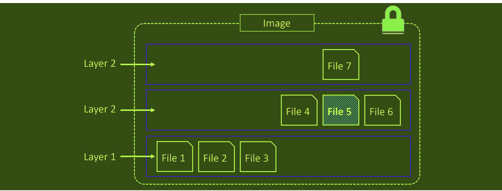

# Docker image
### 1. Tổng quan về images docker
Image docker là 1 đơn vị đóng gói chứa mọi thứ cần thiết để 1 ứng dụng chạy. Nó bao gồm application code, application dependencies, OS constructs. Nếu bạn có 1 image docker của 1 ứng dụng, để chạy ứng dụng đó ta cần 1 máy docker đang chạy.

Để có image, ta có thể pull image từ registry hoặc build image từ Dockerfile.

Khi 1 container được tạo, nó sẽ kéo (pull) các image từ Docker Hub (registry mặc định) về máy chạy docker sau đó tạo container từ image đó.

Images như 1 container đã bị stopped, vậy nên image còn được coi là build-time còn container thì được coi là run-time.


#### 1.1. Image và containers
Khi 1 container tạo và chạy từ 1 image, 2 cấu trúc trở nên phụ thuộc vào nhau và ta không thể xóa image cho đến khi container cuối cùng sử dụng nó bị xóa. Nếu cố gắng xóa 1 image mà không dừng hoặc xóa container sẽ dẫn đến lỗi.

#### 1.2. Dung lượng image luôn nhỏ
Mục đích của container là chạy 1 ứng dụng hoặc 1 dịch vụ. Điều này có nghĩa là nó chỉ cần code của ứng dụng và các phụ thuộc mà ứng dụng đó cần, nó không cần bất cứ thứ gì khác. Vậy nên image luôn có dung lượng thấp vì nó loại bỏ tất cả các phần không thiết yếu.


Image không chứa kernel – Tất cả các container chạy trên máy chủ Docker đều được chia sẻ quyền truy cập vào kernel của máy chủ đó.


Một ví dụ điển hình về mức độ nhỏ của images là image chính thức của Alpine khoảng 5,5MB, có những image có thể nhỏ hơn. Một ví dụ điển hình hơn là image docker của ubuntu 18.04 có dung lượng khoảng 60MB. Các image rõ ràng đã bị loại bỏ hầu hết các phần không cần thiết.


Một số image của windows có xu hướng lớn hơn rất nhiều so với image Linux do cách thức hoạt động của nó. Dung lượng của image windows có thể lên đến vài gigabyte và khi pull sẽ mất nhiều thời gian hơn.

#### 1.3. Pulling images
Nơi lưu trữ image tại local thường được đặt tại /var/lib/docker/image đối với Linux và C:\ProgramData\docker\windowsfilter đối với windows. Có thể sử dụng lệnh sau để kiểm tra xem có bất cứ image nào được lưu trữ cục bộ hay không.

Quá trình để nhận được image về máy chủ docker được gọi là pulling. Vì vậy nếu muốn có 1 image mới về máy chủ docker, ta có thể sử dụng docker pull và kiểm tra lại với docker images
VD:
```sh
docker pull mysql
```
#### 1.4. Image registries
Như đã đề cập ở các mục trước, image được lưu trữ tại nơi lưu trữ tập trung được gọi là image registries. Điều này giúp dễ dàng chia sẻ và truy cập. Resgistry phổ biến và được sử dụng mặc định là Docker Hub.

Registry chứa 1 hoặc nhiều image repositories, trong image repositories chứa 1 hoặc nhiều image. Như hình sau đây cho thấy cách registry lưu trữ các image.

#####  Repo chính thức và không chính thức
Docker Hub có 2 khai niệm là lưu trữ chính thức (official repositories) và lưu trữ không chính thức (unoffical repositories).

Các kho lưu trữ chính thức là nơi lưu trữ các image được kiểm duyệt và quản lý bởi Docker, Inc. Với các kho lưu trữ này sẽ được docker đánh nhãn là Docker Official Images.

Các kho lưu trữ không chính thức không bị kiểm duyệt có thể không an toàn vì chúng không được kiểm định. Tuy nhiên không phải mọi kho lưu trữ không được kiểm duyệt đều xấu, chỉ là bạn nên cẩn thận trước khi sử dụng những thứ từ kho lưu trữ không chính thức. Tốt nhất là nên tin tưởng vào những image có lượt tải xuống cao hoặc image từ những repo nổi tiếng.

Sử dụng `docker search image_name` để có thể nhìn thấy thông tin về image 


#### 1.5. Tên và tag trong images
Để pull 1 image từ repo chính thức, ta cần chỉ ra tên của repo và thẻ của nó (tag) cách nhau bởi dấu : , nếu không chỉ ra tag, nó sẽ hiểu mặc định tag là latest.
```sh
docker image pull <repository>:<tag>
```
VD:
```sh
docker image pull busybox:latest
```
Để thêm 1 image từ repo không chính thức cũng giống như repo chính thức nhưng ta thêm tên của người dùng Docker Hub hoặc tên của tổ chức vào trước.
```sh
docker image pull nigelpoulton/tu-demo:v2
```
#### 1.6 Filtering the output of docker image ls
Docker cung cấp --filter để lọc danh sách trả về
VD:
```sh
docker image ls --filter dangling=true
```
*Image dangling là một image mà không có tag, và xuất hiện trong list dạng <none>:<none>, Nó xuất hiện khi xây dựng một image mới mà cái tag đã tồn tại. Khi chuyện này xảy ra, Docker sẽ xây dựng một image mới, chú ý với một image đã tồn tại có có chung tag, thì sẽ xóa tag từ umage đã tồn tại để cho image mới*
Command:
```sh
docker image prune -a 
```
Docker hiện tại hỗ trợ các bộ lọc sau:
- `dangling`
- `before`: yêu cầu tên hoặc ID làm tham số, và trả về tất cả các ảnh tạo trước đó
- `since`: trả về hình ảnh được tạo sau hình ảnh được chỉ định
- `label`: Bộ lọc hình ảnh dựa trên sự hiện diện của nhãn hoặc nhãn và giá trị
*Có thể sử dụng grep và awk để lọc* 
#### 1.7. Tìm kiếm image từ Docker Hub

Lệnh docker search cho phép ta tìm kiếm trên Docker Hub . 
Ví dụ để tìm các image alpine trên Docker Hub
```sh
docker search alpine
```
```sh
docker search alpine --filter "is-official=true"
```
#### 1.8. Images và layers
##### 1.8.1. Layer trong images
Images Docker là 1 loạt các layer read-only được kết nối với nhau. Mỗi layer bao gồm 1 hoặc nhiều file.


Khi pull các image về local docker cũng có thể nhìn thấy các layer của image đó


 
Mỗi một pull complete sẽ tương ứng với một layer được sắp xếp từ trên xuống. Ví dụ `feec22b5b798` là layer 1
Command

`docker image inspect` để nhìn thấy chi tiết của một image

`docker history image_name` là một cách khác để hiển thị các layer của image. tất cả các hình ảnh docker bắt đầu bằng một lớp cơ sở và khi các layer mới được thêm vào sẽ ở trên. Khi các lớp bổ sung được thêm vào, hình ảnh luôn là sự kết hợp của tát cả các lớp được đặt theo thứ tự chúng được thêm vào.

Ví dụ layer7 là phiên bản cập nhật của layer5 như hình sau 



Docker sử dụng một trình điều khiển lưu trữ chịu trách nhiệm cho các lớp dưới dạng một hình ảnh hợp nhất. Ví dụ: AUFS, Overlay2,Devicemapper, BTRFS và ZFS. 
##### 1.8.2. Chia sẻ layer giữa các image
Các image có thể chia sẻ các layer với nhau, điều này dẫn đến hiệu quả về không gian và hiệu suất. Khi pull image, các trạng thái layer được thông báo là Already exists tức là layer đó đã tồn tại và image sẽ sử dụng layer đó mà không cần pull layer mới.
#### 1.9. Multi-architecture image
Image Docker có thể hỗ trợ nhiều kiến trúc, có nghĩa là 1 image có thể chứa nhiều biến thể cho các kiến trúc khác nhau và đôi khi cho các hệ điều hành khác nhau.
Khi chạy 1 image hỗ trợ multi-architecture, docker sẽ tự động chọn 1 biến thể image phù hợp với hệ điều hành và kiến trúc của máy. Hầu hết các image đều cung cấp nhiều loại kiến trúc khác nhau.
- Manifest list: Có các phiên bản khác nhau của các hệ điều hành khác nhau
- Manifest: Đảm bảo lưu trữ các image 


Mỗi một mục trong danh sách manifes sẽ trỏ đến một bản chứa cấu hình hình ảnh và dữ liệu lớp.
#### 1.10. Deleting Images
Khi không còn cần đến images trên docker của mình nữa, ta có thể sử dụng docker image rm để xóa image. Khi xóa image sẽ xóa tất cả các layer của nó. Tuy nhiên, nếu 1 layer của image chia sẻ cho nhiều image khác thì layer đó sẽ không bị xóa cho đến khi tất cả các image tham chiếu đến nó đều bị xóa hết.
```sh
docker image rm name_image
```
VD:Để xóa tất cả các image
```sh
docker image ls -q
bd3d4369aebc
4e38e38c8ce0
docker image rm $(docker image ls -q) -f |docker image rm `docker iamge ls -q` -f
```
