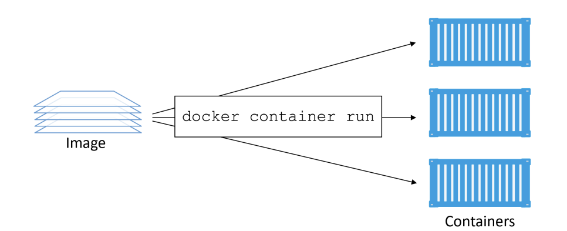
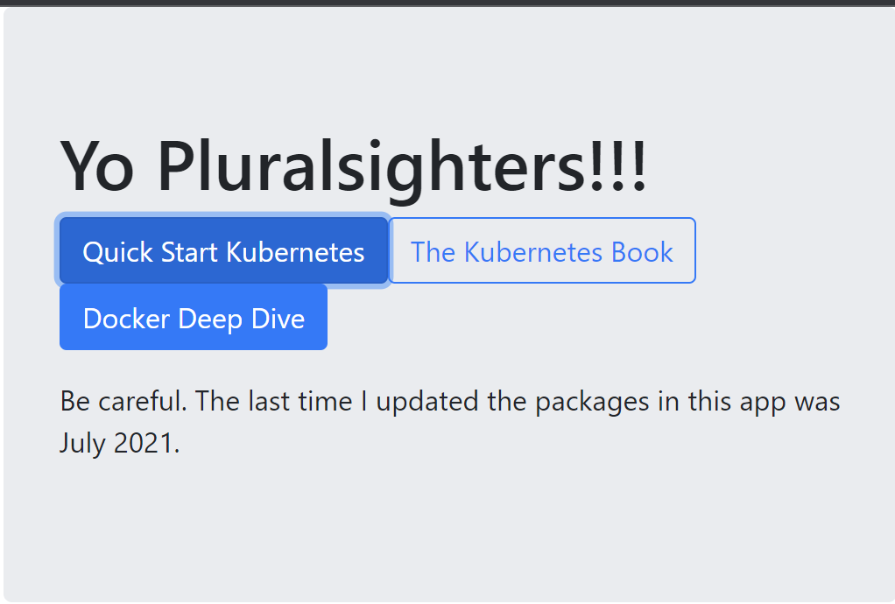

# Docker container

Một container là phiên bản của một image chạy. Docker container là một run-time environment mà ở đó người dùng có thể chạy một ứng dụng độc lập.Không chỉ đảm bảo cho ứng dụng hoạt động như nhau trong các môi trường giống nhau, nó còn làm đơn giản việc cài đặt và chia sẻ cài đặt này cho các thành viên trong team.

Vì container hoạt động độc lập,bạn sẽ không cần lo lắng việc máy tính của bạn bị xung đột do ứng dụng đang được phát triển được chạy trong container.
các container chia sẻ hệ điều hành với máy chủ mà nó đang chạy

*Image có thể tồn tại mà không cần container, trong khi container chạy thì cần có image đã tồn tại. Vì vậy, container phụ thuộc vào image và sử dụng nó để tạo ra run-time environment và chạy ứng dụng trên đó*



Để chạy một container sử dụng lệnh:
```sh
docker container run image_name <command>
```
Chạy một container có 2 dạng là detach và attach, tương tác trực tiếp với container ngay bên trong shell là attach; muốn thoát ra chạy với tiến trình nền là detach sử dụng Ctrl +P+Q điều này có thể giúp bạn thao tác khác. Muốn quay lại với trạng thái attach sử dụng `docker attach <container_id>`|`docker container exec -it ID_container bash`
Dừng một container đang chạy 
```sh
docker container stop ID_container
```
Khởi động lại container Với
```sh
docker container start ID_container
```
Để loại bỏ một container mãi mãi
```sh
docker container rm ID_container
```
VD:
```sh
docker container run -it ubuntu /bin/bash
```
Cờ -it kết nối terminal hiện tại của bản với shell của container
*Chú ý container chạy khi tồn tại lệnh thực thi. VD Linux container tồn tại khi tồn tại bash shell, windows container sử dụng PowerShell*
Có thể sử dụng lệnh sleep để container được bắt đầu trong shell container trong thời gian bạn muốn
```sh
docker container run -it alpine:latest sleep 10
```
Khi thực thi vào terminal của container thì có thể sẽ không thực thi được các câu lệnh bình thường vì images đã được tối ưu nhỏ nhẹ.
### Container processes
Khi chạy với Bash shell thì một và chỉ tiến trình chạy bên trong container. Sử dụng `ps -elf` bên trong container để xem tiến trình

Tiến trình PID 1, là tiến trình sử dụng bash shell; PID thứ 2 ở lệnh ps-elf là tiến trình thời ngắn để tạo danh sách thoát ra ngay khi đầu ra được hiển thị. Nếu đang ở tiến trình nền quay lại terminal container bằng `docker container exec` sẽ tạo ra một tiến trình Bash mới(sẽ có 2 tiến trình bash). Khi exit ra ngoài container khi sử dụng `docker container exec` thì container đó vẫn Chạy
### Container lifecycle
```sh
docker container run --name percy -it ubuntu:latest /bin/bash
```
Đặt tên container là `percy`, 

Khi dừng container và hiển thị Exited(0), tuy container không chạy nhưng toàn bộ cấu hình và nội dung vẫn tồn tại trên local filesystem của Dockerhost. Bạn có thể restarted bấy kì lúc nào. Sử dụng `docker container start name_container` để bắt đầu lại container đó ở trạng thái UP.Và các cấu hình vẫn tồn tại

*Chú ý khi sử dụng lệnh `docker container rm -f` nó sẽ thực hiện xóa cả những container đang chạy. Recommend dừng container trước khi xóa nó*

### Stopping container gracefully
Hầu hết các container trên Linux sẽ chạy với một tiến trình đơn. 

`docker container stop` 

SIGTERM gửi các tín hiệu đến tiến trình bên trong container(PID 1) điều này để tự đóng container. Nếu nó không dừng container trong vòng 10s thì sẽ nhận được một SIGKILL. Với `docker container rm <container> -f` nó sẽ chạy thẳng với tín hiệu SIGKILL
### Các container tự phục hồi với chính sách khởi động lại 
Ý tưởng: Cho phép docker tự restart cho chúng một số sự kiện chắn chắn hoặc thất bại đã xảy ra. Việc khởi động lại là các chính sách được áp dụng trên mỗi container và có thể được cấu hình trên command line như lệnh docker-container run, hoặc khai báo trên tệp YAML được sử dụng với công cụ cấp cao hơn như Docker Swarm, Docker Compose và Kubernetes

Các chính sách khởi động lại :
- always: luôn tự restart một container dừng nếu nó không dừng lại rõ ràng như thông qua `docker container stop`. Với chính sách `--restart always` sẽ bắt đầu tạo ra tương tác mới với container và để chạy với một shell tiến trình. Gõ `exit` sẽ giết tiến trình container với PID=1, tuy nhiên Docker sẽ tự động restart nó bở vì đang ở chế độ `--restart always`. `docker
container ls` sẽ thấy thời gian uptime của contaniner ít hợ thời gian đã tạo. Thông tin `restartCount` trong trường `docker container inspect ` được tăng lên

VD: ` docker container run --name neversaydie -it --restart always alpine sh`
- unless-stopped: `--restart unless-stopped` sẽ không restart khi chúng ở trạng thái Exited. 

VD:
```sh
docker container run -d --name always \
--restart always \
alpine sleep 1d
$ docker container run -d --name unless-stopped \
--restart unless-stopped \
alpine sleep 1d
$ docker container ls
CONTAINER ID IMAGE COMMAND STATUS NAMES
3142bd91ecc4 alpine "sleep 1d" Up 2 secs unless-stopped
4f1b431ac729 alpine "sleep 1d" Up 17 secs always
$ docker container stop always unless-stopped
$ docker container ls -a
CONTAINER ID IMAGE STATUS NAMES
3142bd91ecc4 alpine Exited (137) 3 seconds ago unless-stopped
4f1b431ac729 alpine Exited (137) 3 seconds ago always
$ systemlctl restart docker
$ docker container ls -a
CONTAINER CREATED STATUS NAMES
314..cc4 2 minutes ago Exited (137) 2 minutes ago unless-stopped
4f1..729 2 minutes ago Up 9 seconds always 
```
- on-failed: sẽ restart một container nếu nó thoát với một non-zero exit code. Nó sẽ restart container khi docker daemon restart, thậm chí container ở trạng thái dừng 
### Ví dụ Web server
```sh
$ docker container run -d --name webserver -p 80:8080 nigelpoulton/pluralsight-docker-ci
```
Cờ `-p` cổng 80 trên Docker host đến cổng 8080 bên trong container. Lưu lượng truy cập máy chủ Docker trên cổng 80 sẽ được chuyển đến cổng 8080 của container. Cái image này sử dụng cổng 8080 để xác định một dịch vụ web.
Sau khi mở port 80 trên Docker host thì được như sau:


### Inspecting containers
Khi xây dựng một docker image, bạn có thể thiết lập một hướng dẫn kiệt kê ứng dụng mặc định cho bất kỳ container. Nó xây dựng hình ảnh vowus các lệnh mặc định để các container bắt đầu dễ dàng hơn. Bạn có thể kiểm tra hình ảnh và biết ứng dụng nào mà nó thiết kế để chạy
### Tidying up 
cách xóa tất cả container cả chạy, dừng trên hệ thống
```sh
docker container rm $(docker container ls -aq) -f
```
hoặc 
```sh
docker container rm `docker container ls -aq` -f
```