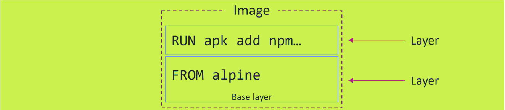
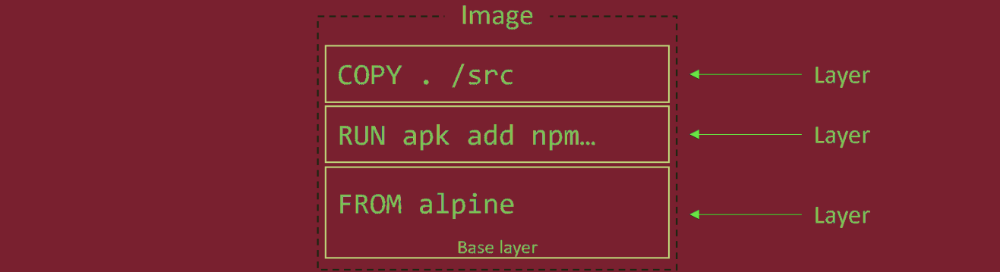
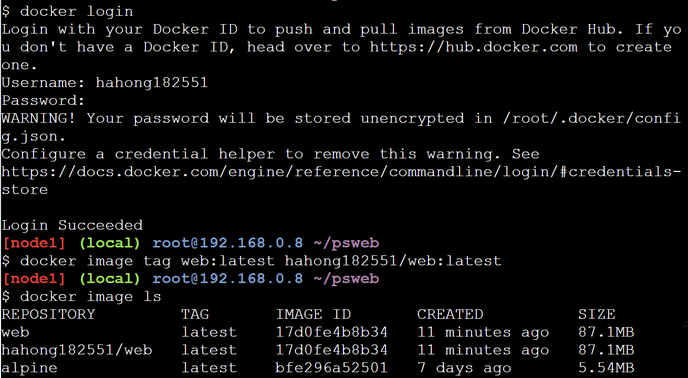
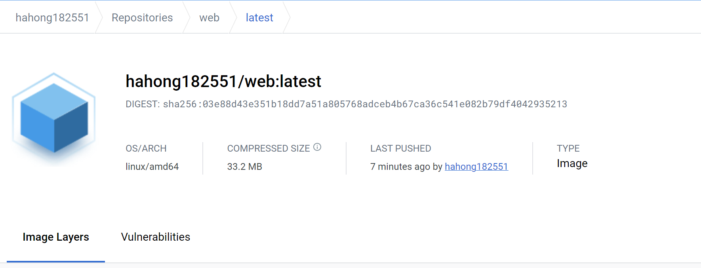
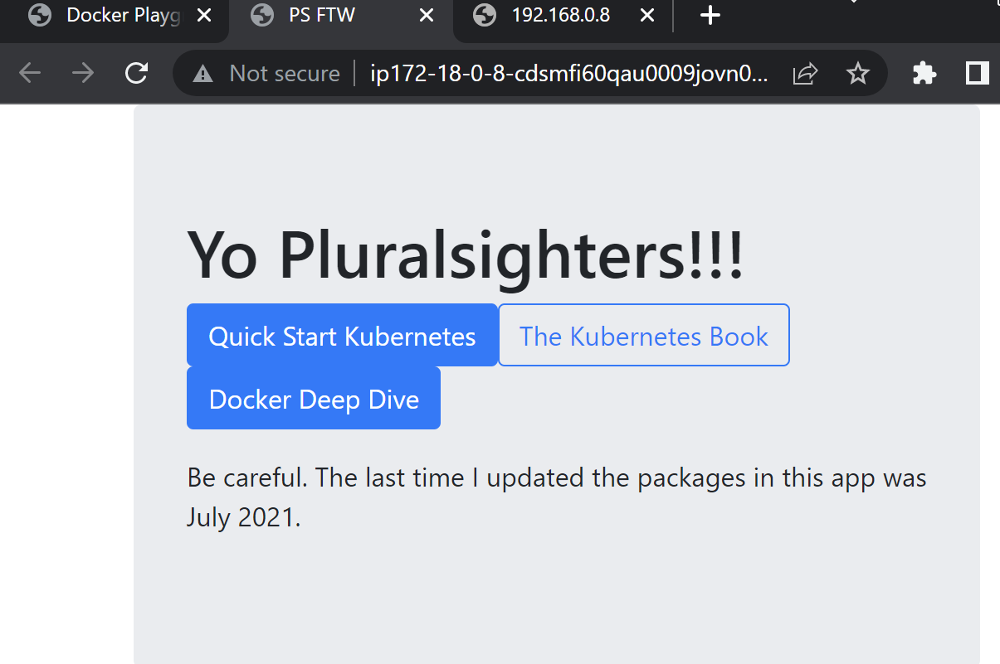
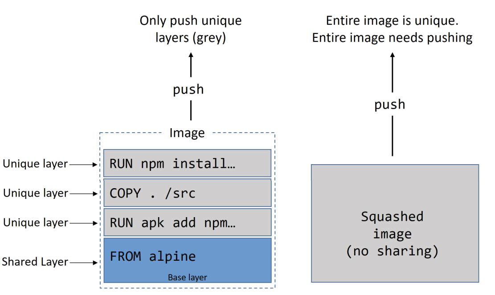

## Containerizing an app
### Containerizing an app- TLDR
Quá trình lấy một ứng dụng và định cấu hình có thể chạy như một container được gọi là containerizing
Conatiner là tầt cả làm cho các ứng dụng build, ship and run
Quá trình của container hóa một app là:
1. Bắt đầu với code, dependencies app của bạn 
2. Tạo một Dockerfile để miêu tả ứng dụng của bạn, phụ thuộc của nó và cách để chạy nó
3. Cung cấp Dockerfile vào bằng lệnh `docker image build`
4. Đẩy image mới nên registry(Không bắt buộc)
5. Chạy container từ image đó.

### Containerizing an app - The deep dive
- Containerize một ứng dụng duy nhất: Quá trình của một app đơn giản theo các bước sau:
    - Clone repo để lấy code ứng dụng
    - Kiểm tra Dockerfile
    - Containerize ứng dụng
    - Chạy ứng dụng
    - Test ứng dụng
    - Nhìn ứng dụng gần hơn 
    - Di chuyển sản phẩm với Multi-stage Builds
    - Một vài thực hành tốt
- Di chuyển sản phẩm với xây dựng nhiều giai đoạn 
- Một vài thực hành tốt nhất 
#### Getting the application code
The application on GitHub: https://github.com/nigelpoulton/psweb.git
Clone từ Github: 
```sh
$ git clone https://github.com/nigelpoulton/psweb.git
Cloning into 'psweb'...
remote: Counting objects: 15, done.
remote: Compressing objects: 100% (11/11), done.
remote: Total 15 (delta 2), reused 15 (delta 2), pack-reused 0
Unpacking objects: 100% (15/15), done.
Checking connectivity... done.
$ cd psweb
$ ls -l
total 28
-rw-r--r-- 1 root root 341 Sep 29 16:26 app.js
-rw-r--r-- 1 root root 216 Sep 29 16:26 circle.yml
-rw-r--r-- 1 root root 338 Sep 29 16:26 Dockerfile
-rw-r--r-- 1 root root 421 Sep 29 16:26 package.json
-rw-r--r-- 1 root root 370 Sep 29 16:26 README.md
drwxr-xr-x 2 root root 4096 Sep 29 16:26 test
drwxr-xr-x 2 root root 4096 Sep 29 16:26 views
```
#### Kiểm tra Dockerfile
Dockerfile là điểm bắt đầu để tạp image – nó mô tả ứng dụng và nói với docker cách để xây dựng nó thành 1 image. Nó bao gồm các lệnh liên tiếp nhau được thực hiện tự động trên 1 image gốc để tạo ra một image mới. Dockerfile bắt đầu bằng chữ D và được đặt tên bắt buộc là Dockerfile. Ngoài tên này, các tên khác đều không hợp lệ
VD:
```sh
$ cat Dockerfile
FROM alpine
LABEL maintainer="nigelpoulton@hotmail.com"
RUN apk add --update nodejs nodejs-npm
COPY . /src
WORKDIR /src
RUN npm install
EXPOSE 8080
ENTRYPOINT ["node", "./app.js"]
```
Tệp Dockerfile mô tả chính xác ứng dụng và các phụ thuộc của nó dưới định dạng dễ đọc 

Cú pháp chung của một Dockerfile có dạng:
```sh
INSTRUCTION arguments
```
VD:
```sh
$ cat Dockerfile
FROM alpine
LABEL maintainer="nigelpoulton@hotmail.com"
RUN apk add --update nodejs nodejs-npm
COPY . /src
WORKDIR /src
RUN npm install
EXPOSE 8080
ENTRYPOINT ["node", "./app.js"]
```
- `From`: Chỉ định rằng image nào sẽ được dùng làm image cơ sở để quá trình build image thực thiện các câu lệnh tiếp theo. Các image base này sẽ được tải về từ Public Repository hoặc Private Repository riêng của mỗi người tùy theo setup.
Chỉ thị FROM là bắt buộc và phải được để lên phía trên cùng của Dockerfile.

- `Label`: dùng để thêm các thông tin meta vào Docker Image khi chúng được build. Chúng tồn tại dưới dạng các cặp key - value, được lưu trữ dưới dạng chuỗi. Có thể chỉ định nhiều label cho một Docker Image, và tất nhiên mỗi cặp key - value phải là duy nhất. Nếu cùng một key mà được khai báo nhiều giá trị (value) thì giá trị được khai báo gần đây nhất sẽ ghi đè lên giá trị trước đó.
```sh
LABEL <key>=<value> <key>=<value> <key>=<value> ... <key>=<value> 
```
VD:
```sh
LABEL com.example.some-label="lorem"
LABEL version="2.0" description="Lorem ipsum dolor sit amet, consectetur adipiscing elit."
```
- `Maintainer` dùng để khai báo thông tin tác giả người viết ra file Dockerfile.
VD:
```sh
MAINTAINER NamDH <namduong3699@gmail.com>
```
-`Run` dùng để chạy một lệnh nào đó trong quá trình build image và thường là các câu lệnh Linux. Tùy vào image gốc được khai báo trong phần FROM thì sẽ có các câu lệnh tương ứng. Ví dụ, để chạy câu lệnh update đối với Ubuntu sẽ là RUN apt-get update -y còn đối với CentOS thì sẽ là Run yum update -y.
VD:
```sh
RUN /bin/bash -c 'source $HOME/.bashrc; echo $HOME'
-------- hoặc --------
RUN ["/bin/bash", "-c", "echo hello"]
```
Ở cách thức shell form bạn có thể thực hiện nhiều câu lệnh cùng một lúc với dấu \ như:
```sh
FROM ubuntu
RUN apt-get update; \
    apt-get install curl -y
```

- `Add` Chỉ thị ADD sẽ thực hiện sao chép các tập, thư mục từ máy đang build hoặc remote file URLs từ src và thêm chúng vào filesystem của image dest.
Cú pháp:
```sh
ADD [--chown=<user>:<group>] <src>... <dest>
ADD [--chown=<user>:<group>] ["<src>",... "<dest>"]
```
src có thể khai báo nhiều file, thư mục, ...
dest phải là đường dẫn tuyệt đối hoặc có quan hệ chỉ thị đối với WORKDIR.
```sh
ADD hom* /mydir/
ADD hom?.txt /mydir/
ADD test.txt relativeDir/
```
- `Copy` Chỉ thị COPY cũng giống với ADD là copy file, thư mục từ <src> và thêm chúng vào <dest> của container. Khác với ADD, nó không hỗ trợ thêm các file remote file URLs từ các nguồn trên mạng

- `Workdir` đặt thư mục làm việc bên trong hệ thống tập tin image cho phần còn lại của các hướng dẫn trong tệp. hướng dẫn không tạo một layer image mới.
- `Env` ùng để khai báo các biến môi trường. Các biến này được khai báo dưới dạng key - value bằng các chuỗi
VD:
```sh
ENV DOMAIN="viblo.asia"
ENV PORT=80
ENV USERNAME="namdh" PASSWORD="secret"
```
- `CMD` định nghĩa các câu lệnh sẽ được chạy sau khi container được khởi động từ image đã build. Có thể khai báo được nhiều nhưng chỉ có duy nhất CMD cuối cùng được chạy.
Cú pháp:
```sh
CMD ["executable","param1","param2"]
CMD ["param1","param2"] 
CMD command param1 param2
```
Vd:
```sh
FROM ubuntu
CMD echo test
```
- `User` Có tác dụng set username hoặc UID để sử dụng khi chạy image và khi chạy các lệnh có trong RUN, CMD, ENTRYPOINT sau nó.
Cú pháp
```sh
USER <user>[:<group>]
hoặc
USER <UID>[:<GID>]
```
VD:
```sh
FROM alpine:3.4
RUN useradd -ms /bin/bash namdh
USER namdh
```
-`Entrypoint` đặt ứng dụng chính mà image(container) sẽ chạy. Không tạo thêm image layer

Một vài Instructions tạo layers mới, một số khác sẽ thêm metadata đến file cấu hình image. Ví dụ Instructions tạo thêm layer mới như From, RUN, COPY; tạo ra metadata bao gồm: EXPOSE, WORKDIR, ENV, and ENTRYPOINT. Nếu thêm nội dung như files và progaram vào trong image sẽ tạo một layer mới. nếu thêm cách build image và run app sẽ tạo ra metadata.
```sh
 docker image history web:latest
IMAGE CREATED BY SIZE
fc6..18e /bin/sh -c #(nop) ENTRYPOINT ["node" "./a... 0B
334..bf0 /bin/sh -c #(nop) EXPOSE 8080/tcp 0B
b27..eae /bin/sh -c npm install 14.1MB
932..749 /bin/sh -c #(nop) WORKDIR /src 0B
052..2dc /bin/sh -c #(nop) COPY dir:2a6ed1703749e80... 22.5kB
c1d..81f /bin/sh -c apk add --update nodejs nodejs-npm 46.1MB
336..b92 /bin/sh -c #(nop) LABEL maintainer=nigelp... 0B
3fd..f02 /bin/sh -c #(nop) CMD ["/bin/sh"] 0B
<missing> /bin/sh -c #(nop) ADD file:093f0723fa46f6c... 4.15MB
```
Chỉ tạo ra 4 layer
#### Containerize the app/build the image
```sh
git clone https://github.com/nigelpoulton/psweb.git
cd psweb
docker image build -t web:latest .
```
Cái câu lệnh này giúp bạn tạo một image mới có tên là web:latest, 
`.` là Build context đề cập đến cái thư mục chứa dockerfile, toàn bộ nội dung bên trong file đó được gọi là build context. 
#### Pushing images
Để lưu trữ trên một image registry, Docker Hub là một public image registry phổ biến
Để push image lên, bạn cần login với Docker ID

Trước khi push image cần phải đặt tag 
Sử dụng câu lệnh 
```sh
docker image push hahong182551/web:latest
```
Kết quả:

Docker cung cấp tính năng lưu cache theo từng layer của image( trong lúc build mỗi layer sẽ có một mã hash tạo ra, lần đầu tiên khi tải lên toàn bộ layer sẽ được tải lên , ở lần tiếp theo docker sẽ tính toán dựa vào các mã hash không thay đổi thì layer đó không có sự thay đổi về nội dung, data docker chỉ tải lên những layer có sự thay đổi => Tiết kiệm được thời gian triển khai)
### Run the app
Ứng dung containerized là một web server lắng nghe trên TCP cổng 8080, 
```sh
docker container run -d --name c1 -p 80:8080 web:latest
```
Bạn sẽ có thể trot một trình duyệt web tại DNS hoặc địa chỉ IP của Docker host chạy container.

Kết quả:

###  Production with Multi-stage Builds
Docker image càng lớn càng không tốt, cách bạn viết dockerfile ảnh hưởng lớn đến kích thước images.

Xây dựng nhiều giai đoạn(Multi-stage) là tối ưu các bản dựng mà không cần thêm độ phức tạp 
để giảm kích thước image và số lượng layer chúng ta có thể kết hợp các câu lệnh bằng sử dụng && hoặc \

Multi-stage builds có một dockerfile duy nhất chứa nhiều instruction `FROM`, mỗi `FROM` là một giai đoạn xây dựng mới nó có thể dễ dàng được sao chép từ các giai đoạn trước
VD về app tại ` hps://github.com/nigelpoulton/atsea-sample-shop-app.git `
```sh
FROM node:latest AS storefront
WORKDIR /usr/src/atsea/app/react-app
COPY react-app .
RUN npm install
RUN npm run build

FROM maven:latest AS appserver
WORKDIR /usr/src/atsea
COPY pom.xml .
RUN mvn -B -f pom.xml -s /usr/share/maven/ref/settings-docker.xml dependency:resolve
COPY . .
RUN mvn -B -s /usr/share/maven/ref/settings-docker.xml package -DskipTests

FROM java:8-jdk-alpine AS production
RUN adduser -Dh /home/gordon gordon
WORKDIR /static
COPY --from=storefront /usr/src/atsea/app/react-app/build/ .
WORKDIR /app
COPY --from=appserver /usr/src/atsea/target/AtSea-0.0.1-SNAPSHOT.jar .
ENTRYPOINT ["java", "-jar", "/app/AtSea-0.0.1-SNAPSHOT.jar"]
CMD ["--spring.profiles.active=postgres"]
```
### Squash the image
Squash có thể tốt trong các tình huống mà image có rất nhiều lớp và đây là lý tưởng. Tạo ra một base image mới mà bạn muốn xây dựng một image khác trong tương lai như một single-layer image.
Về mặt tiêu cực, hình ảnh bị gom lại không chia sẻ các image layers. Có thể dẫn đến thiếu hiệu quả lưu trữ và các hoạt động pull và push hơn
Thêm cờ  `--squash` vào commmand `docker image build` nếu bạn muốn tạo một squashed image

Non-squash có thể chia sẻ các lớp với các image khác trên máy chủ nhưng với squash-image thì không
*Chú ý: Nếu như bạn đang xây dựng iamge Linux và sử dụng apt packeage, bạn nên sử dụng cờ `no-install-recommends` với `apt-get install` để đảm bảo rằng apt chỉ cài đặt các phụ thuộc chính và không đề xuất packages*