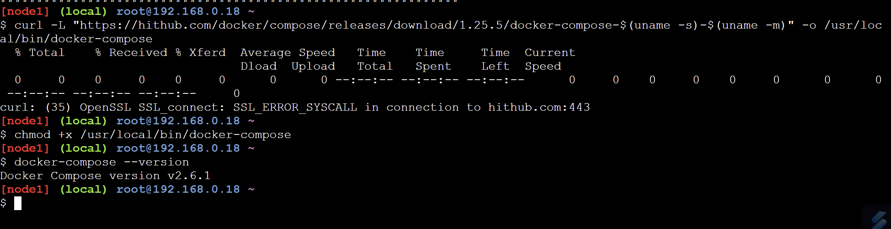

# Deploy Apps với Docker Compose

#### Docker compose để triển khai và quản lý các multi-container application 

Thay vì gán mỗi microservice cùng với các tập lệnh docker, Docker Compose cho phép bạn mô tả toàn bộ ứng dụng trong một tệp cấu hình khai báo duy nhất và triển khai nó bằng một lệnh.
Khi app được triển khai, bạn có thể quản lý toàn bộ vòng đời với một tập lệnh đơn giản. Bạn thậm chí có thể lưu trữ và quản lý tệp cấu hình trong hệ thống điều khiển.
## Deploy apps with Compose
docker Compose là một công cụ mạnh mẽ, dùng để quản lý các ứng dụng nhiều comtainer của Docker. Với compose bạn sử dụng file YAML để config các multi-container cho application của bạn.
Installing Compose (Linux)

### Compose file
Compose sử dụng các tệp YAML để định nghĩa các ứng dụng multi-service. Tên mặc định cho một tệp yaml là docker-compose.yml, tuy nhiên bạn có thể sử dụng cờ -f để chỉ định tên tệp tùy chỉnh
Ví dụ 
```sh
version: '2'

services:
   db:
     image: mysql:5.7
     volumes:
       - ./data:/var/lib/mysql
     restart: always
     environment:
       MYSQL_ROOT_PASSWORD: wordpress
       MYSQL_DATABASE: wordpress
       MYSQL_USER: wordpress
       MYSQL_PASSWORD: wordpress

   wordpress:
     depends_on:
       - db
     image: wordpress:latest
     ports:
       - "8000:80"
     restart: always
     environment:
       WORDPRESS_DB_HOST: db:3306
       WORDPRESS_DB_PASSWORD: wordpress
```
Compose file sẽ có 4 top-level keys:
- version: Chỉ ra phiên bản docker-compose sẽ sử dụng
- services: Trong mục sercices, chỉ ra những services (containers) mà ta sẽ cài đặt
      - image:  chỉ ra image sẽ được sử dụng để create containers.Ngoài ra, bạn có thể viết dockerfile và khai báo lệnh `build` để containers sẽ được create từ dockerfile.
      - restart: always: Tự động khởi chạy khi container bị shutdown.
      - environment: Khai báo các biến môi trường cho container. Cụ thể là thông tin cơ sở dữ liệu.
      - depends_on: db: Chỉ ra sự phụ thuộc của services wordpress với services db. Tức là services db phải chạy và tạo ra trước, thì services wordpress mới chạy
      - ports: Forwards the exposed port 80 của container sang port 8000 trên host machine.
- networks: Mặc định Compose sẽ tạo bridge network. các mạng đơn lẻ chỉ có thể kết nối các container trên cùng một Docker host.
Có thể sử dụng đoạn code sau đây trong tệp soạn thảo Docker file để tạo một overlay network cho phép các thùng chứa đ lập kết nối với nó
```sh
networks:
over-net:
driver: overlay
attachable: true
```
- volumes: mount counter-vol đến với thư mục trong docker
- ### Deploying an an app with Compose
Vd: Cần theo dõi 4 files từ  hps://github.com/nigelpoulton/counter-app:
- Dockerfile
- app.py
- requirement.txt
- docker-compose.yml
```sh
$ git clone https://github.com/nigelpoulton/counter-app.git
Cloning into 'counter-app'...
remote: Counting objects: 9, done.
remote: Compressing objects: 100% (8/8), done.
remote: Total 9 (delta 1), reused 5 (delta 0), pack-reused 0
Unpacking objects: 100% (9/9), done.
Checking connectivity... done.
$ cd counter-app
$ ls
app.py docker-compose.yml Dockerfile requirements.txt ...
```
app.py : file core của application,
docker-compose.yml: file miêu rả cách Docker nên build, deploy app
Dockerfile: miêu tả cách xây dựng lên image 
requirements.txt: liệt ra danh sách các gói Python được yêu cầu bởi ứng dụng
#### Sử dụng docker compose
Với Compose, bạn sử dụng tệp YAML để cấu hình các dịch vụ. Sau đó , với một lệnh duy nhất, bạn tạo và khởi động tất cả các dịch vụ từ cấu hình của mình. Để sử dụng Compose thông thường có ba bước sau:

1. Tạo Dockerfile cho mỗi môi trường container của từng service mình muốn. Dockerfile là bắt buộc để khởi tạo container.
2. Tạo file docker-compose.yml để định nghĩa mối liên kết giữa các containers với nhau.
3. Chạy lệnh docker-compose up để khởi động Compose và chạy toàn bộ ứng dụng.
Để có thể dùng được docker compose, bạn cần tạo một compose file như docker-compose.yml để thiết lập các container cần cho ứng dụng của bạn

Để build, run , stop các container các bạn có thể sử dụng command sau:
```sh
$ docker-compose build
$ docker-compose up
$ docker-compose down
```
- `docker-compose build` dùng để build tất ontainer được định nghĩa trong compose file. Tuy nhiên, mình hay sử dụng lệnh này để thực hiện build lại service vừa được thay đổi bằng lệnh sau `docker-compose build <servicename>`
- `docker-compose up` thực hiện tạo và khởi chạy các container. Nó sẽ xây dựng hoặc pull tất cả các images cần thiết, tạo tất cả những networks và volumes cần thiết và start tất cả các container cần thiết. Theo mặc định, khi docker-compose up sẽ có tên `docker-compose.yml` nếu muốn đổi tên kgacs thì thêm cờ -f ví dụ như `docker-compose -f prod-equus-bass.yml up` .Chú ý với 2 option sau:
       - `-d` thì các container sẽ được chạy dưới dạng background.
       - `--force-recreate` tái tạo lại các container
       - Còn nếu chỉ muốn up một số services thì các bạn cứ đặt các service muốn chạy đằng sau lệnh up là được. Ví dụ như docker-compose up -d redis sqlserver
```sh
$ docker-compose up &
[1] 1635
Creating network "counter-app_counter-net" with the default driver
Creating volume "counter-app_counter-vol" with default driver
Pulling redis (redis:alpine)...
alpine: Pulling from library/redis
1160f4abea84: Pull complete
a8c53d69ca3a: Pull complete
<Snip>
web-fe_1 | * Debugger PIN: 313-791-729
```
Chú ý cách Compose đặt tên mới khi xây dựng hình ảnh là sự kết hợp giữa project name `counter-app` và nguồn tên đặc biệt trong Compose file(VD: `web-fe`)
```sh
$ docker-compose up -d
Creating network "counter-app_counter-net" with the default driver
Creating counter-app_redis_1 ... done
Creating counter-app_web-fe_1 ... done

$ docker image ls
REPOSITORY TAG IMAGE ID CREATED SIZE
counter-app_web-fe latest 96..6ff9e 3 minutes ago 95.9MB
python alpine 01..17a02 2 weeks ago 85.5MB
redis alpine ed..c83de 5 weeks ago 26.9MB

FROM python:alpine << Base image
ADD . /code << Copy app into image
WORKDIR /code << Set working directory
RUN pip install -r requirements.txt << Install requirements
CMD ["python", "app.py"] << Set the default app

$ docker container ls
ID COMMAND STATUS PORTS NAMES
84.. "python app.py" Up 2 mins 0.0.0.0:5000->5000/tcp counter-app_web-fe_1
eb.. "docker-entrypoint.s…" Up 2 mins 6379/tcp counter-app_redis_1

$ docker network ls
NETWORK ID NAME DRIVER SCOPE
b4c1976d7c27 bridge bridge local
33ff702253b3 counter-app_counter-net bridge local
<Snip>

$ docker volume ls
DRIVER VOLUME NAME
<Snip>
local counter-app_counter-vol
```
- `docker-compose down ` dùng để dừng các container và xóa hết những gì được tạo từ lệnh up. Về cơ bản thì nó sẽ xóa bỏ những container và network được định nghĩa trong compose file
VD:
```sh
$ docker-compose down
1. Stopping counter-app_redis_1 ...
2. Stopping counter-app_web-fe_1 ...
3. redis_1 | 1:signal-handler Received SIGTERM scheduling shutdown...
4. redis_1 | 1:M 09 Jan 11:16:00.456 # User requested shutdown...
5. redis_1 | 1:M 09 Jan 11:16:00.456 * Saving the final RDB snap...
6. redis_1 | 1:M 09 Jan 11:16:00.463 * DB saved on disk
7. Stopping counter-app_redis_1 ... done
8. counter-app_redis_1 exited with code 0
9. Stopping counter-app_web-fe_1 ... done
10. Removing counter-app_redis_1 ... done
11. Removing counter-app_web-fe_1 ... done
12. Removing network counter-app_counter-net
13. [1]+ Done docker-compose up
```
Dòng 1 và 2 để dừng 2 dịch vụ là redis và web-fe được định nghĩa trong Compose file
Dòng 3 hiển thị singnal SIGTERM đến tiến trình PID 1 trong mỗi container
Dòng 4-6 hiển thị container Redis được xử lý tín hiệu một cách gracefully và shut down.
Dòng 7 và 8 báo cáo thành công của hoạt động stop
Dòng 9 hiển thị dừng thành công dịch vụ web-fe
Dòng 10 và 11 hiển thị xóa dịch vụ
Dòng 12 hiển thị `counter-net` network đã bị xóa
Dòng 13 hiển thị tiến trình `docker-compose up` đã tồn tại
Điều quan trọng cần chú ý là `counter-vol` đã không bị xóa. Bởi vì volumes được dự định là cửa hàng dữ liệu dài hạn. Ví dụ như, vòng dời của chúng hoàn toàn được tách rời khỏi ứng dụng mà họ phục vụ. Chạy `docker volume ls` sẽ thấy volume vẫn tồn tại trên hệ thống. Bất kì data trên volume vẫn sẽ tồn tại.
Ngoài ra, bất kì image nào được xây dựng hoặc pull như một của hoạt động `docker-compose up`của hệ thống


Ở lần thứ 2 sử dụng lệnh `docker-compose up -d` thấy app bắt đầu nhanh hơn, vì `counter-vol volume ` và images đã tồn tại trên Docker host
Hiển thị trạng thái của của ứng dụng với `docker-compose ps`
```sh
$ docker-compose ps
Name Command State Ports
-----------------------------------------------------------------------------------
counter-app_redis_1 docker-entrypoint.sh redis.. Up 6379/tcp
counter-app_web-fe_1 python app.py Up 0.0.0.0:5000->5000/tcp
```
Sử dụng `docker-compose top` để list những tiến trình chạy trong mỗi container
```sh
$ docker-compose top
counter-app_redis_1
PID USER TIME COMMAND
----------------------------------
19643 999 0:01 redis-server
counter-app_web-fe_1
PID USER TIME COMMAND
--------------------------------------------------------
19679 root 0:00 python app.py
19788 root 0:01 /usr/local/bin/python /code/app.py
```

Sử dụng lệnh `docker-compose stop`  để dừng app mà không xóa tài nguyên của nó
```sh
$ docker-compose stop
Stopping counter-app_web-fe_1 ... done
Stopping counter-app_redis_1 ... done
$ docker-compose ps
Name Command State
----------------------------------------------------------
counter-app_redis_1 docker-entrypoint.sh redis Exit 0
counter-app_web-fe_1 python app.py Exit 0
```
Khi dừng Compose app không xóa app định nghĩa từ hệ thống. Nó chỉ dừng các container của app. Bạn có thể xóa một Compose app đã dừng với `docker-compose rm`. Điều này sẽ xóa container và networks trong app đang sử dụng, nhưng sẽ không xóa volumes hoặc images. Nó cũng sẽ không xóa source code ứng dụng trong thư mục build context (app.py; Dockerfile, requirements.txt, and docker-compose.yml)
```sh
docker-compose restart 
Restarting counter-app_web-fe_1 ... done
Restarting counter-app_redis_1 ... done
$ docker-compose ps
Name Command State Ports
-----------------------------------------------------------------------------------
counter-app_redis_1 docker-entrypoint.sh redis Up 6379/tcp
counter-app_web-fe_1 python app.py Up 0.0.0.0:5000->5000/tcp
```
Sử dụng `docker-compose down` để dừng và xóa app
```sh
$ docker-compose down
Stopping counter-app_redis_1 ... done
Stopping counter-app_web-fe_1 ... done
Removing counter-app_redis_1 ... done
Removing counter-app_web-fe_1 ... done
Removing network counter-app_counter-net
```
Lần đầu tiên bạn triển khai ứng dụng, Compose kiểm tra xem nếu một volume được gọi `counter-vol`đã tồn tại nếu chưa có thì tạo nó. Bạn có thể nhìn nó với `docker volume ls`, hoặc bạn có thể xem thông tin chi tiết `docker volume inspect counter-app_counter-vol`

Compose Builds network và volume trước khi triển khai các service. Bởi vì networks and volumes là đối tượng hạ tầng cấp thấp được tiêu thụ bởi services(containers). Tạo network và volume như tác vụ đầu tiên của nó; thậm chí còn trước xây dựng và pull images.

