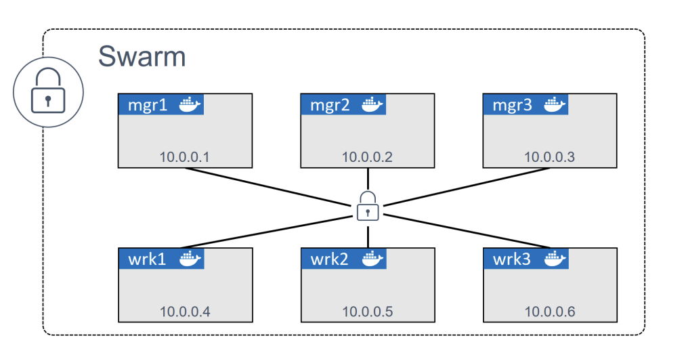
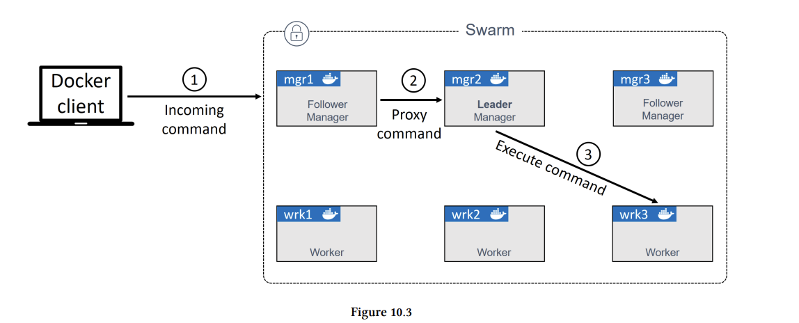
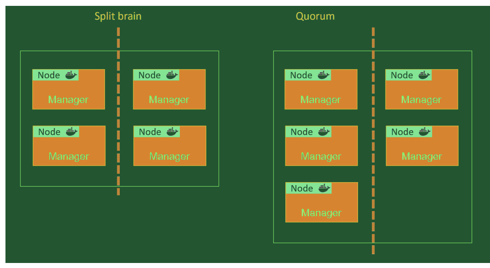
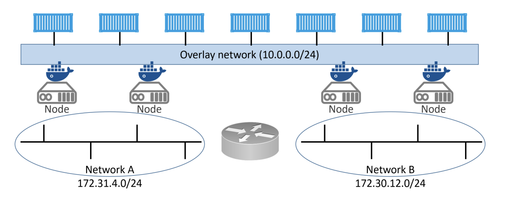
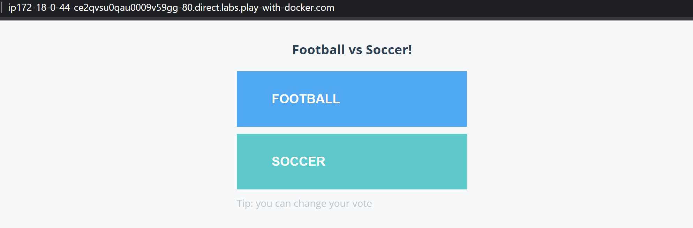

# Docker Swarm
Docker Swarm có 2 nội dung chính
- Một cụm để bảo mật của Docker host
- Một động cơ để phối hợp các ứng dụng microservice 
Docker Swarm là một nhóm các máy chạy Docker và tập hợp lại với nhau thành một cluster. Không như docker engine, sau khi các máy này tập hợp vào Swarm, mọi câu lệnh Docker sẽ được thực thi trên Swarm manager.Các máy tham gia vào swarm được gọi là worker node. Các node này chỉ có khả năng cung cấp khả năng hoạt động chứ không có quyền quản lý các node khác.
Bên ngoài cluster, bạn sẽ nhận được một cửa hàng cụm phân tán được mã hóa, các mạng được mã hóa, tham gia cluster an toàn và PKI quản lý và xoay một cách an toàn . banjc ó thể và loại bỏ các nút

Swarm cho phép bạn triển khai và quản lý các ứng dụng microservices, bạn có thể định nghĩa ứng dụng của bạn trong các tệp kê khai và triển khai chúng với câu lệnh Docker. 
Docker Swarm cạnh tranh trực tiếp với Kubernetes- cả hai đều điều phối các container ứng dụng. Docker Swarm phù hợp với doanh nghiệp có quy mô vừa và nhỏ
Nội dung chính:
- Swarm primer
- Xây dựng cụm Swarm một cách an toàn
- Triển khai một số dịch vụ Swarm
- Khắc phục sự cố
### Swarm primer
Trên cluster, một swarm bao gồm một hoặc nhiều Docker nodes. Docker Swarm có khả năng khởi chạy các container trên nhiều máy ,nó có thể là server vật lý, VMs, hoặc cloud. Yêu cầu chỉ là tất cả các nút đã được cài Docker và có thể giao tiếp trên các mạng đáng tin cậy
Nodes được cấu hình như managers hoặc workers. Manager điều khiển của cluster, có nghĩa là những thứ như trạng thái của cluster và phân tán là của worker.Worker chấp nhận nhiệm vụ từ manager và thực thi chúng
- Cấu hình và trạng thái của swarm được giữ trong `etcd` dữ liệu nằm trên tất cả manager. Nó giữ trong bộ nhớ và được cập nhật, nhưng điều tốt nhất là nó yêu cầu cấu hình bằng không, nó được cài đặt như một phần của swarm và tự chăm sóc bản thân
- Swarm sử dụng `TLS` để mã hóa thông tin, xác thực các noods và, cai trò ủy quyền, xoay quanh kháo tự động
- Trên ứng dụng điều phối, đơn vị lên lịch trình trên một swarm là `service`. Đây là một đối tượng mới trong API,được giới thiệu với Swarm và là một cấu trúc cấp cao hơn bao gồm một số tính năng nâng cao xung quanh container. Nó bao gồm scaling, rolling updates, và simple rollbacks

## Xây dụng một Swarm cluster an toàn

#### Kiến trúc Docker Swarm
Kiến trúc của Docker Swarm bao gồm Manager và Worker, qua đây người dùng có thể dễ dàng khai báo trạng thái của nhiều service dùng chạy trong Swarm sử dụng YAML files. 

Manager Node: Quản lý và điều phối các task đến các node Worker theo như mặc định node Manager và cũng được coi là node Worker.
Worker Node: Đây là node nhận và thực thi các task từ node Manager.
Task: Được biết đến là các con tainers giúp thực thi các lệnh đã được định nghĩa trong service. Tác vụ này một phần do Manager phân bổ, sau việc phân bổ này task không thể chuyển tới một Worker khác. Khi task thất bại, node Manager sẽ có một phiên bản mới cho một node khác sẵn có trong Swam.
Service: Khi một service xác định được image của container cùng với số lượng replicas mong muốn và khởi chạy được trong Swarm. 
Swarm: Là một cluster của node ở trong chế độ Swarm, thiết lập các services giúp phân bổ bản replicas tới node thay vì phải chạy các container bằng câu lệnh. 

#### Hoạt động của Docker Swarm
Dưới đây là một số hoạt động của Docker Swarm:

Manage node được hiểu một cách đơn giản là trạng thái hoạt động của các Worker node có trong cụm. 

Worker node giúp chấp nhận các task gửi từ phía Manage node. 

Worker node được ví giống như một agent, báo cáo các trạng thái task của node đến Manage node. 

Tất cả các Worker node muốn giao tiếp với Manager node cần sử dụng API qua hình thức HTTP.

các worker node được giao task từ manager node sẽ thông báo về cho manager node tình trạng hiện tại của task đang chạy trên node đó thông qua một *agent* ở mỗi node để cho manager node có thể đảm bảo trạng thái của mỗi node bên dưới nó.

Khi khởi tạo một service trong swarm mode, người dùng sẽ xác định container imager nào sẽ được sử dụng và câu lệnh nào sẽ chạy bên trong container đó. Nó khả năng sắp xếp, quản lý container của swarm

Node manager sẽ đưa các task này cho các worker node theo số lượng replicas được set trong service scale. Khi một task được đưa cho một worker node, nó sẽ không thể chuyển sang node khác, nó chỉ có thể trên node được manager node chỉ định hoặc FAIL
Có 2 kiểu service là:

- Replicated Service: ở chế độ này thì swarm manager sẽ xác định số lượng các bản sao mà một task của một service sẽ được chạy trên các nodes dựa theo sự mong muốn của người dùng.
- Global Services: ở chế độ này swarm manager sẽ chạy một task cho một service trên tất cả các node có khả năng chạy được trong cluster

Ngoài ra, nếu người dùng tạo một service mà trong cluster hiện tại chưa có node nào có khả năng chạy service đó thì service đó sẽ được đưa về chế độ Pending Service

Service có thể bị Pending mãi mãi nếu không có node nào trong cluster có khả năng thỏa mãn yêu cầu sử dụng của service.


Xây dụng một Swarm cluster an toàn với 3 manager nodes và 3 worker nodes( có thể xây dựng với số lượng manager và worker khác).

Nó cũng có lợi nếu độ phân giải tên được cấu hình, nó dễ dàng xác định các nút trong các đầu ra lệnh và giúp khắc phục sự cố
Về mặt networking:
- 2377/tcp: giao tiếp client đến swarm an toàn
- 7946/tcp và udp: điều khiển tin đồn
- 4789/udp: đối với overlay network dựa trên VXLAN
Quy trình để khởi tạo:
Khởi tạo manager đầu tiên-> thêm các manager node-> Thêm các worker-> Done.
### Khởi tạo một swarm mới

Docker nodes là single-engine mode, khi họ thêm vào một swarm, nó được chuyển sang swarm mode
Chạy `docker swarm init`trên Docker host thì single-engine mode=> swarm mode
Tham gia một Docker host để vào swarm biến chúng thành swarm mode như một phần của hoạt động.

Đầu tiên đưa `mgr1` vào Swarm mode và khởi tạo một swarm mới. Sau đó `wrk1`,`wrk2`,`wrk3`như worker nodes tự động đưa chúng vào `swarm mode`. Cuối cùng, nó sẽ thêm `mgr2`, `mgr3` như thêm manager và đưa chúng vào `swarm mode`. Cuối cùng, có tất cả 6 node sẽ ở swarm mode và hoạt động như một swarm.

Ví dụ, sẽ sử dụng địa chỉ IP và tên DNS của các nút được hiển thị

1. Đăng nhập `mgr1` và khởi tạo một swarm mới 
```sh
$ docker swarm init \
--advertise-addr 10.0.0.1:2377 \
--listen-addr 10.0.0.1:2377
Swarm initialized: current node (d21lyz...c79qzkx) is now a manager.
```
- `docker swarm init`: Sẽ gọi Docker để thiết lập một swarm mới và làm node đầu tiên manager. 
- `--advertise-addr`: đây là điểm cuối API Swarm sẽ được quảng cáo đến các node khác trong swarm. Nó thường là một trong những địa chỉ IP node, nhưng có thể là một địa chỉ cân bằng tải bên ngoài.
- `--listen-addr`: Đây là địa chỉ IP mà node sẽ chấp nhận lưu lượng truy cập, nếu không được thiết lập rõ ràng, nó sẽ mặc định với cùng một giá trị với `--advertise-addr`. Nếu `--Advertise-addr` là một bộ cân bằng tải, bạn phải sử dụng `--listen-addr` để chỉ định IP hoặc giao diện cục bộ cho lưu lượng truy cập
Port mặc định swarm mode hoạt động trên 2377, nhưng quy ước của nó để sử dụng 2377/TCP cho kết nối an toàn(HTTPS) clinet-to-swarm
 ```sh
 $ docker node ls
ID HOSTNAME STATUS AVAILABILITY MANAGER STATUS
d21...qzkx * mgr1 Ready Active Leader
```
2. Thêm các worker và managers vào swarm
Trên máy mgr1 
```sh
$ docker swarm join-token worker
To add a manager to this swarm, run the following command:
docker swarm join \
--token SWMTKN-1-0uahebax...c87tu8dx2c \
10.0.0.1:2377
$ docker swarm join-token manager
To add a manager to this swarm, run the following command:
docker swarm join \
--token SWMTKN-1-0uahebax...ue4hv6ps3p \
10.0.0.1:2377
```
3. Trên một máy có IP  10.0.0.4 tạo một wrk1
```sh
$ docker swarm join \
--token SWMTKN-1-0uahebax...c87tu8dx2c \
10.0.0.1:2377 \
--advertise-addr 10.0.0.4:2377 \
--listen-addr 10.0.0.4:2377
```
4. Làm tương tự với wrk2 và wrk3 gắn thêm cờ `--advertise-addr`,`--listen-addr` theo đúng địa chỉ Ip wrk2 wrk3
5. đăng nhập vào máy mgr2
```sh
$ docker swarm join \
--token SWMTKN-1-0uahebax...ue4hv6ps3p \
10.0.0.1:2377 \
--advertise-addr 10.0.0.2:2377 \
--listen-addr 10.0.0.2:2377
```
làm tương tự với mgr3 gắn các cờ `advertise-addr` and
`--listen-addr `
```sh
$ docker node ls
ID HOSTNAME STATUS AVAILABILITY MANAGER STATUS
0g4rl...babl8 * mgr2 Ready Active Reachable
2xlti...l0nyp mgr3 Ready Active Reachable
8yv0b...wmr67 wrk1 Ready Active
9mzwf...e4m4n wrk3 Ready Active
d21ly...9qzkx mgr1 Ready Active Leader
e62gf...l5wt6 wrk2 Ready Active
```
Nếu như trên cột `MANAGER STATUS` manager bạn sẽ nhìn thấy `Reachable`hoặc `Leader`, cái nodes mà không có thông tin là worker. Sau ID có (*) hiển thị node mà bạn đang đăng nhâp và thực thi

### Swarm manager high availability (HA)

Swarm `managers` có tính sẵn sàng cao, khi một hoặc nhiều manager có thể bị down và những manager còn sống sẽ giữ cho swarm running. Swarm thực hiện một hình thức của nhiều manager hoạt động HA( cho dù có nhiều manager nhưng chỉ có một trong số họ `active` tại bất kỳ thời điểm nào) nó được gọi là `leader`, là người duy nhất sẽ đưa ra các commands đối với swarm.

Leader hiểu được cấu hình, hoặc đưa các nhiệm vụ cho `worker`; Nếu `manager pasive`nhận được câu lệnh từ swarm, nó sẽ gửi cho leader


* Chú ý: Triển khai một số lượng manager lẻ, triển khai từ 3-5 manager*
Quyết định về việc có bao nhiêu nút quản lý để thực hiện là sự đánh đổi giữa hiệu suất và khả năng chịu lỗi. Thêm các Manager node vào một bầy làm cho bầy có khả năng chịu lỗi hơn. Manager node thêm vào giảm hiệu suất ghi để update trạng thái swarm

Swarm manager nodes sử dụng Raft Consensus Algorithm để quản lý trạng thái swarm .Với các thuật toán đồng thuận, nhiều người tham gia có nghĩa là cần nhiều thời gian hơn để đạt được sự đồng thuận. Raft yêu cầu số đông các manager, hay còn được gọi là `quorum`(đại biểu), để đồng ý update swarm, như thêm, xóa các node...

Nếu Swarm không có `quorum`, swarm sẽ không thể thực hiện các nhiệm vụ quản lý. Nếu swarm của bạn có nhiều manager( luôn nhiều hơn 2), để duy trì `quorum` . Duy trì số lẻ manager sẽ giúp `quorum` dễ giữ hơn. Chẳng hạn, có 3 hoặc 4 người quản lý, bạn vẫn chỉ có thể mất 1 người quản lý và duy trì đại biểu. Nếu bạn có 5 hoặc 6 người quản lý, bạn vẫn chỉ có thể mất hai.



#### Add manager nodes cho khả năng chịu lỗi

|Swarm Size Manager|Majority|Fault Tolerance|
|---|---|---|
|1|1|0|
|2|2|0|
|3|2|1|
|4|3|1|
|5|3|2|
|6|4|2|
|7|4|3|
|8|5|3|
|9|5|4|

#### Locking a Swarm
Việc khởi động lại a manager cũ hoặc khôi phục bản sao lưu cũ có khả năng thỏa hiệp swarm. Các manager cũ tham gia lại một swarm tự động giải mã và có quyền truy cập vào cơ sở dữ liệu chuỗi thời gian của RAFT-điều này có thể đặt ra những lo ngại về bảo mật. Khôi phục backup cũ cũng có thể xóa cấu hình bầy hiện tại. Để ngăn chặn điều này, Docker cho phép bạn khóa một swarm với Autolock. Các manager đã khởi động lại để mở khó cụm trước khi được nhận trở lại vào cụm
Nó có thể khóa trực tiếp một swarm mới `--autolock` cho lệnh init. Sử dụng lệnh `docker swarm update` để khóa 
```sh
$ docker swarm update --autolock=true
Swarm updated.
To unlock a swarm manager after it restarts, run the `docker swarm unlock` command and
provide the following key:
SWMKEY-1-5+ICW2kRxPxZrVyBDWzBkzZdSd0Yc7Cl2o4Uuf9NPU4
```
Cẩn phải lưu trữ khóa này trong trình quản lý mật khẩu, nếu không có nó bán ẽ không thể khởi động lại manager.

Thử khởi động lại một trong các node manager để xem liệu nó có tự động tham gia lại cụm không, sử dụng câu lệnh sau
```sh
$ service docker restart
$ docker node ls
Error response from daemon: Swarm is encrypted and needs to be unlocked before it can be used
```
Mặc dù dịch vụ Docker đã được khởi động lại trên manager, nhưng nó không được tham gia lại swarm
Sử dụng `docker swarm unlock` để mở khóa khởi động manager, cần cung caaos unlock key
```
sh
$ docker swarm unlock
Please enter unlock key: <enter your key>
```
Nó sẽ cho phép bạn gia nhập lại swarm, sẽ hiển thị `ready`, `reachable` nếu bạn hiển thị các node `docker node ls`

### Swarm services
Để tạo các dịch vụ có trong trong 2 cách:
1. Sử dụng `docker service create`
2. Khai báo với tệp stack
VD:
```sh
$ docker service create --name web-fe \
-p 8080:8080 \
--replicas 5 \
nigelpoulton/pluralsight-docker-ci
z7ovearqmruwk0u2vc5o7ql0p
```
Cờ `--replicas` có 5 bản sao của dịch vụ này

Sau khi Return, câu lệnh gửi đến một manager node, the manager hoạt động như leader khởi tạo 5 bản sao trên swarm. Mỗi worker hoặc manager sẽ nhận nhiệm vụ pull image và bắt đầu một container trên port 8080. Leader Swarm cũng đảm bảo một bản sao trạng thái mong đợi của dịch vụ được lưu trữ trên cụm và được sao lưu cho mọi manager
Tất cả các dịch vụ được theo dõi bởi swarm. 

Swarm chạy một vòng lặp nền so sánh `observed state` của dịch vụ với `desired state`. Nếu 2 trạng thái nối với nhau không cần hành động nào nữa; nếu 2 trạng thái không được nối với nhau, swarm đưa `observed state` phù hợp với `desired state`
VD: nếu một công nhân lưu trữ 1 trong 5 bản sao của web-fe bị lỗi, `observed state` sẽ giảm từ 5 bản sao xuống 4,`desired state` sẽ không còn là 5, nên swarm sẽ bắt đầu một bản sao web-fe mới để mang `observed state` theo `desired state`. 

#### Viewing and inspecting services
Sử dụng lệnh `docker service ls` để nhìn một list tất cả các dịch vụ đang chạy trên một swarm
```sh
$ docker service ls
ID NAME MODE REPLICAS IMAGE PORTS
z7o...uw web-fe replicated 5/5 nigel...ci:latest *:8080->8080/tcp
```
Sử dụng `docker service ps name_service` để nhìn một list dịch vụ bản sao và trạng thái 
Để hiện thi thông tin về một service sử dụng lệnh `docker service inspect`
```sh
$ docker service inspect --pretty web-fe
ID: z7ovearqmruwk0u2vc5o7ql0p
Name: web-fe
Service Mode: Replicated
Replicas: 5
Placement:
UpdateConfig:
Parallelism: 1
On failure: pause
Monitoring Period: 5s
Max failure ratio: 0
Update order: stop-first
RollbackConfig:
Parallelism: 1
On failure: pause
Monitoring Period: 5s
Max failure ratio: 0
Rollback order: stop-first
ContainerSpec:
Image: nigelpoulton/pluralsight-docker-ci:latest@sha256:7a6b01...d8d3d
init: false
Resources:
Endpoint Mode: vip
Ports:
PublishedPort = 8080
Protocol = tcp
TargetPort = 8080
PublishMode = ingress
```
Cờ `--pretty` để giới hạn đầu ra các mục thú vị nhất để dễ đọc
### Replicated vs global services

- Replication mode triển khai một bản sao mong muốn và phân phối chúng đều trên cụm; global mode chạy một bản sao duy nhất trên mỗi node trên swarm
Để triển khai global mode sử dụng ` --mode global` trong`docker service create`
#### Scaling a service
 Chẳng hạn có gấp đôi lưu lượng truy cập đang ở trên web, việc scaling(mở rộng) dịch vụ Web-Fe cũng đơn giản `docker service scale `
```sh
$ docker service scale web-fe=10
web-fe scaled to 10
overall progress: 10 out of 10 tasks
1/10: running
2/10: running
3/10: running
4/10: running
5/10: running
6/10: running
7/10: running
8/10: running
9/10: running
10/10: running
verify: Service converged
```
Sau câu lệnh sẽ mở rộng số bản sao service từ 5 lên 10,nó sẽ cập nhật `desired state` của dịch vụ từ 5 lên 10. Chạy một lệnh khác `docker service ls` để xác minh thành công.
Chạy `docker service ps` sẽ hiển thị các bản sao trên các node trong scale
```sh
$ docker service ps web-fe
ID NAME IMAGE NODE DESIRED CURRENT
nwf...tpn web-fe.1 nigelpoulton/... mgr1 Running Running 7 mins
yb0...e3e web-fe.2 nigelpoulton/... wrk3 Running Running 7 mins
mos...gf6 web-fe.3 nigelpoulton/... wrk2 Running Running 7 mins
utn...6ak web-fe.4 nigelpoulton/... wrk3 Running Running 7 mins
2ge...fyy web-fe.5 nigelpoulton/... mgr3 Running Running 7 mins
64y...m49 web-fe.6 igelpoulton/... wrk3 Running Running about a min
ild...51s web-fe.7 nigelpoulton/... mgr1 Running Running about a min
vah...rjf web-fe.8 nigelpoulton/... wrk2 Running Running about a mins
xe7...fvu web-fe.9 nigelpoulton/... mgr2 Running Running 45 seconds ago
l7k...jkv web-fe.10 nigelpoulton/... mgr2 Running Running 46 seconds ago
```
Swarm sử dụng một thuật toán có tên gọi `spread` để cân bằng đồng đều các bản sao trên swarm mà không xem xét CPU load
Chạy lệnh `docker service scale` để mang bản sao từ 10 xuống 5
```sh
$ docker service scale web-fe=5
web-fe scaled to 5
overall progress: 5 out of 5 tasks
1/5: running
2/5: running
3/5: running
4/5: running
5/5: running
verify: Service converged
```
Bây giờ, bạn đã biết cách mở rộng quy mô một dịch vụ, hãy xem cách để loại bỏ dịch vụ
#### Xóa dịch vụ
```sh
$ docker service rm web-fe
web-fe
``` 
Để xóa dịch vụ, chú ý với lệnh rm này vì có thể sẽ xóa dịch vụ mà không có xác nhận
#### Rolling updates
Đẩy các bản cập nhật cho các ứng dụng được triển khai là một thực tế của cuộc sống
Tạo ra một mạng lớp phủ mới cho dịch vụ với câu lệnh
```sh
$ docker network create -d overlay uber-net
43wfp6pzea470et4d57udn9ws
```
Tạo một mạng overlay mới có tên là `uber-net` sử dụng cho dịch vụ được tạo trên layer 2; chúng ta có thể đặt các container trênđó sẽ có thể giao tiếp, nó hoạt động thậm chí nếu tất cả các node trên swarm trên các mạng khác nhau


4 node trên swarm trên 2 dải mạng khác nhau được kết nối với nhau bởi router layer 3. Overlay network tạo ra một mạng lớp 2 cho các thùng chứa container sử dụng.

Chạy `docker network ls` để xác thực tạo mạng đã thành công trên Docker host
```sh
$ docker network ls
NETWORK ID NAME DRIVER SCOPE
<Snip>
43wfp6pzea47 uber-net overlay swarm
```
Mạng `uber-net` sẽ mở rộng động cho các nút công nhân 
Tạo dịch vụ mới và gắn nó vào mamgj
```sh
$ docker service create --name uber-svc \
--network uber-net \
-p 80:80 --replicas 12 \
nigelpoulton/tu-demo:v1
```
Sử dụng lệnh `docker service` và `docker service ps` để xem trạng thái của dịch vụ mới
Cờ `-p 80:80` sẽ đảm bảo rằng ánh xạ rằng một `swarm-wide` mapping được tạo ra tất cẩ lưu lượng truy cập đến bất kì nodes trong swarm trên port 80, thông qua port 80 bên trong bất kỳ bản sao dịch vụ nào.
Chế độ publish một port trên mỗi node trên swarm - thậm chí các node không chạy service replicas- nó được gọi là `ingress mode`. Chế độ thay thế là `host mode` chỉ publishes dịch vụ trên swarm chạy bản sao.
VD sử dụng `host mode`
```sh
$ docker service create --name uber-svc \
--network uber-net \
--publish published=80,target=80,mode=host \
--replicas 12 \
nigelpoulton/tu-demo:v1
```
Mở port 80 trên bất kì địa chỉ IP nodes nào trên swarm

Có thể đẩy hình ảnh cập nhật lên swarm với 2 bản sao và độ trễ giữa mỗi lần là 20s. Sử  dụng câu lệnh sau:
```sh
$ docker service update \
--image nigelpoulton/tu-demo:v2 \
--update-parallelism 2 \
--update-delay 20s uber-svc
```
Cờ `--update-parallelism` và`--update-delay` để đảm bảo rằng hình ảnh mới được đẩy lên 2 bản sao tại một thời điểm có độ trễ là 20s. 

Kết quả 
```sh
$ docker service ps uber-svc
ID NAME IMAGE NODE DESIRED CURRENT STATE
7z...nys uber-svc.1 nigel...v2 mgr2 Running Running 13 secs
0v...7e5 \_uber-svc.1 nigel...v1 wrk3 Shutdown Shutdown 13 secs
bh...wa0 uber-svc.2 nigel...v1 wrk2 Running Running 1 min
e3...gr2 uber-svc.3 nigel...v2 wrk2 Running Running 13 secs
23...u97 \_uber-svc.3 nigel...v1 wrk2 Shutdown Shutdown 13 secs
82...5y1 uber-svc.4 nigel...v1 mgr2 Running Running 1 min
c3...gny uber-svc.5 nigel...v1 wrk3 Running Running 1 min
e6...3u0 uber-svc.6 nigel...v1 wrk1 Running Running 1 min
78...r7z uber-svc.7 nigel...v1 wrk1 Running Running 1 min
2m...kdz uber-svc.8 nigel...v1 mgr3 Running Running 1 min
b9...k7w uber-svc.9 nigel...v1 mgr3 Running Running 1 min
ag...v16 uber-svc.10 nigel...v1 mgr2 Running Running 1 min
e6...dfk uber-svc.11 nigel...v1 mgr1 Running Running 1 min
e2...k1j uber-svc.12 nigel...v1 mgr1 Running Running 1 min
```
#### Troubleshooting (Xử lý sự cố)

Docker nodes cấu hình dịch vụ sử dụng `json-file` log driver, nhưng tồn tại các driver khác bao gồm:
- `journald`
- `syslog`
- `splunk`
- `gelf`

`json-file` và `journald` dễ nhất để cấu hình và cả hai đều hoạt động với `docker service logs`; theo file cấu hình daemon.json trên Docker host sử dụng syslog
#### Backing up Swarm
Sao lưu một swarm để yêu cầu phục hồi swarm trong trường hợp thất bại. Phục hồi một swarm từ backup là một trường hợp cực hiếm. Tuy nhiên, cần phải chuẩn bị cho trường hợp xấu nhát

Quản lý swarm của bạn và các ứng dụng là một cách tốt để ngăn chặn sự cần thiết phải phục hồi từ backup . VD: lưu trữ các đối tượng cấu hình bên ngoài của swarm trong kho lưu trữ mã nguồn sẽ cho phép bạn triển khai các dịch vụ mạng, và các đối tượng khác. Tuy nhiên, việc quản lý môi trường của bạn sử dụng nghiệm ngặt các repos kiểm soát nguồn yêu cầu kỉ luật

Cấu hình và trạng thái của Swarm được lưu trữ trong /var/lib/docker/swarm trên mỗi node quản lý. Cấu hình bao gồm: Raft log keys, overlay network, secrets, configs, services. Một swarm backup là bản sao chéo của tất cả các file trong thư mục này

Vì nội dung của thư mục này được nhân rộng cho tất cả các nhà quản lý, bạn có thể và nên thực hiện backup từ nhiều nhà quản lý. Vì bạn dừng trình nền Docker trên node mà bạn phát triển, nên bạn thực hiện backup từ các manager follow, vì dừng Docker trên leader sẽ tạo ra khởi xứng bầu cử lãnh đạo. Bạn cũng nên chọn thời điểm yên tĩnh, việc dừng một manager có thể tăng nguye cơ swarm bị mất `quorum` nếu một manager kgacs bị fail
Warning: Bạn cần thực hiện kiểm tra backup và khôi phục các hoạt động thường xuyên và kiểm tra kết quả

VD: hoạt động khôi phục
```sh
$ docker network create -d overlay Unimatrix-01
w9l904ff73e7stly0gnztsud7
$ printf "Seven of Nine" | docker secret create missing_drones -
i8oj3b2lid27t5202uycw37lg
```
1. Dừng Docker với một non-leader swarm manager.
```sh
$ service docker stop
```
2. backup Swarm config
```sh
$ tar -czvf swarm.bkp /var/lib/docker/swarm/
tar: Removing leading `/' from member names
/var/lib/docker/swarm/
/var/lib/docker/swarm/docker-state.json
/var/lib/docker/swarm/state.json
<Snip>
```
3. Xác thực file backup đã tồn tại 
```sh
$ ls -l
```
```sh
$ service docker restart
```