## Docker Networking
Container Network Model(CNM) va libnetwork
Docker chaỵ ứng dụng bên trong các thùng chứa và các ứng dụng cần giao tiếp qua nhiều mạng khác nhau. Docker networking dựa trên một kiến trúc nguồn mở có thể cắm được , gọi là Container Network Model
(CNM), `libnetwork` để triển khai CNM, nó cung cấp tất cả khả năng cốt lõi network của docker. Trình điều khiển cắm vào libnetwork để cung cấp các cấu trúc mạng topologies
`libnetwork` cung cấp phát hiện dịch vụ gốc và giải pháp cân bằng tải lượng container cơ bản
### Lý thuyết
#### The Container Network Model (CNM)
Là đăc điểm kỹ thuật thiết kế, nó phác thảo các khối của Docker network
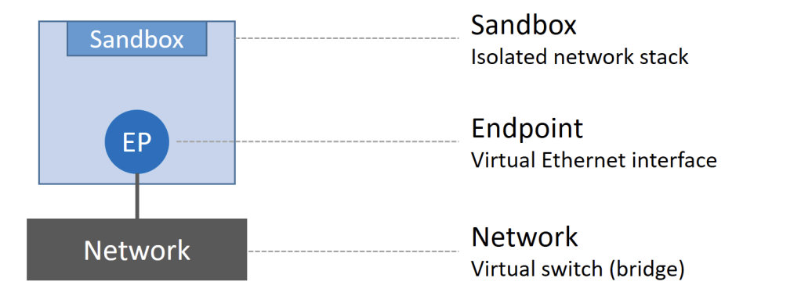
- Sandbox: là một stack network độc lập, nó bao gồm Ethernet interfaces, các bảng định tuyến (routing table), và DNS config.
- Endpoint: là một virtual network interface, cũng giống như các network interface hoạt động trên máy tính của chúng ta, nhiệm vụ của nó là tạo kết nối mạng. Trong thiết kế của CNM, nhiệm vụ của các endpoint là connect các sandbox đến network (block cuối trong CNM)
- Network: là một phần mềm implement tính năng của switch (hay còn được gọi là 802.1d bridge), nhiệm vụ của nó là gom nhóm và tách biệt một tập các endpoint cần giao tiếp với nhau
Ví dụ: các container (A, B) đều có sandbox được đặt trong nó để cung cấp khả năng kết nối mạng.
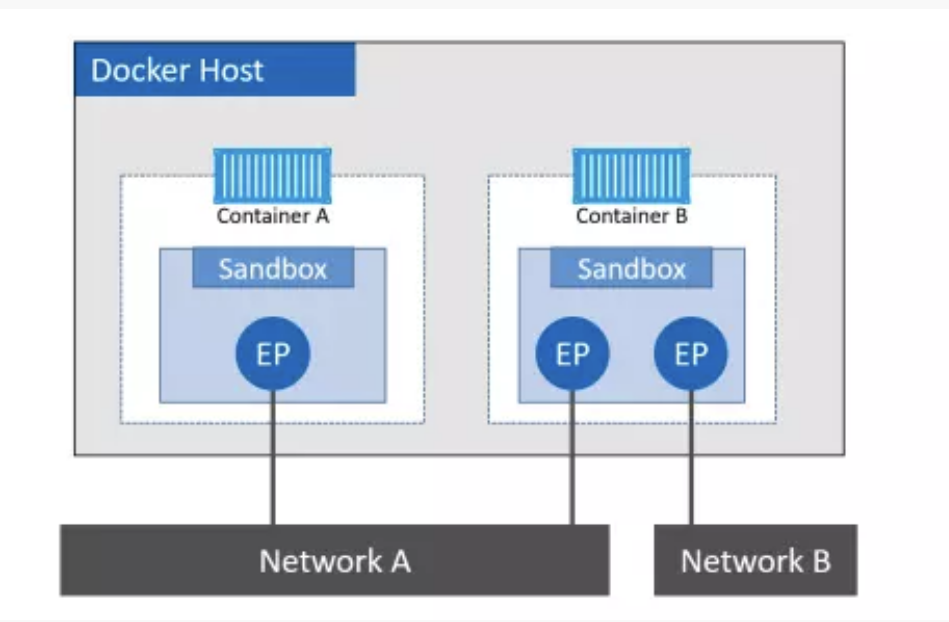
Container B có 2 network interface (chính là các endpoint) và kết nối với các network A và B. Hai container có thể giao tiếp với nhau vì chúng cùng được kết nối tới network A, trong khi 2 endpoints của container B không thể giao tiếp với nhau vì chúng không cùng nằm trên một mạng.

Vì endpoint giống như là các network adapter, cho nên mỗi endpoint chỉ có thể kết nối tới một mạng duy nhất, nên nếu một container muốn kết nói tới nhiều mạng một lúc thì nó cần nhiều hơn 1 endpoint (như trường hợp của container B trong ví dụ trên).

Chúng ta cũng có thể thấy trong ví dụ trên, container A và B cùng hoạt động trên cùng một docker host, thế nhưng network stack của chúng hoàn toàn tách biệt trong OS thông qua sandbox
#### Libnetwork
libnetwork là một bản implementation của CNM
libnetwork có các chức năng khác như service discovery, ingress-base container load balancing , network control plane, management plane (giúp quản lý network trên docker host)
#### Drivers
libnetwork chức năng quản lý networking cho docker host, còn các driver chính là các bản implement cụ thể cho từng mục đích sử dụng khác nhau. Hay nói các khác chính driver mang đến khả năng kết nối thực sự và tách biệt các mạng với nhau.

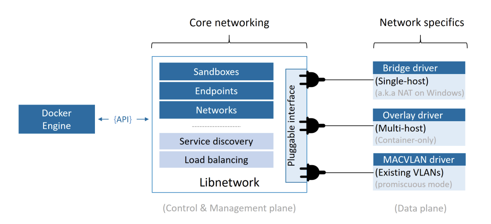

Trong Docker đã có tích hợp sẵn một số driver, được gọi là các native drivers hay local drivers:
- Trên Linux bao gồm: bridge, overlay, macvlan.
- Trên Window bao gồm: nat, overlay, transparent, 12bridge.

Mỗi một driver kể trên chịu trách nhiệm cho việc tạo, quản lý, xóa bỏ các resource trên các network thuộc loại của nó. Ví dụ overlay driver sẽ chịu trách nhiệm tạo, thêm, xóa bỏ các resource trong các overlay network.
Các driver định nghĩa ở trên cũng có thể hoạt động đồng thời cùng lúc để có thể build nên những mô hình cấu trúc phức tạp phục vụ nhu cầu của người dùng
#### Single-host bridge network
Đây là loại mô hình mạng đơn giản nhất trong docker network. Loại mạng single-host bridge network được tạo và quản lý bởi bridge driver trên Linux, nhưng với Window thì driver này tên là nat

Với bridge driver, các network hoạt động trong mode này sẽ chỉ kết nối được với các container trong cùng một host, và nó mô phỏng hoạt động của một layer 2 switch

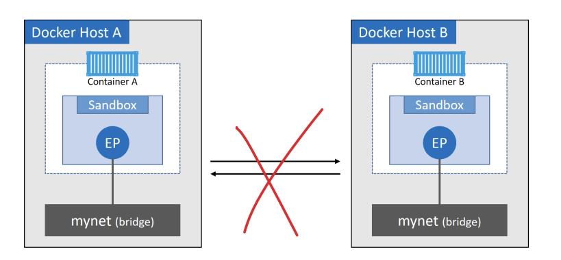

2 docker host có container chạy trên bridge network cùng tên là mynet nhưng không thể kết nối được với nhau bởi vì chúng thực sự ở hai mạng khác nhau trên hai host khác nhau.

`brigde` driver là driver mặc định khi bạn tạo một network với lệnh `docker network create name_network` mà không chỉ định driver cho nó. Khi cài đặt docker thành công, chúng ta luôn có sẵn một bridge network được tạo sẵn. Đối với Linux, network đó tên là bridge, còn trên Windows, network đó tên là nat. 

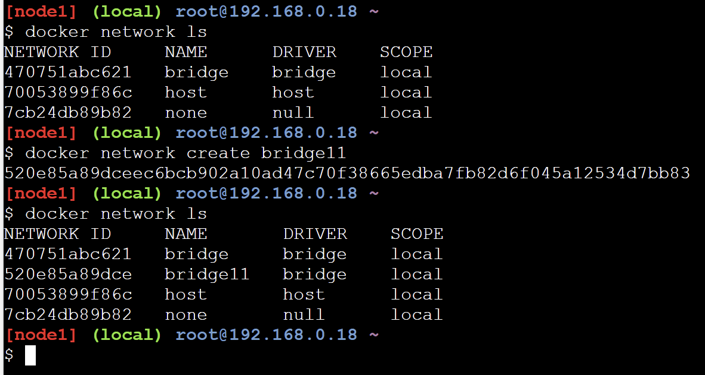

Sử dụng lệnh docker network inspect name_network để biết thêm thông tin về network 
Có thể dùng lệnh ip link show để list ra network device

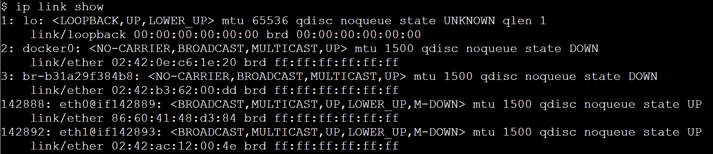

ở đây là bridge network mặc định của docker map với linux bridge tên là docker0 nằm trong Linux kernel, từ đó có thể map đến một Ethernet interface trên docker host thông qua mapping port.

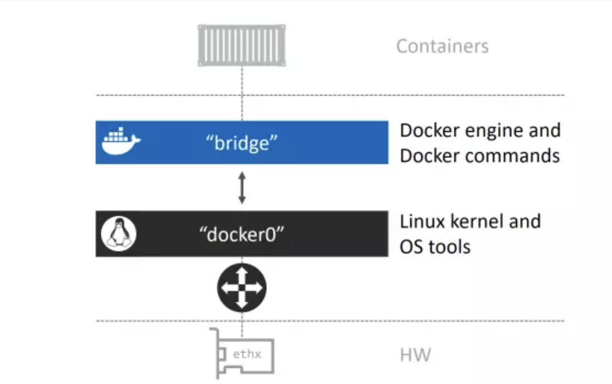

 sử dụng lệnh brctl để liệt kê các brigde đang tồn tại trên hệ thống. Chúng ta có thể thấy kết quả ở dưới, ngoài docker0 là bridge của network mặc định, thì br-b31a29f384b8; br-0d60f59c53e7 là bridge map với network bridge11 và bridge22 chúng ta đã tạo.
 Bây giờ chúng ta sẽ thử tạo một container sử dụng network bridge11 

```sh
$ docker container run -d --name c3 --network bridge11 alpine
```
Kiểm tra bằng `docker network inspect name_network`
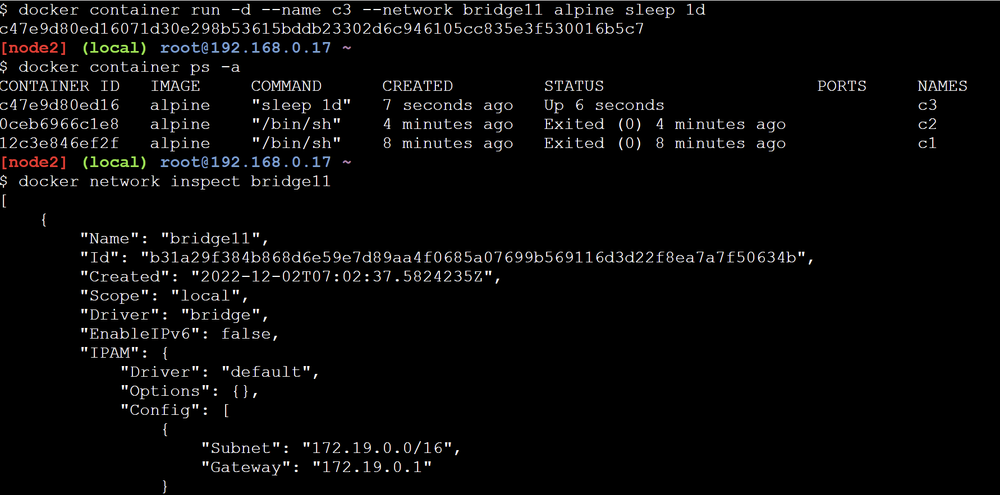
Chạy lại câu lênh brctl show một lần nữa, ta sẽ thấy bridge mới tạo được gắn với interface (endpoint) của container
```sh
$ brctl show
bridge name     bridge id               STP enabled     interfaces
docker0         8000.02420ec61e20       no
br-0d60f59c53e7         8000.0242e6e441a6       no
br-b31a29f384b8         8000.0242b36200dd       no              veth40a20b3
```
Nếu chúng ta thêm một container mới khác vào cùng một mạng, nó sẽ có thể ping container c3 theo tên. Đây là do container mới được tự động đăng ký với dịch vụ Docker DNS nhúng, cho phép chúng kết nối thông qua tên của tất cả các container khác trên cùng một mạng.

VD: Chạy thêm một container khác và ping tới container cũ thông qua tên của nó.

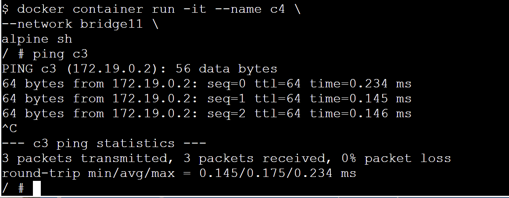

Như vậy, với các container được tạo và sử dụng chung một network bridge có thể kết nối trực tiếp đến nhau mà không cần thông qua một cơ chế mapping port hay address nào cả. Thêm vào đó, chúng ta có thể thực hiện ping trực tiếp đến tên của container như một hostname là do tất cả các containers được tạo mới đều được đăng ký với một DNS service được tích hợp sẵn trong docker, vì thể chúng có thể mapping tên của container với ip của chúng nếu hai container cùng chạy trên cùng một network.

Ánh xạ cổng cho phép bạn ánh xạ một container vào một cổng trên Docker host. 
Bất kỳ lưu lượng truy cập nào có máy chủ Docker trên cổng được cấu hình sẽ được chuyển đến container.
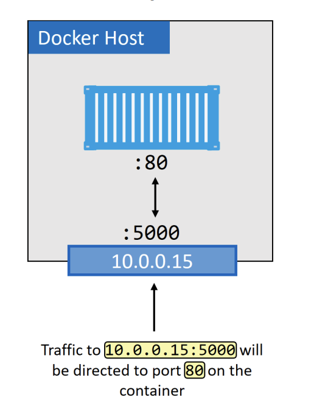

VD:
```sh
$ docker container run -d --name web --network bridge11 --publish 5000:80 nginx
$ docker port web
80/tcp -> 0.0.0.0:5000
```
Kết quả 
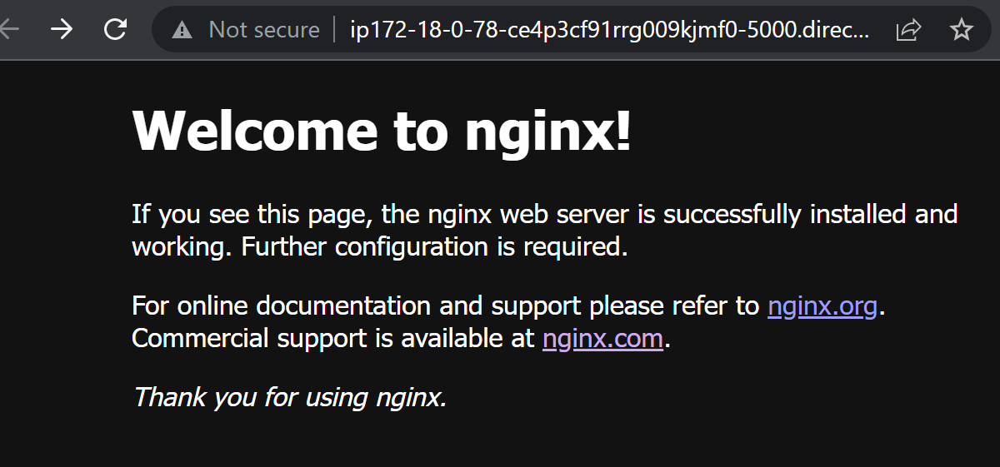

Chỉ có một container duy nhất có thể 
#### Multi-hosts overlay network
Overlay network có thể hoạt động trên multi-hosts. Nó cho phép một network có thể trải rộng trên nhiều docker host khác nhau, vì vậy các container trên các docker hosts đó có thể giao tiếp với nhau thông qua layer 2.
Overlay network là network mặc định khi chúng ta chạy docker với swarm mode (chạy một cluster gồm nhiều docker host), 

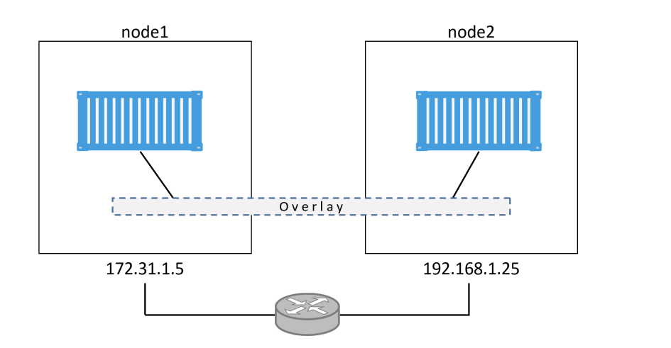

Để tạo một network overlay, chúng ta chỉ cần chạy lệnh `docker network create` với options driver là `-d overlay`.
*Một lưu ý quan trọng là overlay network chỉ có thể tạo được khi docker host của bạn đã được join swarm, hoặc đã được init mode swarm*
VD: Tạo docker swarm với 2 node
```sh
$ docker swarm init \
--advertise-addr 10.0.0.1:2377 \
--listen-addr 10.0.0.1:2377
Swarm initialized: current node (d21lyz...c79qzkx) is now a manager.
```
Trên máy khác tạo 1 node worker
```sh
$ docker swarm join \
--token SWMTKN-1-0uahebax...c87tu8dx2c \
10.0.0.1:2377 \
--advertise-addr 10.0.0.4:2377 \
--listen-addr 10.0.0.4:2377
```
Sau khi đã có hai node join cùng một swarm, ở node 1 là node manager, ta sẽ tạo một network với overlay driver, chú ý là phải có thêm --attachable để có thể tạo container chạy trên network này.
```sh
docker network create -d overlay --attachable overlaynetwork
```
Sau khi đã có network overlay, ta sẽ tiến hành tạo 2 container chạy trên 
```sh
$ docker container run -d --name a1 --network overlaynetwork alpine sleep 1d
$ docker container run -d --name a2 --network overlaynetwork alpine sleep 1d
```
Sau khi tạo xong, chúng ta có thể đứng từ container trên bất kỳ node nào và ping container còn lại
Kết quả:

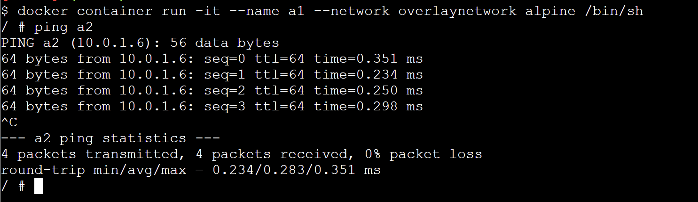

#### Kết nối với mạng hiện có
Khả năng kết nối các ứng dụng container hóa với các hệ thống bên ngoài và mạng vật lý là rất quan trọng, ứng dụng với một phần được container hóa và một phần không container hóa vẫn chạy trên mạng và VLAN vật lý hiện có. Trình điều khiển MacVlan tích hợp đã được tạo ra với mục đích này. Nó tạo ra các container firstclass citizens tồn tại trên mạng vật lý hiện có bằng cách cung cấp cho mỗi container một địa chỉ MAC và địa chỉ IP

Mạng Macvlan cho phép chúng ta gán địa chỉ MAC cho container, điều này làm cho mỗi container như là một thiết bị vật lý trong mạng.

Docker daemon định tuyến truy cập tới container bởi địa chỉ MAC. Sử dụng driver macvlan là lựa chon tốt khi các ứng dụng khác cần phải connect đến theo địa chỉ vật lý hơn là thông qua các lớp mạng của máy chủ.

Hiệu suất MacVlan tốt vì nó không yêu cầu ánh xạ cổng hoặc thêm `bridges`, kết nối giao diện container thông qua giao diện máy chủ. Tuy nhiên, nó máy chủ NIC hỗn loạn. Vì vậy MacVlan tốt cho mạng trung tâm dữ liệu doanh nghiệp, nhưng không phù hợp cho hoạt động trong đám mây công cộng. 
Giả sử có 2 mạng VLAN
- VLAN 100: 10.0.0.0/24
- VLAN 200: 192.168.3.0/24
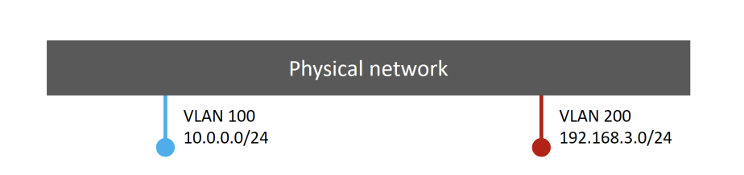
Thêm một Docker host và kết nối vào nó
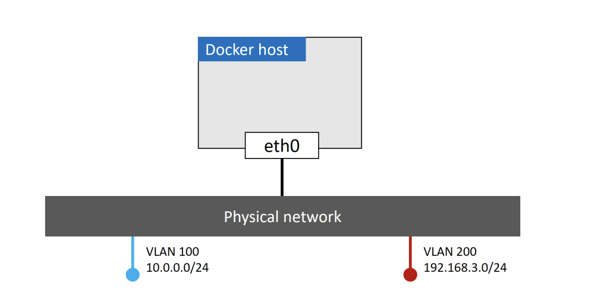
Đưa một yêu cầu cho một container chạy trên máy chủ đó đưa vào Vlan 100. Để làm việc này, chúng tôi tạo một network Docker mới với trình MacVlan( cần thêm các cờ)
```sh
$ docker network create -d macvlan \
--subnet=10.0.0.0/24 \
--ip-range=10.0.0.0/25 \
--gateway=10.0.0.1 \
-o parent=eth0.100 \
macvlan100
```
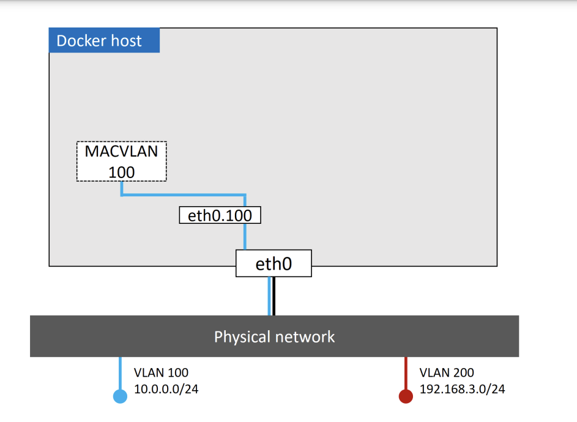
