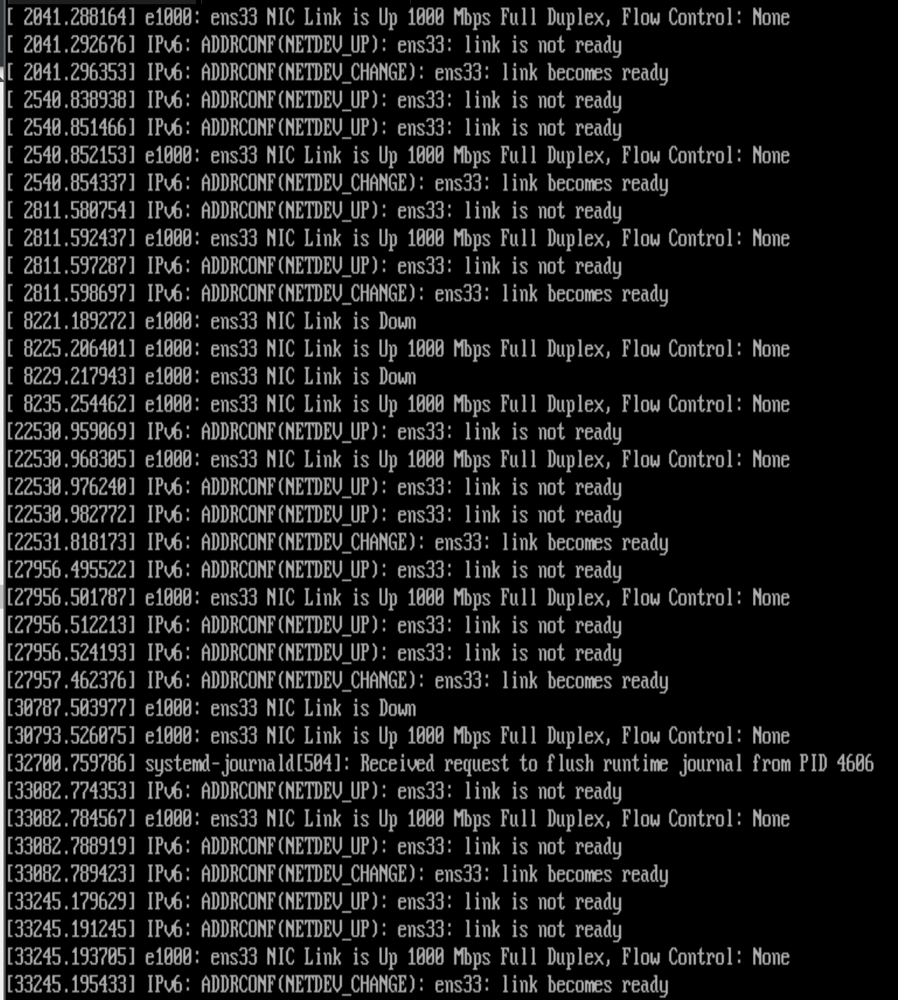
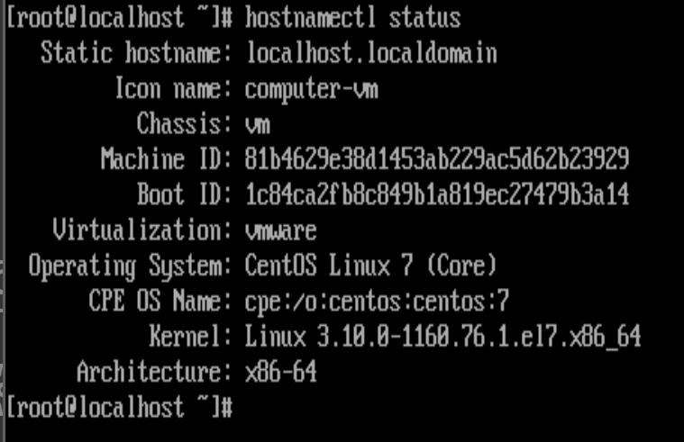
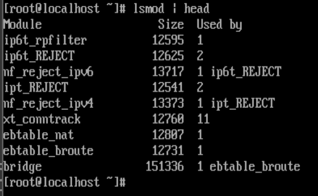
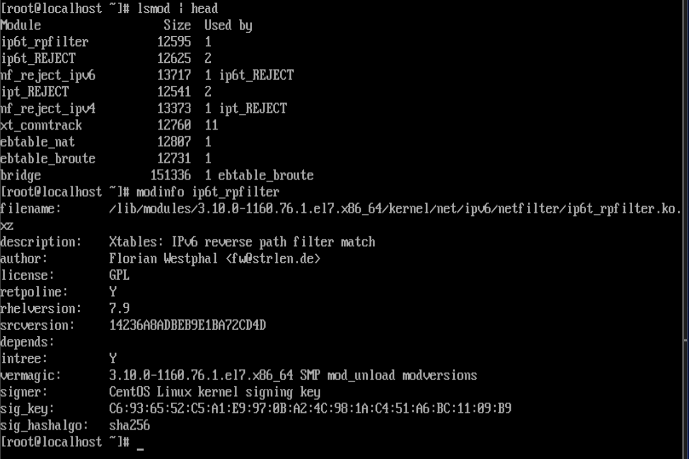

# Linux Kernel
Linux kernel là lớp nằm giữa người dùng, người làm việc với Linux từ một môi trường shell và phần cứng. 

Vai trò của kernel là:
- Quản lí I/O nó nhận được và chuyển chúng thành các hướng dẫn xử lý được thực hiện bởi CPU và phần cứng khác trong máy tính.
- Kernel xử lý các nhiệm vụ hệ điều hành thiết yếu.(Vd bộ lập lịch đảm bảo bất kỳ quy trình nào được bắt đầu trên hệ điều hành được xử lý bởi CPU)

Driver là một phần mềm, gồm các lệnh, hướng dẫn CPU cách tương tác với thiết bị. Các thiết bị có thể là chuột, bàn phím, ổ cứng, card mạng, loa, màn hình,… Tuy nhiên, các thiết bị này không được nối trực tiếp với CPU, bởi vì:

   - Hệ thống có nhiều thiết bị, nhưng số lượng nhân của CPU hữu hạn.
   - Tốc độ làm việc của các thiết bị thấp hơn nhiều so với CPU.


Linux được thiết kế để làm việc với hàng tỉ thiết bị. Nhưng ta không thể đưa tất cả các driver vào trong kernel được, vì sẽ làm cho kích thước kernel rất lớn. Giải pháp cho vấn đề này đó là: thiết kế các driver dưới dạng module tách rời với kernel. Trong quá trình hoạt động, driver nào cần thiết sẽ được lắp vào kernel, còn driver nào không cần thiết sẽ bị tháo ra khỏi kernel (dynamic loading).
#### Linux kernel module
Linux kernel module là một file với tên mở rộng là (.ko). Nó sẽ được lắp vào hoặc tháo ra khỏi kernel khi cần thiết. Chính vì vậy, nó còn có một tên gọi khác là loadable kernel module.

Việc thiết kế driver theo kiểu loadable module mang lại 3 lợi ích:

   - Giúp giảm kích thước kernel. Do đó, giảm sự lãng phí bộ nhớ và giảm thời gian khởi động hệ thống.
   - Không phải biên dịch lại kernel khi thêm mới driver hoặc khi thay đổi driver.
   - Không cần phải khởi động lại hệ thống khi thêm mới driver. Trong khi đối với Windows, mỗi khi cài thêm driver, ta phải khởi động lại hệ thống, điều này không thích hợp với các máy server.
  
Cách dùng Kernel luồng và driver

- Nhiệm vụ của hệ điều hành được thực hiện bởi kernel, được thực hiện bởi các luồng kernel khác nhau
- Luồng là một dòng điều khiển trong một tiến trình, nếu tiến trình có nhiều luồng nó có thể thực hiện nhiều tác vụ tại một thời điểm

- Để nhìn thấy luồng của Kernel sử dụng `ps aux` 


Một nhiệm vụ quan trọng khác của kernel Linux là khởi tạo phần cứng, để đảm bảo rằng phần cứng này có thể sử dụng được, nhân Linux sẽ sử dụng driver. Mỗi một phần của phần cứng sẽ chứa các đặc điểm cụ thể và để sử dụng những đặc điểm đó, một driver phải được load(nắp vào). Nhân Linux là modul và driver được nạp vào như kernel modul.

- Trong một vài trường hợp, các nhà sản xuất phần cứng không phải lúc nào cũng sẵn sàng cung cấp driver nguồn mở được tích hợp tốt với Linux kernel. Điều đó có thể dẫn đến một driver không cung cấp tất cả các chức năng được cung cấp bởi phần cứng.

Phân tích Kernel làm những gì:
- Để giúp phân tích kernel làm những gì, một vài tools được cung cấp bởi hệ điều hành Linux:
   - `dmesg`
   - `/proc`file system chứa chi tiết thông tin trạng thái về những thứ xảy ra trên server của bạn như CPU, memory, mounts
   - `uname`
#### dmesg : chi tiết thông tin về hoạt động của kernel
- Hiển thị nội dung của kernel ring buffer(bộ đệm vòng kernel), một khu vực của bộ nhớ nơi kernel Linux giữa các nhật kí gần đây, nó  là một bộ đệm kích thước cố định trong đó bất kỳ dữ liệu mới nào được thêm vào sẽ ghi đè lên dữ liệu cũ nhất được lưu trữ ở đó. 
- Khi kết nối hoặc ngắt kết nối thiết bị phần cứng trong hệ thống, nhờ lệnh dmesg, có thể biết thông tin được phát hiện hoặc ngắt kết nối trong thời gian thực và tốt nhất
- Một phương pháp thay thế để có quyền truy cập để lấy thông tin bộ đệm vòng kernel là sử dụng câu lệnh `journalctl --dmesg` hoặc `journalctl -k` 

- Chỉ báo thời gian liên quan đến việc bắt đầu kernel, xem số giây đã trôi quan giữa đầu kernel và một sự kiện cụ thể.
- Ngay cả việc sử dụng dmesg theo cách này cũng không tối ưu vì vẫn còn hàng tấn thông tin khác cần sàng lọc,dmesg có một vài tùy chọn cho phép người dùng tiếp tục gói gọn lại các thông tin đó. Chú ý `e journalctl -k`
- Các cấp độ là:

emerg - Hệ thống không sử dụng được

alert - Hành động phải được thực hiện ngay lập tức

crit - Điều kiện quan trọng

err - Tình trạng lỗi

warn - Tình trạng cảnh báo

notice - Tình trạng bình thường nhưng có ý nghĩa

info - Thông tin

debug - Thông báo mức gỡ lỗi

Vd: bạn chỉ muốn xem các cảnh báo quan trọng
```sh
dmesg --level=alert,crit
```
- Sử dụng lệnh `uname` để hiện thị các loại thông tin khác về hệ điều hành. `uname -a` cho xem tổng quát về tham số liên quan, `uname -r`hoặc `hostnamectl status ` để nhìn version kernel gần nhất được sử dụng



### Làm việc với kernel modules
- kernel phải được biên dịch để bao gồm những driver được yêu cầu để hỗ trợ phần cứng máy tính. Một modular kernel cung cấp hỗ trợ driver được load khi được yêu cầu, chúng chỉ bao gồm các modul thực sự cần thiết
- các kernel module thực hiện chức năng kernel cụ thể, được sử dunhj để load driver cho phép giao tiếp với thiết bị phần cứng
##### Khởi tạo phần cứng
- Việc tải driver là một tiến trình tự động:
  1. Trong quá trình khởi động, kernel thăm dò có sẵn phần cứng.
  2. Khi phát hiện một thành phần phần cứng, tiến trình `systemd-udevd` quan tâm việc tải driver thích hợp và cung cấp thiết bị phần cứng.
  3. Để quyết định cách các thiết bị được khởi tạo, `systemd-udevd` đọc các tệp quy tắc trong /usr/lib/udev/rules.d. Đây là các tệp quy tắc do hệ thống cung cấp không nên được sửa đổi
  4. Sau khi xử lý các tệp quy tắc udev system-provided, systemd-udevd sẽ truy cập thư mục /etc/udev/rules.d để đọc bất kỳ quy tắc tùy chỉnh nào nếu chúng có sẵn
  5. Do đó, các kernel modules được yêu cầu được tải tự động và trạng thái về các mô -đun kernel và phần cứng liên quan được ghi vào hệ thống tệp `sysfs` , được gắn trên thư mục `/sys`. Kernel Linux sử dụng hệ thống tệp giả này để theo dõi các cài đặt hardware-related.
- Tiến trình systemd-udevd không phải là quy trình một lần, nó liên tục theo dõi việc cắm, rút các phần cứng mới. Sử dụng lệnh `udevadm monitor` để liệt kê tất cả các sự kiện được xử lý trong khi kích hoạt các thiết bị phần cứng mới. bạn có thể thấy cách các tính năng được cung cấp bởi phần cứng được phát hiện tự động bởi kernel và systemd-udevd. Mỗi một giai đoạn của thăm dò phần cứng được kết thúc bằng cách tạo một tệp `/sys` trong file system. Khi phần cứng đã được khởi tạo đầy đủ, bạn có thể cũng nhìn thấy vài kernel modul được load
### Quản lý Kernel modules
- Linux kernel modul thường được tải tự động khi thiết bị cần đến chúng, tuy nhiên sẽ có lúc bạn hiếm khi bạn phải load kernel modules thủ công. Một số câu lệnh dùng để quản lý thủ công kernel moduls là:
- Một phương pháp thay thế của load kernel modules thông qua thư mục `/etc/modules-load.d`. Trong thư mục, bạn có thể tự động tạo file để load modules không được tải bởi systemd-udevd. 

|Command|Cách sử dụng|
|---|---|
|Ismod|Danh sách các kernel modules hiện tại được load|
|modinfo|Hiển thị thông tin về kernel modules|
|modprobe|Loads kernel modules, bao gồm tất cả sự phụ thuộc của nó|
|modprobe -r|Tháo kernel modules, cân nhắc đến sự phụ thuộc của kernel module, nếu kernel module đang được dùng thì sẽ không unload được|

VD: `lsmod | head`



Nếu bạn muốn có nhiều thông tin hơn về kernel module riêng, bạn có thể sử dụng câu lệnh `modinfo`
VD : `modinfo ip6t_rpfilter`



Để nắp và tháo các modul một cách thủ công, bạn có thể sử dụng `modprobe` và `modprobe -r`, trước đây có `insmod` và `rmmod` tuy nhiên giờ không sử dụng vì nó không tải kernel module phụ thuộc.

### Kiểm tra tính khả dụng của driver cho các thiết bị phần cứng
Đôi khi, bạn có thể thấy một số thiết bị không được hỗ trợ đúng vì các modul của chúng không được load. Cách tốt nhất để tìm ra những phần cứng đó sử dụng `lspci`. Nếu không có tham số, nó sẽ hiển thi tất cả các thiết bi phần cứng đã được phát hiện trên PCI bus. Nếu thêm tham số -k, hiển thị danh sách toàn bộ kernel modules được sử dụng cho PCI devices được phát hiện

```sh
lspci -k | head
```
Nếu bạn phát hiện rằng thiết bị PCI được tìm thấy trong đó không có modul kernel nào có thể được tải, vì bạn đng xử lý một thiết bị không đươck hỗ trợ 

### Quản lý tham số Kernel Module 
Các mục nhập `parm` hiển thị các tham số mà người dùng có thể đặt cho modul và loại giá trị nào họ mong đợi
- Bạn có thể muốn tải kernel modules với các tham số cụ thể, khi bạn đã tìm được tham số bạn muốn sử dụng, bạn có thể load nó thủ công, chỉ định tên của tham số theo sau là giá trị bạn muốn gán.Để làm điều đó một cách tự động, bạn có thể tạo một file trong thư mục /etc/modprobe.d, nơi mà module được load bao gồm tham số bạn muốn load
Vd:
```sh
modinfo cdrom debug=1
```
Module cdrom với tham số debug được bật

### Nâng cấp Linux kernel
Một phiên bản mới của kernel được cài đặt và sử dụng làm kernel mặc định, phiên bản cũ của kernel sẽ vẫn có sẵn. Điều này đảm bảo máy tính của bạn vẫn có thể khởi động nếu kernel mới không được hỗ trợ chức năng. Để cài đặt một phiên bản kernel, vạn có thể sử dụng `yum upgrade kernel` hoặc `yum install kernel`
- 4 tệp kernel cuối cùng bạn đã cài đặt trên máy chủ sẽ giữ trong thư mục /boot
 