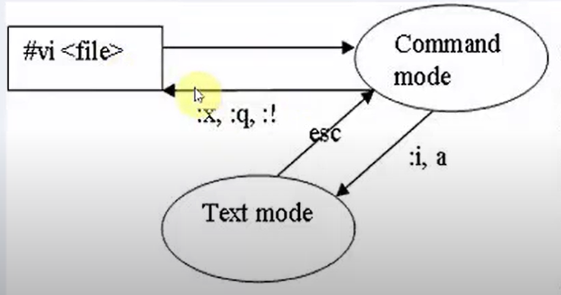
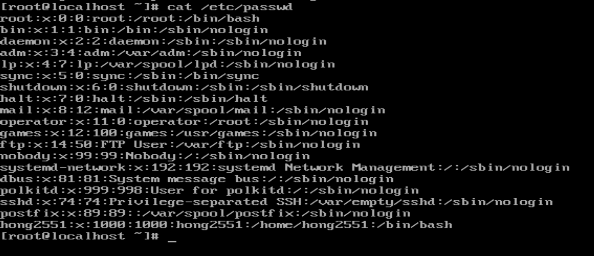
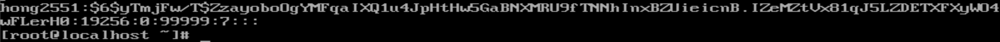
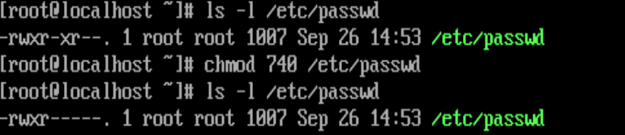
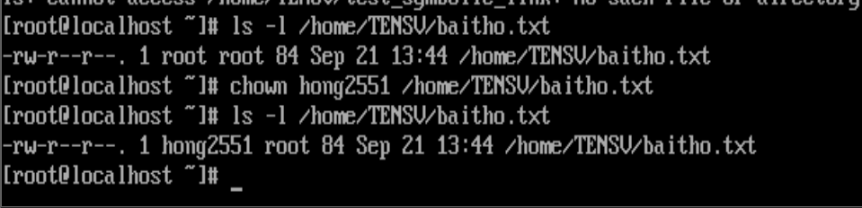
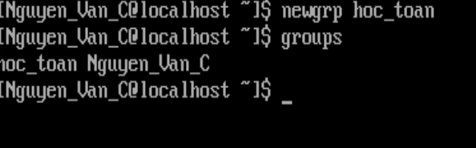
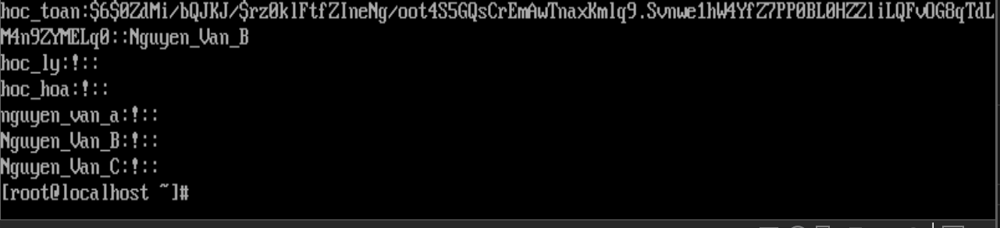
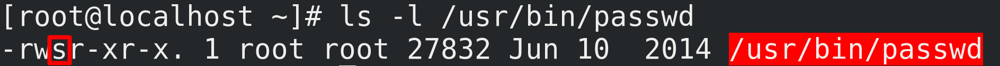

## Nội dung 
- Tìm hiểu về cấu trúc thư mục trong Linux
- Cách sử dụng các lệnh tương tác với thư mục: pwd, cd, mkdir, rmdir,..
- Tìm hiểu về phân quyền trong linux.
- Học cách sử dụng các lệnh: useradd, chmod, chown,...
## 1. The Linux File Hierarchy Structure hay Filesystem Hierarchy Standard (FHS)
- Một hệ thống Linux được trình bày như một phân cấp với thư mục gốc (/) làm điểm bắt đầu.
- Là danh sách các folder được xắp xếp bên trong hệ điều hành Linux, qua đó dữ liệu sẽ được lưu trữ đúng nơi vị trí của nó.
Một số thư mục :

|  | Ý nghĩa |
|----|---------|
| /| Là thư mục gốc, là nơi cây hệ thống bắt đầu |
| /bin| Chứa các chương trình cài dặt vào Linux |
|/boot|Chứa tất cả các tệp và thư mục cần thiết để khởi động nhân Linux.|
|/dev|Chứa các tệp thiết bị được sử dụng để truy cập các thiết bị vật lý.|
|/etc|Chứa các tệp cấu hình được sử dụng bởi các chương trình và dịch vụ trên máy chủ của bạn.|
|/home| Chứa các tập tin của người dùng trong hệ thống, mỗi user sẽ có một thư mục bên trong này|
|/media,/mnt| Chứa các thư mục được sử dụng để lắp các thiết bị trong cây|
|/opt|Được sử dụng cho các gói tùy chọn có thể được cài đặt trên máy chủ của bạn, chứa các ứng dụng thêm của các hãng khác nhau|
|/proc|Được sử dụng bởi hệ thống tệp Proc. Đây là cấu trúc hệ thống tệp cho phép truy cập vào thông tin kernel|
|/root|chứa tập tin của root|
|/run|Chứa thông tin quy trình và người dùng cụ thể đã được tạo kể từ lần khởi động cuối cùng.|
|/srv|Chứa các dữ liệu liên quan các dịch vụ máy chủ như FTP và HTTP|
|/sys|Được sử dụng như một giao diện cho các thiết bị phần cứng khác được quản lý bởi nhân Linux|
|/tmp|Chứa các file tạm thời có thể bị xóa mà không có bất kỳ cảnh báo khi khởi động lại|
|/usr|Chứa các tập tin thực thi, thư viện, tài liệu và mã nguồn cho các chương trình.|
|/var|Chứa các file có thể thay đổi kích thước linh động như  log files,mail boxes, and spool files|

Mounting ?
- Trong quá trình gắn, một thiết bị được kết nối với một thư mục cụ thể, sao cho sau khi gắn kết, thư mục này cho phép truy cập vào noi dung thiết bị.
- Hệ thống phân cấp này có thể được phân phối trên các thiết bị khác nhau và thậm chí các hệ thống máy tính được gắn vào thư mục gốc.
- Các thiết bị gắn kết cho phép tổ chức hệ thống tệp Linux một cách linh hoạt. 
- Có một số nhược điểm để lưu trữ tất cả các tệp chỉ trong một hệ thống tệp, điều này cho một số lý do chính đáng để làm việc với nhiều mounts: 
  - Hoạt động cao trong một khu vực có thể lấp đầy toàn bộ hệ thống tệp, điều này sẽ tác động tiêu cực đến các dịch vụ chạy trên máy chủ. 
  - Nếu tất cả các tệp nằm trên cùng một thiết bị, rất khó để đảm bảo truy cập và phân biệt giữa các khu vực khác nhau của hệ thống tệp với các nhu cầu bảo mật khác nhau. Bằng cách gắn một hệ thống tệp riêng biệt, các tùy chọn gắn kết có thể được thêm vào để đáp ứng các nhu cầu bảo mật cụ thể. 
  - Nếu hệ thống tệp một thiết bị được lấp đầy hoàn toàn, có thể khó có thể cung cấp thêm không gian lưu trữ. 

# 2. Các lệnh tương tác với thư mục

## 2.1. Lệnh ls - xem danh sách tập tin thư mục
ls -[tùy chọn] [đường dẫn thư mục muốn xem]

Các tùy chọn phổ biến
|Các tùy chọn | Ý nghĩa|
|----|----|
|-L|Hiển thị danh sách tập tin, thư mục (chỉ hiện thị tên).|
|-l|Hiển thị chi tiết danh sách tập tin, thư mục (gồm nhiều cột: filename, size, date,….|
|-a|Liệt kê tất cả các tập tin, thư mục, bao gồm những tập tin ẩn.|
|-R|Liệt kê tất cả các tập tin, thư mục kể cả các tập tin, thư mục bên trong thư mục cha.|
|-lrt|Hiển thị các lệnh được sắp xếp vào ngày sửa đổi. Bạn sẽ thấy các tệp được sửa đổi gần đây nhất trong danh sách.|

### Lệnh grep
#### 2.1.1. Lọc lại tên tập tin thư mục muốn xem 
Lệnh ls -l của "/" cho kết quả nhiều thông tin, nếu muốn lọc lại tên tập tin thư mục muốn xem chỉ cần thêm grep.
VD: 
```sh
 ls -l | grep pro 
```
 (Muốn xem trong "/" có tập tin, thư mục nào có ký tự là pro)
```sh
 ls -l /etc/ | grep yum 
 ```
(Thư mục /etc có tập tin, thư mục nào có ký tự là yum )
hoac find . - name "*.txt"
#### Lệnh grep còn được dùng tìm kiếm chuỗi trong file
VD: grep "yum" /root/*.txt (Tìm kiếm chuỗi "yum" trong các file có đuôi .txt trong thư mục /root:)
## 2.2 Lệnh pwd - xem bạn đang ở thư mục nào
Cú pháp: pwd [-options]
Lệnh pwd tồn tại 2 trạng thái:
- 0 : Success
- Non-zero : Failure
pwd Option

|Option|Ý nghĩa |
|---|----|
|-L,--logical|Được sử dụng để in các liên kết tượng trưng|
|-P,-- physical|Dược sử dụng để in đường dẫn thực tế mà không có bất kỳ liên kết tượng trưng nào|
|--version|In ra version chương trình|
|--help|Hiển thị thông báo trợ giúp|
Chú ý: Các biến môi trường là các biến có chứa các giá trị cần thiết để thiết lập môi trường shell, các biến môi trường vẫn tồn tại trong các quá trình con của shell.
## 2.3 Lệnh cd - dùng để đổi sang một thư mục khác
Các lệnh cd thông dụng:
- Di chuyển về thư mục gốc: cd /
- Di chuyển đến 1 vị trí bất kì khi biết đường dẫn tuyệt đối: cd /etc/networks
- Di chuyển đến thư mục con nằm trong thư mục hiện tại: cd docs ; ./docs hoặc docs/
- Di chuyển đến thư mục mẹ: cd ..
- Lệnh cd không có tham số, sẽ đưa bạn về home directory, dù bất kể bạn đang ở đâu: cd hoặc cd ~
- Lệnh cd dùng để quay về thư mục trước: cd -
## 2.4 Lệnh mkdir - dùng để tạo thư mục trên Linux
- Lệnh mkdir được sử dụng để tạo một thư mục trong thư mục hiện tại:
> #mkdir [tên thư mục cần tạo]

- Tạo một thư mục "abcdir" tại thư mục /root/
> #mkdir /root/abcdir/

- Tạo 3 thư mục "abcdir1","abcdir2", "abcdir3" tại thư mục hiện tại
> #mkdir abcdir1 abcdir2 abcdir3

- Tạo 3 thư mục "abcdir1","abcdir2", "abcdir3" tại thư mục root
> #mkdir /root/abcdir1/root/abcdir2/root/abcdir3 
hoặc #mkdir /root/{abcdir1,abcdir2,abcdir3}
- Tạo thư mục kèm theo thư mục cấp cha chủa nó khi thư mục cấp cha của nó chưa tồn tại.
> #mkdir -p -v /root/abcdir_parent/abcdir

(Khi đó nó sẽ tạo thư mục cha trước sau đó sẽ tạo thư mục con)
## 2.5. Lệnh xóa tập tin thư mục
Sử dụng lệnh rm. Khi được sử dụng trên một tệp duy nhất, tệp đơn sẽ bị xóa. Để xóa thư mục có chứa các file cần thêm -r. Chú ý khi sử dụng option -i xóa tập tin sẽ được hỏi trước, nếu bạn không thích việc hỏi trước đó có thể sử dụng option -f => xóa mà không hỏi

- Xóa tập tin 
> #rm [đường dẫn]

VD: Xóa tập tin abc.txt trong /usr/passwd:
> #rm /usr/passwd/abc.txt

- Xóa tập tin mà không cần hỏi
> #rm -f [đường dẫn]

- Xóa thư mục
> #rm -rf [đường dẫn]

- Xóa thư mục rỗng
> #rmdir [đường dẫn]

## 2.6. Lệnh copy tập tin, thư mục
- Lệnh sao chép tập tin:
  option: 
   -a :Sao chép cả những quyền và dặc tính của thư mục
   -R :Sao chép toàn bộ thư mục 
   -l :link file thay vì copy
>cp [Options] [đường dẫn nguồn] [đường dẫn đích]

Ví dụ: Sao chép tập tin abc.txt trong thư mục /root sang /usr: 
> #cp /root/abc.txt /usr

- Lệnh sao chép thư mục:
> #cp -r [đường dẫn nguồn] [đường dẫn đích]

Ví dụ: Sao chép thư mục /root/networks sang /usr/bin:

```sh
#cp -r /root/networks /usr/bin
```
## 2.7 Lệnh mv - dùng di chuyển, đổi tên
- Cần đổi tên một tập tin
>#mv  [Options] [đường dẫn với tên củ] [đường dẫn với tên mới]

Option:
  -i: Nhắc trước khi di chuyển với tập tin/ thư mục đích đã có rồi
  -f: Ghi đè khi di chuyển với tập tin/thư mục đích đã có rồi

Ví dụ: Đổi tên tập tin test1.txt trong /root thành test.txt:
>#mv /root/test1.txt /root/test.txt

- Di chuyển một tập tin đến vị trí khác, trong khi đó nó có thể đổi tên cùng lúc.
>#mv [đường dẫn nguồn] [đường dẫn đích]

Ví dụ: Di chuyển và đổi tên tập tin test1.txt trong /root sang /etc đổi tên thành test.txt:
>#mv /root/test1.txt /etc/test.txt
## 2.8. Cách  hiển thị các tệp văn bản 
|Lệnh|Chức năng|
|---|----|
|cat|Dùng để xem các tập tin không quá dài.|
|tac|Dùng để xem nội dung của một tập tin ngước bắt đầu từ dòng cuối.|
|less|Lệnh less dùng mở một tệp để đọc tương tác, cho phép di chuyển lên xuống và tìm kiếm.|
|head|Dùng để in 10 dòng đầu của tập tin theo mặc định|
|tail|Dùng để in 10 dòng cuối của tập tin theo mặc định.|
|cut|Được sử dụng để lọc các cột hoặc ký tự cụ thể từ tệp văn bản
|tess|Dùng để xem tập tin lớn hơn vì đây là chương trình phân trang.|
Chú ý với head và tail có thể sửa dòng lệnh để đọc n dòng 
VD:
>head -5 /etc/passwd


Chú ý cách thay đổi password cho user đang login
#passwd 
nếu đang đăng nhập với tài khoản root bạn có thể thay đổi mật khẩu của tài khoản user
#passwd user

## Thực hành 
1. Tạo thư mục TENSV trong Home
``` sh
mkdir /home/TENSV/
```


2. Tạo 1 tập tin danhsach.txt và baitap.sh trong TenSV
```sh
touch /home/TENSV/danhsach.txt
touch /home/TENSV/baitap.sh
```


3. Tạo 1 tập tin trong /root có tên là thuhanh.txt và chuongtrinh.sh
```sh
touch /root/thuhanh.txt
touch /root/chuongtrinh.sh
```


4. Copy tập tin chuongtrinh.sh sang thư mục TENSV
```
cp /root/chuongtrinh.sh /home/TENSV/
```


5. Dùng lệnh vi tạo tập tin baitho.txt, viết 2 câu thơ vào tập tin đó, xong save lại
   - Vi: - là trình soạn thảo có mặt trên các hệ điều hành Unix/Linux
- Sử dụng trong việc sửa các file cấu hình trên Linux.
#vi <file> ta sẽ vào chế độ command mode

- Lệnh cơ bản:
  - dd: xóa dòng
  - x: xóa ký tự
  - yy: copy dòng
  - p: patsr dòng
  - /<chuối>: tìm chuổi
  - :x : thoát lưu
  - :q : thoát thông lưu
- Để vào chế độ text mode: :i, a

```sh
vi baitho.txt
```


6. Xem(đọc) nội dung tập tin baitho.txt 
```sh
cat baitho.txt
```


7. Di chuyển và đổi tên tập tin thuchanh.txt sang lythuyet.txt đến thư mục TenSV và xóa chuongtrinh.sh khỏi root
```sh
mv /root/thuhanh.txt /home/TENSV?lythuyet.txt
rm /root/chuongtrinh.sh
```


8. Di chuyển baitho.txt vao TENSV
```sh
mv baitho.txt home/TENSV/
```
   


9. Xem nội dung câu đầu của tập baitho.txt, xem nội dung 2 câu cuối của tập baitho.txt
```sh
cat home/TENSV/baitho.txt
head -1 home/TENSV/baitho.txt
tail -2 home/TENSV/baitho.txt
```


## 3. Using Links

Có symbolic links and hard links để hiểu một link cần biết về hệ thống file sử dụng inodes cho quản trị hệ thống tệp.
Inodes được sử dụng để lưu trữ tất cả các dữ liệu trong file. Về phía người dùng ta có thể dễ dàng phân biệt với các file khác dựa vào tên filename, nhưng về phía hệ điều hành các file được phân biệt định danh bằng chỉ số inode. Mỗi file trong Linux có một inode và chứ thông tin quan trọng và tệp lưu trữ:
  -  Khối dữ liệu nơi lưu trữ nội dung tệp
  - Tạo, truy cập và ngày sửa đổi 
  - Quyền
  - Chủ sở hữu tập tin
Có 1 phần quan trọng không được lưu trữ trong inode là tên của tệp, nó được lưu trức trong thư mục
### Hard links


Ta có file nguồn tên là filename, có chỉ số inode là inode, địa chỉ bộ nhớ addresses, vùng lưu trữ dữ liệu là data. Khi tạo hard link có tên file othername, thì chỉ số đi kèm với nó sẽ chính là inode của filename.

Vì cùng chỉ số inode nên sẽ cùng tham chiếu đến một vùng nhớ chứa địa chỉ addresses của dữ liệu do đó sẽ cùng trỏ đến một vùng lưu trữ dữ liệu data. Tuy 2 mà 1, filename và othername cũng chỉ là hai cái tên về mặt người dùng nhưng đối với hệ thống nó gần như là như nhau. 

- Một inode không biết nó có tên nào; nó chỉ biết có bao nhiêu tên được liên kết với inode , những tên này được gọi là hard links. Khi bạn tạo một file bạn cho nó một tên -> nó là một hard link. Trong Linux hệ thống file, nhiều hard links có thể được tạo từ một File, bạn có thể truy cập vào file từ nhiều địa điểm khác nhau
Hạn chế của hard link:
- Hard link phải tồn tài trên cùng một thiết bị
- Không thể tạo hard link đến thư mục
- Khi tên cuối(hard link) đến tệp bị xóa, truy cập vào dữ liệu của tệp cũng bị xóa.
### Symbolic Links
- Không liên kết trực tiếp với inode mà là tên của tệp. Điều này làm cho các symbolic linh hoạt hơn nhiều, nhưng nó cũng có một số nhược điểm. Ưu điểm của các symbolic link là chúng có thể liên kết đến file trên các thiết bị khác, cũng như trên các thư mục. Nhược điểm chính là khi tệp gốc bị xóa,liên kết tượng trưng trở nên không hợp lệ và không hoạt động nữa.
- Tạo link:
    - Sử dụng ln để tạo links, cách dùng giống với cp và mv.
    - Tạo một symbolic link , ​​bạn sử dụng tùy chọn -s
    - Tuy nhiên: để có thể tạo các liên kết cứng, bạn phải là chủ sở hữu của mục bạn muốn liên kết đến
- Ví dụ về tạo symbolic link


## 4. Phân quyền trong linux
### 4.1. User, Group

Đầu tiên, User (hay còn gọi là người dùng) là tài khoản dùng để đăng nhập vào hệ thống. Mỗi User sẽ chứa một mã UID (Unique identification number) hay mã xác định danh tính duy nhất, từ đó hệ thống có thể phân biệt được các người dùng với nhau.

Dựa vào quyền hạn truy cập thì User được chia theo 3 loại chính:
- Superuser/root/administrator : Loại User có quyền hạn cao nhất. Có khả năng truy cập vào mọi file có trong hệ thống(UID=0)
- Normal user: Là loại User thường, bị giới hạn một số quyền (Ta có thể tuỳ chọn các quyền mà user này có thể làm, UID start to 1000).
- System user: Những tài khoản người dùng được tạo ra bởi hệ thống để chạy các processes hoặc daemons. Mỗi users có những files và resources riêng. UIDs nằm trong khoảng từ 1 – 999
  
Note: Superuser

- Các đặc quyền mà Superuser có thể làm:

  - Đặc quyền thay đổi read/write/exectue
  - Tạo, tải file hay phần mềm
  - Sửa đổi files và cài đặt
  - Xoá thông tin User và data

- Group (nhóm) là một tập hợp các user. Mục đính chính của Group là phân quyền của một hay nhiều tài nguyên cho các thành viên trong Group. Ta có thể thêm, bớt thành viên trong Group để phù hợp với mục đích. Có 2 loại group chính:

   - Primary/ Login group (Nhóm chính/ Nhóm đăng nhập): Là nhóm được gán cho files được tạo bởi User. Thông thường, tên của nhóm chính giống với tên của người dùng. Người dùng bắt buộc phải nằm trong một nhóm chính nào đó.
   - Secondary/ Supplementary group (Nhóm phụ/ nhóm bổ sung): Được sử dụng để cung cấp các đặc quyền nhất định cho một nhóm người dùng. Các User có thể là thành viên của không hoặc nhiều nhóm phụ.

#### Các file chứa thông tin user
File /etc/passwd: là tập tin văn bản chứa thông tin về các tài khoản user trên máy. Mọi user đều có thể đọc tập tin này nhưng chỉ có root mới có quyền thay đổi. tập tin /etc.passwd 


(1)login name: (2)password: (3)user ID: (4)Group ID: (5)Real name(GECOS):(6)Home directy:(7)shell

- Cột 1: tên người sử dụng
- Cột 2: mã liên quan đến mật khẩu 'x' đối với Linux. Linux lưu mã này trong một tập tin khác /etc/shadow mà chỉ root mới có quyền đọc
- Cột 3, 4: user ID, group ID
- Cột 5: Tên mô tả người sử dụng
- Cột 6: Thư mục home của user
- Cột 7: Shell sẽ hoạt động sau khi user login, thường là /bin/bash

/etc/shadow: là tập tin văn bản chứa thông tin về mật khẩu của các tài khoản user trên máy chỉ root mới có quyền đọc tập tin này



- Cột 1: Tên người sử dụng, tên này cũng giống với tên trong /etc/passwd
- Cột 2: Mật khẩu đã được mã hóa($1 MD5 hashing, $5 SHA-256, $6 SHA-512)
- Cột 3: Số ngày kể từ lần cuối thay đổi mật khẩu (tính từ 1/1/1979)
- Cột 4: Số ngày tối thiểu được phép thay đổi passwd
- Cột 5: Số ngày mật khẩu có giá trị 
- Cột 6: Số ngày cảnh báo user trước khi mật khẩu hết hạn
- Cột 7: Số ngày sau khi mật khẩu hết hạn tài khoản sẽ bị xóa
- Cột 8: Số ngày kể từ khi tài khoản bị khóa

#### Các file chứa thông tin Group
File /etc/group

VD: hoctoan:x:1000:nam,nu
- Cột 1: Tên nhóm
- Cột 2: mật khẩu của group (/etc/gshadow)
- Cột 3: Mã nhóm (gid)
- Cột 4: Danh sách các user thuộc nhóm

File /etc/gshadow: chứa thông tin password của nhóm
VD: hoctoan:$6$IHauh...AbortController[Symbol].:nam:nam,nu
- Cột 1 tên nhóm
- Cột 2 Chuỗi passwd đã mã hóa
- Cột 3 Danh sách các user có quyền admin trên group này
- Cột 4 Danh sách các user thuộc nhóm

### Read, write, execute trong phân quyền file:
- Quyền truy xuất trên thư mục và tập tin được trình bày trên lệnh ls
   - READ/ r / 4 (Đọc): Quyền đọc cho phép bạn mở file và xem nội dung của nó. Trong trường hợp thư mục thì bạn có thể xem các thành phần con trong nó.
   - WRITE/ w/ 2 (Viết): Quyền viết hay ghi cho phép bạn thay đổi nội dung của file. Trong trường hợp thư mục thì bạn có thể thay đổi vị trí, xoá, thêm các thành phần con trong nó
   - EXECUTE/ x/1 (Thực thi): Quyền thực thi cho phép bạn chạy file.
  


Khi bạn gọi lệnh xem quyền linux sẽ show cho bạn 1 dãy gồm 10 chữ số. khi đó vị trí: 
 - 0 - chỉ định danh file, folder, link
 - 1,2,3 - chỉ định quyền người sở hữu ( là ngừoi tạo ra nó )
 - 4,5,6  - chỉ định quyền của những user trong group đó
 - 7,8,9 - chỉ định quyền của những user khác không nằm trong group 
Ví dụ:
> - rw- --- --- : File thường, User read, write.

>- rwx r-x r-x : File thường, User read,write, execute, Group read, execute, Other read,execute.

>d rw- r-x --- : Thư mục, User read, write, Group read, execute.

>i rwx r-- r-- : Link, User read,write, execute, Group read, Other read.

### 4.2 Phân quyền với chmod
- Lệnh chmod: Thay đổi quyền truy xuất trên thư mục tập tin. Chỉ có người sở hữu mới có thể thực hiện quyền này (3 chứ số bát phân) 


- Cach 1
```sh 
chmod [user][group][other] [filename] 
```
Ví dụ : Owner read, write, group read, execute, other read
User: Read + write = 4 + 2 = 6
Group: Read + execute = 4 + 1 = 5
Other: Read = 4
Ta thu được: 654
- Cách 2: Lệnh chmod: quyền truy xuất mới có thể gán cho từng nhóm quyên bằng cách sử dụng ký tư:
  - u: đại diện cho quyền của người sở hữu
  - g: đại diện cho quyền của nhóm
  - o: đại diện cho quyền của người dùng khác
  - a: all (owner, group, others)
  Ký tự: +: gán thêm quyền 

  -: rút bớt quyền

  =: không đổi
  VD:
  - g+w : thêm quyền ghi cho nhóm
  - o-r : xóa quyền đọc với mọi người dùng khác
  VD: 
  ```sh
  ls -l /etc/passwd
  chmod 740 /etc/passwd
   ls -l /etc/passwd
   ```


### 4.3 Phân quyền với chown 
chown (change ownership): Thay đổi quyền sở hữu của file hoặc folder. Cú pháp:
```sh
chown [options] [newowner:newgroup] file  
```
Có 5 cách để làm việc này:

||Miêu tả |
|---|----|
|user|Tên của người sở hữu mới, dấu hai chấm (“:”) và tên nhóm mới được bỏ qua, tức là nhóm sở hữu sẽ không thay đổi|
|user:group|Dạng đầy đủ của chủ mới và nhóm mới, được ngăn cách bởi dấu hai chấm và không có khoảng cách ở giữa|
|:group|Chủ sở hữu sẽ được bỏ qua, nhóm sở hữu mới bắt buộc phải đi sau dấu hai chấm|
|user:|Nhóm sở hữu được bỏ qua, ở đây nhóm sở hữu mới sẽ được gán bằng nhóm login của user|
|:|Bỏ qua cả hai, tức là không thay đổi gì cả|

Chú ý: Chủ sở hữu không thể chuyển quyền sở hữu trừ phi họ là root hoặc sử dụng sudo. Nhóm sở hữu sẽ được thay đổi bởi chủ sở hữu nếu chủ sở hữu thuộc nhóm đó.Vì vậy, tôi khuyến nghị chạy chown dưới quyền super admin
```sh
ls -l /home/TENSV/baitho.txt
chown hong2551 /home/TENSV/baitho.txt
ls -l /home/TENSV/baitho.txt
```


### 4.4 Các lệnh quản lý với user, group
#### User
-  Lệnh useradd: tạo tài khoản user
```sh
useradd [options] username
```
Options:

  - -p sẽ yêu cầu nhập mật khẩu tài khoản user vừa tạo. 
  - -m sẽ tạo một user với thư mục home mặc định
  - -u number tự tạo ra ID tùy chọn
  - -d : chỉ định thư mục home

- Lệnh passwd: Thiết lập mật khẩu

```sh
passwd  username
```
- Lệnh usermod [Options] login_name
- Opyions:
  - -c: Comment, tạo bí danh
  - -l: thay đổi tên user
  - -g: chỉ định nhóm chính
  - -G: chỉ định nhóm phụ
  - -d: thay đổi thư mục home
  - -L: Lock account

- Lệnh userdel: Xóa tài khoản user

Cấu trúc lệnh: userdel [Options] login_name
-r: xóa thư mục home của user

#### Group 
- Lệnh groupadd :tạo nhóm
```sh
 groupadd -g ten_nho
```
 Với -g là option tạo mã nhóm GID

-  Lệnh groupmod:sua thông tin nhóm
Cấu trúc lệnh: groupmod [options] group
  - -g: Sửa mã nhóm thành GID
  - -n: Sửa tên nhóm 
- Lệnh groups: dùng user đang thuộc nhóm nào
Cấu trúc lệnh: groups [options] ten_user
- Lệnh gpasswd: đặt passwd cho group
Cấu trúc lệnh: gpasswd [options] ten_nhom
Options:
-a: thêm thành viên
-A: thêm user administrator cho nhóm
-d: xóa thành viên
-r: xóa password cho nhóm
- Lệnh newgrp: dùng để 1 user vào 1 nhóm
Cấu trúc lệnh: newgrp ten_nhom

VD: Một lớp mới có một học sinh mới chuyển đến có tên Nguyễn Văn A. Tạo 3 nhóm hoc_toan, hoc_ly, hoc_hoa


 Sau đó đổi tên tài khoản thành Nguyen_Van_A, đổi UID, thư mục của user là /home/A, sau đó add Nguyen_Van_A vào 3 nhóm hoc_toan; hoc_ly; hoc_hoa.


Đặt mật khẩu cho nhóm hoc_toan, tạo một user Nguyen_Van_B sau đó sử dụng tài khoản root thêm B vào nhóm hoc_toan, login vào user Nguyen_Van_C tham gia vào nhóm hoc_toan

```sh
gpasswd hoc_toan
useradd -u 1034 Nguyen_Van_B
useradd -u 1035 Nguyen_Van_C
passwd Nguyen_Van_B
passwd Nguyen_Van_C
gpasswd -a Nguyen_Van_B hoc_toan
```

Login Nguyen_Van_C và tự tham gia nhóm hoc_toan khi đã biết password
```sh
newgrp hoc_toan
groups
```


Đăng nhập vào tài khoản root kiểm tra
```sh
cat /etc/gshadow
```


Người dùng khi sở hữu một file thì mới có khả năng phân quyền cho file đó, những người dùng khác và nhóm kể cả có quyền read, write lẫn execute thì vẫn không được phép thay đổi quyền của file. Ngoại lệ duy nhất là siêu người dùng root, cho dù là bất cứ file nào thì root cũng có thể phân quyền được, không quan trọng ai là người sở hữu. 
Và các file được tạo ra bởi người dùng thì luôn có những giá trị mặc định được thiết lập sẵn theo bảng sau:

|Type|Owner|Group|Other|
|---|---|---|---|
|File|rw-|r--|r--|
|Directory|rwx|r-x|r-x|

#### Các quyền đặc biệt Setuid/Setgid
- SETUID  và SETGID là các cờ xác định quyền truy cập trên các hệ thống Linux cho phép người dùng chạy một tệp thực thi với quyền của chủ sở hữu hoặc nhóm sở hữu của tệp đó và để thay đổi các hành vi trong thư mục. Dược sử dụng để cho phép người dùng trên một hệ thống máy tính chạy các chương trình với các đặc quyền tạm thời nâng cao để thực hiện một tác vụ cụ thể. 

- SETUID  và SETGID là cần thiết cho các tác vụ yêu cầu đặc quyền cao hơn so với các người dùng thông thường hiện có, chẳng hạn như thay đổi mật khẩu đăng nhập của họ.

- Các cờ setuid và setgid có ý nghĩa hoàn toàn khác nhau tùy thuộc vào việc chúng được đặt trên một tệp hay một thư mục.

- Các quyền setuid/setguid được sử dụng để thông báo cho hệ thống chạy một tệp thực thi với tư cách là chủ sở hữu với quyền của chủ sở hữu.
- Có 2 cách thêm SETUID:
chmod u+s [file]
hoặc

chmod [4]750 [file]   ( thêm 4 vào đầu file_permisson )
Chú ý : Nếu file chưa có quyền thực thi , SUID sẽ là chữ S . Để kí tự S thành s phải cấp quyền execute cho nó.
chmod u+x file1
- Có 2 cách thêm SGID
chmod g+s [file]
hoặc

chmod [2]750 [file]   (thêm 2 vào đầu file_permission)



#### Sticky Bit
- Được dùng cho các thư mục chia sẻ , mục đích là ngăn chặn việc người dùng này xóa file của người dùng kia . Chỉ duy nhất owner file và root mới có quyền rename hay xóa các file , thư mục khi nó được set sticky bit .
- Sticky bit được mô tả bằng chữ cái t ở cuối dòng hiển thị permission .
  


Có 2 cách thêm **Sticky Bit** cho thư mục :
chmod o+t [file]
hoặc

chmod [1]750 [file]  (thêm 1 vào đầu file_permission)

*Biểu diễn bằng số thì 4 cho setuid, 2 cho setgid và 1 cho sticky*

- Các lệnh hỗ trợ khác:
 - Xóa SUID :
```sh 
chmod u-s [file]
```
  - Xóa SGID :
```sh
chmod g-s [file]
```
  - Xóa Sticky Bit :
```sh
chmod o-t [file]
```
  - Tìm tất cả các file có SUID :
  ```sh
find / -perm -4000
```
   - Tìm tất cả các file có SGID :
```sh
find / -perm -2000
```
  - Tìm tất cả các file có Sticky Bit :
```sh
find / -perm -1000
```

Nguồn

[Thao tac thu muc](https://blogd.net/linux/lam-viec-voi-tap-tin-va-thu-muc-tren-linux/#2-l%E1%BB%87nh-cd)
[symbolic](https://viblo.asia/p/hard-links-va-symbolic-links-tren-linux-07LKXJR2lV4)
[phan quyen](https://123host.vn/community/tutorial/gioi-thieu-ve-phan-quyen-tren-linux.html)

