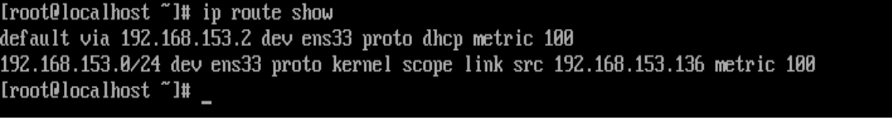
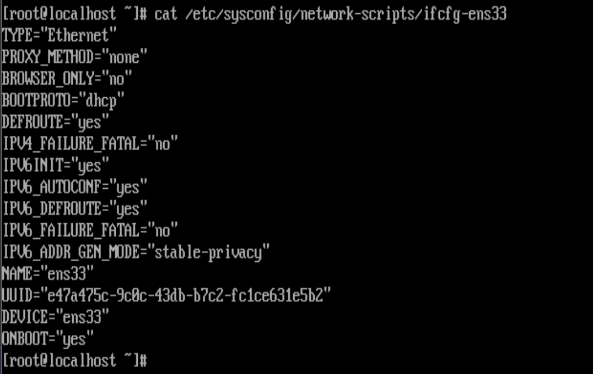
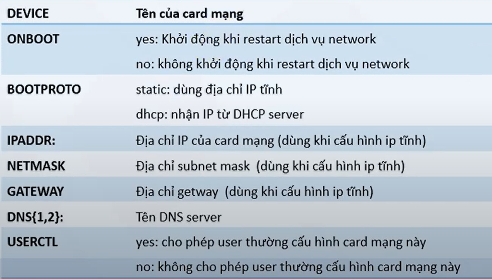

# Configuring Networking
Như một quản trị viên máy chủ Linux, bạn cần quản lý địa chỉ mạng và cổng mạng. Địa chỉ IP có thể được tạo 2 cách:Tĩnh và Động
Trước khi tìm hiểu cách đặt thông tin mạng, bạn phải biết cách xác minh thông tin mạng hiện tại. Cần kiểm ta các phần sau:
- Địa chỉ IP, mặt nạ mạng(subnet mask)
- Routing
- Khả năng của port và dịch vụ

### 1. Giới thiệu các file cấu hình network


Để xác minh cấu hình của địa chỉ mạng, sử dụng IP. Nhiều phương diện của networking có thể được theo dõi:
- ip addr : để cấu hình và theo dõi địa chỉ
- ip route để cấu hình và theo dõi thông tin bảng định tuyến
- ip link để cấu hình và theo dõi các trao đổi với nhau về topology mạng để tính toán đường đi tốt nhất từ nguồn đến đích

### 2. Cấu hình quản lý địa chỉ IP

#### 2.1 thêm địa chỉ IP Tĩnh
```sh 
ip address add [IPaddress/prefix subnet mask] dev [device]
```
VD
```sh
ip addr add 10.0.0.10/24 dev ens33
```
#### 2.2 Xóa địa chỉ IP Tĩnh
```sh
ip addr del [IPaddress/prefix subnet mask] dev [device]
```
VD
```sh
ip addr del 10.0.0.10/24 dev ens33
```
#### 2.3 Xem thông tin IP

- Để xem mạng hiện tại, sử dụng 'ip addr show' hoặc 'ip a s' hoặc 'ip a'


Nhìn vào kết quả bạn sẽ thấy một danh sách tất cả các network interfaces. Thấy ít nhất 2 giao diện, nhưng trên các cấu hình cụ thể, có thể có nhiều giao diện hơn. Hai giao diện được trình bày : loopback interface lo, và broadcast Ethernet card ens33
- Loopback interface được sử dụng giao tiếp giữa các tiến trình. Một vài tiến trình sử dụng giao thức IP trong giao thức nội bộ. bạn sẽ luôn tìm thấy giao diện loopback và địa chỉ IP của giao diện Loopback luôn được đặt thành 127.0.0.1. Tình trạng hiện tại của nó:
  - Tình trạng hiện tại: UP (up và có sẵn)
  - Địa chỉ MAC: duy nhất, cài đặt cho mỗi card mạng.(00:0c:29:50:9e:c9)
  - IPv4: IP address, subnet mask, broadcast address
  - IPv6: IP address, khi bạn đã định cấu hình bất cứ thứ gì, mọi giao diện sẽ tự động nhận được địa chỉ IPv6, chỉ có thể sử dụng để giao tiếp cục bộ

### 3. Cấu hình thiết bị card mạng
#### 3.1 Up/down card mạng
Trong trường hợp, link state đang down, bạn có thể tạm thời bật nó lên với
```sh
ip link set [device] {up|down}
```
VD: ```sh
ip link set dev ens33 up
```
#### 3.2 Show thông tin card mạng
```sh
ip link show [device]
```

- Sẽ hiển thị tất cả các interface trên hệ thống. Nếu như bạn thêm option -s thì sẽ nhận được thông tin về các gói được gửi và nhận, và các lỗi trong quá trình truyền gói.


### 4. Cấu hình quản lý bằng định tuyến
#### 4.1 Hiển thị thông tin bảng định tuyến
```sh 
ip route show
```


Nó sẽ hiển thị default gateway qua địa chỉ IP: 192.168.153.2 và hiển thị rằng ens33 phải được sử dụng để đến IP đó, default gateway được đăng ký bởi DHCP server. Và metric, chúng được sử dụng trong trường hợp nhiều tuyến đường có sẵn cho cùng một đích, tuyến đường có metric thấp nhất sẽ được sử dụng. 

- Tính có sẵn của cổng và dịch vụ
 Để xác minh tính khả dụng của các cổng trên máy chủ của bạn, bạn có thể sử dụng lệnh netstat hoặc ss 


#### 4.2 Thêm/xóa route tĩnh vào bảng định tuyến
``` sh
ip route {add|del} {NETWORK}
```
VD: 
```sh
ip route add 192.168.1.0/24 via 192.168.1.1 dev eth0
ip route add 192.168.1.99 via 192.168.1.1 dev eth0
ip route del 192.168.1.0/24 via 192.168.1.1 dev eth0
ip route del 192.168.1.99 via 192.168.1.1 dev eth0


#### 4.3. Thêm/xóa default gateway route
```sh 
ip route add|del default via [ IP_GATEWAY] dev [Name]
```
VD: 
```sh
ip route add defaul via 192.168.1.0 dev eth0
```

#### 4.4. Tìm route mà gói tin sẽ đi qua 
```sh
ip route get {IP_ADDRESS}
```
#### 4.5. Xóa bảng định tuyến
```sh 
ip route flush
```
### 5. Cấu hình network bằng file
*Sẽ không thay đổi khi restart*
- Trong thư mục này chứa thông tin cấu hình của từng card mạng sử dụng lệnh vi để thay đổi
```sh
vi /etc/sysconfig/network-scripts/ifcfg-<tên card mạng>
```

- Ý nghĩa các thông số:


- Khởi động dịch vụ
#service network restart

### 6. Sử dụng nmcli 

#### Lệnh show phổ biến với nmcli
- Xem thông tin IP
```sh
nmcli con show
```
- Để hiển thị danh sách tất cả các thiết bị 
```sh
nmcli dev 
``` 
-  Để hiển thị cài đặt cho một thiết bị cụ thể
```sh
nmcli dev show <devicename>
```

#### Cấu hình IP tĩnh bằng nmcli
- Kiểm tra các card đang có và xác định tên card mạng cần đặt ip tĩnh
```sh
nmcli c
```
- Đặt ip với tên card mạng tương ứng
```sh
nmcli c m ens33 ipv4.addresses 192.168.99.100/24
```
- Đặt ip gateway
```sh
nmcli c m ens33 ipv4.gateway 192.168.99.1
```
- Đặt mode static
```sh
nmcli c m ens33 ipv4.method manual
```
- Đặt ip dns
```sh
nmcli c m ens33 ipv4.dns "8.8.8.8"
```
- Up card mạng
```sh
nmcli c up ens33 
```
### NetworkManager và câu lệnh nmcli
#### Cài đặt NetworkManager

- Đối với CentOS và  Red Hat Enterprise Linux, mặc định NetworkManager đã được cài đặt sẵn. Tuy nhiên với những bản phân phối khác, người dùng cần cài đặt mới có thể sử dụng

```sh
yum install NetworkManager
```

- NetworkManager daemon mặc định sẽ được cấu hình để khởi động cùng hệ thống. Để check trạng thái của nó, sử dụng câu lệnh:

```sh
systemctl status NetworkManager
```

- Trong trường hợp NetworkManager ở trạng thái inactive, sử dụng câu lệnh systemctl để kích hoạt và cho phép nó khởi động cùng hệ thống

``` sh
systemctl start NetworkManager
systemctl enable NetworkManager
```

#### Tương tác với NetworkManager

##### Câu lệnh nmcli 


`nmcli OPTIONS OBJECT { COMMAND | help }`

Trong đó, nmcli làm việc với 5 đối tượng (OBJECT) bảo gồm:
1. general: làm việc với các hoạt động, các trạng thái của NetworkManager.
2. networking: toàn bộ việc điều khiển mạng chung.
3. radio: quản lý radio switches.
4. connection: quản lý các kết nối (connections).
5. device: làm việc với các thiết bị mà NetworkManager quản lý.

Các options hay được sử dụng nhất đó là `-t`, `-p` và `-h`. 

Sử dụng `mcli help` để hiển thị ra những trợ giúp:

``` sh
 nmcli help
Usage: nmcli [OPTIONS] OBJECT { COMMAND | help }

OPTIONS
  -t[erse]                                   terse output
  -p[retty]                                  pretty output
  -m[ode] tabular|multiline                  output mode
  -f[ields] <field1,field2,...>|all|common   specify fields to output
  -e[scape] yes|no                           escape columns separators in values
  -n[ocheck]                                 don't check nmcli and NetworkManager versions
  -a[sk]                                     ask for missing parameters
  -w[ait] <seconds>                          set timeout waiting for finishing operations
  -v[ersion]                                 show program version
  -h[elp]                                    print this help

OBJECT
  g[eneral]       NetworkManager's general status and operations
  n[etworking]    overall networking control
  r[adio]         NetworkManager radio switches
  c[onnection]    NetworkManager's connections
  d[evice]        devices managed by NetworkManager
  a[gent]         NetworkManager secret agent or polkit agent
  m[onitor]       monitor NetworkManager changes
```

``` sh
nmcli general { COMMAND | help }
```
COMMAND := { status | hostname | permissions | logging }


Sau đây là một vài ví dụ về việc sử dụng nmcli với 5 đối tượng khác nhau:

- Để hiển thị trạng thái chung của NetworkManager sử dụng câu lệnh:

```sh
nmcli general status
```

- Để kiểm soát log của NetworkManager:
```sh
nmcli general logging
```

- Để hiển thị tất cả kết nối:
```sh
nmcli connection show
```

- Để hiển thị những kết nối hiện đang chạy, thêm vào tùy chọn `-a` hoặc `--active`

```sh
nmcli connection show --active
```

- Để hiển thị các thiết bị được nhận định bởi NetworkManager và trạng thái của chúng:

```sh
nmcli device status
```

#### Bật và tắt cổng sử dụng nmcli

- nmcli có thể bật và tắt bất cử cổng mạng nào

``` sh
nmcli con up id ens33
```
```sh
nmcli dev disconnect ens3
```

Lưu ý: nên sử dụng `nmcli dev disconnect iface-name` thay vì `nmcli con down id id-string` bởi vì việc disconnect  sẽ đặt cổng mạng vào trạng thái `manual`, tức là cổng mạng ấy sẽ không có kết nối tự động trừ khi người dùng  cho phép NetworkManager khởi động lại kết nối.

#### Các options trong nmcli

- `type` : Loại kết nối. Các giá trị có thể sử dụng là: `adsl, bond, bond-slave, bridge, bridge-slave, bluetooth, cdma, ethernet, gsm, infiniband, olpc-mesh, team, team-slave, vlan, wifi, wimax`.

Mỗi một loại đều có một số các tùy chọn đi kèm. Ấn `tab` để xem danh sách các tùy chọn.

- `con-name` : Tên được gán cho cấu hình kết nối. Tên này hoàn toàn khác so với tên của các thiết bị (em1, eth0...). Có thể có rất nhiều cấu hình kết nối cho 1 thiết bị, thay vì phải chỉnh sửa lại cấu hình, bạn chỉ cần tạo sẵn chuyển đổi khi cần.

- `id` : ID của cấu hình kết nối.

#### Thiết lập kết nối sử dụng nmcli

- Để list các kết nối hiện có

``` sh
nmcli con show
```


Việc thêm một kết nối ethernet thực chất là tạo ra cấu hình và gán nó cho một thiết bị nào đó. Để xem danh sách thiết bị hiện có:

``` sh
nmcli dev status
```

#### Thêm kết nối tự động

Để thêm kết nối sử dụng DHCP, sử dụng câu lệnh sau:

```sh
nmcli connection add type ethernet con-name `connection-name` ifname `interface-name`
```

ví dụ:

``` sh
 nmcli con add type ethernet con-name my-office ifname ens3

```
=> Connection 'my-office' (fb157a65-ad32-47ed-858c-102a48e064a2) successfully added.

- Để bật kết nối vừa tạo:

``` sh
 nmcli con up my-office
```

Xem lại trạng thái của kết nối

``` sh
nmcli device status
```

#### Tạo kết nối tĩnh

- Để tạo một kết nối ethernet với cấu hình IPv4 tĩnh, sử dụng câu lệnh sau:

``` sh
nmcli connection add type ethernet con-name `connection-name` ifname `interface-name` ip4 `address` gw4 `address`
```

Note: Nếu là IPv6, sử dụng `ip6` và `gw6`. Mặc định NetworkManager sẽ thiết lập 2 tham số `ipv4.method` thành `manual` và `connection.autoconnect` thành `yes`

Ví dụ: 

``` sh
nmcli con add type ethernet con-name test-lab ifname ens9 ip4 10.10.10.10/24 \
gw4 10.10.10.254
```

``` sh
 nmcli con add type ethernet con-name test-lab ifname ens9 ip4 10.10.10.10/24 \
gw4 10.10.10.254 ip6 abbe::cafe gw6 2001:db8::1
```

- Để thiết lập địa chỉ dns, sử dụng câu lệnh:

```sh
 nmcli con mod test-lab ipv4.dns "8.8.8.8 8.8.4.4"
```

Lưu ý rằng nó sẽ thay thế hoàn toàn những địa chỉ đã được set trước đó, nếu bạn chỉ muốn thêm địa chỉ dns vào, sử dụng tiền tố `+`:

```sh
 nmcli con mod test-lab +ipv4.dns "8.8.8.8 8.8.4.4"
```

- Để bật kết nối vừa tạo, sử dụng câu lệnh:

``` sh
 nmcli con up test-lab ifname ens9

```

- Xem thông tin trạng thái của thiết bị và kết nối:

``` sh
 nmcli device status
```

- Để xem thông tin chi tiết của kết nối vừa tạo:

``` sh
 nmcli -p con show test-lab
 ```
Nguon:
 
[Lệnh IP](https://cuongquach.com/su-dung-lenh-ip-tren-linux.html)
[ManageNetwork](https://docs.fedoraproject.org/en-US/Fedora/22/html/Networking_Guide/sec-Using_the_NetworkManager_Command_Line_Tool_nmcli.html?fbclid=IwAR0bmfcIaGFq4bUHCewpmNe_Zmi-Lq_cR1aEb5rQiCwltdChay3lny6fsG8)
