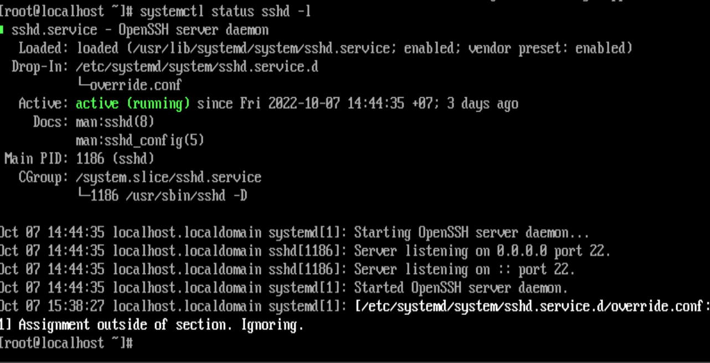
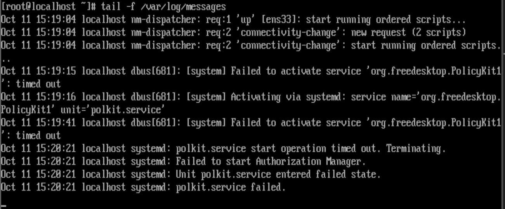
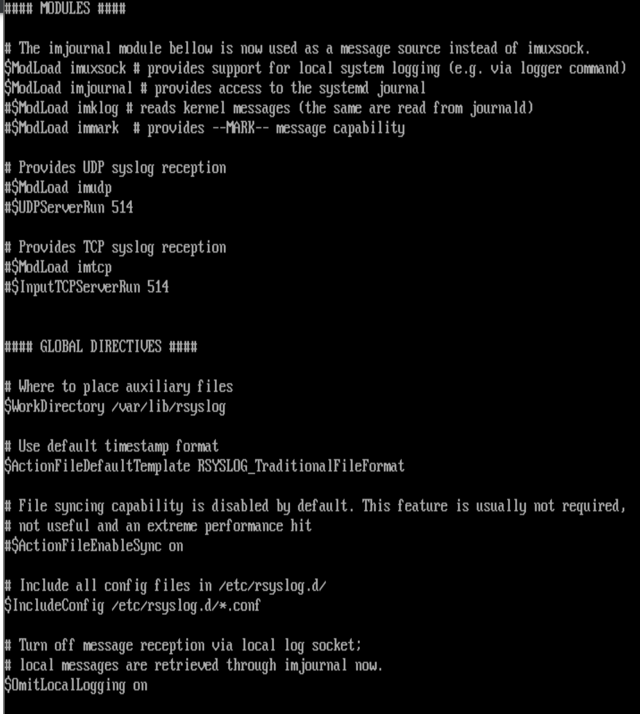
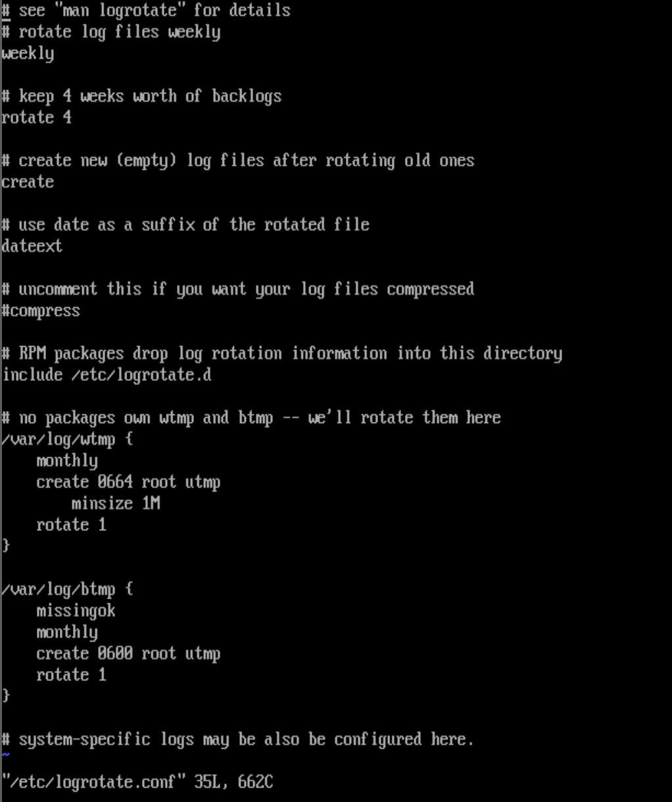

### System Logging
Log : Ghi lại liên tục các thông báo về hoạt động của cả hệ thống hoặc của các dịch vụ được triển khai trên hệ thống và file tương tự

Công dụng của log:
- Phân tích nguyên nhân và khắc phục nhanh hơn khi có sử cố xảy ra
- Phát hiện và dự đoán vấn đề có thể xáy ra đối với hệ thống

System Log hay được gọi là nhật ký hệ thống (syslog) chứa một bản ghi của hệ điều hành để thấy các tiến trình hệ thống và điều khiển được nạp như thế nào. Các chương trình syslog cung cấp thông tin, báo lỗi và cảnh báo các sự kiện liên quan đến các hệ điều hành máy tính. Những cái thông tin có thể được viết dưới các đích đến khác nhau, và nó có nhiều giải pháp để tìm thông tin thích hợp trong nhật ký hệ thống. Không dưới 3 phương pháp khác nhau có thể được sử dụng bởi các dịch vụ để ghi nhật ký hệ thống Syslogd là :
- Ghi trực tiếp: Một vài dịch vụ viết thông tin nhật ký trực tiếp vào log files- tậm chí vài dịch vụ quan trọng như Apache web server and
the Samba file server.
- rsyslogd: là sự nâng cao của syslogd, một dịch vụ chăm sóc quản lý các tệp nhật ký tập trung
- journald: Dịch vụ được tích hợp chặt chẽ với Systemd,cho phép quản trị viên đọc thông tin chi tiết từ journal trong khi giám sát trạng thái dịch vụ bằng systemctl status 

- `journald`: được thực hiện bởi systemd-journald daemon cung cấp một hệ thống quản lý nhật ký nâng cao, journald sưu tập các tin nhắn từ kernel, toàn bộ phương thức khởi động, dịch vụ và ghi các tin nhắn này và một nhật ký sự kiện. Nhật ký sự kiện này được lưu trữ dưới dạng nhị phân và nó có thể được truy vấn bằng cách sử dụng `journalctl command` . Câu lệnh này cho phép bạn truy cập sâu với mức độ chi tiết về các tin nhắn được ghi lại, vì nó là một phần tích hợp của Systemd và nhận toàn bộ thông báo rằng đã được tạo bởi đơn vị Systemd.
- Bởi vì nhật ký được viết bởi journald không tồn tại giữa các lần khởi động lại, các thông báo cũng được chuyển tiếp đến dịch vụ rsyslogd, ghi các thông báo đến các file khác trong thư mục /var/log , rsyslogd cũng cung cấp các tính năng không tồn tại trong journald
  

Chú ý: journal được tích hợp chặt chẽ với Systemd, nên nó ghi lại mọi thứ mà máy chủ của bạn đang làm. rsyslogd thêm một số dịch vụ cho nó. Cụ thể, nó quan tâm đến việc viết thông tin nhật kí vào trong file cụ thể sẽ liên tục giữa các lần khởi động lại, và nó cho phép bạn cấu hình các máy chủ ghi nhật ký từ xa.

- Ngoài rsyslogd và systemd-jourald, có dịch vụ auditd, dịch vụ này cung cấp kiểm tra, một dấu vết chuyên sâu về những dịch vụ, tiến trình hoặc người dùng cụ thể đã làm

Để lấy thêm thông tin về những gì đã xảy ra trên máy chạy RHEL, các quản trị viên thực hiện ba cách tiếp cận:
- Giám sát các file trong /var/log được viết bởi rsyslogd
- Sử dụng lệnh journalctl để lấy thêm thông tin chi tiết từ nhật ký
- Sử dụng lệnh systemctl status <unit> để có cái nhìn tổng quan ngắn về các sự kiện quan trọng cuối đã ghi lại bởi Systemd unit thông qua journald. 



Sẽ hiển thị trạng thái của dịch vụ cũng như vài thao tác cuối được ghi lại

### Đọc Log files
Trên Linux bạn sẽ tìm thấy các file log khác nhau trong thư mục /var/log. Hầu hết các thư mục này được quản lý bởi rsyslogd, nhưng một vài dile được tạo trực tiếp bởi các dịch vụ cụ thể.Số lượng tệp chính xác trong thư mục /var /log sẽ thay đổi, tùy thuộc vào cấu hình của máy chủ và các dịch vụ đang chạy trên máy chủ đó. Tuy nhiên ta nên biết chúng là tệp nào và loại nội dung nào có thể được trong các tệp này.

Ý nghĩa của một số file log thông dụng:

|Log file |Ý nghĩa|
|----|----|
|/var/log/messages|là tệp được sử dụng phổ biến nhất, nơi hầu hết các thông báo được ghi vào|
|/var/log/dmesg|Chứa thông báo kernel log |
|/var/log/secure|Chứa thông báo liên quan đến xác thực, xem ở đây để xem những lỗi xác thực nào đã xảy ra trên máy chủ|
|/var/log/boot.log|Nhìn những thông báo có liên quan đén khởi động hệ thống|
|/var/log/audit/audit.log|Chứa các tin nhắn kiểm tra|
|/var/log/maillog|hông tin log từ các máy chủ mail chạy trên máy chủ.|
|/var/log/sssd|Chứa các thông báo đã được viết bởi dịch vụ SSSD, đóng vai trò quan trọng trong quá trình xác thực.|
|/var/log/httpd/|Thư mục chứa log file được viết bởi Apache web server, Apacha ghi trực tiếp và không thông qua rsyslog |


### Nội dung của log file 
Có các thành phần cụ thể:
- Date and time: Mỗi log thông báo bắt đầu với 1 dấu thowuf gian, 
- Host: Máy chủ lưu trữ thông báo, rsyslogd có thể được cấu hình cũng như để xử lý việc ghi nhật ký từ xa
- Service or process name: tên của dịch vụ hoặc tiến trình tạo thông báo
- mesage content: Nội dung của thông báo, chứa chính xác thông báo được ghi
 


### Giao thức Syslog 
- Syslog là một giao thức client/server là giao thức dùng để chuyển log và thông điệp đến máy nhận log. Syslog có thể gửi qua UDP hoặc TCP, các dữ liệu được gửi dạng cleartext, syslog dùng port 514

## Giám sát log file:
### Sử dụng logger
- Câu lệnh `logger` cho phép người dùng viết thông báo đến rsyslog từ cml. Chỉ cần nhập logger, theo sau là tin nhắn bạn muốn ghi vào nhật kí
### Cấu hình rsyslogd
Để đảm bảo rằng thông tin cần đăng nhập được ghi vào vị trí bạn muốn tìm nó, bạn có thể định cấu hình dịch vụ rsyslogd thông qua tệp /etc/rsyslog.conf. Trong tệp này, bạn tìm thấy các phần khác nhau cho phép bạn chỉ định nơi và cách viết thông tin.
- Nếu các tùy chọn cụ thể cần được chuyển cho dịch vụ rsyslogd khi khởi động, bạn có thể thực hiện điều này bằng cách sử dụng tệp /etc/sysconfig/rsyslog. Tệp này theo mặc định chứ một dòng, đọc   SYSLOGD_OPTIONS="". Trên dòng này bạn có thể chỉ định tham số khởi động cho rsyslogd
- Tệp rsyslog.conf được sử dụng để chỉ định những gì nên được ghi lại và nơi nó nên được ghi lại, các phần khác nhau trong tệp:
  - modules: được bao gồm để nâng cao các tính năng được hỗ trợ trong rsyslogd
  - global directives: phần này được sử dụng để chỉ định các tham số toàn cầu, chẳng hạn như vị trí nơi tệp phụ trợ được viết hoặc định dạng dấu thời gian mặc định
  - rules: chứa các quy tắc chỉ định thông tin nào nên được ghi vào điểm đến nào
Sử dụng câu lệnh để xem cấu hình file rsyslog
```sh 
less /etc/rsyslog.conf
```



### Facilities, Priorities, and Log Destinations
- Với mục đích chỉ định thông tin nào nên được ghi vào đích đến nào:
  - facility: chỉ định một danh mục thông tin được ghi lại, rsyslogd sử dụng một danh sách cố định của cơ sở, không thể mở rộng, điều này là do khả năng tương thích ngược với dịch vụ legacy syslog
  - priority: được sử dụng để định nghĩa mức độ nghiêm trọng của thông báo rằng cần được ghi. Khi chỉ định một độ ưu tiên, mặc định tất cả các thông báo với độ ưu tiên đó và tất cả độ ưu tiên cao hơn sẽ được ghi lại
  - destination: nơi mà thông báo nên được ghi vào. Các điểm đến điển hình là các tệp, nhưng các modules rsyslog cũng có thể được sử dụng làm đích đến, để cho phép xử lý thêm thông qua modules rsyslogd
* Khi chỉ định 1 đích, 1 file thường đươc sử dụng, nếu file nó bắt đầu bằng dấu gạch nối (VD -/var/log/maillog), thông báo nhật ký sẽ không được thừa nhận ngay đến file thay vào đó nó sẽ được đệm để ghi hiệu quả hơn. các tệp thiết bị cũng có thể được sử dụng như /dev/console, nếu thiết bị này được sử dụng, các thông báo được ghi theo thời gian thực cho console

Trong chuẩn syslog, mỗi thông báo đều được dán nhãn và được gán các mức độ nghiêm trọng khác nhau. Các loại phần mềm sau có thể sinh ra thông báo: auth, authPriv, daemon, cron, ftp, dhcp, kern, mail, syslog, user,...
 Sử dụng tiện ích của người dùng cấp độ, đưa ra các log liên quan đến người dùng đã ban hành các lệnh
- Nguồn sinh ra log

|Facility Number|Nguồn tạo log|Ý nghĩa |
|---|----|---|
|0|kernel|Những log mà do kernel sinh ra|
|1|user|Log ghi lại cấp độ người dùng|
|2|mail|Log của hệ thống mail|
|3|daemon|Log của các tiến trình trên hệ thống|
|4|auth|Log từ quá trình đăng nhập hệ hoặc xác thực hệ thống|
|5|syslog|Log từ chương trình syslogd|
|6|lpr|Log từ quá trình in ấn|
|7|news|Thông tin từ hệ thống|
|8|uucp|Log UUCP subsystem|
|9|cron|Tiện ích cho phép thực hiện các tác vụ theo định kì|
|10|authpriv|Các thông báo liên quan đến truy cập và bảo mật|
|11|ftp|Log của FTP deamon|
|12|ntp|Hệ thống con NTP|
|13|security|Kiểm tra đăng nhập|
|14|console|Log cảnh báo hệ thống|
|15|solaris-cron|Log lịch trình|
|16-23|local0-local7|Log dự trữ cho sử dụng nội bộ|

*Nếu các dịch vụ không có trong rsyslogd facility có sẵn cho riêng nó khi cần ghi thông báo nhật ký vào một tệp cụ thể, các dịch vụ này có thể được cấu hình vào bất kỳ local0- local7. Tiếp theo, bạn phải cấu hình các dịch vụ để sử dụng cơ sở này, bạn làm điều đó cho dịch vụ bạn đang sử dụng, sau đó bạn cần thêm một rule vào tệp rsyslog.còn để gửi thông báo qua facility vào một tệp nhật ký cụ thể*
- Mức độ cảnh báo
  - Mức độ cảnh báo của Syslog được sử dụng để mức độ nghiêm trọng của log event và chúng bao gồm từ gỡ lỗi (debug), thông báo thông tin (informational messages) đến mức khẩn cấp (emergency levels).
  - Cảnh báo được chia thành các loại số từ 0 đến 7, 0 là cấp độ khẩn cấp quan trọng nhất

|Value|Severity|Keyword|
|---|---|----|
|0|emerg|Thông báo tình trạng khẩn cấp|
|1|alert|Hệ thống cần can thiệp ngay|
|2|crit|Tình trạng nguy kịch|
|3|error|Thông báo lỗi đối với hệ thống|
|4|warn|Mức cảnh báo đối với hệ thống|
|5|notice|Chú ý đối với hệ thống|
|6|info|Thông tin của hệ thống|
|7|debug|Quá trình kiểm tra hệ thống|

Khi một ưu tiên cụ thể được sử dụng, tất cả các thông điệp có mức độ ưu tiên đó và cao hơn được ghi lại theo các thông số kỹ thuật được sử dụng trong Rules cụ thể. Nếu bạn cần định cấu hình đăng nhập một cách chi tiết, trong đó các thông điệp có độ ưu tiên khác nhau và được gửi đến các tệp khác nhau, bạn có thể chỉ định mức độ ưu tiên với một dấu `=` ở phía trước nó

VD: cron.=debug -/var/log/cron.debug

Các cấp độ facility và các mức độ cảnh báo sẽ được thể hiện qua RULES trong file cấu hình của rsyslog: /etc/rsyslog.conf

### Rotating Log Files 
Để ngăn chặn syslog gửi thông báo đầy đến hệ thống của bạn, thông báo log có thể xoay vòng. Điều đó có nghĩa là Điều đó có nghĩa là khi đạt đến một ngưỡng nhất định, tệp nhật ký cũ được đóng và một tệp nhật ký mới được mở. Tiện ích xoay vòng được bắt đầu định kì thông qua dịch vụ crond để xoay vòng log files

Khi 1 log file được xoay vòng, các file log cũ sẽ được copy đến 1 flie có ngày xoay vòng trong đó. Nên, nếu /var/log/messages được xoay vòng ngày June 8.2019 thì cái file xoay vòng đó sẽ có tên là /var/log/mesages-20190608.Như một mặc định, bốn tệp nhật ký cũ được giữ trên hệ thống. Các tệp cũ hơn khoảng thời gian đó sẽ tự động được xóa khỏi hệ thống 

Chú ý: Log files được xoay vòng không được lưu trữ ở bất kì đâu  Nếu chính sách công ty của bạn yêu cầu bạn có thể truy cập thông tin về các sự kiện đã xảy ra hơn năm tuần trước, bạn nên sao lưu các tệp nhật ký hoặc định cấu hình máy chủ nhật ký tập trung nơi logrotate giữ các tin nhắn được xoay trong một khoảng thời gian dài hơn đáng kể.
```sh
vi /etc/logrotate.conf
```
Đây là file cấu hình mặc định


Khi muốn cấu hình logrotate cho ứng dụng cụ thể ta sẽ tạo từng file riêng biệt trong folder /etc/logrotate.d/


##### Lựa chọn Log file được rotate
Bạn có thể chỉ định cụ thể một hay nhiều file log với đường dẫn tuyệt đối của file log đó, phân biệt danh sách các log file cụ thể bằng khoảng trắng
VD: ` /var/log/my-app/log/*.log
##### Rotate theo thời gian
Có 4 giá trị cấu hình tương ứng với khoảng thời gian log file sẽ được rotate.
- Daily: mỗi ngày
- Weekly: mỗi đầu tuần
- Monthly: mỗi đầu tháng
- Yearly: mỗi năm
#####  Rotate theo dung lượng file log
Ta có thể quy định tiến trình rotate dựa vào dung lượng file, ví dụ nếu file đó đạt dung lượng 100mb thì tiến hành rotate. Các đơn vị kích thước file có thể sử dụng là K, M, G.
```sh
size 100k
```
Ví dụ, log file được cấu hình rotate theo tuần weekly và theo dung lượng 100mb. Tuy vậy, đến giữa tuần log file được rotate do dung lượng file đạt 100M. Khi đó, Logrotate sẽ phải đợi sang tuần kế tiếp để thực hiện rotate log, do việc rotate theo size đã bỏ qua luôn thời gian của tuần này

##### Rotate theo số lượng Log file
```sh
rotate [number]
```
Ví dụ: rotate7 giữ lại 7 file log cũ. Trường hợp đã có đủ 7 file log cũ thì file cũ nhất sẽ bị xóa đi để chứa file log mới được tạo.
##### Tự động nén Log file
Tùy chọn `compress`: Logrotate sẽ nén tất cả các file log lại sau khi đã được rotate, mặc định bằng gzip

