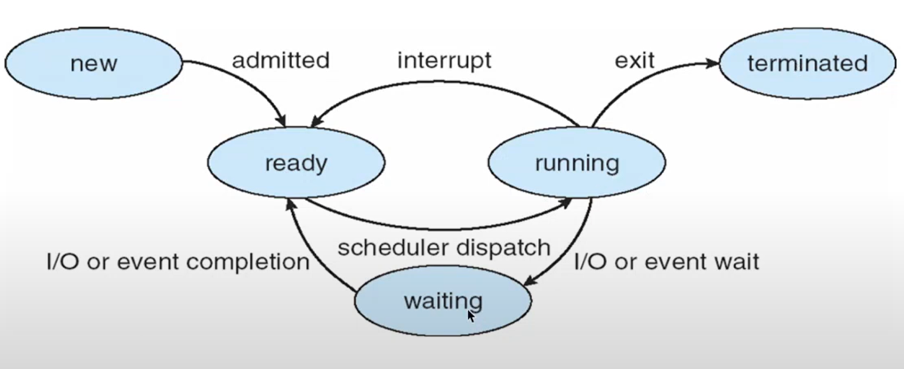
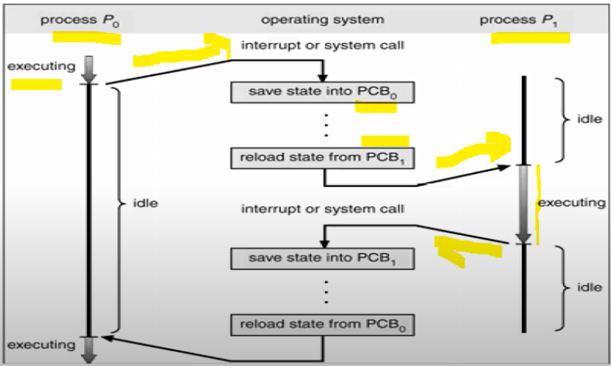

## Tiến trình (process)
- Tiến trình là một chương trình đang thức thi (chương trình đang được ở trong bộ nhớ trong và đang được làm việc với CPU)
- Khi chương trình hoạt động. nó chuyển thành tiến trình, tiến trình cần:
   - Được cung cấp đầy đủ tài nguyên cần Thiết
   - Được CPU tiếp nhận và thực hiện
- Các trạng thaí của tiến trình
- 


  - new: Khi chương trình vừa được load từ bộ nhớ ngoài vào trong bộ nhớ trong
  - ready: đợi đến lượt làm việc với CPU
  - running: các tiến trình đang được xử lý
  - terminated: khi chuong trình kết thúc 
  - waiting: khi có yêu cầu vào ra, quá khoảng thời gian cho phép hoặc chờ cấp phát thêm tài nguyên để chuyển trạng thái sẵn sàng
- CPU chuyển giữa các tiến trình



- Đặc điểm tiến trình:
   - Tiến trình hướng I/O: sử dụng nhiều thời gian thực hiện vào/ra hơn việc tính toán, chiếm dụng CPU ngắn\
   - Tiến trình hướng xử lý: sử dụng nhiều thời gian tính toán hơn việc I/o
   - Tiến trình tương tác hay xử lý theo lô
  
#### Khối điều khiển tiến trình (Process Control Block)
- PCB: là vùng nhớ lưu trữ các thông tin mô tả cho tiến trình, mỗi tiến trình có một PCB
- Cấu trúc PCB:   
     - Khi khởi chạy, mỗi tiến trình được cấp một chỉ số
PID (process id) duy nhất. Hệ thống dùng PID để
quản lý tiến trình
     - Trạng thái tiến trình: Xác định trang thái hiện Thời
     - Tài nguyên liên quan đến tiến trình (hiện có hoặc đang đợi phân bố)
     - Thông tin giao tiếp: phản ánh quan hệ giữa tiến trình này với các tiến trình khác trong hệ thống
     - Tiến trình cũng có phân quyền sở hữu và truy cập
(như với tập tin)
- Lập lịch cho tiến trình: nhằm tối ưu việc sử dụng CPU trong hệ thống cho phép chia sẻ thời gian chuyển CPU giữa các tiến trình
- Hàng chờ lập lịch:
  - Hàng chờ nhiệm vụ: các hàng chờ đang đợi làm việc với CPU
  - Hàng chờ sẵn sàng: các hàng chờ trong bộ nhớ chính, sẵn sàng và chờ thực thi
  - Hàng chờ thiết bị: Một tiến trình đang được thực thi và đang đợi thiết bị vào ra

- Linux dac diem tiến trình 
   - Nhân linux có một module riêng lập lịch phân phối CPU
cho từng tiến trình để đảm bảo các tiến trình đều được
hoạt động hợp lý
  - Mỗi tiến trình có một chỉ số ưu tiên (priority) tương ứng
  - Chỉ số ưu tiên càng thấp thì hệ thống càng ưu tiên phân
phối nhiều thời gian sử dụng CPU cho tiến trình đó


- Tiến trình cha và tiến trình con:
  - Khi một tiến trình sinh ra 1 tiến trình khác là tiến trình cha, tiến trình được sinh ra tiến trình con
  - Khi tiến trình con hoàn thành thì tiến trình cha sẽ tiếp tục thực thi và tiến trình con sẽ được kết thức.
của nó đã kết thúc thì được gọi là orphan proces. Hoặc cũng có thể tiến trình cha và con thực thi đồng thời
  - Cây tiến trình: Mỗi tiến trình cha có thể tạo một số tiến trình con, và những tiến trình con này có thể tạo các tiến trình con khác, tạo thành cây tiến trình
#### Các loại tiến trình:

-  Foreground processes: Những kiểu processes này được biết đến là interactive processes .Theo mặc định , mọi process mà bạn bắt đầu chạy là foreground process . Nó nhận input từ bàn phím và gửi output tới màn hình .Trong khi một chương trình đang chạy trong foreground và cần một khoảng thời gian dài, chúng ta không thể chạy bất kỳ lệnh khác (bắt đầu process khác) bởi vì dòng nhắc lệnh không có sẵn tới khi chương trình đang chạy kết thúc process và thoát ra.

 - Background processes: Là những kiểu processes được biết đến là non-interactive processes.Cchạy mà không được kết nối với bàn phím của bạn . Nếu backround process yêu cầu bất cứ đầu vào từ bàn phím , chương trinh sẽ đợi .Lợi thế của chạy một chương trình trong background là có thể chạy các lệnh khác : không phải đợi tới khi nó kết thúc để bắt đầu một process mới 

Để bắt đầu một background process , thêm dấu "&" tại cuối lệnh .
  
### Quản lý Job

|Command|Use|
|---|---|
|&|Bắt đầu trực tiếp với background|
|Ctrl -Z|Dừng tạm thời|
|Ctrl -D|Gửi ký tự kết thúc của tệp đến công việc hiện tại để cho biết rằng nó sẽ ngừng chờ thêm đầu vào|
|Ctrl -C|Có thể được sử dụng để hủy công việc tương tác hiện tại|
|bg|Tiếp tục việc vừa đóng với lệnh Ctrl -Z trong nền |
|fg|Quay trở lại foreground cái công việc cuối cùng trước khi chuyển sang background|
|jobs|Hiển thị các công việc đang được chạy từ shell, hiển thị số công việc có thể sử dụng làm đối số cho các lệnh bg và fg|

  - Hệ thống linux có một số các tiến trình đặc biệt gọi là các daemon process:
      - Thường cung cấp các chức năng quan trọng của hệ
thống, đặc biệt là các dịch vụ mạng
      - Thường thuộc về quyền root
      - Thường không gắn với shell cụ thể nào, không truy xuất
vào/ra bàn phím, màn hình
      - Khi sử dụng câu lệnh liệt kê tiến trình sẽ thấy kí hiệu ? ở
trường TTY
      - Đa số daemon process không chiếm CPU, chúng chỉ
hoạt động khi có yêu cầu
- Quản lý tiến trình:
  - Xác định những tiến trình đang chạy trên hệ thống
  - Trạng thái của các tiến trình
  - Tài nguyên mà các tiến trình đang sử dụng
  - Kiểm soát tiến trình
  - Kết thúc các tiến trình không mong muốn 
  - Thực thi các nghiệp vụ theo lịch

- Truyền thông giữa các tiến trình:
  - Các tiến trình trong một hệ thống có thể là tiến trình độc lập hoặc hợp tác
  - Tiến trình hợp tác có thể ảnh hưởng bởi tiến trình khác
  - Mục đích của việc hợp tác tiến trình:
      - Chia sẻ thông tin
      - Tính toán nhanh hơn
## 2. Quản lý các tiến trình
#### Liệt kê các tiến trình:"ps"
Lệnh : ps [option]
Một số option:
  - a tất cả proc của các user khác
  - x các proc không gắn với terminal (daemon)
  - u user-format
  - l long-format
  - w wide output
  - f hiển thị đầy đủ các trường thông tin
  - -U user xem proc của một user cụ thể
```sh 
ps
PID  TTY    TIME       CMD

739  tty1   00:00:00   bash

1642 tty1   00:00:00   ps

```
```sh
ps -f
```

Các thông tin:

|Thông số |Ý nghĩa|
|---|---|
|UID|User quản lý tiến trình|
|PID|ID tiến trình|
|PPID|ID tiến trình cha|
|STIME|Start time|
|C|CPU đang thực thi|
|Time|Thời gian thực thi của tiến trình|
|CMD|câu lệnh thực thi|

- Trạng thái (cột STAT):
  - R Đang thi hành
  - S Đang bị đóng
  - Z Ngừng thi hành
  - W Không đủ bộ nhớ cho tiến trình thi hành

### Thông tin chi tiết với "top"
`top` hiển thị một bảng realtime các tiến trình đang chạy, bên cạnh tiến trình thì cũng có thể theo dõi CPU và memory của hệ thống=> Giám sát tải hệ thống
- Cung cấp các chỉ số quan trọng của hệ thống:
  - Thời gian hiện tại, thời gian từ lần khởi động mới nhất
  - Mức độ tải CPU trung bình trong 1, 5, 15 phút gần đây
  - Mức độ chiếm dụng CPU hiện tại
  - Các chỉ số quan trọng của từng tiến trình


Các tham số chính cho lệnh top

- -h  Hiển thị phiên bản hiện tại
- -c  Tham số này chuyển đổi trạng thái cột lệnh từ hiển thị lệnh sang hiển thị tên chương trình và ngược lại
- -d  Chỉ định thời gian trễ khi refresh màn hình
- -o  Sắp xếp theo trường được đặt tên
- -p  Chỉ hiển thị các tiến trình với ID được chỉ định
- -u  Chỉ hiển thị những tiến trình của người dùng được chỉ định

### Ngừng tiến trình "kill"
`kill` sử dụng để gửi tín hiệu để dừng một process thông qua PID

Cú pháp: 
```sh
kill [signal] PID
```
Signal phổ biến: 

`1`: để tải lại một tiến trình

`9`: kết thúc tiến trình ngay lập tức

`15`: gửi tín hiệu kết thúc đến tiến trình, chờ tiến trình thực hiện cleanup và kết thúc

### Cho máy ngừng hoạt động một thời gian với lệnh sleep
- Cú pháp: 
```sh
sleep [tùy-chọn] NUMBER[SUFFIX] 
```
   - NUMBER: số giây(s) ngừng hoạt động. 
   - SUFFIX : có thể là giây(s) hoặc phút(m) hoặc giờ hoặc ngày(d)

### Xem cây quá trình với lệnh pstree

Lệnh pstree sẽ hiển thị các quá trình đang chạy dưới dạng cây quá trình. Gốc của cây quá trình thường là init. Nếu đưa ra tên của một người dùng thì cây của các quá trình do người dùng đó sở hữu sẽ được đưa ra.

- Cú pháp:
```sh
 pstree [tùy-chọn] [pid | người-dùng]
```
### Lệnh thiết đặt lại độ ưu tiên của quá trình nice và lệnh renice

Theo mặc định, tất cả các quy trình thông thường đều bằng nhau và được bắt đầu với cùng mức độ ưu tiên

Để chạy một chương trình với độ ưu tiên định trước, hãy sử dụng lệnh nice. 

Cú pháp lệnh: 
```sh
nice [tùy-chọn] [lệnh [tham-số ]... ] 
```

Lệnh nice sẽ chạy một chương trình (lệnh) theo độ ưu tiên đã sắp xếp. Nếu không có lệnh, mức độ ưu tiên hiện tại sẽ hiển thị. Độ ưu tiên được sắp xếp từ -20 (mức ưu tiên cao nhất) đến 19 (mức ưu tiên thấp nhất). 
 
  -ADJUST : tăng độ ưu tiên theo ADJUST đầu tiên 
  
  --help : hiển thị trang trợ giúp và thoát 
Để thay đổi độ ưu tiên của một quá trình đang chạy, hãy sử dụng lệnh renice. 

Cú pháp lệnh: renice <độ-ưu-tiên> [tùy-chọn] Lệnh renice sẽ thay đổi mức độ ưu tiên của một hoặc nhiều quá trình đang chạy. 
  -g : thay đổi quyền ưu tiên theo nhóm người dùng 
  
  -p : thay đổi quyền ưu tiên theo chỉ số của quá trình 
  
  -u : thay đổi quyền ưu tiên theo tên người dùng
VD:
```sh
renice +1 987 -u root -p 32
```

### Đặt lịch tiến trình chạy tự động
- Mục đích:
  - Thiết lập lịch cho 1 tác vụ được thức hiện vào 1 thời điểm xác định
  - Giúp tự động hóa các công việc mang tính lặp loại
  - Hỗ trợ cho việc vận hành, giám sát hệ thống
#### Đặt lịch với "at"
- Đặt lịch cho 1 lệnh hoặc 1 tiến trình thực thi 1 lần duy nhất vào 1 thời điểm xác định
- Trước tiên cần thực hiện cài đặt `at`
Cú pháp: 
```sh
yum install at
```
- Đặt lịch:

```sh
at time [date]
```
VD:
at now + 10 minutes/hours/days/weeks
at 12:00 December 31
at 11:00
- Lệnh kiểm tra:
```sh
atq
```
or
```sh
at -l
```
#### Đặt lịch với CRONTAB
- Đặt lịch cho 1 lệnh hoặc 1 tiến trình thực thi lặp lại nhiều lần
- Nguyên lý hoặt động
  - Sử dụng daemon cron
  - Lịch thực thi được lư trong file crontab
  - Daemon cron đọc file crontab để thực thi theo lịch và câu lệnh cấu hình trong crontab
- Các lệnh crontab thường dùng
```sh
crontab -e: tạo,  chỉnh sửa các crontab
crontab -l: Xem các Crontab đã tạo
crontab -r: xóa file crontab
```
- Cài đặt crontab
```sh
yum install cronie
```
- Start crontab và tự động chạy mỗi khi reboot:
```sh
service crond start
chkconfig crond on
```
Cấu trúc của crontab
Một crontab file có 5 trường xác định thời gian, cuối cùng là lệnh sẽ được chạy định kỳ, cấu trúc như sau:
```sh
*     *     *     *     *     command to be executed
-     -     -     -     -
|     |     |     |     |
|     |     |     |     +----- day of week (0 - 6) (Sunday=0)
|     |     |     +------- month (1 - 12)
|     |     +--------- day of month (1 - 31)
|     +----------- hour (0 - 23)
+------------- min (0 - 59)
```
VD: 
Chạy script 30 phút 1 lần
```sh
30 * * * * command
```
Chạy script vào 3 giờ sáng mỗi ngày
```sh
0 3 * * * command
```

### Lệnh pgrep
Tìm hoặc xử lý tín hiệu theo tên của tiến trình

Ví dụ 1: Trả về các PID của bất kỳ tiến trình đang chạy
```sh
[root@test1 ~]# ps aux | grep python
root       809  0.0  0.8 573848 16972 ?        Ssl   2018  51:44 /usr/bin/python -Es /usr/sbin/tuned -l -P
root      4547  0.0  0.2 130152  4892 pts/0    T    21:05   0:00 python
root      4555  0.0  0.0 112704   972 pts/0    S+   21:08   0:00 grep --color=auto python
[root@test1 ~]# pgrep -u root python
4547
```
