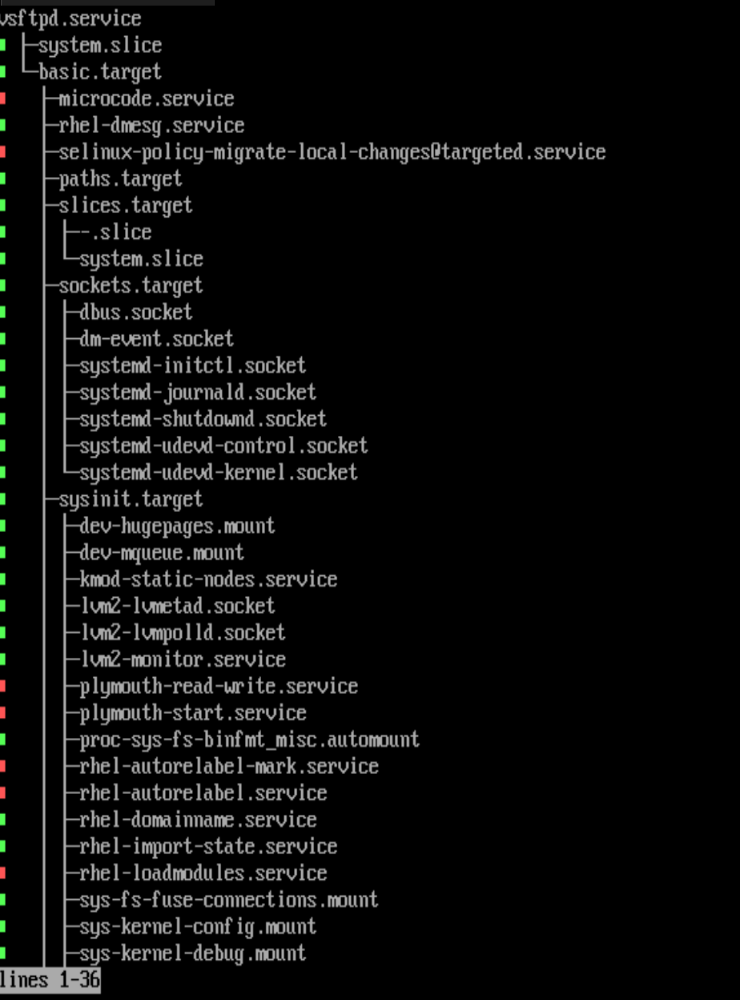

# Working with systemd
- Systemd mới chỉ xuất hiện từ 30-3-2010, còn trước đó có 2 hệ thống khác đã từng được sử dụng

  - Upstart: hệ thống init được phát triển bởi Canonical và được sử dụng trong Ubuntu Linux giai đoạn đầu.
   - SysV: hệ thống init cổ điển của UNIX BSD System V, được viết bằng shell script và đã quá lâu đời.


Systemd là một init system . Systemd không chỉ dừng ở việc start hoặc stop các services nó còn có thể thực hiện được những công việc đó nó phân chia các units. Để hiển thị các units được quản lý bởi systemd sử dụng:
```sh
systemctl -t help
Available unit types:
service(các file quản lý hoạt động của 1 số chương trình)
socket(quản lý các kết nối)
target(quản lý tạo liên kết)
device(quản lý thiết bị)
mount(gắn thiết bị)
automount(tự động gắn thiết bị)
swap(vùng không gian bộ nhớ trên đĩa cứng)
timer(dùng cho cron-job để lập lịch)
path( quản lý các đường dẫn)
slice(quản lý các tiến trình)
scope(quy định không gian hoạt động)
```

Lợi ích chính của việc làm việc với Systemd, so với các phương pháp trước đây Red Hat được sử dụng để quán lý dịch vụ, là nó cung cấp một giao diện thống nhất , giao diện này được xác định trong unit file. Unit file có thể nằm ở 3 vị trí:

/usr/lib/systemd/system : chứa các gói mặc định đã được cài đặt từ gói rpm, không nên chỉnh sửa các tập tin này trực tiếp 

/etc/systemd/system : chứa các unit file tùy chỉnh, nó có thể được viết bởi quản trị viện hoặc được tạo bơi câu lệnh systemctl edit

/run/systemd/system : chứa các unit file đã được tạo tự động

- Systemd thường là process đầu tiên được chạy sau khi bật máy và có PID=1 , nó là cha của các tiến trình khác
```sh
  pstree -Ap | more
```


#### Quản lý units với systemctl
|Comments|Commands|
|----|----|
|Start a service|systemctl start `name`.service|
|Stop a service|systemctl stop `name`.service|
|Restart a service|systemctl restart `name`.service|
|Reload a service|systemctl reload `name`.service|
|Service status|systemctl status `name`.service|
|Restart a service if already running|systemctl condrestart `name`.service|
|Enable service|systemctl enable `name`.service|
|Disable service|systemctl disable `name`.service|

Chú ý: Với version mới của systemd hỗ trợ `systemctl start name` 
- Các trạng thái của Systemd

|Trạng thái |Miêu tả |
|---|---|
|Loaded|Unit file đã được xử lý và đang hoạt động|
|Active(running)|Unit chạy với một hoặc nhiều tiến trình|
|Active(exited)|Unit hoàn thành thành công trong một lần chạy|
|Active(waiting|Unit đang chạy và đợi cho một sự kiện|
|Inactive(dead)|Unit đang không chạy|
|Enabled|Unit sẽ được bắt đầu vào thời điểm khởi động|
|Disabled|Unit sẽ không bắt đầu khi khởi động|

#### Trạng thái của các tệp đợn vị

|Command|Miêu tả|
|----|---|
|systemctl --type=service|Hiển thị unit dịch vụ|
|systemctl list-units --type=service|Hiển thị các unit dịch vụ hoạt động|
|systemctl list-units --type=service --all|Hiển thị các đơn vị dịch vụ không hoạt động cũng như các đơn vị dịch vụ đang hoạt động|
|systemctl --failed --type=service|Hiển thị tất cả các dịch vụ đã thất bại|
|systemctl status -l your.service|Hiển thị chi tiết thông tin trạng thái của các services|

#### Quản lý sự phụ thuộc 

- Sự phụ thuộc có thể được định nghĩa trong unit, sử dụng keyword giống như  Requires, sRequisite, After, and Before
- Xem danh sách các unit phụ thuộc:
```sh
systemctl list-dependencies `name`
```
VD:
```sh
systemctl list-dependencies vsftpd
```


- Các keyword có thể được sử dụng trong unit:

  - Requires: Nếu unit này load các unit được liệt kê cũng sẽ load, nếu một trong các unit được liệt kê bị vô hiệu hóa thì unit này cũng sẽ bị vô hiệu hóa.

  - Requisite: Nếu unit liệt kê ở đây chưa được tải thì unit này sẽ thất bại

  - Wants: Các unit này muốn tải các unit được liệt kê ở đây, nó sẽ không thất bại nếu bất kì unit liệt kê không thành công

   - Before: Cái unit này sẽ được bắt đầu trước khi unit đặc biệt

  - After: Unit này bắt đầu sau unit đặc biệt 

- Để có cái nhìn tổng quan về các tùy chọn cấu hình có sẵn cho tệp đơn vị này
```sh
systemctl show `name`.service
```
- Để thay đổi cấu hình mặc định của unit
```sh 
 systemctl edit `name`.service
 ```
Khi edit sẽ tạo ra một thư mục con /etc/systemd/system. 
VD:
```sh
systemctl edit sshd.service
```
bạn sẽ có thư mục với tên /etc/systemd/systemd/sshd.service.d
- Để đảm bảo systemd chọn cấu hình mới vừa edit
```sh
systemctl daemon-reload 
```
- Để restart dịch vụ
```sh
systemctl restart httpd
```
