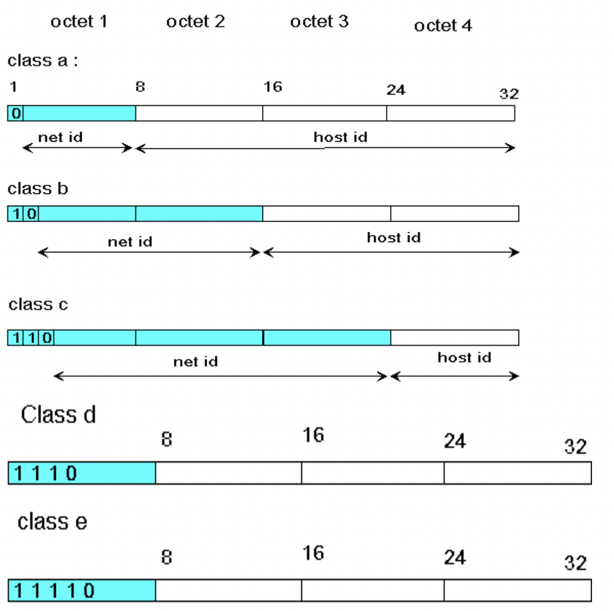
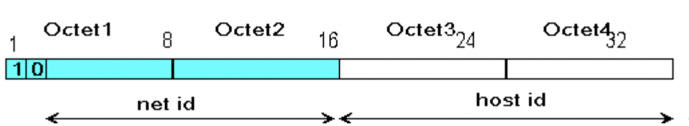
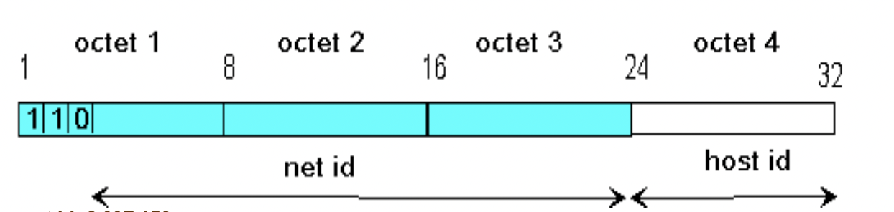
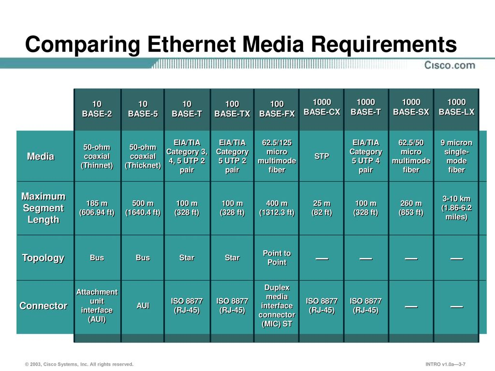
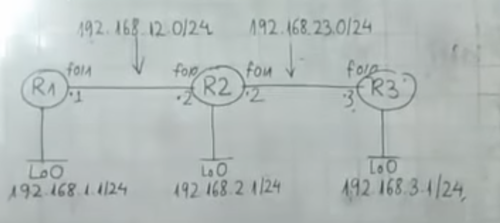

# Cấu trúc và địa chỉ IP

### 1. Thành phần của IPv4

- IPv4, 32 bit, chia thành 4 octet (mỗi octet có 8 bit, tương đương 1 byte, các byte tách nhau bằng dấu .), bao gồm 3 thành phần chính

  

  - Bit nhận dạng lớp (classbit)
  - Địa chỉ của mạng (NetID)
  - Địa chỉ của máy chủ (Host ID)

### 2. Các lớp địa chỉ IPv4




#### 2.1 Địa chỉ lớp A


- Bit thứ nhất nhận dạng lớp A = 0
- 7 Bit còn lại trong octet1 dành cho địa chỉ mạng
- 3 Octet còn lại có 24 bit dành cho địa chỉ host

  - netid: 126 mạng
  - host id: 16.777.214 máy chủ trên 1 mạng

#### 2.2 Địa chỉ lớp B



- 2 bit đầu nhận dạng lớp B = 10
- 14 Bit còn lại trong 2 octet đầu dành cho địa chỉ mạng
- 2 Octet còn lại có 16 bit dành cho địa chỉ host

  - netid: 16.382 mạng
  - host id: 65.354 máy chủ

#### 2.3 Địa chỉ lớp C



- 3 bit đầu nhận dạng lớp C = 110
- 21 bit còn lại trong 3 octet đầu dành cho địa chỉ mạng
- Octet cuối có 8 bit dành cho địa chỉ máy chủ

  - netid: 2.097.150 mạng
  - host id: 254 máy chủ / mạng

### 3. Phân chia địa chỉ mạng con

- Default Mask:

  - Lớp A: 255.0.0.0
  - Lớp B: 255.255.0.0
  - Lớp C: 255.255.255.0

- Subnet mask:

  - Subnet Mask bao giờ cũng đi kèm với địa chỉ mạng tiêu chuẩn để cho người đọc biết địa chỉ
    mạng tiêu chuẩn này dùng cả cho 254 máy chủ hay chia ra thành các mạng con. Mặt khác nó
    còn giúp Router trong việc định tuyến cuộc gọi.

- CCNA Thầy Phương

- Hiểu cách hoạt động của mô hình, tuy nhiên chưa nắm rõ các lớp gồm có cụ thể thành phần gì.
  - Application: Provides network services to application processes (such as electronic mail, file transfer, and terminal emulation), Provides user authentication
  - Presentation: Ensures that data is readable by receiving system, Formats data, Structures data, negotiates data transfer syntax for application layer, provides encryption)
  - Interhost Communication: Establishes, manages, and terminates sesions between applications
  - Transport: Provide transport protocol to delivery packet between host
  - Network: Route data packet, choose best path
  - Data link - create/delete frames, check errors
  - Physical
- Cách chia địa chỉ IP:

- Lớp A:

  - Lớp A: Địa chỉ từ 1.0.0.0 -> 127.0.0.0
  - Mạng 127.0.0.0 Loopback network
    -> 126 mạng được sử dụng
  - Host, 24 bit -> 2^24 -2 host được sử dụng cho mỗi mạng

- Lớp B:

  - Địa chỉ mạng: 128.0.0.0 -> 191.255.0.0
  - 2^14 mạng cho lớp B
  - 2^16-2 host cho lớp B

- Lớp C:

  - Địa chỉ mạng: 192.0.0.0 -> 233.255.255.0
  - Có tất cả 2^21 mạng trong lớp C
  - host: 2^8-2

- Private và Public IP

  - Trong LAN: Private
  - Internet: Public
  - NAT: Chuyển đổi public <-> private

- Dải địa chỉ private:

  - Lớp A: 10.x.x.x
  - Lớp B: 172.16.x.x -> 172.31.x.x
  - Lớp C: 192.168.x.x

- Subnet mask:

  - 255.0.0.0 = /8
  - 255.255.0.0 = /16
  - 255.255.255.0 = /24

- Các loại cáp:

  - 10Base-T: Twisted-Pair
  - UTP: Unshield Twisted-Pair
  - STP: Shield Twisted-Pair



- Cấu hình router: sử dụng packet tracer thử cấu hình và ping đến các router

- Telnet, CDP, SHH

  - Telnet: cấu hình qua internet, sử dụng giao thức telnet đề ngồi từ 1 ip, truy cập vào ip khác để cấu hình router
  - Giao thức của tầng application
  - Sử dụng TCP, port 23
  - Điều kiện: có kết nối TCP từ PC đến Router
  - IP đang dùng phải ping được tới IP muốn config
    - Mở cổng vty

- CDP (Cisco Discovery Protocol)

  - 60/s lần các router gửi CDP message cho nhau, cho phép các thiết bị biết được thông tin tất cả các thiết bị kết nối trực tiếp với nó.
  - Cisco Proprietary
  - CDP: Cho biết device ID (host name), local interface (cổng mình đầu với láng giềng), outgoing port(cổng của láng giềng đầu với mình), Platform, Capability, IP Address, IOS version

- SSH

  - Vì mọi thông tin trao đổi bằng Telnet đều hiển thị dưới dạng clear text, ssh cung cấp mã hoá dữ liệu
  - Tầng application
  - TCP, Port 22

- Switch

  - Switch làm việc như một Bridge nhiều cổng. Khác với Hub nhận tín hiệu từ một cổng rồi chuyển tiếp tới tất cả các cổng còn lại, switch nhận tín hiệu vật lý, chuyển đổi thành dữ liệu, từ một cổng, kiểm tra địa chỉ đích rồi gửi tới một cổng tương ứng.
  - Có Mac Address Table dùng để check các mã Mac Address nhận diện thiết bị, dễ trao đổi thông tin
  - Cách switch forward frame
  - 

- Các phương pháp chuyển mạch (3 phương pháp)

  - Cut-through (kiểm tra đích đến và gửi frame)
  - Store and forward (lưu frame đó lại, kiểm tra các lỗi rồi mới gửi)
  - Fragement-Free ( kiểm tra xem frame đủ 64 bytes hay không rồi chuyển đi luôn)

- Định tuyến tĩnh

  - Điều kiện:
    - Biết destination address
    - Biết đường đi đến router đích (có 2 cách, cách 1 học qua các router, cách 2 định tuyến bằng tay)
    - Biết các đường đi có thể để đi đến đích
    - Chọn đường đi tối ưu nhất

- Ví dụ định tuyến tĩnh:

  ```sh
  ip route 172.16.1.0 255.255.255.0 172.16.2.1
  ```

- 

  - Interneface lôopback là các cổng ảo, sử dụng cổng này như 1 con router, các interface loopback lúc này đại diện cho end user của router mà không cần sử dụng các PC giả lập.
  - Các Interface loopback đại diện cho mạng của nó

  - Yêu cầu: Ping được các Loopback với nhau

  - Trỏ các static route đến các router.
