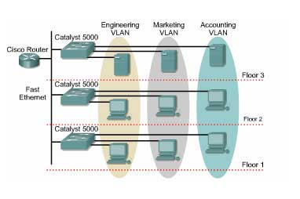
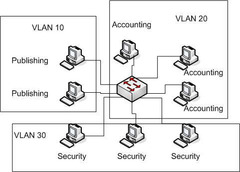
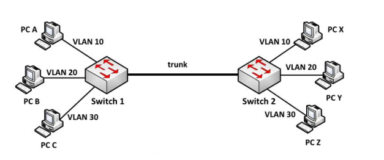

## Overview
1. VLAN
2. Trunking
3. VTP (VLAN Trunking Protocol)

### 1. VLAN (Virtual Local Area Network)

#### 1.1 Mục đích ra đời của VLAN

- VLAN là một broadcast domain được tạo bởi các switch.
- Thông thường thì router sẽ đóng vai trò tạo broadcast domain. Đối với VLAN, switch có thể tạo ra broadcast domain.

#### 1.2 Các đặc điểm của VLAN
- Tất cả các mạng VLAN đơn đều thuộc 1 miền broadcast duy nhất.
- Các máy cùng VLAN có thể giao tiếp với nhau. 
- Chúng ta có thể cấu hình để có thể giao tiếp các máy ở khác VLAN với nhau.
- Dãy giá trị các VLAN ID chạy từ 0 -> 4095:

    – 1 – 1001 : dải VLAN thường được sử dụng.

    – 1002 – 1005 : dải này dùng để giao tiếp với các kiểu mạng LAN khác.

    – 1006 – 4094: dải VLAN mở rộng, sử dụng khi switch hoạt động ở mode Transparent.

    – 0 và 4095: VLAN dành riêng.

    – VLAN 1, 1002 – 1005: mặc định trên Switch và không thể xóa được.

    - Mặc định VLAN sau khi được tạo sẻ được lưu vào file vlan.dat trong bộ nhớ Flash.
#### 1.3 Các loại VLAN

- **Port - based VLAN**: Mỗi cổng switch được gắn cho 1 VLAN xác định (mặc định là VLAN 1), do đó bất cứ thiết bị host nào gắn vào cổng đó đều thuộc VLAN đó.
- **MAC Address - based VLAN**: Mỗi địa chỉ MAC được đánh dấu với 1 VLAN xác định
- **Protocol - based VLAN**: Sử dụng địa chỉ IP để thay thế địa chỉ MAC.

> Trong 3 loại trên thì loại **Port -based VLAN** phổ biến nhất và được sử dụng nhiều nhất.

#### 1.4 Vì sao cần VLAN?

- Khi có quá nhiều lượng truy cập
- VLAN mặc định kích hoạt là dùng chung 1 VLAN (VLAN 1). Vì thế khí cắm vào bất cứ cổng nào trên switch thì các máy đều có thể giao tiếp được với nhau.

#### 1.5 Lợi ích của VLAN

- Tiết kiệm băng thông của mạng: Do VLAN có thể chia nhỏ LAN thành các đoạn khác nhau. Khi gửi gói tin nó sẽ gửi trên 1 VLAN duy nhất, không truyền cho các VLAN khác.

- Tăng khả năng bảo mật: Các VLAN khác nhau không truy cập được vào nhau (trừ khi khai báo định tuyến).

- Dễ dàng thêm hay bớt các máy tính vào VLAN

- Có tính linh động cao: 
    - Trong cấu hình tĩnh, người quản trị phải cấu hình cho từng switch. 
    - Trong cấu hình động, mỗi cổng của switch có thể tự cấu hình VLAN dựa vào địa chỉ MAC của thiết bị được kết nối vào.

### 2. Trunking

#### 2.1 Mục đích ra đời
- Khi dùng VLAN, các mạng khác VLAN muốn kết nối với nhau thì dùng 1 đường dây để kết nối, tuy nhiên giả sử có 100 máy, cứ 2 máy cần kết nối 1 đường dây thì sẽ phải tốn 50 đoạn dây.

- Khi đó Trunking ra đời để giải quyết vấn đề trên bằng cách dùng 1 đoạn dấy để có thể kết nối.

#### 2.2 Các chuẩn trunking trong một hệ thống mạng
- Chèn thông tin vào Ethernet frame. Khi nó đi trên đường trunk, để biết frame này đến từ VLAN nào để đẩy nó đến VLAN đúng.

##### 2.2.1: Chuẩn IEEE và kỹ thuật trunking DOT1Q.
- Chèn thêm 4 byte VLAN Tag vào sau trường Source Address của Ethernet Frame trên đường đi.

- Các trường trong 802.1Q VLAN Tag bao gồm:
    - Tag Protocol ID (16 bit) nôi dung trường này luôn được set 0x8100 dùng để định danh ra frame này đã được tag 802.1q để phân biệt với frame untagged trên đường trunk.
    - User Priority (3 bit) sử dụng cho kỹ thuật QoS.
    - Canonical Format Indicator (1bit) cho biết địa chỉ MAC đang được sử dụng ở định dạng Token Ring hay Ethernet Frame.
    - VLAN ID(12bit): cho biết Frame đang chạy trên đường trunk là của VLAN nào.

- Khi switch nhận Frame có tag 802.1Q, nó sẽ kiểm tra xem Frame này đến từ VLAN nào. Sau đó nó gỡ bỏ tag và trả về frame mà đúng VLAN thuộc về.

##### 2.2.2 Chuẩn Cisco và kỹ thuật trunking ISL

- Kỹ thuật Trunking này của Cisco tiến hành chèn thêm Header 26 byte và trường CRC kiểm tra lỗi 4 byte vào Ethernet Frame.

- Các trường trong ISL Tag bao gồm:
    - DA(Destination Address): 40 bit sẻ set ở dạng 0x01-00-0C-00-00″ or “0x03-00-0c-00-00”. Để báo hiệu bên nhận rằng frame được tag ở dạng ISL.

    - Type: 4bit chỉ ra type frame được và sử dụng là gì (0000:Ethernet, 0001: Token ring….).

    - User: 4bit chỉ ra độ ưu tiên của frame khi đi qua switch(XX00: normal priority, XX01: priority 1, XX10: priority 2, XX11: highest priority).

    - SA(Source Address): 48 bit địa chỉ nguồn của gói tin ISL. Tuy nhiên thiết bị nhận có thể bỏ qua địa chỉ này.

    - LEN(Length): 16bit cho biết kích thước của gói tin thực tế.

    - AAAA03 là một giá trị 24bit liên tục của  0xAAAA03.
HSA(High Bits of Source Address):24 bit trường này chứa giá trị “0x00-00-0C.

    - BPDU: được set để tất cả gói tin BPDU được tag ISL(hoạt động trên STP).

    - INDEX: 16bit chỉ ra chỉ số port nguồn của gói tin tồn tại trên Switch.

    - RES: dài 16bit sử dụng khi Token ring hoặc FDDI được đóng gói frame ISL, với frame Ethernet trường RES được set tất cả bit 0.

### 3. VLAN Trunking Protocol (VTP)
#### 3.1 Đặc điểm
- Giúp cho việc cấu hình VLAN luôn đồng nhất khi thêm, xóa, sửa thông tin về VLAN trong hệ thống mạng.

- VTP hoạt động trên các đường Trunking Layer 2 để trao đổi thông tin VLAN với nhau

- 3 yếu tố quan trọng của VTP là : VTP domain, VTP password, VTP mode(Server, Client, Transparent). Trong đó
VTP domain : các switch được tổ chức cùng thuộc một domain mới có thể chia sẻ thông tin VLAN với nhau.

#### 3.2 VTP Mode

<!-- - **Server** : switch hoạt động ở mode này có toàn quyền quyết định tạo, xóa, sửa thông tin VLAN. Đồng bộ thông tin VLAN từ các Switch khác, Forward thông tin VLAN đến các Switch khác.

-  **Client**: switch hoạt động ở mode này không được thay đổi thông tin VLAN mà chỉ nhận thông tin VLAN từ Server. Đồng bộ thông tin VLAN từ switch khác và forward thông tin VLAN.

-  **Transparent**: switch hoạt động ở mode này không tiến hành tiếp nhận thông tin VLAN. Nó vẫn nhận được thông tin VLAN từ các Switch khác nhưng không tiến hành đồng bộ thông tin VLAN. Có thể tạo, xóa, sửa VLAN độc lập trên nó. Không gửi thông tin VLAN của bản thân cho các Switch khác nhưng nó có thể forward thông tin VLAN nhận được đến các Switch khác. -->

#### 3.3 Revision Number
- Mặc định số Revision giữa các switch đều bằng 0.
- Khi có thay đổi Revision Number sẽ tăng lên 1 đơn vị

#### 3.4 VTP Pruning

- Thông thường, khi VLAN 10 gửi Frame đến host khác thuộc VLAN 10 nhưng nằm ở switch khác. Vì mỗi VLAN là một broadcast domain nên frame này sẽ được truyển đến tất cả các host thuộc VLAN 10 của switch 2. Mặc định khi đi trên trunk nó sẽ cho qua dữ liệu của tất cả VLan nên switch 4 cũng nhận được frame này. 

- Khi được bật tính năng VTP Prunning. Switch 4 sẻ gửi thông điệp báo cho switch 1 rằng nó không cần dữ liệu của VLAN 10(vì không tồn  tại VLAN10). Và khi switch 1 khi nhận được frame broadcast này sẻ tiến hành chặn frame này không forward nó qua đường trunk đến các SW không tồn tại VLAN 10(switch 4).

Tài liệu tham khảo:

- [VLAN1](https://quantrimang.com/vlan-la-gi-lam-the-nao-de-cau-hinh-mot-vlan-tren-switch-cisco-64830)
- [VLAN2](https://www.dienmayxanh.com/kinh-nghiem-hay/vlan-la-gi-co-can-thiet-su-dung-khong-lam-the-nao-1137273)
- [VLAN3](https://fptshop.com.vn/tin-tuc/tin-moi/cach-don-gian-phan-biet-cac-loai-vlan-122720#:~:text=VLAN%20s%E1%BA%BD%20%C4%91%C6%B0%E1%BB%A3c%20chia%20ra,cho%20m%E1%BB%99t%20VLAN%20nh%E1%BA%A5t%20%C4%91%E1%BB%8Bnh.)

- [Trunking 1](https://www.totolink.vn/article/97-vtp-la-gi-vlan-trunking-protocol-la-gi.html#:~:text=K%E1%BA%BFt%20n%E1%BB%91i%20%E2%80%9Ctrunk%E2%80%9D%20l%C3%A0%20li%C3%AAn,VLAN%20tr%C3%AAn%20h%E1%BB%87%20th%E1%BB%91ng%20m%E1%BA%A1ng.)

- [Trunking 2](https://itforvn.com/bai-6-vlan-trunking-vtp/)

- [VTP 1](https://itforvn.com/bai-6-vlan-trunking-vtp/)