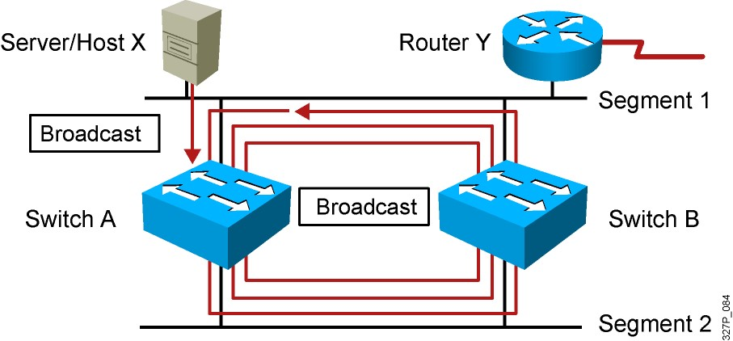
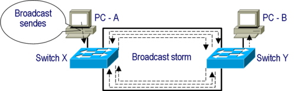
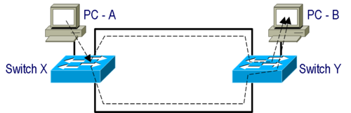
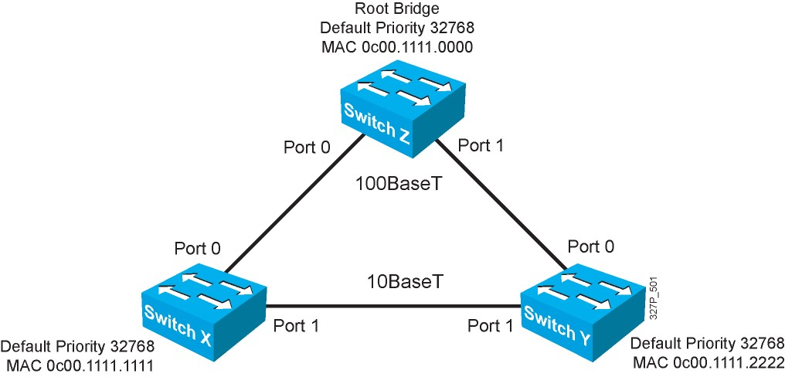
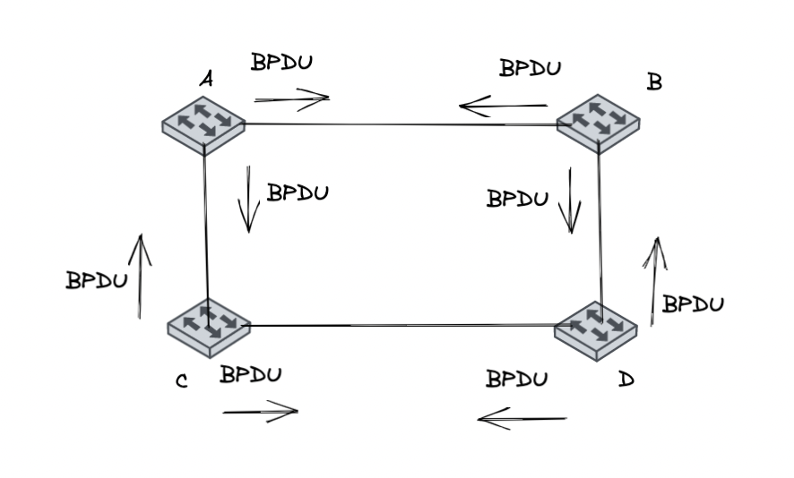
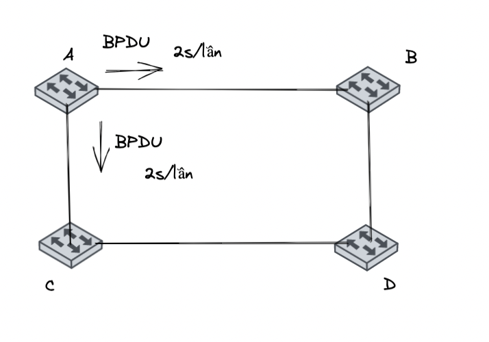
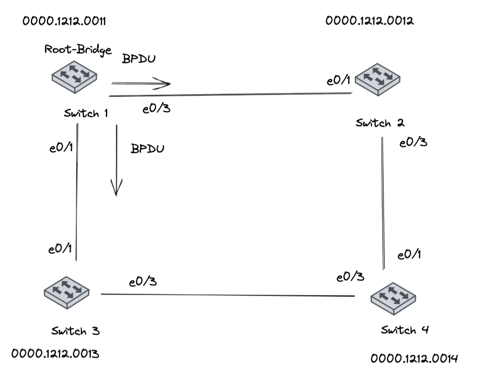
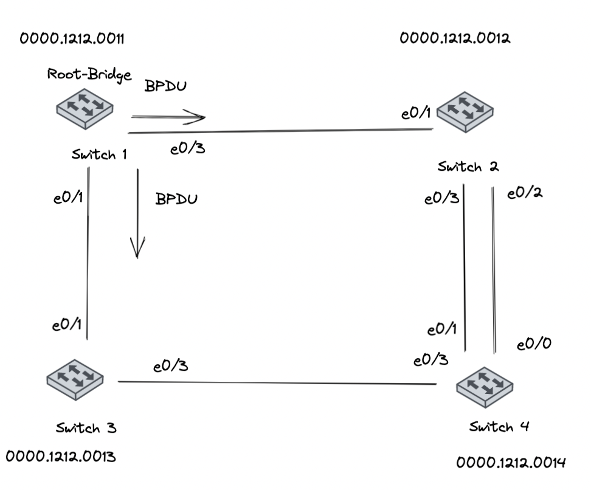
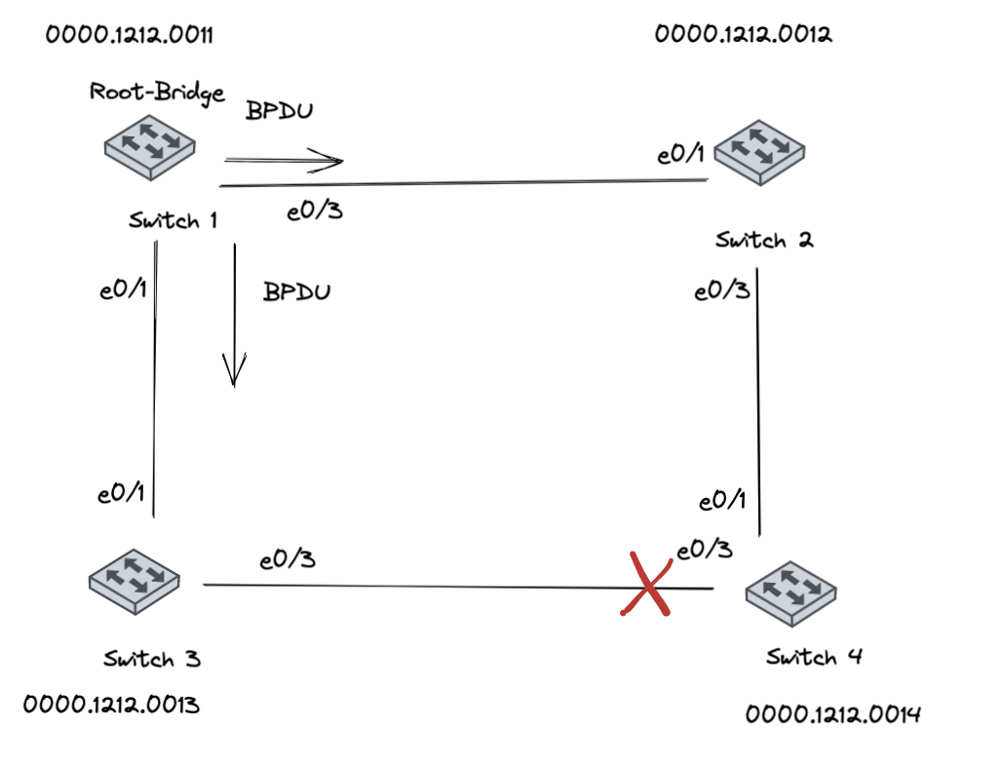

## Overview

1. Spanning Tree Protocol (STP)
<!-- 2. Open Shortest Path First (OSPF) -->

<!-- EIGRP (Enhanced Internet Gateway Routing Protocol) -->

<!-- - Chống loop cho giao thức chuyển mạch layer 2
- Broadcast storm
- Instability Mac-Address-Table
- Multi-frame copies -->

## 1. Spanning Tree Protocol (STP)

### 1.1 Các hình thức loop trong layer 2

- Broadcast storm
- Instability MAC address table 
- Multiple Frame copies

#### 1.1.1 Broadcast storm (Bão quảng bá):

#### 1.1.2 Multiple Frame Copies (Trùng lặp Frame)

- PC A gửi một unicast frame đến PC B và địa chỉ MAC của B chưa được cập nhật vào bảng MAC của switch thì switch sẻ xử lý các frame này như một broadcast frame và flood ra tất cả các port trừ port nhận vào.

#### Spanning Tree Protocol
>  Spanning Tree Protocol (STP) là một giao thức ngăn chặn sự lặp vòng, cho phép các bridge truyền thông với nhau để phát hiện vòng lặp vật lý trong mạng.

### 1.2 Hoạt động của Spanning Tree Protocol

- Hoạt động bầu chọn của một tiến trình STP:
    - Thực hiện bầu chọn Root-Bridge
    - Bầu chọn Root-Port
    - Lựa chọn các Designated-Port
    - Blocking các Port còn lại

Ví dụ về mô hình STP:

#### 1.2.1 Bầu chọn Root-Bridge của STP

- Khi các switch được đấu nối thì nó sẽ gửi các gói tin BPDU (Bridge Protocol Data Unit) trên các port của switch.

- BPDU chứa Bridge-ID của các switch, dùng để định danh mỗi switch khi tham gia vào STP
    - Bridge-ID có 8 byte, gồm có các thông số:
        - Priority (2byte) (của switch): có giá trị từ 0 – 65535 mặc định là 32768
            - Switch nào có chỉ số priority có chỉ số nhỏ nhất sẽ được chọn làm Root-switch 
        - MAC Address (6 byte): 
            - Xét từ trái sang phải từng giá trị hexa thì switch nào có MAC nhỏ nhất làm Root-switch

- Tiến trình bầu Root-Bridge được tiến hành như sau:

    - Đầu tiên sẻ so sánh switch nào có số Priority thấp nhất sẻ là Root-Bridge
    - Nếu các switch được thiết lập có số Priority bằng nhau thì switch nào có MAC nhỏ nhất sẽ được bầu làm Root-Bridge.
    - Sau khi đã bầu chọn được Root-Bridge thì chỉ có switch làm root mới gửi BPDU ra khỏi cổng để duy trì tiến trình STP ( gửi 2s/lần). Các SW con chỉ nhận, bổ xung thông tin BPDU và forward thông tin BPDU này.

- Theo hình trên, giả sử A < B < C < D thì switch A sẽ được bầu làm Root-Bridge

#### 1.2.2 Bầu chọn Root-Port của STP
- Sau khi đã bầu chọn Root-bridge các switch sẻ bầu chọn Root-port, Root-port là port có đường về Root-bridge có tổng path-cost tích lũy nhỏ nhất.
- Khi bầu chọn Root-port thì Root-Switch ko tham gia quá trình bầu chọn này
- Mỗi Non-Root-switch chỉ có 1 Root-port
- Path-cost là giá trị cost trên từng cổng của Switch.

| Interface  | Speed | Cost  |
|---|---|---|
| Ethernet  | 10Mb  | 100  |
|  Fast Ethernet |  100Mb | 19  |
|  Gigabit Ethernet | 1Gb  | 4  |
| 10 Gigabit Ethernet  |  10Gb |  2 |

#### Luật Tie Break
 - Sender Bridge ID:
    - Cổng nào kết nối switch mà switch đó có Bridge ID nhỏ nhất -> port đó sẽ được chọn làm Root-port.
- Sender Port ID:
    - Port ID của Switch bên kia thì port nào của switch bên kia có giá trị port-ID nhỏ hơn thì chọn port bên switch mình kết nối với Port ID nhỏ hơn đó.
        - Priority của port: có giá trị từ 0 -> 255, default = 128. Port nào có Priority nhỏ hơn thì Port đó có Port ID nhỏ hơn
        - Vị trí của Port (Port number): Xét theo hạng của số thứ tự của port. Port số 1 < port 2 -> port số 1 làm root-port vd: (f0/0)

Ví dụ: 

- Giả sử các Bridge ID được sắp xếp theo thứ tự Switch 1 < Switch 2 < Switch 3 < Switch 4
- Khi đó, Switch 1 đã được bầu chọn là Root-Bridge, ta bắt đầu bầu chọn Root-Port

    - Switch 2 ta tính cost trên cổng e0/1 sẻ là 100, trên cổng e0/3 sẽ là 300 nên cổng e0/1 sẻ được chọn là Root-port trên Switch 2
    - Trên Switch 3 là e0/1
    - Trên Switch 4 ta thấy cả 2 cổng e0/3 và e0/1 đều có path-cost là 200. Khi đó ta sẽ xem đến luật Tie Break
        - Với trường hợp Sender Bridge ID:
            - e0/1 nối với Switch 2 mà Bridge ID của Switch 2 < Switch 3. Nên e0/1 sẽ được chọn làm Root-Port
        - Với trường hợp Sender Port ID:
            
            
            - Ta nối thêm một đường backup giữa SW2 và SW4 như hình. 
            - Tại cổng e0/1 và cổng e0/0 đều có tổng cost là 200 và cùng đấu nối về một switch. Trong trường hợp đó ta sử dụng Port-ID
            - Trong trường hợp này cổng nào có Port-ID nhỏ hơn thì sẽ được chọn làm Root-Port và cổng e0/0 sẽ được bầu làm Root-Port vì nó đấu nối đến e0/2, còn e0/1 đấu với e0/3 (2 < 3) - trong điều kiện các cổng đều sử dụng port-priority là 128
- Thông thường các port đấu nếu với Switch làm root-bridge đều là root-port

#### 1.2.3 Bầu chọn Designated Port
- Designated port là port cung cấp đường về root-bridge có tổng cost nhỏ nhất trên phân đoạn mạng đang xét.
- Một link kết nối chỉ có một Designated port
- Các quy tắc trong bầu chọn Designated port:
    - Tất cả các port của Root-bridge đều là Designated Port

    - Trên một link p2p thì đối diện Root-port là Designated port.

    - Nếu trên một link có 2 cổng cung cấp đường về Root-bridge có cost tích lũy bằng nhau. Lúc đó sẻ dùng Sender ID để xác định, nếu Sender ID lại bằng nhau thì dùng đến port-ID để xét.

- Trong trường hợp trên, Port e0/3 của Switch trên phân đoạn mạng giữa Switch 3 và Switch 4 có tổng cost là 100, e0/3 của Switch 4 có tổng cost 200 nên e0/3 Switch 3 sẻ thành Designated port

#### 1.2.4 Blocking các port còn lạic ủa giao thức STP
- Các port không có vai trò là root hay designated sẽ bị block và được gọi là Alternated port.
- Hình dưới port e0/3 của Switch 4 sẽ bị block và trở thành Alternated port
- Đặc điểm của Alternated port:
    - Khi 1 trong các phân đoạn khác bị đứt thì phân đoạn port lock sẽ được mở ra để chạy
    - Khi phân đoạn trên có lại thì phân đoạn lock sẽ lại bị lock lại
    - Tuy port lock không nhận được dữ liệu nhưng nó vẫn nhận gói tin BPDU từ Root-Switch để duy trì Spanning-Tree.

- Sau khi block xong thì sẽ hoàn thành tiến trình STP. Khi có sự cố e 0/1 switch 4 down thì STP sẽ mở e0/3 để mạng luôn được duy trì.
- Luồng BPDU sẽ được forward qua các Switch và kết thúc ở cổng Switch 4 vì cổng block port chỉ nhận BPDU mà không forward 
- BPDU đi vào Root và blocking port, đi ra các Designated port.

### 1.3 Nhân tố định thời của giao thức Spanning Tree
- STP sử dụng các định thời : hello timer, forward delay timer, max age timer
    - Hello Timer: default 2s, khoảng thời gian mà Root-Bridge tiến hành gửi các gói tin BPDU ra khỏi cổng của nó để duy trì tiến trình STP.
    - Forward delay timer: default là 15s. Thời gian các trạng thái listening, learning trước khi sang forwarding để hội tụ
    - Max age timer: default là 20s. Khi một cổng đang tiến hành nhận BPDU và đồng thời nhận BPDU kém hơn. Port này sẽ chờ hết thời gian Max-age timer rồi mới thực hiện các hoạt động hội tụ.

- Chất lượng của 1 gói tin BPDU được đánh giá theo:
    - So sánh bridge ID của Root Switch. BPDU nào mà thông số Bridge ID nhỏ hơn được xem là tốt hơn.
    -  Nếu chung Root-Bridge, ta sẽ so sánh path-cost đi về Root-Bridge. BPDU có tổng tích luỹ nhỏ hơn sẽ tốt hơn.
    - Khi tổng tích luỹ bằng nhau ta sẽ tiến hành so sánh Sender Bridge ID của Switch kết nối gửi đến cho Switch đang xét. Sender Bridge ID nào nhỏ hơn thì BPDU được xem là tốt hơn.
    - Nếu Sender Bridge ID bằng nhau thì sẽ so sánh tiếp tục đến Port-ID, Port-ID nào nhỏ hơn thì BPDU tốt hơn.

### 1.4 Các trạng thái trong một tiến trình STP
- Các trạng thái trong một tiến trình STP đến khi hội tụ bao gồm:
    - Disabled: cổng này đang ở trạng thái inactive
    - Blocking: port đang bị khoá Alternated Port. Chỉ tiếp nhận BPDU mà không cho BPDU đi ra khỏi cổng. Không học địa chỉ MAC vào bảng MAC và không forward được dữ liệu.
    - Listening: có đặc tính cổng chỉ nhận BPDU hoặc gửi BPDU. Không học địa chỉ MAC vào bảng MAC và không forward được dữ liệu
    - Learning: Giống như Listening là nhận hoặc gử BPDU. Hơn thế, nó còn học được địa chỉ MAC vào bảng MAC. Tuy nhiên không forward được dữ liệu.
    - Forwarding: Có thể nhận hoặc gửi BPDU, học được địa chỉ MAC vào bảng MAC, forward được dữ liệu.

#### Tiến trình chạy STP
- Khi Spanning Tree Protocol chạy. Cổng bị đưa vào trạng thái Blocking sẻ bị khóa ngay lập tức. Còn các cổng như Root và Designated port thì phải trải qua các trạng thái Listening(15s) rồi tiếp tục chuyển sang trạng thái Learning(15s). Rồi mới chuyển sang trạng thái Forwarding để forward được dữ liệu.

-  Đợi tiến trình STP chạy hết để chống loop qua các trạng thái Listening và Learning mất 30s khá lâu. Cho nên Cisco đã đưa ra một số các tính năng nhằm hạ thấp khoảng thời gian timer này lại như: Portfast, Uplinkfast, Backbonefast hay version Rapid SPAN IEEE 802.1W.
- Việc chuyển từ trạng thái: Blocking sang listening mất 20(s)
- Việc chuyển từ trạng thái: Listening sang Learning mất 15(s)
- Việc chuyển từ trạng thái: Learning sang Forwarding mất 15(s)

Vậy khi Switch khởi động xong hoặc khi cắm dây vào port thì phải mất 30(s) đèn chuyển sang màu xanh.
#### Tài liệu tham khảo: 
[STP 1](https://vnpro.vn/thu-vien/tim-hieu-ve-giao-thuc-spanning-tree-protocol-3115.html)

[STP2](https://itforvn.com/tu-hoc-ccnax-bai-7-spanning-tree/)

[STP 3](https://securityzone.vn/t/bai-19-tim-hieu-giao-thuc-spanning-tree-protocol.163/)