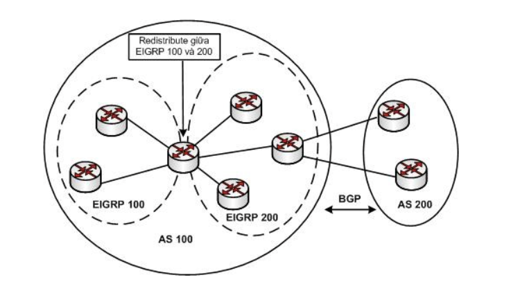
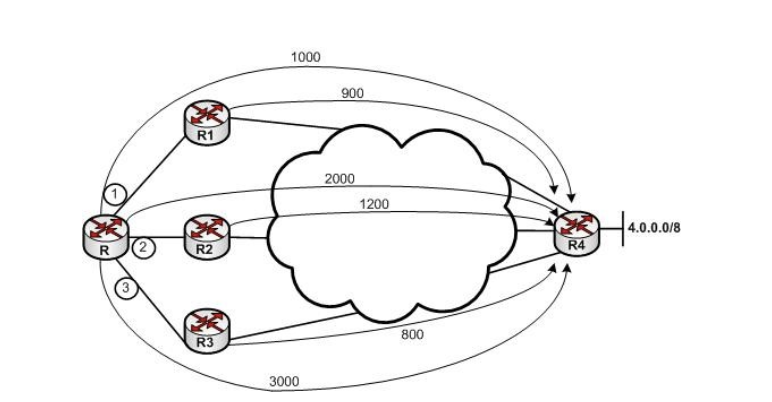
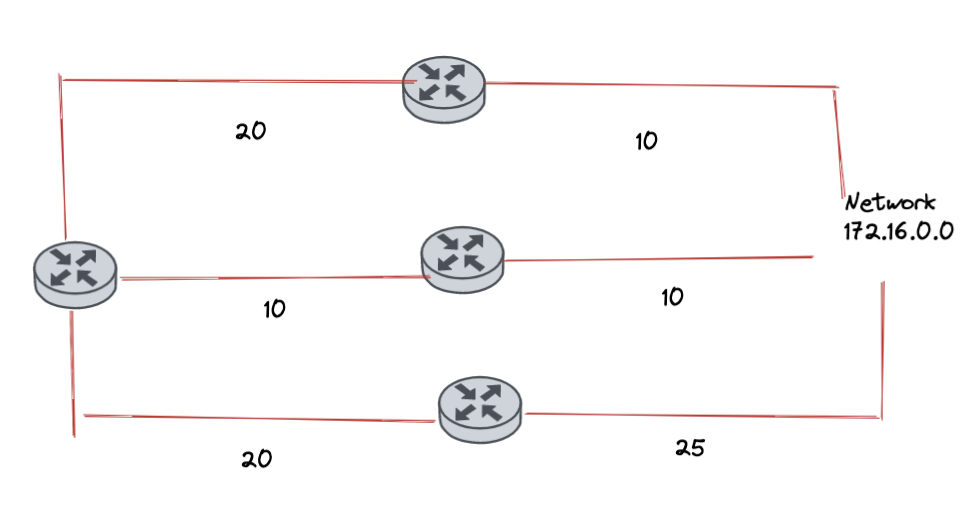

## Overview
1. EIGRP (Enhanced Interior Gateway Routing Protocol)

### 1. Giao thức định tuyến EIGRP (Enhanced Interior Gateway Routing Protocol)
- Là giao thức định tuyến do Cisco phát triển, chỉ chạy trên các sản phẩm của Cisco. 

- Là giao thức dạng Advanced Distance Vector, sử dụng thuật toán DUAL.

- EIGRP chỉ gửi toàn bộ bảng định tuyến cho láng giềng lần đầu, và các lần sau chỉ gửi bản cập nhật khi có sự thay đổi, giúp cho việc tiết kiệm tài nguyên mạng.

- Việc sử dụng bảng Topology và thuật toán DUAL làm cho EIGRP có tốc độ hội tụ rất nhanh.

- EIGRP sử dụng công tính thức metric phức tạp, dựa trên nhiều thông số: Bandwidth, Delay, Load, Reliability

- Chỉ số AD của EIGRP là 90 cho các internal router và 170 cho external router

- EIGRP chạy trực tiếp trên nền IP và có số protocol-id là 88

### 2. Hoạt động của EIGRP

#### 2.1 Thiết lập quan hệ láng giềng

- Điều kiện thiết lập quan hệ láng giềng:
    - Giá trị AS (Autonomous System) được cấu hình trên router là giống nhau
    - Cùng subnet
    - Thoả mãn các điều kiện xác thực
    - Cùng bộ tham số K

- Cách hoạt động:
    - Khi bật EIGRP lên một cổng, thì router sẽ tự động gửi các gói tin ra khỏi cổng để thiết lập quan hệ neighbor với router được kết nối trực tiếp với nó. Các gói tin này được gửi đến địa chỉ multicast dành riêng cho EIGRP là 224.0.0.10 với giá trị hello-timer (khoảng thời gian định kỳ gửi gói tin hello) là 5s.
    - Để thiết lập được quan hệ láng giềng thì router phải thoả mãn các điều kiện được nhắc tới ở trên.

#### Điều kiện 1: Giá trị AS - Autonomous System
- AS ở đây chỉ được coi là 1 routing domain, các router khi chạy định tuyến với nhau, cùng 1 sự quản trị sẽ được ghép chung 1 domain. Mỗi domain có 1 giá trị AS riêng 
- AS được dùng trong giao thức định tuyến EIGRP khác với giao thức định tuyến ngoài (Ví dụ: BGP)

- Ở hình trên, Có 2 AS 100 và 200 chạy định tuyến ngoài BGP với nhau. Bên trong AS 100 chạy giao thức định tuyến EIGRP và chia thành 2 process-domain là 100 và 200. Router biên đứng ở giữa process-domain 100 và 200 sẽ redistribute thông tin giữa 2 domain để các con router trên 2 domain này thấy các thông tin về các subnet của nhau.

#### Điều kiện 2: Cùng Subnet

- Để 2 router thiết lập được quan hệ láng giềng, hai router phải có cùng subnet.

#### Điều kiện 3: Thoả mãn các điều kiện xác thức

- Trên các router phải có password giống nhau mới có thể trao đổi thông tin định tuyến với nhau.

#### Điều kiện 4: Cùng bộ tham số K

EIGRP sử dụng công thức tính metric rất phức tạp: 

 - Metric = f(Bandwidth, Delay, Reliability, Load), các thông số K1, K2, K3, K4, K5 được cấu hình trên các router phải khớp với nhau.

#### 2.2. Bảng Topology, FD, AD, Successor và Feasible Successor

- Sau khi thiết lập quan hệ láng giềng, các router láng giềng của nhau sẽ lập tức gửi toàn bộ các route EIGRP trong bảng định tuyến của chúng.
- Chúng chỉ gửi bảng định tuyến lần đầu tiên, các lần sau sẽ gửi các bản cập nhật nếu có bất kỳ thay đổi gì.
- Khi router nhận được nhiều route từ nhiều láng giềng khác nhau, nó sẽ chọn cái tốt nhất để đưa vào sử dụng, các route khác nó sẽ đưa vào một "kho chứa" để dùng cho mục đích dự phòng đường đi. Kho chứa này được gọi là bảng "Topology". Khi đó, bảng Topology trên một router chạy EIGRP là bảng lưu toàn bộ route có thể có từ nó đến mọi đích đến trong mạng, và bảng định tuyến sẽ là bảng lấy và sử dụng route tốt nhất từ bảng Topology này.

- Giả sử sơ đồ trên chạy định tuyến EIGRP, ta xem xét các đường đi từ router R đến mạng 4.0.0.0/8 của R4. Khi đó có tổng cộng 3 đường

    - Đường số 1: metric từ router đang xét đến mạng 4.0.0.0/8 là 1000, metric từ láng giềng trên đường này (R1) đến 4.0.0.0/8 là 900. 
    - Đường số 2: metric từ router đang xét đến mạng 4.0.0.0/8 là 2000, metric từ láng giềng trên đường này (R2) đến 4.0.0.0/8 là 1200.
    - Đường số 3: metric từ router đang xét đén mạng 4.0.0.0/8 là 3000, từ router láng giềng trên đường này (R3) đến 4.0.0.0/8 là 800.

- Khi đó ta có các khái niệm:
    - Với mỗi đường đi, giá trị metric từ router đang xét đến mạng đích được gọi là FD - Feasible Distance
    - Cũng với đường ấy, giá trị metric từ router láng giềng (next hop) đi đến cùng mạng đích được gọi là AD - Advertised Distance hay là RD - Reported Distance. Khái niệm AD ở đây khác với AD - Administrative Distance được dùng trong việc so sánh độ ưu tiên giữa các giao thức định tuyến.

- Như vậy ta có các giá trị AD, FD từ hình trên như sau:
    - Đường số 1: FD1 = 1000, AD1 = 900
    - Đường số 2: FD2 = 2000, AD2 = 1200
    - Đường số 3: FD3 = 3000, AD3 = 800

- `Sucessor`: Trong tất cả các đường đi đến mạng đích được lưu ở trong bảng Topology, đường nào có FD nhỏ nhất, đường đó sẽ được bầu làm `Successor`, router láng giềng trên đường này được gọi là successor router (hoặc successor). Đường successor sẽ được đưa vào bảng định tuyến để sử dụng làm được đi chính thức đến đích
- `Feasible Successor`: Trong tất cả các đường còn lại có FD > FD của Successor, đường nào có AD < FD của successor, đường đó sẽ được chọn làm `Feasible Successor` và được dùng để làm backup cho `Successor`

- Trong 3 đường trên, đường 1 được bầu làm `Successor` và đường 3 được bầu làm `Feasible Successor`. Khi đường số 1 down, đường số 3 sẽ lập tức được dùng để thay thế.

- Lý do chọn đường `Feasible Successor` mà thoả mãn điều kiện AD < FD của successor là để chống loop. Trong một mạng chạy giao thức Distance - Vector, nếu metric từ điểm A đến một mạng nào đấy < metric đi từ điểm B đến mạng ấy thì không bao giờ trên hành trình từ điểm A đi đến mạng nêu trên lại đi qua mạng B. Chính vì thế nếu AD của Feasible Successor < FD của Successor thì không bao giờ dữ liệu đi theo Feasible Successor lại đi vòng trở lại router Successor.

- Trong trường hợp không có đường nào được bầu làm `Feasible Successor`. `Successor` vẫn được đưa vào bảng định tuyến để làm đường đi chính thức đến mạng chính nhưng nó sẽ không có đường backup. Trong trước hợp này khi `Successor` bị down, router chạy EIGRP sẽ thực hiện một kỹ thuật gọi là Query: nó sẽ phát các gói tin truy vấn đến các láng giềng, hoạt động truy vấn sẽ được tiếp tục nó khi tìm thấy đường đi đến đích hoặc không còn đường đi nào có thể về đích được nữa. 

### Cân bằng tải trên những đường không đều nhau (Unequal Cost Load - Balancing)

| Network  |  Neighbor |  FD |  AD |
|---|---|---|---|
| 172.16.0.0  | B  |  30 |  10 |
|   |  C |  20 | 10  |
|   |  D | 45  | 25  |

- Khi này router gốc sẽ chọn router C để route đến network 172.16.0.0 bởi vì nó có FD min.
- Với variance 2. Router gốc sẽ chọn cả router B để đi đến network 172.16.0.0 (20 + 10 = 30 < (2 * FDmin) = 40)
- Với variance 3. Ta sẽ có cả 3 đường.

#### Xác thực MD5 với EIGRP

[Video](https://www.youtube.com/watch?v=JpsV9LVFUAw&list=PLBOZzuSFDzSL_5CvfuNo7EhFQR1z6hhpo&index=71)

[Docs](https://vnnet.edu.vn/giao-thuc-dinh-tuyen-eigrp-enhanced-interior-gateway-routing-protocol/)

#### Tài liệu tham khảo:

[EIGRP VNNET](https://vnnet.edu.vn/giao-thuc-dinh-tuyen-eigrp-enhanced-interior-gateway-routing-protocol/)

[EIGRP VNPRO](https://vnpro.vn/thu-vien/so-luoc-ve-giao-thuc-dinh-tuyen-eigrp-2055.html)

[EIGRP ITFORVN](https://itforvn.com/tu-hoc-ccna-bai-13-giao-thuc-eigrp/)