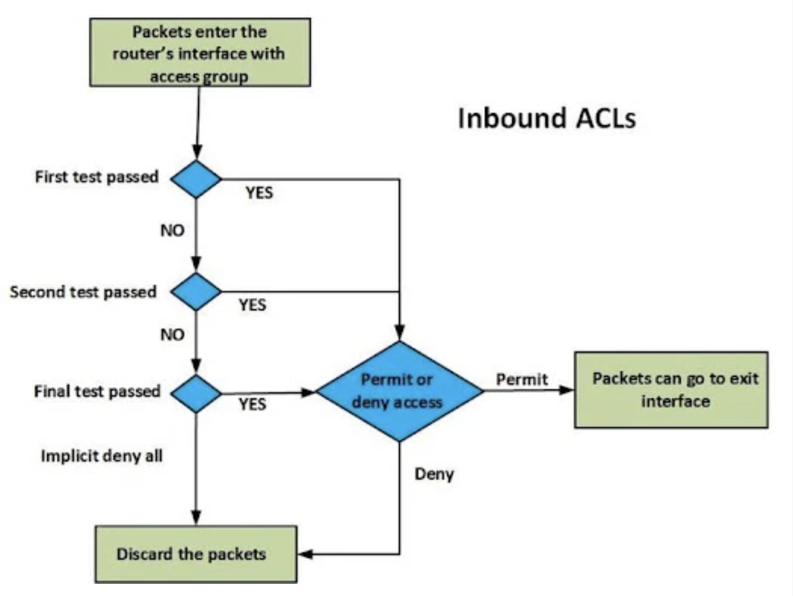
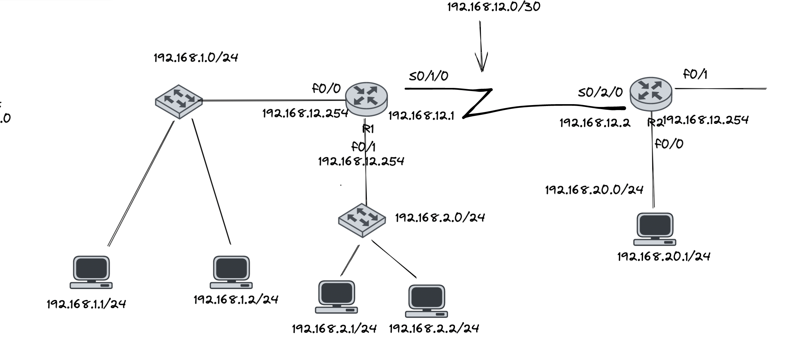

## Overview

1. Access Control List

### 1. Access Control List
- là danh sách quản lý truy cập, có nhiệm vụ lọc gói tin lớp 3 và phân loại dữ liệu (NAT, Distribute-list, VPN).

#### 1.1 Mục đích sử dụng ACL
- Kiểm soát lưu lượng ra vào
- Đảm bảo hiệu suất mạng
- Giám sát lượng truy cập ra vào hệ thống
- Cung cấp bảo mật cho mạng

### 1.2 Một số đặc điểm của ACL

- Các entry trong ACL được xử lý theo thứ tự
- Cơ chế lọc dựa vào thông số trong header gói tin
- Cần phải đặt tên interface, line, giao thức hoặc dịch vụ hỗ trợ ACL
- Mỗi interface, line, giao thức hoặc dịch vụ có thể sử dụng nhiều ACL
- Hỗ trợ hầu như tất cả các giao thức nhưng mỗi giao thức nên có 1 ACL riêng
- Cuối mỗi ACL luôn có `[deny all]`
- Không thể sửa, xoá entry trong numbered ACL


### 1.3 Cách hoạt động của ACL



### Ví dụ: 



- Giả sử cấu hình trên router R1:

```sh
# Mặc định thì access list được cài sẽ là out nếu không khai báo gì 
$ access-list 1 permit 192.168.1.0 0.0.0.255
```
- Ở trong trường hợp trên, khi cấu hình ACL trên router R1 như thế kia, thì các mạng 192.168.1.0 sẽ  đi qua được R1.
- Trong khi đó các mạng 192.168.2.0 sẽ không đi qua được R1.
- Mỗi cổng của router chỉ có thể đặt được 1 chiều in và 1 chiều out của access list.

### 1.4 Các loại Access Control List


#### 1.4.1 Standard Access Control List

- Standard ACL là những bản tin đơn giản, được đánh số từ 1 đến 99 nếu là number ACL
- Standard ACL chỉ lọc ra các địa chỉ nguồn trong header của IP packet, vì thế chúng hoạt động ở lớp 3.
- Standard ACL có thể được đặt theo chiều vào (inbound) hoặc theo chiều ra (outbound) đối với mỗi interface, tuy nhiên bản tin Standard ACL nên được đặt càng gần với destination, và thường theo chiều ra. Vì Standard ACL chỉ kiểm tra địa chỉ IP nguồn, nên vị trí đặt cần chỉ ra chính xác chiều gói tin được qua hoặc không được qua.


#### Cú pháp cấu hình:
```sh
# Ở configured mode
# Cách 1:

    $ access-list [ACL number] [permit/deny] [source ip address/ any/ host] [wildcard mask]

# Cách 2:

    $ ip access-list standard [ACL number hoặc ACL name] [permit/deny] [source ip address/any/host] [wildcard mask]

    # Gán ACL vào port,  vào interface-configured mode của interface cần áp dụng

    $ ip access-group [ACL number hoặc ACL name] [in/out]

```
#### Một số thuật ngữ cần biết khi cấu hình:
- `[ACL number]`: Đánh số cho Standard ACL từ 1 - 99 (Dãy mở rộng 1300 - 1999)
- `[permit/deny]`: Cho phép hoặc không cho phép gói tin đi qua
- `[source IP address]`: Địa chỉ IP nguồn của gói tin
- `[any]`: Tất cả các source IP
- `[host]`: Chỉ 1 host IP
- `[wildcard mask]`: wildcard mask của địa chỉ IP
- `[in/out]`: Chiều vào/ra của các gói tin trên cổng router
- `[ACL name]`: Cấu hình cho ACL bằng tên


Cách cấu hình:
```sh
# Vào mode config của router: R(config)

$ access-list + n + permit + IP + wildcard
$ access-list + n + deny +  IP + wildcard

# n chạy từ 1 -> 99 với Standard ACL

# Vào mode config-if của router: R(config-if)

$ ip access-group + n + in
$ ip access-group + n + out
```

Ví dụ: 


- Yêu cầu: Cấm toàn bộ mạng 192.168.1.0/24 đi đến server 192.168.20.1

```sh
# Vào mode config của router: R(config)

$ access-list 1 deny 192.168.1.0 0.0.0.255 
```

- Yêu cầu trên, ta có thể cấu hình theo 4 cách dưới này thì đều thoả mãn yêu cầu:
    - Đặt ACL theo chiều `in` trên cổng f0/0 của R1
    - Đặt ACL theo chiều `out` trên cổng s0/1/0 của R1
    - Đặt ACL theo chiều `in` trên cổng S0/2/0 của R2
    - Đặt ACL theo chiều `out` trên cổng f0/0 của R2 
- Tuy nhiên trường hợp tối ưu nhất sẽ đặt ở gần destination, trong trường hợp đó ta chọn đặt ở R2 theo chiều `out`
- Ví dụ về cách hoạt động của Access List Control

```sh
$ access-list 1 deny 192.168.1.0 0.0.0.255
$ access-list 1 permit any
$ access-list 1 deny 192.168.3.0 0.0.0.255

# Nó sẽ chạy từng dòng 1, gặp dòng nào sẽ thực thi ngay dòng đó và bỏ qua các dòng còn lại
# => Khi đó dòng 3 ở trên sẽ không được xét tới
# => Lưu ý vị trí đặt permit và deny

```


#### 1.4.2 Extended Access Control List

- Là những bản tin ACL mở rộng, cho phép lọc đa dạng hơn so với Standard ACL
- Được đánh số từ 100 đến 199
- Cho phép port number, source-destination IP address, protocol và nhiều tuỳ chọn, vì thế Extended ACL hoạt động tại lớp 3 và lớp 4 của mô hình OSI.
- Extended Access Control List cũng được cấu hình inbound và outbound trên các interface, tuy nhiên vì nó lọc cả source IP, destination IP nên vị trí đặt ACL cần tránh hảo tổn băng thông không cần thiết. Khi đó người ta đặt gần source IP

#### Cú pháp cấu hình:

```sh
# Cách 1:

$ access-list [ACL number] [permit/deny] [protocol] [source ip address/any/host] [destination ip address/any/host] [protocol qualification] [logging]

# Cách 2:

    $ ip access-list extended [ACL number hoặc ACL name] [permit/deny] [protocol] [source ip address/any/host] [destination ip address/any/host] [protocol qualification] [logging]

    # Áp dụng ACL vào port

    $ ip access-group [ACL number hoặc ACL name] [in/out]

```

#### Một số thuật ngữ cần biết khi cấu hình:

- `[ACL number]`: Đánh số cho Extended ACL từ 100-199 (dãy mở rộng 2000 - 2699)
- `[permit/deny]`: Cho phép hoặc không cho phép gói tin đi qua
- `[protocol]`: Giao thức của gói tin (từ lớp 3 trở lên), lớp 3: `ospf`, `eigrp`..., lớp 4: `tcp`, `udp`, `icmp`, `ip`.
- `[source address]`: Là một chuỗi entry bao gồm [source ip address] [wildcard mask]

- `[protocol qualification]`: phụ thuộc vào `[protocol]` giúp tăng tính bảo mật hoặc thực hiện các tác vụ lọc dữ liệu.

- Nếu `[protocol]` là TCP hoặc UDP thì `[protocol qualification]` = `[optional port]` `[port number]`
    - `[optional port]`: khoảng port cần kiểm tra
    - `[port number]`: chỉ ra chính xác port làm mốc cho `[optional port]`


- Nếu `[protocol]` là IP: router sẽ match tất cả các giao thức

- `[logging]`: Ghi lại thông tin về những gói tin match các entry trong ACL

| Application  | Protocol  | Destination Port  |
|---|---|---|
| HTTP  | TCP  | 80  |
|  HTTPS | TCP   | 443  |
| Telnet  | TCP   | 23  |
| SSH  | TCP  | 22  |
| FTP  | TCP  |  20, 21 |
| TFTP  | UDP  | 69  |
| SMTP  | TCP  | 25  |
|  POP3 | TCP  | 110  |
|  SNMP | UDP  | 161  |
|  Ping | ICMP  | -  |
|  - | IP  | -  |

### Ví dụ 1:


Yêu cầu: Cấm toàn bộ mạng 192.168.1.0/24 truy cập đến server 192.168.20.1/24 **bằng web**

```sh
# Vào R1 chọn mode configure: R1(configure)#
$ access-list deny tcp 192.168.1.0 0.0.0.255 192.168.20.1 0.0.0.0 eq80

$ access-list permit ip any any

```

- Yêu cầu trên, ta có thể cấu hình theo 4 cách dưới này thì đều thoả mãn yêu cầu:
    - Đặt ACL theo chiều `in` trên cổng f0/0 của R1
    - Đặt ACL theo chiều `out` trên cổng s0/1/0 của R1
    - Đặt ACL theo chiều `in` trên cổng S0/2/0 của R2
    - Đặt ACL theo chiều `out` trên cổng f0/0 của R2 
- Tuy nhiên, tối ưu nhất ta sẽ đặt theo chiều `in` trên cổng f0/0 của R1

### Ví dụ 2:


Yêu cầu: Cấm toàn bộ mạng 192.168.1.0/24 telnet đến R2.

```sh

# Cách 1: 
    # Ta sẽ phải cấm các mạng 192.168.1.0/24 truy cập vào 192.168.12.2 và 192.168.12.254

# Cách 2:
# Vì khi telnet bắt buộc phải đi qua cổng vty
    # Ở R2 mode configure:

    $ access-list 2 deny 192.168.1.0 0.0.0.255
    $ access-list 2 permit any
    # sau đó đem access-list đặt vào cổng vty của R2
    $ line vty 0 4
    ## R2(config-line)#:
    $ access-class 2 in
```

### Tài liệu tham khảo

[hocmangcoban.blogspot.com](https://hocmangcoban.blogspot.com/2014/05/acl-la-gi-standard-access-list-extended_26.html)

[bizflycloud.vn](https://bizflycloud.vn/tin-tuc/access-control-list-la-gi-tai-sao-acl-co-vai-tro-quan-trong-trong-bao-mat-20211104172253903.htm)