## Overview

1. Network Address Translation (NAT)

### 1. Network Address Translation (NAT)
- là kỹ thuật cho phép biến đổi IP private thành IP public

- IP Private:
    - A: 10.x.x.x
    - B: 172.16.x.x -> 172.31.x.x
    - C 192.168.x.x

### 2. Ưu điểm và nhược điểm của NAT

#### 2.1 Ưu điểm
- Tiết kiệm địa chỉ IPv4
- Che giấu IP bên trong mạng LAN
- Chia sẻ kết nối Internet cho nhiều máy tính chỉ với 1 IP public duy nhất trong mạng LAN
- Giúp nhà quản trị mạng lọc được các gói tin đến và xét duyệt quyền truy của IP public dến 1 port bất kỳ.

#### 2.2 Nhược điểm
- Tốn thời gian chuyển đổi IP Public <-> IP Private, tăng độ trễ trong quá trình switching.
- Vì nó giấu IP nên sẽ gặp khó khăn khi truy vết gói tin gốc

### 3. Các thuật ngữ liên quan đến NAT
- **Địa chỉ inside local**: Địa chỉ IP được đặt ở local, nó không được cung cấp bởi NIC
- **Địa chỉ inside global**: Địa chỉ IP đã được đăng kí tại NIC.
- **Địa chỉ outside local**: Địa chỉ IP nằm ở thiết bị mạng bên ngoài. Các thiết bị bên trong sẽ tìm thấy thiết bị mạng bên ngoài thông qua địa chỉ này. Địa chỉ outside local không nhất thiết phải đăng kí bởi NIC. Nó có thể là một địa chỉ Private
- **Địa chỉ outside global**: Địa chỉ IP đặt cho thiết bị ở mạng bên ngoài. Địa chỉ này là 1 IP hợp lệ trên mạng Internet.


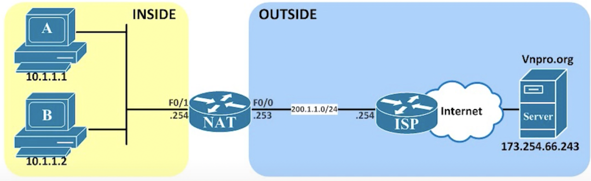


### 3. Cách thức hoạt động của NAT

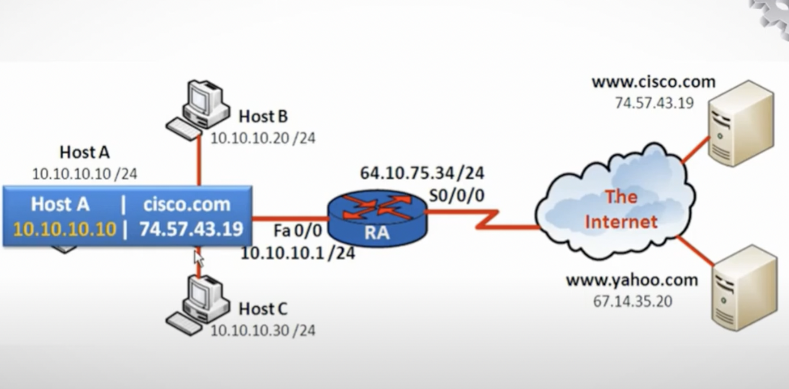

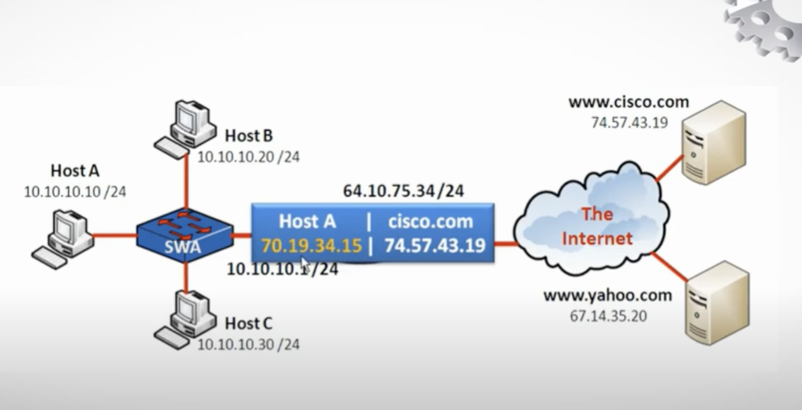

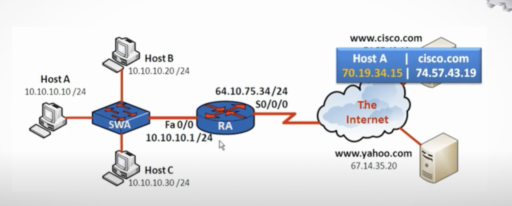

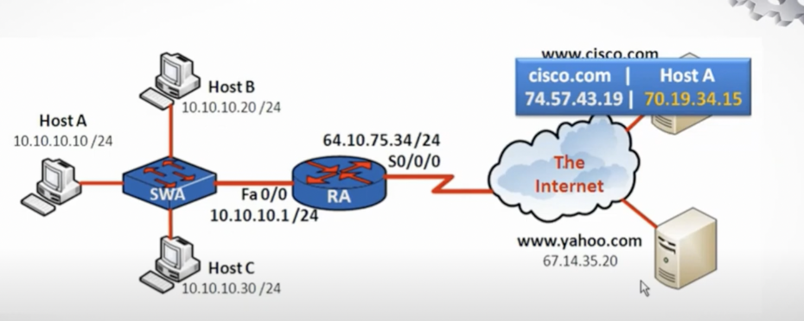

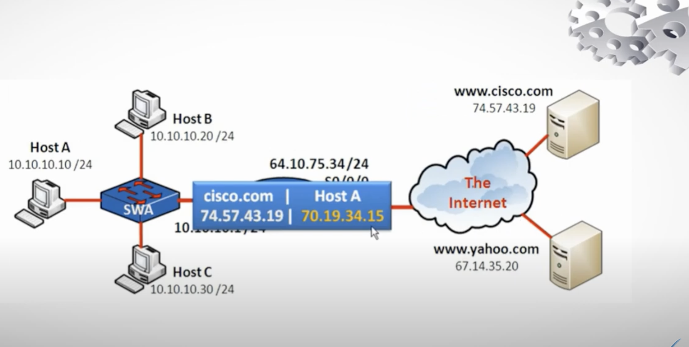 

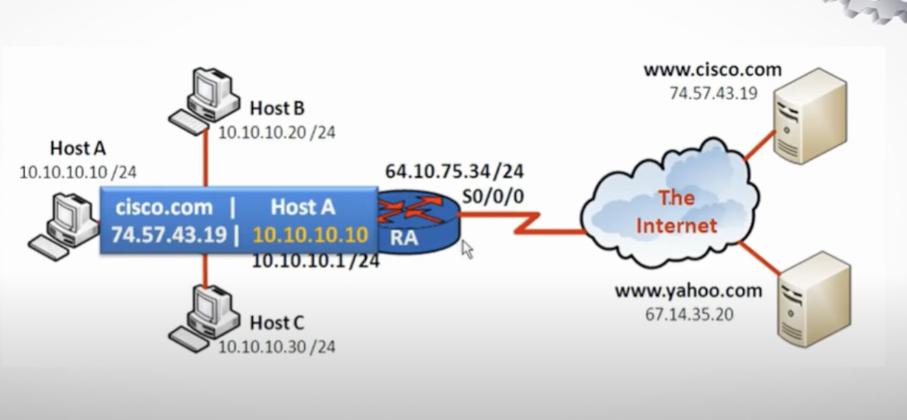 

### 4. Phân loại NAT

#### 4.1 Static NAT
- Cài đặt thủ công để chuyển đổi 1 IP Private thành 1 IP Public

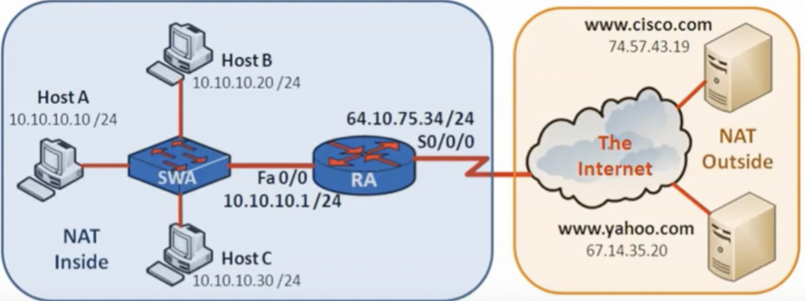

Cấu hình:

```sh
# Vào mode configure và gõ
$ ip nat inside source static 10.10.10.10 64.10.75.99
$ interface Fa0/0 # để cấu hình trên cổng f0/0
# Mode: (config-if) ở cổng f0/0
$ ip nat inside
$ interface S/0/0/0
# Mode: (config-if) ở cổng S0/0/0
$ ip nat outside
```

#### 4.2 Dynamic NAT
- Cài đặt để chuyển đổi 1 Miền IP Private này sang 1 miền IP public khác bằng phương pháp tự động

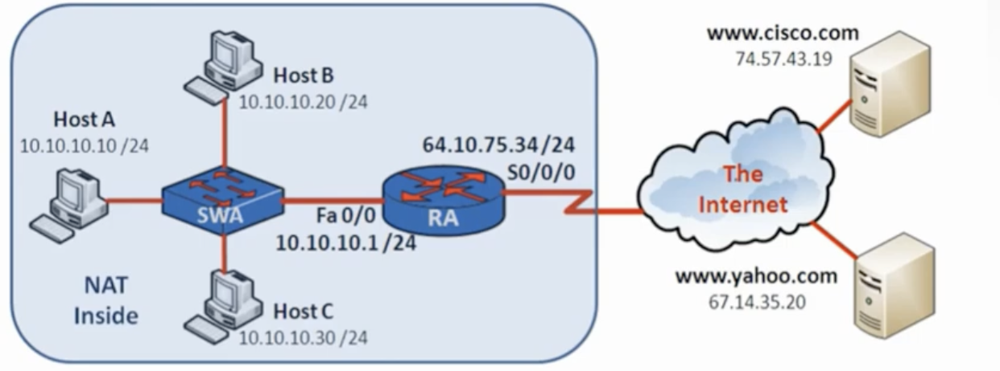

Cấu hình:
```sh
$ ip nat pool test 64.10.75.80 64.10.75.99 netmask 255.255.255.0
$ access-list 10 permit 10.10.10.0 0.0.0.255
$ ip nat inside source list 10 pool test
$ interface Fa 0/0
# Mode: (config-if) ở cổng f0/0
$ ip nat inside
$ interface S0/0/0
# Mode: (config-if) ở cổng S0/0/0
$ ip nat outside 
```


#### 4.3 NAT Overload (PAT: Port Address Translation)
- Đây là một dạng biến thể khác của Dynamic NAT. Nó cũng thực hiện chuyển đổi địa chỉ IP một cách tự động. Tuy nhiên, kiểu chuyển dịch địa chỉ của NAT Overload là dạng many – to – one: ánh xạ nhiều địa chỉ IP thành 1 địa chỉ IP và dùng các port khác nhau để phân biệt cho từng chuyển đổi
- Ví dụ:
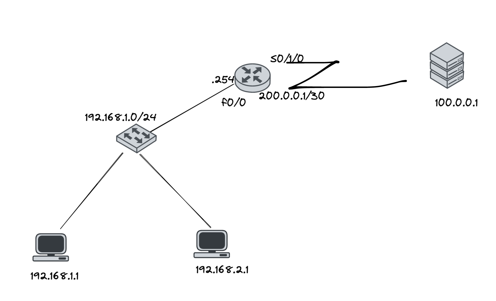
    - Có 2 mạng 192.168.1.1 và 192.168.1.2 muốn truy cập đến serveer 100.0.0.1 qua web
    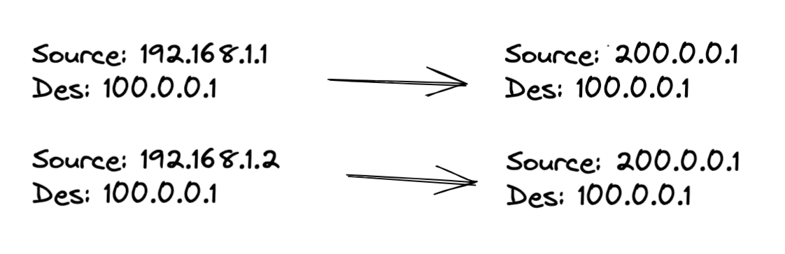
    - Ở NAT này ta sử dụng thêm thông số nữa là Port
    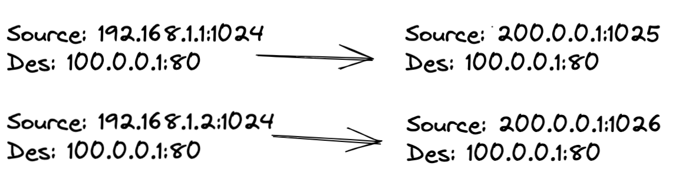
    - Sau khi server nhận được nó sẽ trả gói tin về
    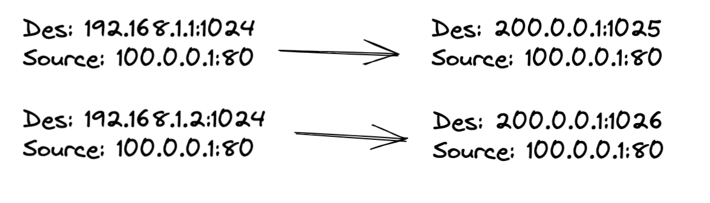
- Mỗi port cho 1 connection, chứ không phải cho 1 máy


Cấu hình:


```sh
# Vào mode configure
$ acess-list 1 permit 192.168.1.0 0.0.0.255 
$ ip nat inside source list 1 interface S0/0/0
# hoặc $ ip nat inside source list 1 pool test overload
# Trên cổng f0/0 gõ:
$ ip nat inside
# Trên cổng s0/1/0 gõ:
$ ip nat outside
```

#### Các câu lệnh để kiểm tra NAT
```sh
# ở trên router:
    $ show ip nat translation
    $ clear ip nat translation* # xoá toàn bộ bảng NAT
    $ debug ip nat
```


### Tài liệu tham khảo
1.  [matbao.net](https://wiki.matbao.net/nat-la-gi-huong-dan-cach-ket-noi-mang-nat-de-dang/)
2. [totolink.vn](https://www.totolink.vn/article/90-3-loai-nat-network-address-translation-ban-can-biet.html)
3. [hostingviet.vn](https://hostingviet.vn/nat-la-gi-nhung-uu-nhuoc-diem-cua-nat-va-cach-ket-noi)
4. [tino.org](https://wiki.tino.org/nat-la-gi/)
5. [Youtube VNPRO1](https://www.youtube.com/watch?v=eSmIov2DCvs&list=PLnaGQB5hLTI6nQP8MqlTCCJE3wc4g1Q0B&index=45)
6. [Youtube VNPRO2](https://www.youtube.com/watch?v=WWrS-DLTQ8c&list=PLBOZzuSFDzSL_5CvfuNo7EhFQR1z6hhpo&index=79)