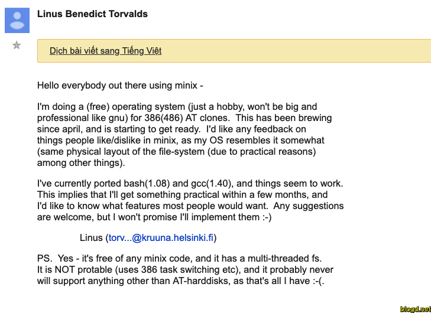

# Linux History

> Linux là một hệ điều hành mã nguồn mở và miễn phí. Bất cứ ai cũng có thể sao chép, tuyên truyền, phân tán, viết lại và phát triển hệ điều hành này. Vì vầy hệ điều hành Linux ngày nay càng ngày càng phát triển

---

# 1. Người sáng lập ra hệ điều hành Linux

- Linus Benedict Torvalds, ông sinh ngày 28 tháng 12 năm 1969 là một nhà khoa học máy tính người Mỹ gốc Phần Lan, người đã chế tạo và phát triển chính của nhân Linux và sau này đã trở thành nhân cho nhiều bảng phân phối và các hệ điều hành Android và Chrome OS.

- Ông cũng đồng thời tạo ra hệ thống điều khiển phân phối phiên bản Git.

- Ông đã được vinh danh nhận giải thưởng Công nghệ Thiên niên kỷ được trao bởi Technology Academy Finland “công nhận về sự sáng tạo của ông ấy cho một hệ điều hành mã nguồn mở mới dẫn đến việc những máy tính hàng đầu để sử dụng nhân Linux một cách rộng rãi”.

- Ông cũng nhận giải thưởng Tiên Phong về Máy tính 2014 và giải thưởng Điện tử Tiêu dùng Masaru Ibuka 2018.

# 2. Lịch sử hệ điều hành Linux

- Tháng 4/1991, năm 21 tuổi Linus Torvalds là sinh viên của trường Đại học Helsinki ở Phần Lan bắt tay vào viết những dòng lệnh đầu tiên của Linux.

- Tháng 8/1991, Torvalds gửi đi thông điệp và nổi tiếng sau này về sự ra đời của Linux.

- Tháng 9/1991, phiên bản Linux 0.01, phiên bản Linux đầu tiên được Torvalds công bố. Tháng 10/1991 phiên bản Linux 0.02 ra đời.

- Năm 1992, Torvals đã quyết định phát hành Linux dưới dạng mã nguồn mở của giấy phép GPL ( giấy phép phần mềm miễn phí ), cho phép tất cả mọi người có quyền download về để xem mã nguồn để cùng phát triển. Quyết định đã giúp hệ điều hành Linux phổ biến như ngày nay.

- Năm 1993, Slackware là hệ điều hành đầu tiên phát triển dựa trên mã nguồn Linux ra đời. Slackware là một trong những hệ điều hành Linux đầu tiên và có tuổi đời lâu nhất hiện nay. Phiên bản mới nhất của Slackware được công bố vào tháng 5/2010.

- Ngày 14/3/1994, sau 3 năm miệt mài, Torvalds cho ra mắt phiên bản hoàn thiện đầu tiên, Linux 1.0 với 176.250 dòng lệnh. Sau 1 năm, phiên bản 1.2 ra mắt với 310.950 dòng lệnh.

- Ngày 3/11/1994, Red Hat Linux phiên bản 1.0 được giới thiệu. Đây là một trong những hệ điều hành được thương mại hóa đầu tiên dựa trên Linux.

- Năm 1996, Linus Torvalds ghé thăm công viên hải dương học. Ông đã quyết định sử dụng hình ảnh chú chim cánh cụt để làm biểu tượng chính thức của Linux.

  - 

- Năm 1998, Linux bắt đầu được các tập đoàn công nghệ quan tâm và đầu tư để phát triển. Nổi bật là IBM đã đầu tư hàng tỉ USD để phát triển các dịch vụ và phần mềm trên nền tảng Linux. Ngoài IBM, còn có Compaq và Oracle cũng bắt đầu đầu tư và phát triển hê điều hành Linux.

- Năm 2005, Linus Torvalds được xuất hiện trên trang bìa của tạp chí về kinh tế BusinessWeek, với câu chuyện về sự thành công của hệ điều hành Linux.

- Năm 2007, các hãng sản xuất máy tính như HP, ASUS, Dell, Lenovo,… bắt đầu bán ra các sản phẩm laptop được cài đặt sẵn Linux.

- Tính đến hiện tại, Linux đã có rất nhiều phiên bản khác nhau, được xây dựng và phát triển riêng biệt bởi các công ty phần mềm và các cá nhân. Nổi bật trong số đó chính là hệ điều hành di động Android của Google, hiện là một trong những hệ điều hành thông dụng nhất hiện nay.

- Hiện nay, Linux được sử dụng rộng rãi trên toàn thế giới, trên các máy tính cá nhân, các máy chủ, đến các thiết bị di động, máy nghe nhạc, máy tính bảng, các máy ATM và thậm chí trên cả các siêu máy tính.
