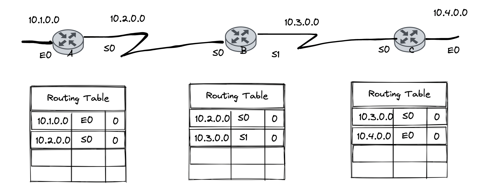
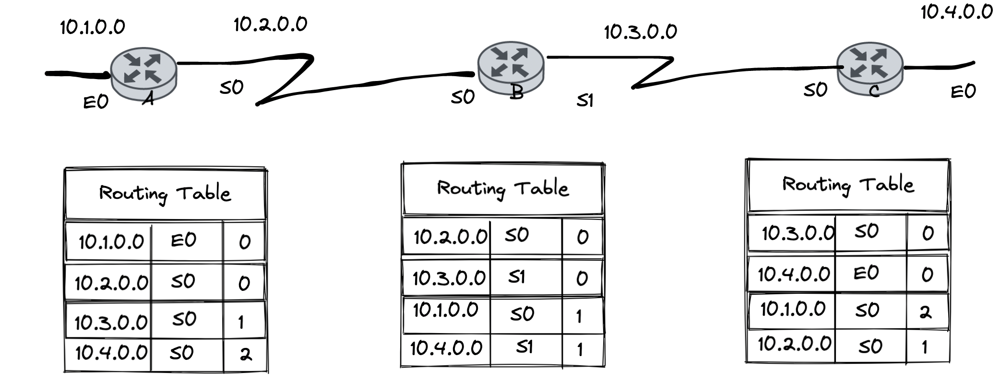
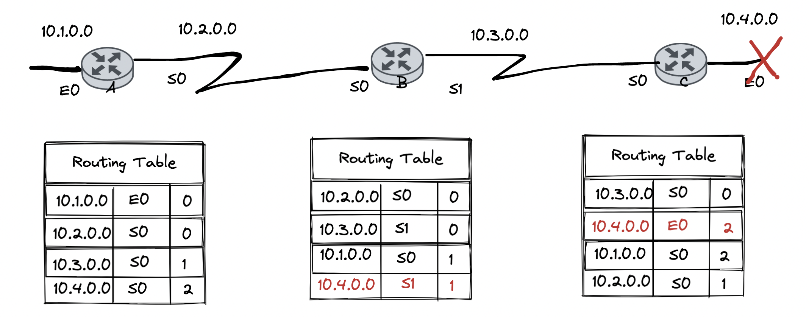
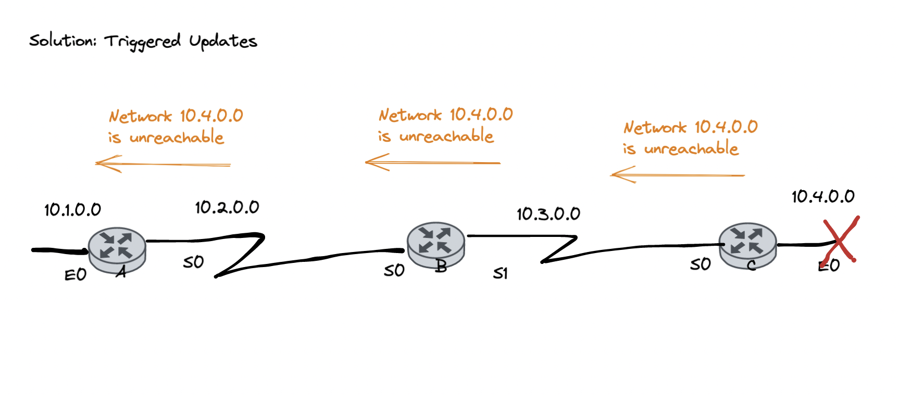
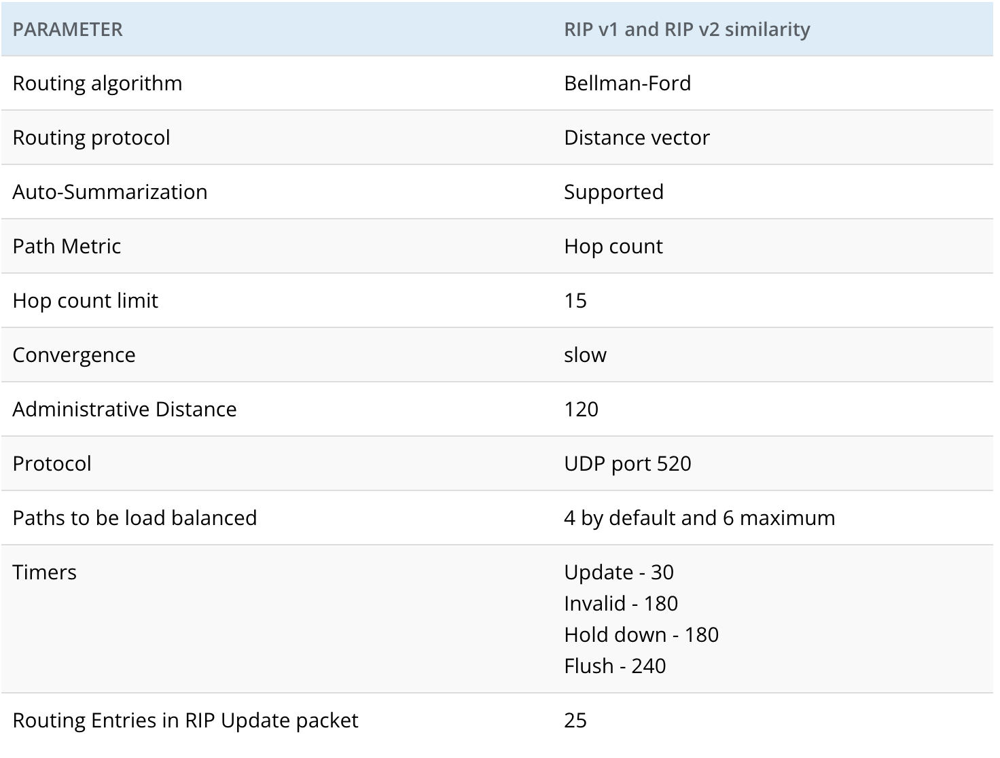

# Title

## Overview

1. Dynamic Routing

   1.1 Định tuyến RIP 2(Routing Information Protocol 2)

2. DHCP (Dynamic Host Configuration Protocol)

3. ARP (Address Resolution Protocol)

4. ICMP (Internetwork Control Message Protocol)

### 1. Dynamic Routing

#### 1.1 Rounting Information Protocol 2

- Autonomous system: là một tập hợp các mạng nằm dưới sự quản lý chung của administrative domain nào đó.

##### 1.1.1 Các giao thức định tuyến

- Các giao thức định tuyến bên trong (Interior Gateway protocol): RIP, IGRP, EIGRP, OSPF
- Các giao thức định tuyến bên ngoài (Exterior Gateway Protocol)

##### 1.1.2 Giao thức định tuyến bên trong

- Các giao thức định tuyến bên trong được chia làm 3 loại:

  - Distance Vector (RIP)
  - Hybrid Routing (EIGRP)
  - Link-State (OSPF)

- #### 1.1.3 Administrative System (AD)

- Ở đây, router A sẽ căn cứ vào chỉ số AD để chọn đường đi đến router D

#### 1.1.4 Distance Vector

- Router láng giềng: là router mà kết nối trực tiếp với router đang xét

- Giao thức RIP: Gửi toàn bộ bảng định tuyến cho láng giềng theo định kỳ

Ví dụ:

- Router A:

  - Mạng 10.1.0.0 Kết nối trực tiếp với router A thông qua cổng E0
  - Mạng 10.2.0.0 kết nối trực tiếp với router A thông qua cổng S0

- Router B:

  - Mạng 10.2.0.0 Kết nối với trực tiếp với router B thông qua cổng S0.
  - Mạng 10.3.0.0 kết nối trực tiếp với router B thông qua cổng S1

- Router C:

  - Mạng 10.3.0.0 kết nối trực tiếp với router C thông qua cổng S0
  - Mạng 10.4.0.0 kết nối trực tiếp với router C thông qua cổng E0

- Ở đây, cột thứ 3 là đơn vị đo lường (metrics) trong giao thức định tuyến dùng để định lượng mức độ tốt xấu của đường đi trong định tuyến
- Cách tính các metrics tuỳ thuộc vào các giao thức khác nhau

- Với ví dụ trên dùng distance vector rip, thì metrics được tính dựa trên hop count (số các lớp 3 trên đường đi)

> Khi chạy định tuyến:

- các router sẽ trao đổi bảng định tuyến với nhau, và cuối cũng sẽ được kết quả như sau

> Khi có 1 mạng bị **down**

- Khi đó router B gửi toàn bộ bảng định tuyến cho router C theo định kỳ, vì ở router C, mạng 10.4.0.0 bị mất rồi, nên khi thấy router B gửi bảng định tuyến qua, nó lấy mạng 10.4.0.0 rồi cập nhật metric lên 2:

- Khi đó, router C lại gửi lại bảng định tuyến cho B, thì lúc này mạng 10.4.0.0 của router B cập nhật `số metric` lên `2` và lại gửi cho router A, và router A cập nhật ` số metric` lên `3` và cứ thế tăng lên dần.

- Trong trường hợp này, khi có gói tin gửi đến mạng 10.4.0.0, giả sử gửi đến mạng 10.4.0.1, thì gói tin đó đi đến router B, router B tra bảng định tuyến và gửi gói tin này cho router C, cứ thế router B và C trao đổi qua lại gói tin và xảy ra hiện tượng `LOOP`.

> Lúc này một khái niệm mới `infinity-metric` ra đời để giải quyết vấn đề này, sau khi tất cả các metric của các router chạy lên `16`

### Trong giao thức RIP, một mạng có thể đi đến được thì mạng đó cách chúng ta 15 con router.

- Cách giải quyết `infinity-metric`:

  - Split Horizon : Giả sử router nhận được định tuyến từ 1 cổng nào, thì nó không được gửi thông tin định tuyến gửi về mạng đó nữa.

    - Khi đó trong ví dụ trên, khi router B gửi bảng định tuyến cho router C, nó sẽ không gửi mạng 10.4.0.0 cho router C nữa.

  - Split Poisoning: Khi 1 mạng nào bị down, nó sẽ trigger cái rout poisoning và gửi cho các router láng giềng, các router nhận được đó sẽ gửi lại poison reverse đẻ xác nhận đã nhận được báo cáo lỗi.

  

  - Hold Down Timers: Chờ các router khác tính toán xong rồi mới thực hiện hội tụ hệ thống

  

  - Triggered Updates

  

<!--

  10
  00001010 1|0000000 00000000 00000000/9

  10.0.0.0/8

00001010 | 0 || 0000000 00000000 00000000

11111111.|10000000 00000000 00000000 /8

10.128.0.0/8

255.128.0.0

255.0.0.0
11111111 00000000 00000000 00000001

172.16.66.3

128 64 32 16 8 4 2 1

00000000

10101100. 10000.  1000010.  00000011

256.10.3.16 (x) -->

#### So sánh RIPv1 và RIPv2

- Classfull (gửi kèm subnet mask trong bảng định tuyến của nó) còn Classless thì không.

Tài liệu tham khảo:

[So sánh RIPv1 và RIPv2](https://ipwithease.com/rip-v1-vs-rip-v2/)

[Bài giảng CCNA](https://www.youtube.com/watch?v=Y9GZrBGRYyc&list=PLBOZzuSFDzSL_5CvfuNo7EhFQR1z6hhpo&index=45)
