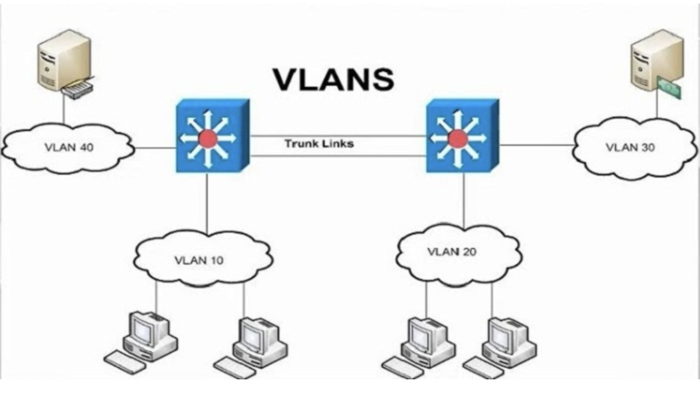
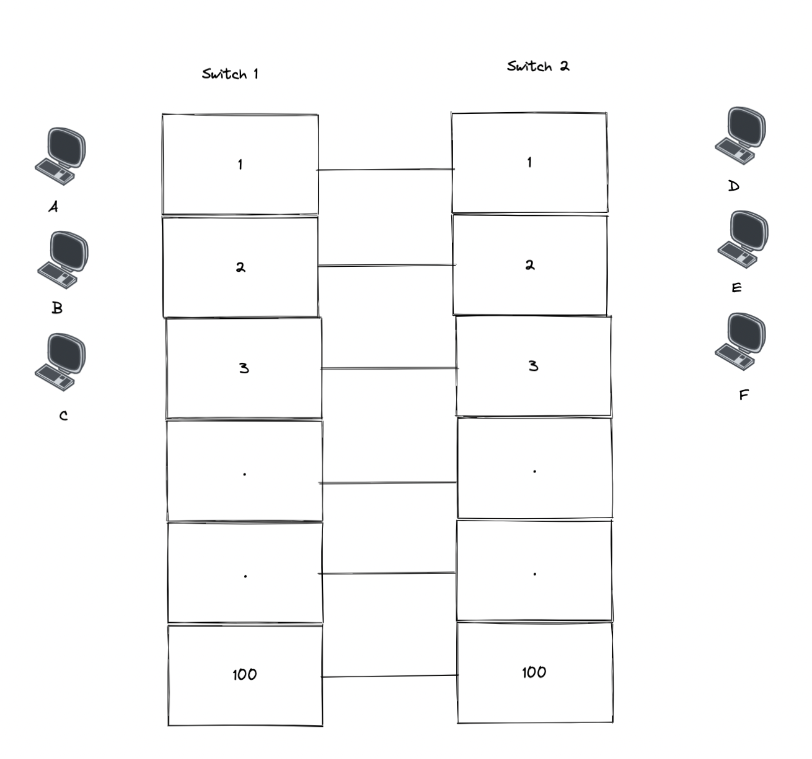
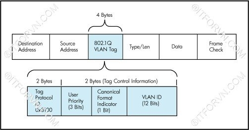

## Overview
1. VLAN
2. Trunking

### 1. VLAN (Virtual Local Area Network)

#### 1.1 Mục đích ra đời của VLAN

- VLAN là một broadcast domain được tạo bởi các switch.
- Thông thường thì router sẽ đóng vai trò tạo broadcast domain. Đối với VLAN, switch có thể tạo ra broadcast domain.

#### 1.2 Các đặc điểm của VLAN
- Tất cả các mạng VLAN đơn đều thuộc 1 miền broadcast duy nhất.
- Các máy cùng VLAN có thể giao tiếp với nhau. 
- Chúng ta có thể cấu hình để có thể giao tiếp các máy ở khác VLAN với nhau.
- Dãy giá trị các VLAN ID chạy từ 0 -> 4095:

    – 1 – 1001 : dải VLAN thường được sử dụng.

    – 1002 – 1005 : dải này dùng để giao tiếp với các kiểu mạng LAN khác.

    – 1006 – 4094: dải VLAN mở rộng, sử dụng khi switch hoạt động ở mode Transparent.

    – 0 và 4095: VLAN dành riêng.

    – VLAN 1, 1002 – 1005: mặc định trên Switch và không thể xóa được.

    - Mặc định VLAN sau khi được tạo sẻ được lưu vào file vlan.dat trong bộ nhớ Flash.
#### 1.3 Các loại VLAN

- **Port - based VLAN**: Mỗi cổng switch được gắn cho 1 VLAN xác định (mặc định là VLAN 1), do đó bất cứ thiết bị host nào gắn vào cổng đó đều thuộc VLAN đó.
- **MAC Address - based VLAN**: Mỗi địa chỉ MAC được đánh dấu với 1 VLAN xác định
- **Protocol - based VLAN**: Sử dụng địa chỉ IP để thay thế địa chỉ MAC.

> Trong 3 loại trên thì loại **Port -based VLAN** phổ biến nhất và được sử dụng nhiều nhất.

#### 1.4 Vì sao cần VLAN?

- Khi có quá nhiều lượng truy cập
- VLAN mặc định kích hoạt là dùng chung 1 VLAN (VLAN 1). Vì thế khí cắm vào bất cứ cổng nào trên switch thì các máy đều có thể giao tiếp được với nhau.

#### 1.5 Lợi ích của VLAN

- Tiết kiệm băng thông của mạng: Do VLAN có thể chia nhỏ LAN thành các đoạn khác nhau. Khi gửi gói tin nó sẽ gửi trên 1 VLAN duy nhất, không truyền cho các VLAN khác.

- Tăng khả năng bảo mật: Các VLAN khác nhau không truy cập được vào nhau (trừ khi khai báo định tuyến).

- Dễ dàng thêm hay bớt các máy tính vào VLAN

- Có tính linh động cao: 
    - Trong cấu hình tĩnh, người quản trị phải cấu hình cho từng switch. 
    - Trong cấu hình động, mỗi cổng của switch có thể tự cấu hình VLAN dựa vào địa chỉ MAC của thiết bị được kết nối vào.

### 2. Trunking

#### 2.1 Mục đích ra đời
- Khi dùng VLAN, các mạng khác VLAN muốn kết nối với nhau thì dùng 1 đường dây để kết nối, tuy nhiên giả sử có 100 máy, cứ 2 máy cần kết nối 1 đường dây thì sẽ phải tốn 50 đoạn dây.

- Khi đó Trunking ra đời để giải quyết vấn đề trên bằng cách dùng 1 đoạn dấy để có thể kết nối.

#### 2.2 Các chuẩn trunking trong một hệ thống mạng
- Chèn thông tin vào Ethernet frame. Khi nó đi trên đường trunk, để biết frame này đến từ VLAN nào để đẩy nó đến VLAN đúng.

##### 2.2.1: Chuẩn IEEE và kỹ thuật trunking DOT1Q.
- Chèn thêm 4 byte VLAN Tag vào sau trường Source Address của Ethernet Frame trên đường đi.

- Các trường trong 802.1Q VLAN Tag bao gồm:
    - Tag Protocol ID (16 bit) nôi dung trường này luôn được set 0x8100 dùng để định danh ra frame này đã được tag 802.1q để phân biệt với frame untagged trên đường trunk.
    - User Priority (3 bit) sử dụng cho kỹ thuật QoS.
    - Canonical Format Indicator (1bit) cho biết địa chỉ MAC đang được sử dụng ở định dạng Token Ring hay Ethernet Frame.
    - VLAN ID(12bit): cho biết Frame đang chạy trên đường trunk là của VLAN nào.

Tài liệu tham khảo:

- [VLAN1](https://quantrimang.com/vlan-la-gi-lam-the-nao-de-cau-hinh-mot-vlan-tren-switch-cisco-64830)
- [VLAN2](https://www.dienmayxanh.com/kinh-nghiem-hay/vlan-la-gi-co-can-thiet-su-dung-khong-lam-the-nao-1137273)
- [VLAN3](https://fptshop.com.vn/tin-tuc/tin-moi/cach-don-gian-phan-biet-cac-loai-vlan-122720#:~:text=VLAN%20s%E1%BA%BD%20%C4%91%C6%B0%E1%BB%A3c%20chia%20ra,cho%20m%E1%BB%99t%20VLAN%20nh%E1%BA%A5t%20%C4%91%E1%BB%8Bnh.)

- [Trunking 1](https://www.totolink.vn/article/97-vtp-la-gi-vlan-trunking-protocol-la-gi.html#:~:text=K%E1%BA%BFt%20n%E1%BB%91i%20%E2%80%9Ctrunk%E2%80%9D%20l%C3%A0%20li%C3%AAn,VLAN%20tr%C3%AAn%20h%E1%BB%87%20th%E1%BB%91ng%20m%E1%BA%A1ng.)

- [Trunking 2](https://itforvn.com/bai-6-vlan-trunking-vtp/)