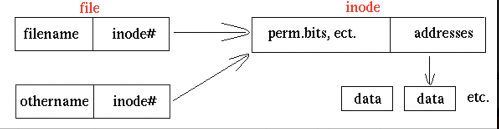
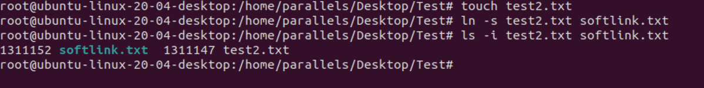
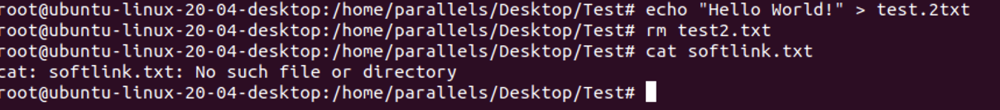
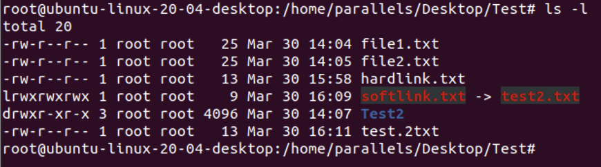
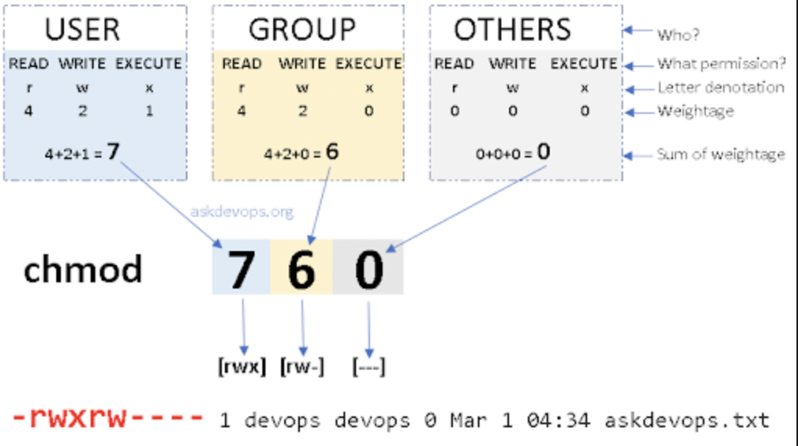

# Linux Managing Files

## Overview

1. Các lệnh quản lý file: cat, head, tail, mv, cp, mkdir.mkdirr..

2. Các lệnh nén và giải nén file: zip, gzip, bzip, tar.

3. Hiểu và biết cách sử dụng các liên kết tắt (shortlink): ln.

4. Quản lý quyền sở hữu và quyền truy cập file: chmod,chown.

5. Sửa file với vi, vim, nano.

---

## 1. Các lệnh quản lý file

### 1.1 cat command

`cat` là đọc tất cả nội dung của file và in ra màn hình. **Tuy nhiên** chúng ta cần kéo thanh cuộn để xem nội dung của file nếu file dài.

```sh
cat + [options] + file_name
```

| Options      | Description                                                                            |
| ------------ | -------------------------------------------------------------------------------------- |
| -n, --number | Hiển thị Line numbers của file.                                                        |
| -e           | Hiển thị kí tự '$' ở cuối mỗi dòng và ở giữa 2 đoạn văn nếu đoạn văn không có kí tự gì |

- Đọc nhiều file cùng 1 lúc:

```sh
cat + [options] + file_name1 + file_name2 + file_name.....
```

### 1.2 less command

`less` cũng dùng để đọc file, tuy nhiên có nhiều tuỷ chỉnh hơn ở trên file, như là dùng phím mũi tên để đọc từ đầu đến cuối. Pagedown, Pageup, để di chuyển về cuối file hoặc đầu trang. 'g' để quay về đầu file, và 'Shift g' để cuộn tới cuối file.

```sh
less + [options] + file_name
```

| Options               | Description                      |
| --------------------- | -------------------------------- |
| -f                    | Mở ra các file non-regular       |
| -n, --lines, + number | Giới hạn số dòng in ra           |
| -v, --verbose         | In ra tên file ở standard output |

Ngoài ra chúng ta cũng có thể tìm từ ở trong file bằng cách dùng `/ + từ muốn tìm`, ấn **n** để đi tới các kết quả tiếp theo và **shift n** để quay về kết quả trước đó.

Và cuối cùng là nhấn **q** để thoát khỏi file.

### 1.3 head command

`head` cũng là lệnh đọc file, tuy nhiên sẽ đọc từ đầu file, và sẽ in ra 10 dòng đầu tiên của file.

```sh
head + [options] + file_name
```

| Options               | Description                         |
| --------------------- | ----------------------------------- |
| -c, --byte, + number  | Hiển thị số kỹ tự tối đa đã đặt ra. |
| -n, --lines, + number | Giới hạn số dòng in ra              |
| -v, --verbose         | In ra tên file ở standard output    |

### 1.4 tail command

`tail` là một dạng đọc file từ cuối lên đầu, nó thường được sử dụng để check log (vì log thường được viết vào cuối file)

```sh
tail + [options] + file_name
```

### 1.5 cp command

`cp` là copy 1 file (có thể copy được cả thư mục nếu dùng thêm options -R)

```sh
cp + source + destination
```

| Options       | Description                                           |
| ------------- | ----------------------------------------------------- |
| -R            | Recusive copy (bao gồm cả file hidden).               |
| -f,           | force copy, có thể remove cả file destination nếu cần |
| -l,           | link file thay vì copy                                |
| -v, --verbose | hiện ra các công việc khi chạy lệnh                   |

### 1.6 mv command

`mv` dùng để đổi tên, di chuyển file hoặc thư mục từ vị trí này qua vị trí khác.

```sh
mv + [options] + source + destination
```

| Options | Description                                                             |
| ------- | ----------------------------------------------------------------------- |
| -i      | Hỏi trước khi xác nhận overwrite                                        |
| -f,     | Bắt buộc ghi đè mà không hiện thông báo gì (nếu có file)                |
| -n,     | Không được ghi đè nếu file đã tồn tại                                   |
| -b,     | Nếu file đích đã tồn tại thì sẽ tạo ra 1 bản backup trước khi overwrite |

### 1.7 mkdir command

`mkdir` dùng để tạo thư mục trong linux

```sh
mkdir + [options] + namefile
```

| Options | Description                                                                   |
| ------- | ----------------------------------------------------------------------------- |
| -p      | tạo thư mục kèm với thư mục cha(nếu thư mục cha chưa tồn tại, nó sẽ tạo luôn) |
| -m,     | Phân quyền cho thư mục                                                        |
| -v      | Hiển thị quá trình tạo thư mục                                                |

## 2. Các lệnh nén và giải nén file

### 2.1 Zip và unzip

#### 2.1.1 Zip

```sh

zip + [options] + file.zip(tên file zip) + file_directories(file muốn đc zip)

```

| Options | Description                                          |
| ------- | ---------------------------------------------------- |
| -r      | Đệ quy, dùng để nến nhiều file hay thậm chí 1 folder |
| -l,     | Liệt kê các tệp tin đang có trong file zip           |
| -d      | Xoá dữ liệu đã có trong file nén                     |

| -(1,9) | Mức độ nén |

Ví dụ:

- Nén 1 file:

```sh
zip -r test.zip file1 file2 folder1 folder2

```

- Xoá 1 file từ trong file.zip

```sh
zip –d sampleZipFile.zip ExampleFile.txt
```

- Thêm 1 file vào file nén

```sh
zip –u sampleZipFile.zip ExampleFile2.txt
```

- Chuyển 1 file vào trong file nén

```sh
zip –m sampleZipFile.zip ExampleFile2.txt
```

- Nén file nhưng loại trừ 1 số file không muốn nén

```sh
zip -x sampleZipFile.zip ExampleFile.txt
```

- Giải nén sang 1 thư mục khác

```sh
unzip sampleZipFile.zip -d /usr/sampleZip/ExampleDir
```

#### 2.1.2 Unzip

```sh


```

- Giải nén nhiều file .zip 1 lúc

```sh
unzip ‘*.zip’
```

- Bỏ qua hiển thị quá trình unzip

```sh
unzip -q sampleZipFile.zip

```

- Loại trừ file khi giải nén

```sh

unzip sampleZipFile.zip -x excludedFile.txt

hoặc loại trừ 1 loại file nhất định bằng cách

unzip sampleZipFile.zip -x "*.png/*"
```

- Giải nén file zip có mật khẩu

```sh

unzip -P Password sampleZipFile.zip
```

- Liệt kê danh sách file trong file.zip

```sh
unzip -l sampleZipFile.zip
```

### 2.2 Gzip và Gunzip

#### 2.2.1 Gzip

`gzip` chỉ có thể làm việc trên 1 tập tin hoặc 1 dòng dữ liệu
. Do đó nếu muốn sử dụng cho nhiều tập tin thì chúng ta phải dùng Tar để đóng gói nó lại trước.

```sh
gzip + [options] + file_name
```

Ví dụ:

`gzip test.php` thì nó sẽ chuyển đổi file `test.php` thành file `test.php.gz`

#### 2.2.2 Gunzip

`gunzip` hay `gzip -d` đều được dùng để giải nén 1 file.

Ví dụ:

`gzip -d test.php.gz` sẽ chuyển đổi file `test.php.gz` thành file `test.php`

### 2.3 Bzip2 và Bunzip2

#### 2.3.1 Bzip2

Tương tự như `gzip` thì `bzip2` cũng là giải nén file, tuy nhiên sau khi giải nén đuôi của file sẽ thành `.bz2` thay vì .gz như khi dùng gzip

Ví dụ:

- `bzip2 ubunlog.txt` thì file `ubunlog.txt` sẽ được nén thành `ubunlog.txt.bz2`

- Nén tệp mà không muốn xoá đi tệp gốc

  - Chúng ta sẽ sử dụng thêm option -c

```sh
bzip2 -c ubunlog.txt > test.txt.bz2

```

#### 2.3.2 Bunzip2

Chúng ta có 2 cách để có thể giải nén tập tin, có thể dùng `Bunzip2` hoặc `bzip2 -d` đều được

Ví dụ:

```sh
bzip2 -d ubunlog.txt.bz2

bunzip2 ubunlog.txt.bz2
```

### 2.4 Tar

`Tar` được dùng để đóng gói các tập tin thành 1 khối. Ta sẽ thường sử dụng thêm các options để giảm tối đa kích thước của file.

| Options   | Description                                                         |
| --------- | ------------------------------------------------------------------- |
| -c        | Tạo file lưu trữ                                                    |
| -x        | Giải nén file lưu trữ                                               |
| -z        | Nén với gzip - Luôn có khi làm việc với tập tin gzip (.gz)          |
| -j        | Nén với bunzip2 - Luôn có khi làm việc với tập tin LZMA(.lzma)      |
| -f        | Chỉ đến file lưu trữ sẽ tạo - Luôn có khi làm việc với file lưu trữ |
| -v        | Hiển thị các tập tin đang làm việc lên màn hình                     |
| -r        | Thêm tập tin vào file đã lưu trữ                                    |
| -u        | Cập nhật file đã có trong file lưu trữ                              |
| -t        | Liệt kê file đã có trong file lưu trữ                               |
| --delete  | Xoá file đã có trong file lưu trữ                                   |
| --totals  | Hiển thị thông số file trong file tar                               |
| --exclude | Loại bỏ file nào đó trong quá trình nén                             |

Ví dụ

1. Cách tạo file nén .tar

```sh
$  tar -cvf ten_file.tar file1 file2 folder1 folder2
```

2. Đóng gói và nén dữ liệu

- `-z` ở đây cho file gzip (.gz) và `-j` cho những file bunzip2 (.bz2)

```sh
$ tar -czvf ten_file.tar.gz file1 file2 folder1 folder2
hoặc

$ tar -cjvf ten_file.tar.bz2 file1 file2 folder1 folder2
```

3. Nén và bỏ qua những file không mong muốn

```sh
$ tar -cvf ten_file.tar /usr/lib/python3/dist-packages/apt --exclude='*.png'

```

4. Hiển thị tổng dung lượng đã được lưu trữ

```sh
tar -cvf ten_file.tar file1 folder1 --totals

Total bytes written: 10240 (10KiB, 102MiB/s)

```

5. Liệt kê nội dung bên trong file nén

```sh
$ tar -tvf ten_file.tar
```

6. Thêm mới, cập nhật nội dung vào file nén

- Để thêm nội dung mới ta dùng options `-r`, cập nhật nội dung dùng `-u`

```sh
$ tar -rvf ten_file.tar add_file1 add_file2

$ tar -uf ten_file.tar

```

7. Xoá dữ liệu trong file nén

```sh
tar -f ten_file.tar --delete file1 file2
```

8. Giải nén file .tar

```sh
$ tar -xvf ten_file.tar
```

> Đối với file gzip thì ta phải thêm options `-z` và file bzip2 ta thêm options `-j`

```sh
$ tar -xzvf ten_file.tar.gz
$ tar -xjvf ten_file.tar.bz2
```

9. Giải nén vào 1 file khác
   - Ta dùng thêm options `-C`

```sh
$ tar -xvf ten_file.tar -C /directory
```

## 3. Symbolic links và Hard links

### 3.1 Inode

> Trước khi đi tìm hiểu khái niệm soft link và hard link ta cần phải hiểu **inode** ở trong linux là gì.

**inode** là một cấu trúc dữ liệu, nó xác định 1 file hay 1 thư mục
được lưu trữ trong directory entry. Indoes trỏ đến các block tạo nên 1 file. Chúng chứa tất cả các dữ liệu cần thiết để đọc file. Metadata của mọi file được lưu trữ trong inode trong cấu trúc bảng


Trong 1 **inode** sẽ bao gồm các metadata sau:

- Dung lượng file tính bằng bytes.

- Device ID : id của thiết bị lưu file.

- User ID : id chủ sở hữu của file.

- Group ID: id nhóm của chủ sở hữu file.

- File mode : gồm kiểu file và cách thức truy cập file.

- Timestamps: các mốc thời gian khi: bản thân inode bị thay đổi (ctime, inode change time), nội dung file thay đổi (mtime, modification time) và lần truy cập mới nhất (atime, access time).

- Link count : số lượng hard links trỏ đến inode. Các con trỏ chỉ đến các blocks trên ổ cứng dùng lưu nội dung file. Các con trỏ cho biết file nằm ở đâu để đọc nội dung.

Inode xác định file và thuộc tính của nó (các thuộc tính đã liệt kê ở trên). Mỗi Inode được xác định bởi 1 con số duy nhất trong hệ thống tệp tin.

**Lưu ý**

- Inode không chứa tên file, thư mục
- Các con trỏ là thành phần quan trọng nhất: Nó cho biết địa chỉ các block lưu nội dung file và có thể tìm đến block đó để truy cập nội dung file

### 3.2 Hard Links

Hard links là các liên kết cấp thấp (low-level links) mà hệ thống sử dụng để tạo ra các thành phần chính của hệ thống file.
Hard link sẽ tạo ra 1 liên kết trong cùng hệ thống tập tin với 2 inode entry
tương ứng trỏ đến cùng một nội dung vật lý (cùng số inode, trỏ đến cùng vùng dữ liệu)



- Cách tạo hard links

```sh
ln + source + destination
```


2 file hardlink.txt và test.txt có cùng inode. Nếu ta xoá file test.txt thì nội dung của file
hardlink.txt vẫn còn.


> Nội dung của file hardlink.txt vẫn còn vì khi xoá file test.txt
> hệ thống sẽ chỉ xoá số link count trong inode của file đi 1.

> Khi sử dụng lệnh rm để xoá file thì số link count trong inode của file sẽ giảm đi 1 hard link.
> Bao giờ số lượng hard link giảm đến 0 thì không truy cập được nữa

### 3.3 Symbolic Links

- **Symbolic Links** là một file đặc biệt trỏ đến 1 file hay một thư mục khác - đưọc gọi là target.
  Khi được tạo, một _symbolic links_ có thể thay cho 1 target file. Nhiều _symbolic link_ được tạo cho cùng một target file
  cho phép người dùng truy cập target bằng nhiều tên khác nhau.


- **Symbolic Links** không chứa bản sao dữ liệu của file target. Nó tương tự như một short-cut của Microsft Windows.
  Symbolic links không dùng đến inode entry. Nó sẽ tạo ra một inode mới và trỏ đến file target.

- Ngoài ra, nếu target của một symbolic link bị xóa,
  di chuyển hoặc đổi tên, symbolic link không được cập nhật.
  Khi điều này xảy ra, liên kết tượng trưng được gọi là "broken" hoặc "orphaned" và
  sẽ không còn hoạt động như một liên kết.

- Cách tạo symbolic links

```sh
ln -s + source + destination
```



- 2 file test2.txt và softlink.txt có inode khác nhau. Và khi ta xoá file test2.txt thì file softlink.txt sẽ không thể truy cập được nữa.



#### So sánh Hard Links và Symbolic Links

| Hard links                                                                  | Symbolic Links                                                                                    |
| --------------------------------------------------------------------------- | ------------------------------------------------------------------------------------------------- |
| Chỉ liên kết được tới file, không liên kết được tới thư mục                 | Có thể liên kết được tới thư mục                                                                  |
| Không tham chiếu được tới file trên ổ đĩa khác                              | Có thể tham chiếu tới file/thư mục khác ổ đĩa                                                     |
| Liên kết file vẫn còn ngay cả khi file đó bị di chuyển, đổi tên, hay bị xoá | Liên kết sẽ không được tham chiếu nữa nếu làm 1 trong 3 việc ở cột bên kia                        |
| Được liên kết với inode tham chiếu vật lý trên ổ cứng nơi chứa file         | Liên kết, tham chiếu tên file/thư mục trừu tượng mà không phải vật lý. Được cung cấp inode riêng. |
| Có thể làm việc với mọi ứng dụng                                            | Một số ứng dụng không cho symbolic links                                                          |

## 4. Quản lý quyền sở hữu và quyền truy cập file: chmod,chown

### 4.1 Chmod

- Các khái niệm cơ bản:

  - **Ownership**:
    Mỗi file hay thư mục ở trên Linux đều được gán bởi 3 loại chủ sở hữu: _user_, _group_, _other_

    - **User**

      Là người tạo ra file/thư mục đấy.

    - **Group**

      Là một nhóm người có quyền truy cập vào thư mục đấy.

    - **Other**

      Là bất kỳ người dùng nào không thuộc 2 nhóm trên.

  - **Permissions**:

    - Mỗi file trong linux đều có 3 quyền là **đọc**, **ghi**,**thực thi**, được xác định cho 3 chủ sở hữu trên.

      - **Đọc**: Nếu là 1 file thì quyền này sẽ cho bạn mở file đó và đọc. Nếu là một thư mục thì sẽ cho phép đọc các file trong thư mục đó.

      - **Ghi**: Cho phép sửa nội dung file, có thể thêm, sửa, xoá nội dung file.

      - **Thực Thi**: Chạy file hoặc truy cập vào file hoặc thư mục

- Xem quyền:

```sh
ls -l
```



| Ký hiệu | Ý Nghĩa        |
| ------- | -------------- |
| d       | Thư mục        |
| -       | File           |
| r       | Đọc            |
| w       | Ghi            |
| -       | Không có quyền |

- Thay đổi quyền với `chmod`

  - `chmod` là **change mode** dùng để thay đổi quyền của 1 file hoặc 1 thư mục ở Linux

**Phân quyền bằng số**

```sh
chmod <permissions-number> <filename>

```



- Permission -number có 3 chữ số. Số thứ nhất ứng với quyền của user, số thứ 2 là quyền của group, và số thứ 3 là quyền của other.

| Số  | Ký hiệu |              Ý nghĩa |
| --- | :-----: | -------------------: |
| 0   |   ---   |       Không có quyền |
| 1   |   --x   |             Thực thi |
| 2   |   -w-   |                  Ghi |
| 3   |   -wx   |       Thực thi & Ghi |
| 4   |   r--   |                  Đọc |
| 5   |   r-x   |       Đọc & Thực thi |
| 6   |   rw-   |            Đọc & Ghi |
| 7   |   rwx   | Đọc & Ghi & Thực thi |

- Ví dụ: Bạn có file1 có quyền **rwxrw-r--.**. Nó có nghĩa là:

  - **user**: r + w +x = 4 + 2 + 1 = 7

  - **group**: r + w = 4 + 2 = 6

  - **other**: r = 4 = 4

Vậy lúc phân quyền cho file1 thì ta chỉ cần ghi

```sh
chmod 764 file1
```

Ngoài ra cũng còn cách khác để phân quyền:

```sh

chmod u=rwx,g=rw,o=r <filename>

```

| Ký hiệu | Ý Nghĩa |
| ------- | ------- |
| u       | User    |
| g       | Group   |
| o       | Other   |
| a       | Tất cả  |

### 4.2 Chown

Bạn có thể thay đổi quyền sở hữu của 1 file bằng `chown`. Để thay đổi được
bạn cần phải có quyền **sudo**

- Để thay đổi user

```sh
sudo chown <username> <filename>
```

- Để thay đổi group

```sh
sudo chgrp <groupname> <filename>
```

- Để thay đổi cả user và group

```sh

sudo chown <username>:<groupname> <filename>

```
