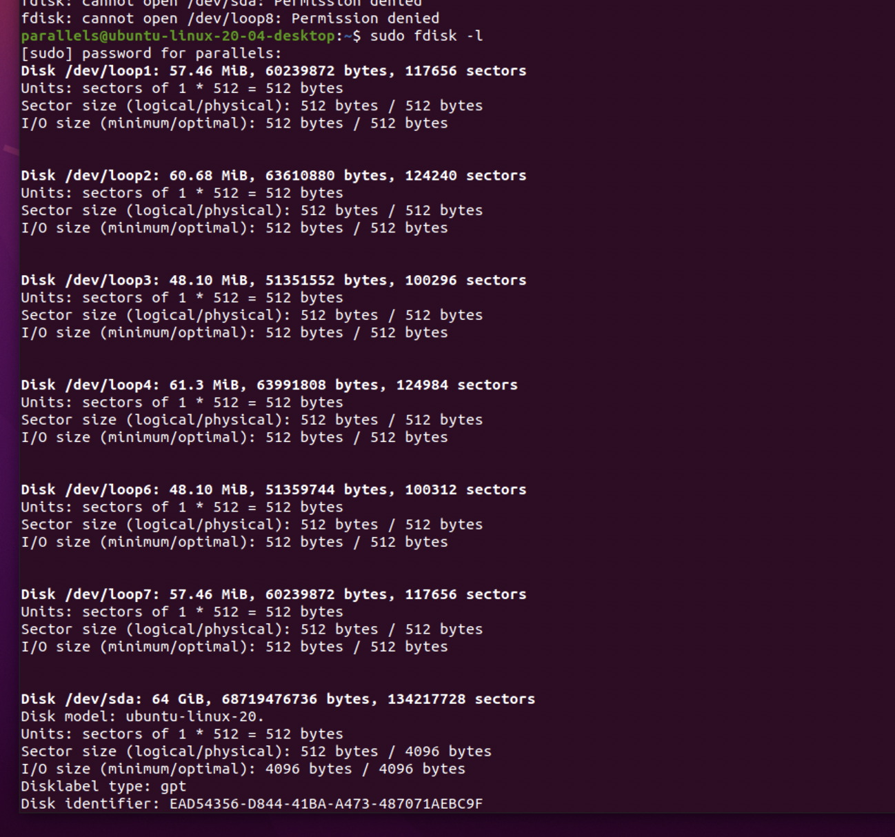
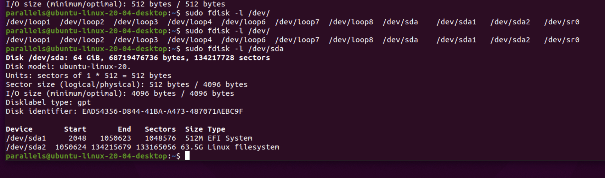
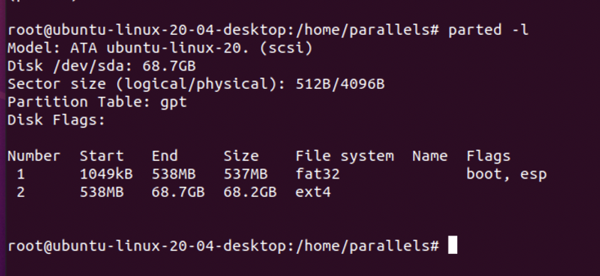
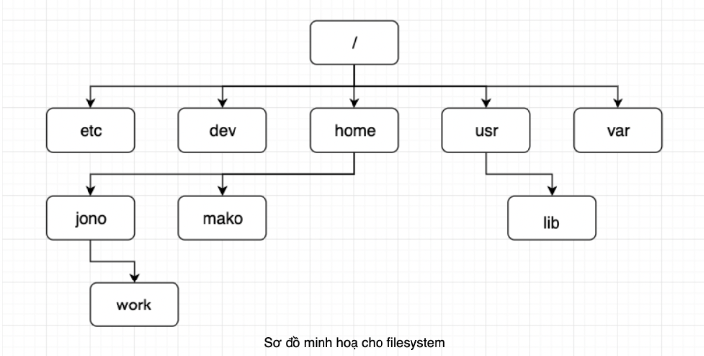
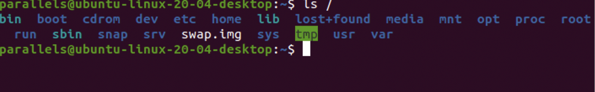
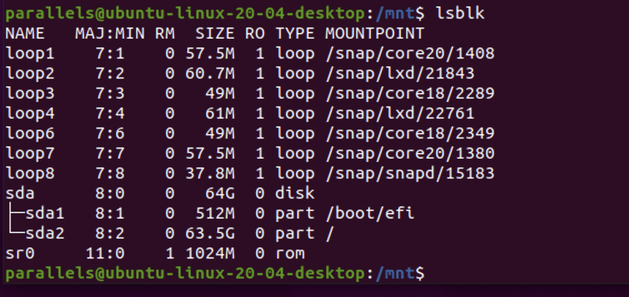

# Linux Configuring Hardware

## Overview

1. Các cách tương tác với thiết bị ngoại vi trong máy chủ: HDD, NIC... trong /dev

2. Tương tác với module trong kernel: sysctl, module

3. Sử dụng các công cụ quản lý ổ cứng: fdisk, gdisk, parted

4. Các định dạng filesystem trên các ổ cứng: ext4, xfs, btrfs

5. Quản lý các phân vùng nhớ qua mạng bằng mount

---

## 1. Các lệnh thao tác với thiết bị ngoại vi trong Linux

- Kiểm tra CPU:

```sh
$ cat /proc/cpuinfo
```

- Kiểm tra RAM:

```sh
$ free -h
```

- Kiểm tra dung lượng ổ cứng:

```sh
$ df -h

$ fdisk -l
```

- Kiểm tra thông tin mạng:

```sh
$ ifconfig -a

$ ip a
```

## 2. Tương tác với module trong kernel: sysctl, module

### 2.1 Sysctl

`sysctl` cho phép cấu hình các kernel parameters trong thời gian chạy. Các tham số có sẵn là các tham số được liệt kê ở _proc/sys_

```sh
$ sysctl [options] [variable[=value]] [...]
```

- Để xem các thông số

```sh
$ sysctl -a
```

- Hiển thị nguyên phần key, không hiển thị value

```sh
$ sysctl -aN
```


- Sửa đổi các kernel parameters

```sh
$ sysctl -w parameter=value
```

Ví dụ: để bật chuyển tiếp gói IPv4 sẽ dùng

```sh
$ sysctl -w net.ipv4.ip_forward=1
```

> Tuy nhiên sau khi hệ thống khởi động lại, giá trị mặc định sẽ lại set lại.

Để có thể đặt vĩnh viễn 1 tham số vào, cần phải chỉnh sửa ở ` /etc/sysctl.conf` hoặc một tệp khác ở trong thư mục `/etc/sysctl.d`

Ví dụ:

```sh
$ sysctl -w net.ipv4.ip_forward=1 >> /etc/sysctl.conf

$  echo 1 > /proc/sys/net/ipv4/ip_forward
```

### 2.2 Module in Linux

```sh
$ lsmod
```


- Load và unload module trong linux

  - Để load 1 module trong linux ta dùng `insmod`. Chúng ta phải chỉ rõ full path của module

  Ví dụ:

  ```sh
  $ insmod /lib/modules/4.4.0-21-generic/kernel/drivers/cpufreq/speedstep-lib.ko

  ```

  > Command này sẽ insert speedstep-lib.ko module.

  - Để unload 1 module trong linux ta dùng `rmmod`

    Ví dụ:

    ```sh
    $ rmmod /lib/modules/4.4.0-21-generic/kernel/drivers/cpufreq/speedstep-lib.ko
    ```

    > Command này sẽ remove sppedstep-lib.ko module

- Cách quản lý các kernel modules trong Linux

  - `modprobe` dùng để insert hay remove 1 module mà không cần chỉ thăng full path của modules đó

  Ví dụ:

  - insert module:

  ```sh
      $ modprobe speedstep-lib
  ```

  - remove module

  ```sh
    $ modprobe -r speedstep-lib
  ```

## 3. Các công cụ quản lý ổ cứng fdisk, gdisk, parted

### 3.1 Các khái niệm cơ bản

#### 3.1.1 File system

Một file system là file lữu trữ dữ liệu trong Linux. Đối với _Windows_ các file nổi tiếng là
**FAT32** và **NTFS**. Còn đối với _Linux_, các file system phổ biến là **ext2, ext3, ext4, xfs, vfat, swap, ZFS, GlusterFS**

#### 3.1.2 Bảng phân vùng (Partition table)

- Phân vùng là 1 vùng của không gian đĩa nhớ.

- Bảng phân vùng là một phân vùng của đĩa, chứa thông tin về kích thước và vị trí các phân vùng trên đĩa cứng. Hai bảng phân vùng phổ biến là **MBR** và **GPT**

#### 3.1.2 Master Boot Record (MBR)

- MBR chứa các hệ thống tệp được sắp xếp trên đĩa
- Nó chứa code thực thì để có thể hoạt động như 1 trình tải
- Hỗ trợ tối đa 4 phân vùng chính
- Nếu muốn nhiều phân vùng hơn thì chỉ có thể tạo phân vùng chính của mình thành 1 phân vùng mở rộng của WAP và tạo các phân vùng hợp lý bên trong nó.
- MBR sử dụng 32 bit để lưu trữ địa chỉ khối
- Đối với các đĩa cứng có các sectors 512 byte, MBR xử lý tối đa 2TB (2^32 × 512 byte).

#### 3.1.3 Bảng phân vùng GUID (GPT)

- GPT có thể có 128 phân vùng
- GPT sử dụng 64 bit cho địa chỉ khối
- Đối với các đĩa cứng có các sectors 512 byte, GPT xử lý tối đa 9,4 ZB (9,4 × 10^21 byte) hoặc 8ZiB

### 3.2 Quản lý phân vùng ổ cứng bằng fdisk

- fdisk có thể xem, tạo, thay đổi kích thước, xoá, sao chép và di chuyển phân vùng khác.
- fdisk cho phép tạo tối đa 4 phân vùng chính. Mỗi vùng tối thiểu 40mb

> Lưu ý: Công cụ fdisk không thể sử dụng đối với bảng phân vùng GUID(GPT) và nó không hoạt động phân vùng lớn hơn 2TB.

- Các command thông dụng

  - Xem tất cả các phân vùng đĩa hiện có

  ```sh
      $ fdisk -l
  ```

  

  - Xem phân vùng trên 1 đĩa cụ thể

  ```sh
    $ fdisk -l /dev/sda
  ```

  

[Cách tạo phân vùng và xoá phân vùng dùng fdisk](https://blogd.net/linux/quan-ly-phan-vung-dia-cung-tren-linux/)

### 3.3 Quản lý phân vùng ổ cứng parted

- `parted` tương tự như **fdisk**, tuy nhiên nó cho phép chúng ta tạo phân vùng khi kích thước đĩa lớn hơn 2TB nhưng `fdisk` không cho phép.

- Nó hỗ trợ nhiều định dạng bảng phân vùng, bao gồm MS-DOS và GPT

- Cài đặt parted

  - Đối với các bản phân phối Ubuntu/Debian:

  ```sh
  $ apt-get install parted
  ```

  - Đối với các bản phân phối RHEL/CentOs

  ```sh
  $ yum install parted
  ```

  - Xem các phân vùng hiện có

  ```sh
    $ parted -l
  ```

  

[Cách tạo phân vùng và xoá phân vùng với Parted](https://blogd.net/linux/quan-ly-phan-vung-dia-cung-tren-linux/)

### 3.4 Quản lý phân vùng ổ cứng gdisk

- Dùng cho disk được cấu hình GUID Partition Table (GPT).

> Không dùng `gdisk` trên disk mà được formatted với `fdisk` hoặc đã lưu trữ _fdisk partition_. Gdisk sẽ phát hiện MBR đang có và sẽ convert thành GPT và máy tính của bạn sẽ không có khả năng để boot sau khi làm việc đó.

```sh
[root@localhost ~] $ gdisk /dev/sda GPT fdisk (gdisk) version 1.0.3
Partition table scan: MBR: MBR only
BSD: not present APM: not present GPT: not present


Found invalid GPT and valid MBR; converting MBR to GPT format in memory. THIS OPERATION IS POTENTIALLY DESTRUCTIVE! Exit by typing 'q' if you do not want to convert your MBR partitions to GPT format!

```

## 4. Các dạng filesystem trên Linux

### 4.1 File system

- File system được dùng để quản lý cách dữ liệu được đọc và lưu trên thiết bị.

- Truy cập nhanh, an toàn.



### 4.2 Các loại file system phổ biến trên Linux

- File cơ bản: EXT2, EXT3, EXT4, XFS, Btrfs, JFS, NTFS,…
- Filesystem dành cho dạng lưu trữ Flash: Thẻ nhớ
- Filesystem dành cho hệ cơ sở dữ liệu
- Filesystem mục đích đặc biệt: procfs, sysfs, tmpfs, squashfs, debugfs,…

| File System | Description                                                                                                         |
| ----------- | ------------------------------------------------------------------------------------------------------------------- |
| XFS         | File mặc định ở RHEL 8                                                                                              |
| Ext4        | File mặc định ở phiên bản trước của RHEL, vẫn khả dụng và được hỗ trợ ở RHEL 8                                      |
| Ext3        | Phiên bản ra mắt trước của Ext4. Ở RHEL 8, chúng ta không cần sử dụng RHEL 8 nữa                                    |
| Ext2        | File cơ bản được phát triển vào những năm 1990. nó cũng không còn được sử dụng trong RHEl 8 nữa                     |
| BtrFS       | Một relatively new file system mà không được support ở RHEL 8                                                       |
| NTFS        | Một Windows-compatible file, không được hỗ trở trên RHEL 8                                                          |
| VFAT        | Một filesystem nó cho phép khả năng tương thích ở Window và Mac và một functional equivalent của FAT32 file system. |

### 4.3 Filesystem Hierarchy Standard (FHS)

- Cấu trúc cây thư mục trong Linux




| Thư mục          | Chức năng                                                                                                          |
| ---------------- | ------------------------------------------------------------------------------------------------------------------ |
| /bin             | command binaries cơ bản 8                                                                                          |
| /boot            | Chứa nhân Linux để khởi động và các file system maps cũng như các file khởi động giai đoạn hai                     |
| /dev             | Các file thiết bị (CDRom, HDD, FDD….)                                                                              |
| /etc             | Chứa các file cấu hình hệ thống                                                                                    |
| /home            | Dành cho users khác root                                                                                           |
| /lib             | Chứa các thư viện dùng chung cho các lệnh nằm trong /bin và /sbin. Và thư mục này cũng chứa các module của kernel. |
| /mnt hoặc /media | Mount point mặc định cho những hệ thống file kết nối bên ngoài.                                                    |
| /opt             | Thư mục chứa các phần mềm cài thêm                                                                                 |
| /sbin            | System binaries                                                                                                    |
| /srv             | Dữ liệu được sử dụng bởi các máy chủ lưu trữ trên hệ thống.                                                        |
|                  |
| /tmp             | Thư mục chứa các file tạm thời                                                                                     |
| /usr             | Thư mục chứa những file cố định hoặc quan trọng để phục vụ tất cả người dùng.                                      |
| /var             | Dữ liệu biến được xử lý bởi daemon. Điều này bao gồm các tệp nhật ký, hàng đợi, bộ đệm, bộ nhớ cache,              |
| /root            | Các tệp cá nhân của người quản trị (root)                                                                          |
| /proc            | Sử dụng cho nhân Linux. Chúng được sử dụng bởi nhân để xuất dữ liệu sang không gian người dùng                     |

- Sơ đồ tree của folder:


## 5. Quản lý các phân vùng nhớ qua mạng bằng `mount`

1. Giới thiệu

   - Khác với Windows, Linux sử dụng một cây thư mục (folder tree) thống nhất, trong đó mỗi phân vùng được gắn kết tại một điểm gắn kết trên cây đó.
   - Khi dùng Linux thì bạn không thể truy cập vào file system, rất có thể là do bạn chưa thực hiện mount. Tức là phải gắn vào một thư mục trống bất kỳ có sẵn trên cây thư mục của Linux thì bạn mới có thể truy cập vào filesystem đó.
   - Thư mục trống mà gắn với thiết bị kể trên được gọi là mount point
   - Sau khi mount thiết bị, bạn có thể truy cập tới dữ liệu trong thiết bị bằng cách truy cập vào mount point. Bạn cần thực hiện thao thác unmount để hủy gắn kết thiết bị với hệ thống khi không còn cần truy cập tới thiết bị nữa

2. Cách mount

```sh
mount -t <type> -o <option> <device file> <mount point>
```

- 2.1 Mount ổ cứng bằng lệnh `mount`

  - Khi bạn gắn thêm ổ cứng vào máy tính/server chạy hệ điều hành Linux, hệ thống sẽ nhận ổ cứng đó với một device file đặt ở thư mục /dev.
  - Để kiểm tra danh sách ổ cứng và phân vùng được nhận trên Linux bạn sử dụng lệnh sau:

  ```sh
    $ lsblk
  ```

  

  - Ví dụ để mount ổ cứng trên vào thư mục /home/tmp có sẵn, mình sẽ sử dụng câu lệnh sau:

  ```sh
  $ mount -t ext4 -o defaults /dev/sdb1 /home/tmp/

  ```

  - `-o defaults` ở đây bao gồm rw, suid, dev, exec, auto, nouser và async.

        - `rw`mount ở read/write mode
        - `suid` enable SUID hay SGID
        - `dev` cho phép sử dụng các ký tự đặc biệt, device and block special device trên file hệ thống
        - `exec` cho phép thực thi trên binary
        - `auto` nếu option -a được chỉ định, ổ cứng sẽ auto mount
        - `nouser` người dùng thông thường (không phải super user) thì không được phép thực thi lệnh mount
        - `aync` đối với file hệ thông thì mọi I/O sẽ được tiến hành không đồng bộ
        - `nosuid` SUID cũng như SGID bị disable
        - `nodev` các ký tự, ký tự đặc biệt, device block, special device…sẽ không sử dụng được
        - `noexec` không được phép trực tiếp execute binary
        - `noauto` nếu option -a được chỉ định, ổ cứng sẽ không auto mount
        - `user` cho phép general user được quyền mount ổ cứng
        - `users` cho phép toàn bộ user đều có thể mount/unmount ổ cứng
        - `remount` mount lại 1 file hệ thống đang được mount

    ro mount với readonly

  - Để kiểm tra `mount` diễn ra thành công hay chưa, gõ `df -h`
  - Bình thường làm theo cách này, sau khi reset lại máy, mount sẽ mất hết
  - Tuy nhiên, ta có thể giữ các mount này bằng cách mở file `/etc/fstab` và thêm dòng sau vào cuối file:
  - Ví dụ:

    - ```sh
      /dev/sdb1 /home/tmp/ ext4 defaults 0 0
      echo "/dev/sdb1 /home/tmp/ ext4  defaults     0   0" >> "/etc/fstab"
      ```

      | Column 1            | Column 2    | Column 3                                         | Column 4                                                | Column 5                                  | Column 6                    |
      | ------------------- | ----------- | ------------------------------------------------ | ------------------------------------------------------- | ----------------------------------------- | --------------------------- |
      | Device or Partition | Mount Point | File system (ext2, ext3, ext4, swap, vfat, ntfs) | Mount option: auto, no-auto, user, no-user, ro, rw .... | DUMP for backup, by default its value = 0 | fsck check error filesystem |
      | /dev/sdb1           | /DATA       | ext3                                             | defaults                                                | 0                                         | 0                           |

  - 2.2 Mount ổ cứng bằng `UUID`
  - Tại sao phải mount ổ cứng bằng UUID?

        - Nếu chỉ gắn thêm vào hệ thống một ổ cứng thì mount theo device file trên kia là được, nhưng nếu từ 2 ổ cứng trở lên, khi khởi động lại máy sẽ gặp trường hợp ổ cứng này được mount vào thư mục kia. Nguyên nhân ở việc hệ thống ngẫu nhiên nhận device file của ổ cứng khi khởi động lại máy.

    Ví dụ:

    - HDD1 có device file là /dev/sdb1
    - HDD2 có device file là /dev/sdc1

    Nhưng sau khi khởi động lại thì HDD2 lại là /dev/sdb1, và ngược lại

    Để khắc phục điều này, mỗi ổ cứng đều đổ một UUID duy nhất, do đố nếu mount ổ cứng theo UUID sẽ khắc phục được vấn đề trên

  Để check UUID, ta dùng:

  ```sh
  $ sudo blkid
  ```

  Example:
  Mở file `/etc/fstab/` và thêm dòng này vào cuối file:

  ```sh

  $ UUID=fb315fe6-xxxx-xxxx-8d30-80f44a874420 /home/tmp/ ext4 defaults 0 0

  $ echo "UUID=fb315fe6-xxxx-xxxx-8d30-80f44a874420      /home/tmp/   ext4    defaults     0   0" >> "/etc/fstab"

  ```

  2.2 Unmount ổ cứng

  ```sh
  $ umount <file_mount>
  ```
