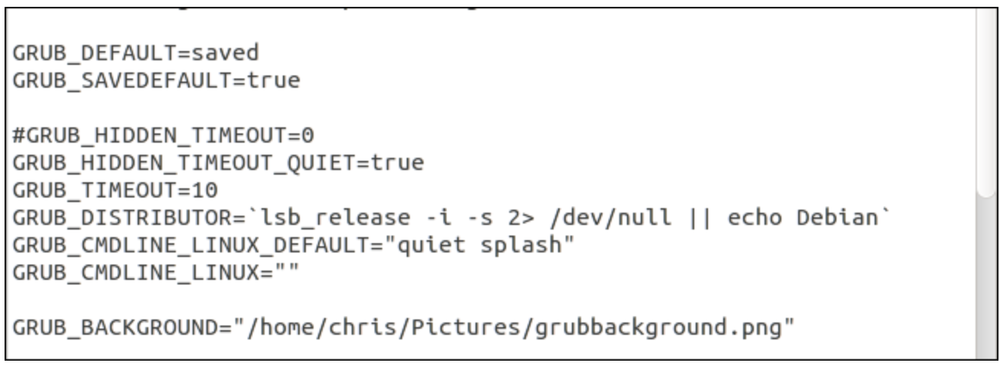
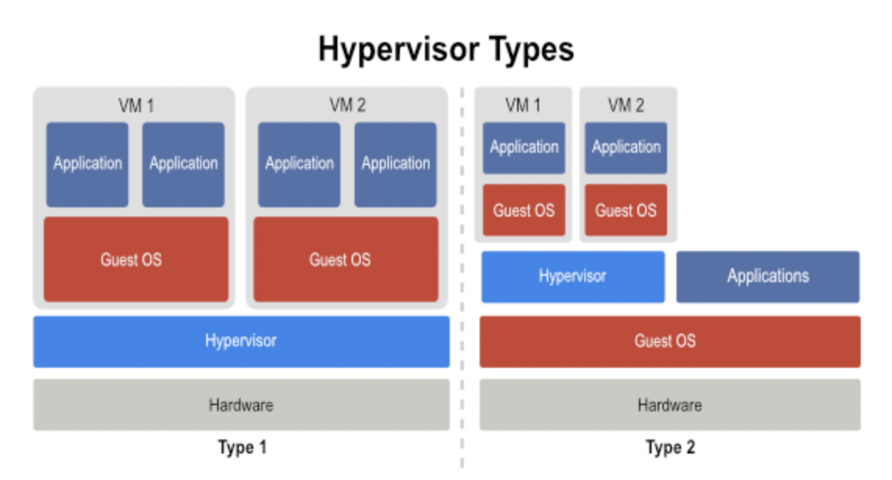

# Linux Booting, Initializing, and Virtualizing

## Overview

1. Cơ chế khởi động của: BIOS, UEFI
2. Thông tin trong các tập tin cấu hình: GRUB2, EFI
3. Các units trong systemd, tập lệnh systemctl
4. Ảo hoá? Mục đích ra đời ảo hoá? Bài toán áp dụng ?

## 1. Cơ chế khởi động của BIOS, UEFI

### 1.1 Cơ chế khởi động của BIOS (Basic Input Output System)

- Bios là hệ thống thông tin đầu vào, đầu ra cơ bản.
- Bios là một nhóm lệnh được lưu trữ trên 1 chip firmware nằm trên bo mạch chủ (mainboard) của máy tính.

Cơ chế hoạt động: Khi máy tính khởi động, BIOS sẽ tiến hành kiểm tra RAM có hoạt động hay không, đi kết nối và chạy driver cho các thiết bị ngoại vi (chuột, keyboard, usb), đọc trật tự ổ cứng để khởi động hệ điều hành, hiển thị tín hiệu lên màn hình.

- Ý nghĩa: Nó sẽ đi 'đánh thức' và kiểm tra từng linh kiện có hoạt động hay không. Sau thời gian đó, nó sẽ trả lại quyền kiểm soát cho hệ điều hành.

### 1.2 Cơ chế khởi động của UEFI (Unifiel Extensibale Firmware Interface)

- UEFI là một phần mềm mở rộng hợp nhất được dùng để kết nối máy tính với hệ điều hành của nó. Được Intel phát triển để cải thiện các hạn chế của LEGACY BIOS.

- Giống như LEGACY, UEFI là chương trình đầu tiên được chạy khi máy tính được bật. Nó sẽ kiểm tra thành phần, thiết bị phần cứng, kích hoạt chúng hoạt động rồi đưa chúng vào hoạt động cùng hệ điều hành.

- Nó cải thiện về phạm vi phân vùng đĩa cứng, và tốc độ.

So sánh LEGACY BIOS và UEFI

| Legacy                                                | UEFI                                                   |
| ----------------------------------------------------- | ------------------------------------------------------ |
| Giao diện người dùng đơn giản, thao tác bằng bàn phím | Giao điện đồ hoạ, thao tác bằng chuột, phím dễ sử dụng |
| Chỉ hỗ trợ ổ cứng định dạng MBR                       | Hỗ trợ cả MBR và GPT                                   |
| Không hỗ trợ ổ cứng lớn hơn 2TB                       | Hỗ trợ ổ cứng tối đa 18EB                              |
| Hỗ trợ tối đa 4 phân vùng chính (Primary)             | Hỗ trợ tối đa 128 phân vùng chính                      |
| Khả năng bảo mật kém hơn                              | Khả năng bảo mật cao hơn                               |

[Tham khảo về BIOS và UEFI](https://sentayho.com.vn/boot-uefi-la-gi.html)

[Một số tài liệu về BIOS và UEFI](https://embergarde.com/boot-mode-legacy-la-gi/)

[Sự khác biệt giữa BIOS và UEFI](https://quantrimang.com/su-khac-biet-giua-uefi-va-bios-169895)

## 2. Thông tin trong các tập tin cấu hình: GRUB2, EFI

### 2.1 Thông tin trong các tập tin cấu hình GRUB2

- GRUB (GRand Unified Bootloader) là một chương trình khởi động máy tihs được phát triển bởi dự án GNU.
- GRUB cho người dùng khởi động một trong hệ điều hành được cài trên máy tính.

  #### Các tính năng của GRUB:

  - Hỗ trợ nhiều hệ điều hành - bằng cách khởi động trực tiếp nhân hệ điều hành hoặc bằng cách nạp chuỗi (chain-loading)
  - Hỗ trợ nhiều hệ thống tệp tin: BSD, FFS, DOS FAT16 và FAT32, Mini fs, Linux ext2fs và ext3fs, JSF, XFS, VSTa fs
  - Cung cấp giao diện command linh hoạt, hỗ trợ tập tin cấu hình

  #### Các phiên bản của GRUB:

  - GRUB phiên bản 1 hay còn được gọi là GRUB legacy, chỉ phổ biến ở các phiên bản cũ của các bản Linux Distribution, trong đó vẫn còn đang được sử dụng và hỗ trợ như CentOS 5

  - GRUB phiên bản 2, được gọi là GRUB2, được viết lại từ đầu và có ý định thay thế phiên bản tiền nhiệm, được sử dụng bởi đa số các bản phân phối Linux ngày nay

  <!-- - GRUB là Grand Unified Bootloade, là một chương trình khởi động máy tính được phát triển bởi dự án GNU. GRUB cho phép người dùng có thể chọn khởi động 1 trong nhiều hệ điều hành được cài trên một máy tính.

Chỉnh sửa tệp cấu hình GRUB

```sh
sudo nano / etc / default / grub
```


- **Chọn hệ điều hành mặc định**: Thay đổi **GRUB_DEFAULT** = hàng. Theo mặc định, **GROUP_DEFAULT = 0** sử dụng mục nhập đầu tiên làm mặc định. Bạn cũng có thể sử dụng **GROUP_DEFAULT = saved** và GRUB sẽ tự khởi động hệ điều hành cuối cùng mà bạn chọn mỗi lần khởi động.

- **Lưu hệ điều hành mặc định** : Nếu bạn chọn **GROUP_DEFAULT = saved**, bạn cũng cần phải thêm **GRUB_SAVEDEFAULT = true**, nếu không nó sẽ không hoạt động

- **Chọn xem GRUB có bị ẩn hay không**: Chỉ với một hệ điều hành được cài đặt, Ubuntu mặc định GRUB sẽ tự động khởi động vào hệ điều hành mặc định với tùy chọn GRUB_HIDDEN_TIMEOUT = 0. Tùy chọn này chỉ định GRUB sẽ bị ẩn và nó sẽ tự động khởi động vào hệ điều hành mặc định sau 0 giây – nói cách khác là ngay lập tức.
  Bạn có thể truy cập vào menu khi máy tính đang khởi động bằng cách giữ **SHIFT**.

- **Kiểm soát thời gian chờ của menu GRUBs**: Nếu GRUB không tự động ẩn, bạn sẽ thấy menu mỗi khi máy tính của bạn khởi động. GRUB sẽ tự động khởi động hệ điều hành mặc định sau một khoảng thời gian, thường là mười giây. Trong thời gian đó, bạn có thể chọn hệ điều hành khác hoặc để nguyên hệ điều hành tự động khởi động. Để thay đổi khoảng thời gian chờ, hãy chỉnh sửa **GRUB_TIMEOUT = 10** và nhập bất kỳ số giây nào bạn thích.
  - Để ngăn GRUB tự động khởi động và luôn đợi bạn chọn một hệ điều hành, hãy thay đổi dòng thành **GRUB_TIMEOUT = -1**
- **Chọn hình nền:** Các **GRUB_BACKGROUND**dòng kiểm soát xem hình nền có được sử dụng hay không – theo mặc định, GRUB sử dụng giao diện đơn sắc trắng trên đen. Bạn có thể thêm một dòng như **GRUB_BACKGROUND = / home / user / Pictures / background.png** để chỉ định một tệp hình ảnh mà GRUB sẽ sử dụng.

 -->

### 2.2 EFI (Extensible Firmware Interface Firmware)

#### 2.2.1 File EFI Là gì?

- File .EFI là những các tệp thực thi của trình tải khởi động, tồn tại trên các hệ thống máy tính dựa trên UEFI (Unified Extensible Firmware Interface) và chứa dữ liệu về cách thức tiến hành quá trình khởi động.

#### 2.2.2 File EFI ở đâu trong Windows?

- Hầu hết thời gian, tệp này được lưu trữ trên một phân vùng hệ thống EFI đặc biệt. Phân vùng này thường bị ẩn và không có ký tự ổ đĩa.

- Ví dụ: trên hệ thống UEFI có cài đặt Windows 10, tệp EFI sẽ nằm ở vị trí sau, trên phân vùng ẩn đó:

`\EFI\boot\bootx64.efi `

hoặc

`\EFI\boot\bootia32.efic`

> Bạn sẽ thấy bootx64 nếu bạn cài phiên bản 64bit, và 32 bit nếu cài phiên bản tươn ứng.

Bộ tải khởi động EFI cho Linux sẽ khác nhau tùy thuộc vào bản phân phối bạn đã cài đặt, nhưng sau đây là một số:

`\EFI\SuSE\elilo.efi `

`\EFI\RedHat\elilo.efi`

` \EFI\ubuntu\elilo.efi`

#### 2.2.3 Nội dung file EFI

Nó chứa dữ liệu cấp hệ thống thực thi giữa hệ điều hành và Firmware. Các tệp EFI được sử dụng để sắp xếp các bản cập nhật Firmware, khởi động hệ điều hành và chạy các chương trình trước khi khởi động.

## 3. Các units trong systemd và tập lệnh systemctl

### 3.1 Các units trong systemd

#### 3.1.1 Khái niệm về systemd

- Systemd hay system daemon, daemon ở đây ám chỉ những process chạy nền (background process). Systemd là nhóm các chương trình đậc biệt, sẽ quản lý, vận hành và theo dõi các tiến trình khác nhau trong hệ thống.

#### 3.1.2 Vai trò của systemd trong hệ thống

- Systemd cung cấp một chương trình đặc biệt là `sbin/init` và nó là chương trình đầu tiên được khởi động trong hệ thống (PID = 1). Khi hoạt động,`sbin/init` sẽ kích hoạt các file cần thiết cho hệ thống, và các chương trình này sẽ tiếp nối để hoàn tất công đoạn khởi tạo.

#### 3.1.3 Các thành phần của systemd

- `systemctl` dùng để quản lý trạng thái của dịch vụ hệ thống (bắt đầu, kết thúc, khởi động lại hoặc kiểm tra trạng thái hiện tại)
- `journald` dùng để quản lý nhật ký hoạt động của hệ thống (hay còn gọi là ghi log)
- `logind` dùng để theo dõi việc đăng nhập, đăng xuất của người dùng
- `networkd` dùng để quản lý kết nối mạng thông qua các cấu hình mạng
- `timedated` dùng để quản lý thời gian hệ thống, hoặc thời gian mạng
- `udev` dùng để quản lý các thiết bị và firmware

#### 3.1.4 Unit files

- Tất cả các chương trình được quản lý bởi **systemd** đều được thực thi dưới nền
  và được cấu hình thành 1 file configuration gọi là _unit_ file. Các _unit_ file này bao gồm 12 loại:

  - service: các file quản lý hoạt động của một số chương trình
  - socket: quản lý các kết nối
  - device: quản lý thiết bị
  - mount: gắn thiết bị
  - automount: tự động gắn thiết bị
  - swap: vùng không gian bộ nhớ trên đĩa cứng
  - target: quản lý tạo liên kết
  - path: quản lý các đường dẫn
  - timer: dùng cho cron-tab để lập lịch
  - snapshot: sao lưu
  - slice: dùng cho quản lý tiến trình
  - scope: quy định không gian hoạt động

#### 3.1.5 Service

- Xem các service được kích hoạt trên hệ thống

```sh
$ systemctl list-units | grep -e '.service'

$ systemctl -t service

```

- start: bật service
- stop: tắt service
- restart: khởi động lại service
- enable: service sẽ được khởi động cùng hệ thống
- disable: service không được khởi động cùng hệ thống

Ví dụ:

```sh
$ sudo systemctl start application.service

$ sudo systemctl restart application.service

$ sudo systemctl reload-or-restart application.service


```

- Để khởi động một dịch vụ khi khởi động:

  `$ sudo systemctl enable application.service`

- Để tắt dịch vụ tự động khởi động, có thể chạy lệnh:

  `$ sudo systemctl disable application.service`

- Kiểm tra trạng thái service:

  `$ systemctl status application.service `
  hoặc

  ```sh
  $ systemctl is-active application.service

  $ systemctl is-enabled application.service

  $ systemctl is-failed application.service

  ```

## 4. Ảo hoá (Virtualization)

### 4.1 Khái niệm ảo hoá

- Ảo hóa là quá trình tạo ra 1 phiên bản mô phỏng của một thứ gì đó.

### 4.2 Các thành phần của một hệ thống ảo hoá



- Tài nguyên vật lý chính (Host machine / Host hardwave): Máy chủ vật lý, CPU, RAM, ổ đĩa cứng, card mạng… Nhiệm vụ là chia tài nguyên cấp cho các máy ảo.
- Phần mềm ảo hóa (Hypervisor): cung cấp truy cập cho mỗi máy chủ ảo đến tài nguyên của máy chủ vật lý, lập kế hoạch và phân chia tài nguyên vật lý cho các máy chủ ảo, cung cấp giao diện quản lý cho các máy chủ ảo
- Hệ điều hành khách (Guest Operating System): được cài đặt trên một máy chủ ảo, thao tác như ở trên hệ điều hành thông thường.
- Mảy ảo (Virtual Machine): nó hoạt động như một máy chủ vật lý thông thường với tài nguyên riêng, giao diện riêng, hệ điều hành riêng.

### 4.3 Mục đích của ảo hoá:

- Availability: giúp các ứng dụng hoạt động liên tục bằng cách giảm thiểu (bỏ qua) thời gian chết (downtime) khi phần cứng gặp sự cố, khi nâng cấp hoặc di chuyển.
- Scalability: khả năng tùy biến, thu hẹp hay mở rộng mô hình server dễ dàng mà không làm gián đoạn ứng dụng
- Optimization: sử dụng triệt để nguồn tài nguyên phần cứng và tránh lãng phí bằng cách giảm số lượng thiết bị vật lý cần thiết (giảm số lượng server, switch, cáp, v.v. )
- Management: khả năng quản lý tập trung, giúp việc quản lý trở nên dễ dàng hơn bao giờ hết.


