Host: là một thực thể mà có khả năng truyền được các ứng dụng
VD: WWW, telnet, tftp,ftp

Older model:

- Proprietary (độc quyền): chỉ các máy cùng hãng mới có thể trao đổi dữ liệu với nhau.
- Application and combinations software controlled by one vendor

Standards-based model

- Multivendor software
- Layered approach

Why a Layered Network Model?

- Reduces complexity
- Standardizes interfaces
- Facilitates modular engineering
- Ensures interoperable technology
- Accelerates evolution
- Simplifies teaching and learning

# The Seven Layers of the OSI Model (Open System Interconnection)

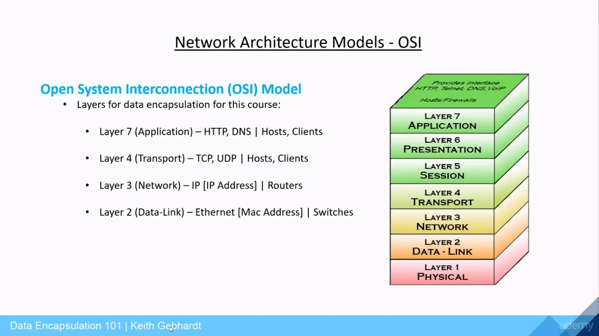

1. Physical: Đảm bảo các yêu cầu truyền/nhận các chuỗi bit qua các phương tiện vật lý. (Xây dựng đường truyền vật lý cho các host)
2. Data Link: Tạo/Gỡ bỏ khung thông tin (Frames), kiểm soát luồng và kiểm soát lỗi (Defines how data is formatted for transmission and how accessed to the network is controlled. Provides error detection) (Điều khiển truy cập vào đường truyền vật lý)
   Giả sử có nhiều đường truyền vật lý có thể truy cập vào được, thì giả sử có nhiều đường đi, ta sẽ phải chọn đường đi nào tối ưu nhất => Lớp network đảm nhận vai trò này
3. Network: Thực hiện chọn đường và đảm bảo trao đổi thông tin trong liên mạng với công nghệ chuyển mạch thích hợp (Routes data packets(Định tuyến gói dữ liệu), Selects best path to deliver data, Provides logical addressing and path selection) Lớp network định nghĩa ra những giao thức để xác định đường tối ưu nhất. Giao thức đó được gọi là giao thức định tuyến
4. Transport: Vận chuyển thông tin giữa các máy chủ (End to End Connections).Kiểm soát lỗi và luồng dữ liệu (Handles transportation issues between hosts, Ensures data transport reliability, Establishes, maintains, and terminates virtual circuits, Provides reliability through detection and recovery information flow control)
5. Session: Quản lý các cuộc liên lạc giữa các thực thể bằng cách thiết lập, duy trì, đồng bộ hóa và hủy bỏ các phiên truyền thông giữa các ứng dụng (Interhost Communication: Establishes, manages, and terminates sesions between applications)
6. Presentation: Chuyển đổi cú pháp dữ liệu để đáp ứng yêu cầu truyền thông của các ứng dụng. (Ensures that data is readable by receiving system, Formats data, Structures data, negotiates data transfer syntax for application layer, provides encryption)
7. Application: Giao tiếp người và môi trường mạng. (Provides network services to application processes (such as electronic mail, file transfer, and terminal emulation), Provides user authentication)

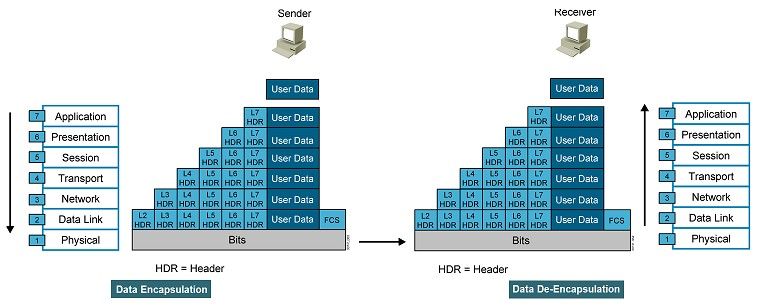

### Data Encapsulation

Đầu tiên sender sẽ gửi xuống user data dữ liệu người dùng, dữ liệu người dùng đi vào lớp `Application`, nó được đóng thêm một cái L7 HDR (Layer7 Header). Header là phần thông tin quản lý của 1 gói tin. Gói tin sẽ gồm 2 phần, phần **dữ liệu** và phần **header**. Đến lớp `Presentation`, toàn bộ nội dung của gói tin lớp 7 trở thành data của gói tin lớp 6, nội dung của gói tin lớp 7 sẽ được đóng thêm L6 HDR (Layer6 Header). Mỗi lần gói tin đi xuống 1 lớp, lại được bọc thêm 1 Header. Đến layer2, ngoài việc bọc thêm L2 HDR, nó còn kiểm tra thêm lỗi `FCS`. Khi đi xuống lớp Physical, toàn bộ dữ liệu sẽ được chuyển thành bits nhị phân để truyền trên đường truyền vật lý.

> Toàn bộ gói tin lớp trên sẽ trở thành dữ liệu của gói tin lớp dưới

### Data De-Encapsulation

Đầu tiên khi đưa lên `Data Link`, nó được chuyển thành cấu trúc khung, 1 đơn vị dữ liệu lớp 2, khi lên lớp 3, nó gỡ bỏ Layer2 header và FCS để trả lại gói tin lớp 3. Tương tự như thế cho đến khi người nhận nhận đc User Data.

Peer To Peer Communication

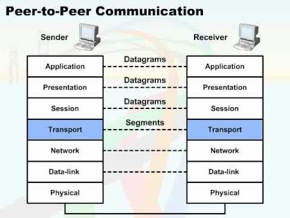

Các lớp nói chuyện với các lớp đồng cấp với nhau chứ không phải trên xuống,trên xuống như hồi nãy. Đơn vị dữ liệu của lớp Transport được gọi là Segments (Phân đoạn), Đơn vị của lớp Network gọi là packets. Đơn vị của lớp Data Links gọi là frame. Đơn vị của lớp vật lý là các bits.

### TCP/IP Stack

- Defines four layers
- Uses different names for Layers 1 through 3
- Combines Layers 5 through 7 into single application layer

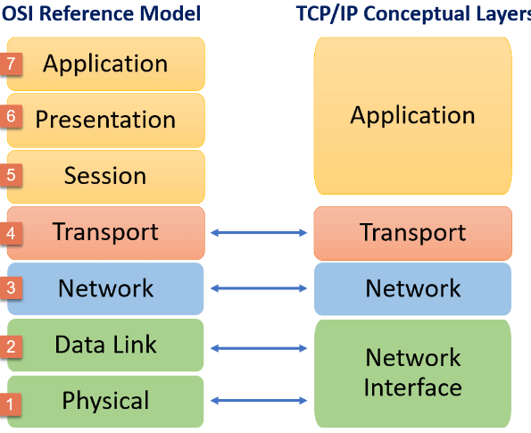

Summary

- The OSI reference model defines the network functions that occur at each layer.
- The physical layer defines the electrical, mechanical, procedural, and functional specifications for activating, maintaining, and deactivating the physical link between end systems.
- The data link layer defines how data is formatted for transmission and how access to the physical media is controlled
- The network layer provides connectivity and path selection between two host systems that may be located on geographically separated networks.
- The transport layer segments data from the system of the sending host and reassembles the data into a data stream on the system of the receiving host
- The session layer establishes, manages, and terminates sessions between two communicating hosts.
- The presentation layer ensures that the information sent at the application layer of one system is readable by the application layer of another system.
- The application layer provides network services to the applications of the user, such as email, file transfer, and terminal emulation

---

---

# The TCP/IP Transport Layer

Building a Simple Network

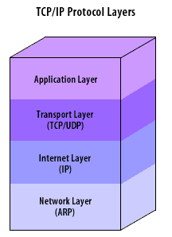

Transport Layer: Application, Presentation, Session, Transport (UDP and TCP), Network (IP), Data Link and Physical (Ethernet)

Transport layer cung cấp:

- Session multiplexing (ghép các phiên truy cập của các ứng dụng, tức là nếu các máy muốn trao đổi ứng dụng gì đó, thì nó phải tổ chức thành nhiều session giữa các máy, các session này đều đi chung trên 1 kết nối End to End, nên nhiệm vụ của tầng transport này ghép các kết nối ấy lại trong 1 đường truyền duy nhất)
- Segmentation (Phân mảnh dữ liệu)
- Flow control (when required)
- Connection-oriented (when required) có 2 kỹ thuật `connection-oriented`: truyền theo kiểu hướng kết nối, `connectionless`:

connection oriented (TCP): khi 2 máy có ý định truyền dữ liệu cho nhau, thì đầu tiên chúng phải kết nối luận lý. Khi kết nối xong có rất nhiều cơ chế truyền tin cậy được sử dụng kèm theo kết nối luận lý. Thiết lập xong kết nối, rồi mới thực hiện truyền dữ liệu.

connectionless (UDP): khi máy tính có gói tin, lập tức đẩy ngay vào đường truyền mà không cần thao tác, thiết lập từ trước.

Tầng transport cung cấp cả 2 kiểu truyền trên

- Reliability (when required)

Reliable vs Best-Effort Comparison

|                 | Reliable                         | Best-Effort                      |
| --------------- | -------------------------------- | -------------------------------- |
| Connection Type | Connection-oriented              | Connectionless                   |
| Protocol        | TCP                              | UDP                              |
| Sequencing      | YES                              | NO                               |
| Uses            | Email, File Sharing, Downloading | Voice streaming, Video streaming |

### UDP Characteristic

- UDP stands for User Datagram Protocol
- Operates at transport layer of OSI and TCP/IP models
- Provides applications with access to the network layer without the overhead of reliability mechanism
- Is a connectionless protocol
- Provides limited error checking
- Provides best-effort delivery
- Has no data-recovery features

### UDP Header

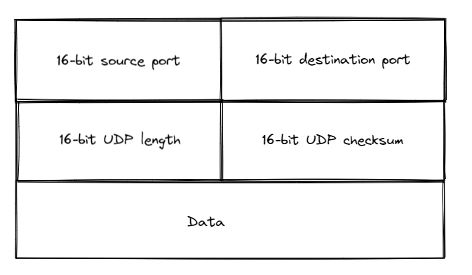

Khi các ứng dụng bên trên chia sẻ 1 kết nối UDP, có rất nhiều ứng dụng, rất nhiều kết nối, sessions, và cách định danh các session là sử dụng port. Tức là mõi cặp source port, 1 cặp destination port sẽ định danh ra một session đang truy cập vào trong đường truyền End to End của kết nối UDP. Port được coi như là địa chỉ của lớp thứ 4.

16-bit length: cung cấp 2^16 giá trị cho gói tin

16-bit checksum: kiểm tra lỗi FCS, sử dụng thuật toán mã vòng CRC để kiểm tra lỗi cho toàn bộ gói tin

### TCP Characteristics

- Transport layer of the TCP/IP stack
- Access to the network layer for applications
- Connection-oriented protocol
- Full-duplex mode operation (mode muốn truyền là truyền, muốn nhận là nhận, tức là có thể truyền và nhận tại cùng 1 thời điểm)
- Error checking
- Sequencing of data packets
- Acknowledgement of receipt (khi máy A gửi cho máy B một gói tin, nếu máy B nhận được sẽ gửi lại một báo nhận để máy A biết)
- Data-recovery features

#### TCP Header

- Options để có thể lập trình thêm các tính năng cho giao thức TCP

##### TCP/IP Application Layer Overview

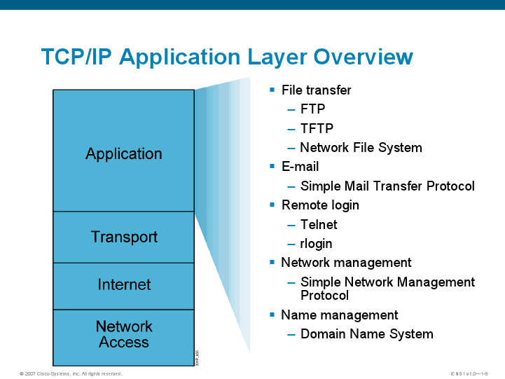

##### Mapping Layer3 to Layer 4

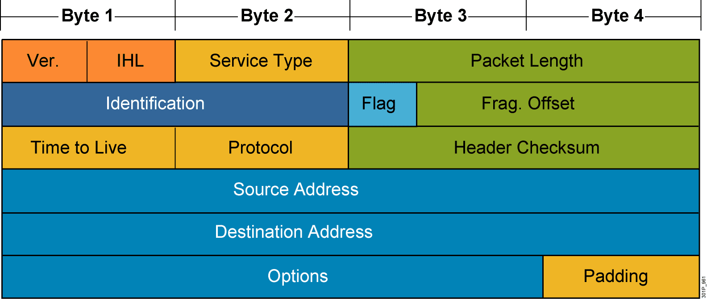

- Dùng trường protocol để nhìn vào IP Header để xem phần dữ liệu chứa gói tin gì. Số này gọi là Protocol ID

##### Mapping Layer 4 to Applications

- Các `Application` lớp 7 khi truyền dữ liệu, phải đưa xuống lớp 4 để nó truyền đi. Các application khi truy nhập vào đường truyền lớp 4 phải sử dụng các ports dành cho nó

#### Establishing a Connection

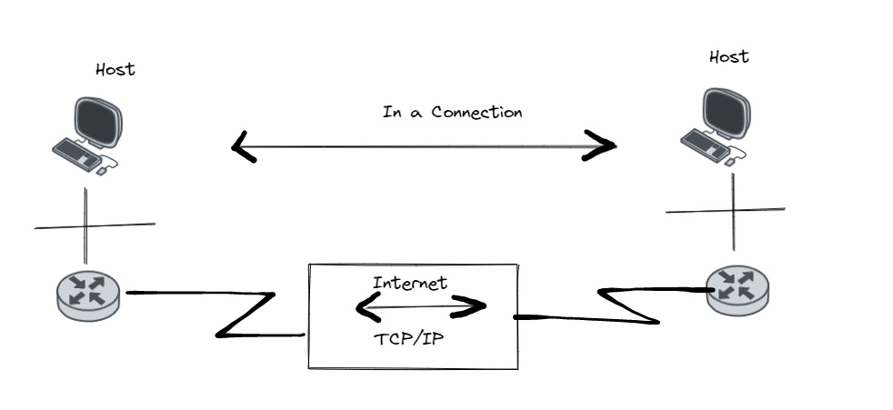

#### Three-Way Handshake

#### Flow Control

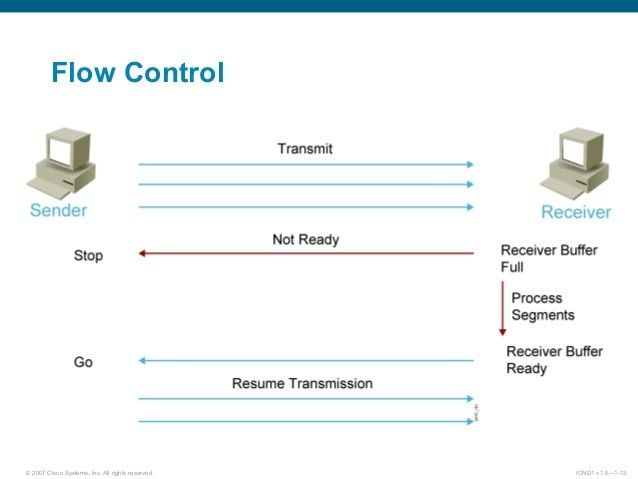

#### TCP Acknowledgement

- Window Size = 1

- Fixed Windowing: Window Size = 3

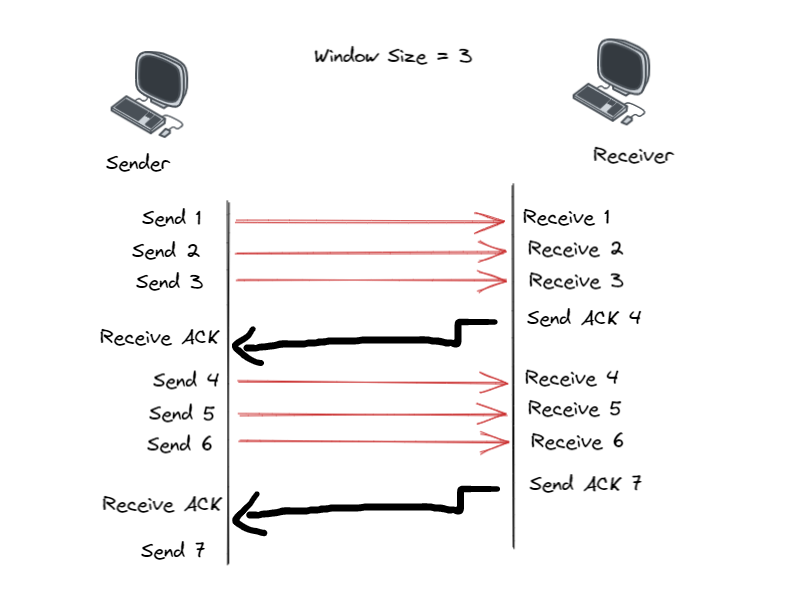

#### TCP Sequence and Acknowledgement numbers

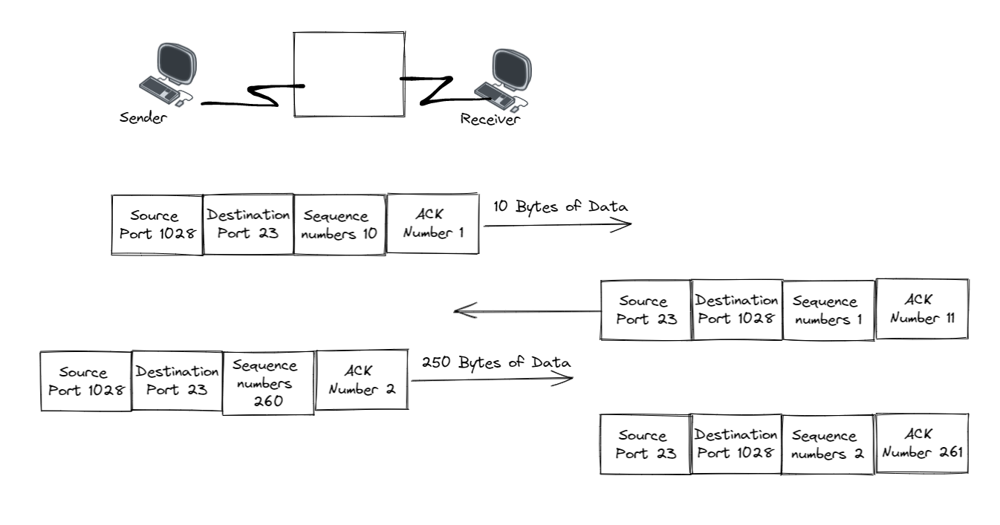
