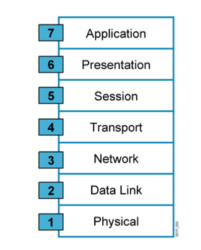

# Mô hình OSI
## Mô hình OSI là gì?

Mô hình OSI (Open system interconnection – Mô hình kết nối các hệ thống mở) là một thiết kế dựa vào nguyên lý tầng cấp, lý giải một cách trừu tượng kỹ thuật kết nối truyền thông giữa các máy vi tính và thiết kế giao thức mạng giữa chúng. Mô hình này được phát triển thành một phần trong kế hoạch OSI (Open Systems Interconnection) do ISO và IUT-T khởi xướng. Nó còn được gọi là Mô hình bảy tầng của OSI. 
## Tại sao mô hình OSI lại ra đời? Để giải quyết vấn đề gì?

Mô hình OSI ra đời là để mô tả cho phép sự tương giao giữa các máy từ những nhà sản xuất khác nhau có thể giao tiếp được với nhau, Mô hình cho phép tất cả các thành phần của mạng hòa đồng bất kể thành phần ấy do ai tạo dựng.

> Vấn đề giải quyết: để giải quyết vấn đề cho phép nhiều máy tính sử dụng được nhiều hãng các máy khác hãng có thể giao tiếp được với nhau.

## Chức năng cơ bản của mô hình OSI
    
1. Physical (lớp vật lý): Đảm bảo các yêu cầu truyền/nhận các chuỗi bit qua các phương tiện vật lý.
2. Datalink: Giúp dữ liệu truy cập vào đường truyền vật lý.
    * Lớp con điều khiển phương tiện (MAC).
    * Lớp con điều khiển liên kết logic (LLC).
3. Network: phân phối dữ liệu trên đường truyền vật lý. Tìm đường đi ngắn nhất nhanh chóng đi đến đích.
4. Transport: Nhận thông tin từ tầng Session chia thành các gói nhỏ hơn và truyền xuống lớp dưới, hoặc nhận thông tin từ lớp dưới chuyển lên phục hồi theo cách chia của hệ phát.
5. Session: Kiểm soát các phiên hội thoại giữa các máy tính. Thiết lập, quản lý và kết thúc các phiên truyền thông giữa các ứng dụng.
6. Presentation: Chuyển đổi, nén dữ liệu, mã hóa và giải mã dữ liệu đảm bảo sự bảo mật trên mạng.
7. Application:Tầng ứng dụng là tầng gần với người sử dụng nhất. Nó cung cấp phương tiện cho người dùng truy nhập các thông tin và dữ liệu trên mạng thông qua chương trình ứng dụng.
## Phương thức hoạt động
Mỗi tầng trong mô hình OSI, có hai phương thức hoạt động chính được áp dụng đó là: phương thức hoạt động có liên kết (connection–oriented) và không có liên kết (connectionless).     
Với phương thức có liên kết, trước khi truyền dữ liệu cần thiết phải thiết lập một liên kết logic giữa các thực thể cùng lớp (layer). Còn với phương thức không có liên kết, thì không cần lập liên kết logic và mỗi đơn vị dữ liệu trước hoặc sau đó.     
Phương thức có liên kết gồm 3 giai đoạn để truyền dữ liệu:
* Thiết lập liên kết: hai thực thể đồng mức ở hai hệ thống thương lượng với nhau về tập các tham số sẽ được sử dụng trong giai đoạn sau.
* Truyền dữ liệu:dữ liệu được truyền với cơ chế kiểm soát và quản lý.
* Hủy liên kết: giải phóng các tài nguyên hệ thống đã cấp phát cho liên kết để dùng cho các liên kết khác.

