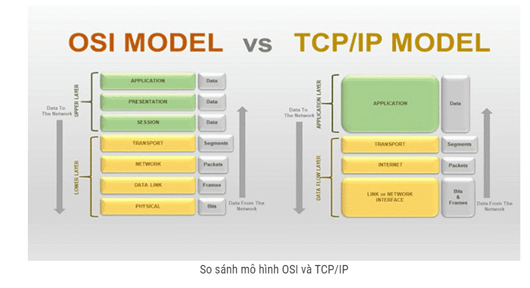

# Mô hình TCP/IP
## Khái niệm
TCP/IP là cụm từ viết tắt của Transmission Control Protocol/Internet Protocol hay còn gọi là giao thức điều khiển truyền nhận/ Giao thức liên mạng. Đây là một bộ các giao thức truyền thông được sử dụng để kết nối các thiết bị mạng với nhau trên internet. TCP/IP cũng có thể được sử dụng như một giao thức truyền thông trong mạng máy tính riêng (mạng nội bộ). Trong đó, bộ Giao thức internet – một tập hợp các quy tắc và thủ tục – thường gọi là TCP/IP (TCP/IP Protocol)
## Nguyên lý và cách thức hoạt động
* Thực tế trong giao thức TCP/IP, IP đóng góp một vai trò cực kỳ quan trọng.Như tên gọi đã nói lên tất cả, TCP/TP là sự kết hợp giữa 2 giao thức. 
* IP cho phép máy tính chuyển tiếp gói tin tới một máy tính khác. Thông qua một hoặc nhiều khoảng (chuyển tiếp) gần với người nhận gói tin. 
* Còn TCP sẽ giúp kiểm tra các gói dữ liệu xem có lỗi không sau đó gửi yêu cầu truyền lại nếu có lỗi được tìm thấy. 
* Có thể hình dung việc truyền tin trên internet như một dây chuyền sản xuất. IP đóng vai trò như quy cách hoạt động sản xuất của nhà máy còn TCP đóng vai trò như người giám sát dây chuyền, đảm bảo cho dây chuyền liên tục nếu có lỗi xảy ra.
## Cấu trúc của TCP/IP và chức năng mỗi tầng

TCP/IP gồm 4 tầng:
1. Tầng vật lý (Physical)
* Đây là sự kết hợp giữa tầng Vật lý và tầng liên kết dữ liệu của mô hình OSI. 
* Tầng này chịu trách nhiệm truyền dữ liệu giữa hai thiết bị trong cùng một mạng. 
* Tại đây, các gói dữ liệu được đóng vào khung (gọi là Frame) và được định tuyến đi đến đích đã được chỉ định ban đầu.
2. Tầng mạng (Internet)
* Cũng gần giống như tầng mạng của mô hình OSI. 
* Tại TCP/IP, tầng 2 – tầng mạng (Internet) cũng được định nghĩa là một giao thức chịu trách nhiệm truyền tải dữ liệu một cách logic trong mạng.
* Các phân đoạn dữ liệu sẽ được đóng gói (Packets) với kích thước mỗi góiphù hợp với mạng chuyển mạch mà nó dùng để truyền dữ liệu. 
* Lúc này, các gói tin được chèn thêm phần Header chứa thông tin của tầng mạng và tiếp tục được chuyển đến tầng tiếp theo. 
Các giao thức chính trong tầng là IP, ICMP và ARP.
* IP – Internet Protocol
* ICMP – Internet Control Message Protocol
* IGMP- Internet Group Message Protocol
3. Tầng giao vận (Transport Layer)
Đây là lớp điều khiển giao tiếp máy chủ tới máy chủ, còn được gọi là Tầng giao vận.
* Tầng  truyền tải sẽ phụ trách luồng dữ liệu giữa 2 trạm thực hiện các ứng dụng của lớp trên. Tầng này có 2 giao thức chính là:
    * TCP – Transmission Control Protocol: cung cấp luồng dữ liệu tin cậy giữa 2 trạm nhờ nhiều cơ chế.    
        Ví dụ như chia nhỏ các gói tin ở tầng trên thành các gói tin có kích thước thích hợp cho tầng mạng bên dưới, báo nhận gói tin, đặt hạn chế thời gian timeout để đảm bảo bên nhận biết được các gói tin đã gửi đi.
    * UDP – User Datagram Protocol: gửi dữ liệu từ trạm này tới trạm kia mà không đảm bảo các gói tin đến được tới đích.
4. Tầng ứng dụng (Application)
* Tầng Ứng dụng đảm nhận vai trò giao tiếp dữ liệu giữa 2 máy khác nhau thông qua các dịch vụ mạng khác nhau như chính tên gọi của nó.
* Các dịch vụ mạng đó có thể là duyệt web, chat, gửi email, một số giao thức trao đổi dữ liệu: SMTP, SSH, FTP,…. 