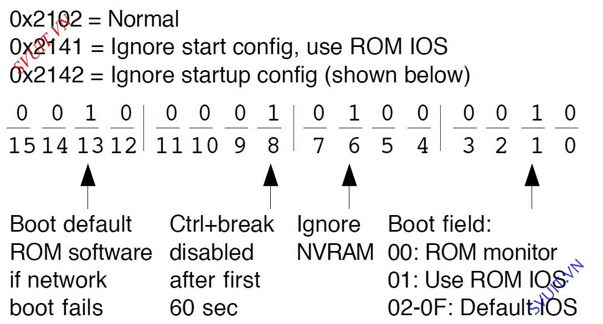

# Khởi động Router
## Thanh ghi cấu hình trên Router Cisco
- Thanh ghi có độ dài 16 bits. 16 bits này hiển thị theo kiểu hexa nhị phân(1 giá trị hexa = 4 bit nhị phân). Ví dụ: 0x2102,...
- Là thanh ghi mềm nằm trên NVRAM của con NVRAM.
- Khi thay đổi các bits này nó sẽ ảnh hưởng rất lớn đến việc khởi động và làm việc của Router.

   

1. Boot field trong Router Cisco
* Gồm 4 bit đầu tiên của thanh ghi ( 3 2 1 0) gọi là boot field
* Khi thay đổi bất kì bit nào trong 4 bit trên nó sẽ ảnh hưởng đến việc khởi động của Router. Ví dụ:
    * 0 (0x2100): Lúc này Router chạy hệ điều hành phụ là ROM => mode rommon. các chức năng hạn chế.
    * 1: Tìm kiếm IOS đầu tiên của Flash để sử dụng. Nếu như không tìm được IOS nào hoặc bị lỗi thì router sẽ tìm hệ điều hành trên các TFTP server. Nếu như TFTP bị lỗi thì router sẽ chọn ROM để lấy hệ điều hành.
    * 2->F: bootsystem: cho phép chọn ra IOS được sử dụng. còn nếu bị lỗi thì router sẽ tiến hành theo trình tự trên flash, TFTP, rồi cuối cùng đến ROM.

2. File config trên router cisco
- Là Bit thứ 6.
- Nó ảnh hưởng tới file config 

3. Console speed trên Router Cisco
- Bit số 5 11 12
- Nói về tốc độ của cổng console ( 9600 or 115200)

## Quá trình khởi động Router cisco
* Bước 1 : Đầu tiên khi khởi động Router sẽ kiểm tra phần cứng có bị lỗi hay không bằng chương trình Post & Bootstrap.   
* Bước 2: Bootstrap sẽ đêm các chương trình từ ROM ra RAm để chạy    
* Bước 3: Load IOS    
    * Router sẽ load IOS từ FLASH để load   
    * Khi nói đến khởi động của Router có nghĩa là nói đến 4 bits đầu tiên của thanh ghi (boot field)
        * 4 bits đầu tiên là 0 0 0 0 = 0x2100 : Router sẽ luôn luôn vào hệ điều hành phụ trên ROM. rommon 1>
        * 4 bits đầu tiên là 0 0 0 1 = 0x2101 : Luôn luôn lấy HĐH đầu tiên của FLASH để chạy( đối với FLASH có nhiều IOS).
            * Khi không có IOS trên FLASH nó sẽ gửi broadcast(255.255.255.255) ra tất cả các cổng mạng LAN của nó để tìm TFTP server( là server lưu trữ IOS và các file cấu hình router...)
            * Để tìm có IOS trên TFTP server không để nó load gọi là boot qua mạng từ TFTP server
            * Nếu TFTP không có IOS thì nó sẽ quay về HĐH phụ trên ROM
        * 4 bits đầu tiên là 0 0 1 0 = 0x2102 : vào trong FLASH để load HĐH ra nhưng khác với ở trên nó sẽ lấy toàn bộ IOS trong FLASH ra để load. Cái nào load được thì nó sẽ lấy dùng
            * Tương tự như trên nếu không có IOS trên FLASH nó cũng sẽ broadcast --> tìm TFTP để load HĐH qua mạng --> nếu không có thì sẽ quay về HĐH phụ trên ROM

* Bước 4: Load file config trên router cisco.
    * Sau khi Router load HĐH xong thì nó sẽ load file config
    * Load file config thì liên quan đến bit số 6 trên thanh ghi
        * bit số 6 có giá trị là 0 = 0x2102
            * Vào trong NVRAM để load file startup-config.
            * Nếu trong NVRAM không có file startup-config thì nó sẽ broadcast(255.255.255.255) để tìm file startup-config trên TFTP server
            * Nếu không có startup-config thì Router sẽ vào setup mode( cấu hình trắng).
        * bit số 6 có giá trị là 1 = 0x2142
            * Luôn luôn vào setup mode cho dù NVRAM có file startup-config.

# Tài liệu tham khảo
[start router](https://securityzone.vn/t/bai-8-qua-trinh-khoi-dong-cua-router-cisco.33/)    
