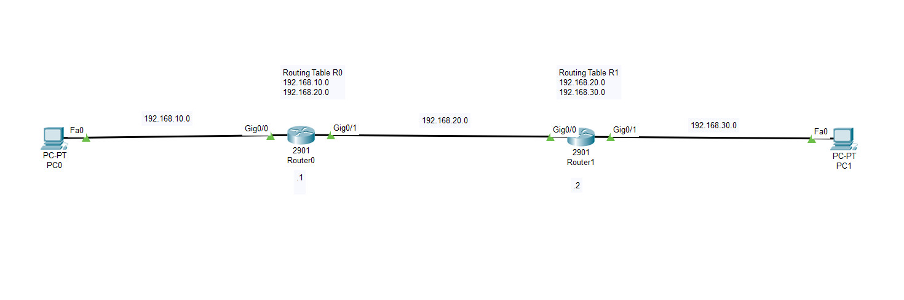
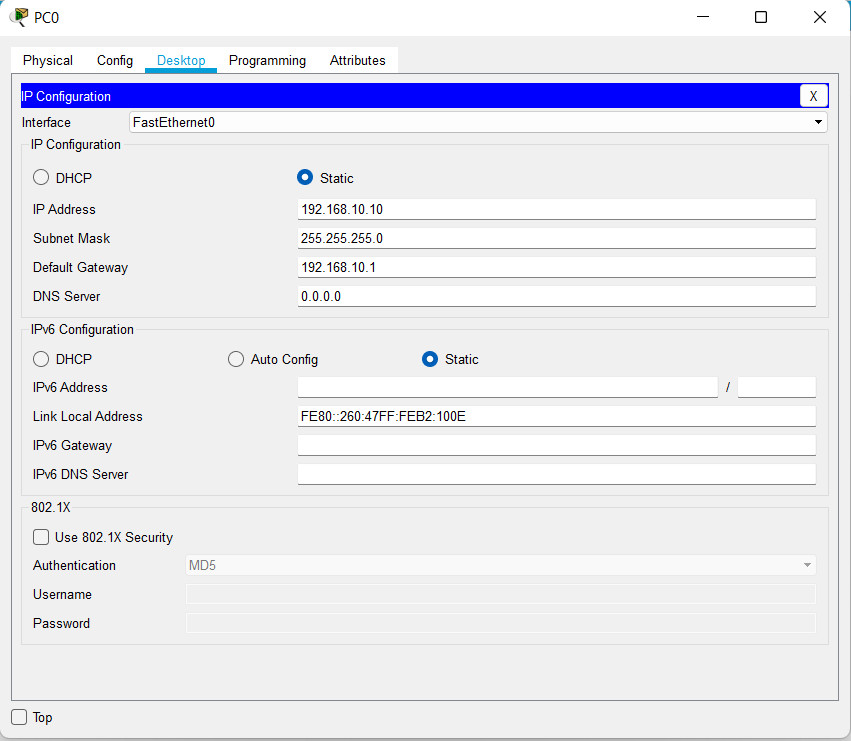
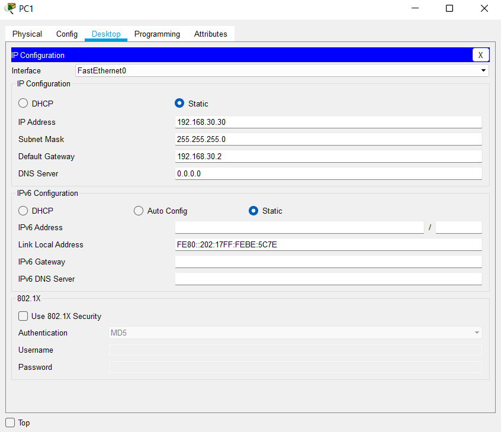
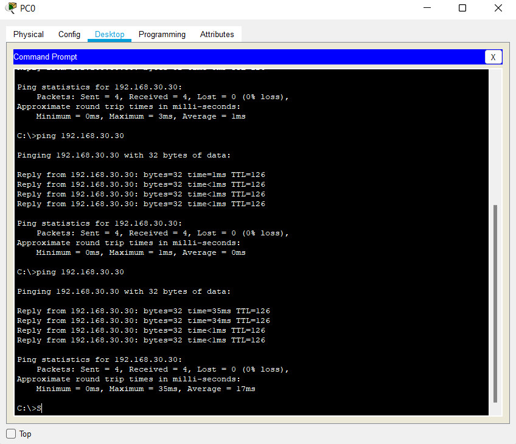
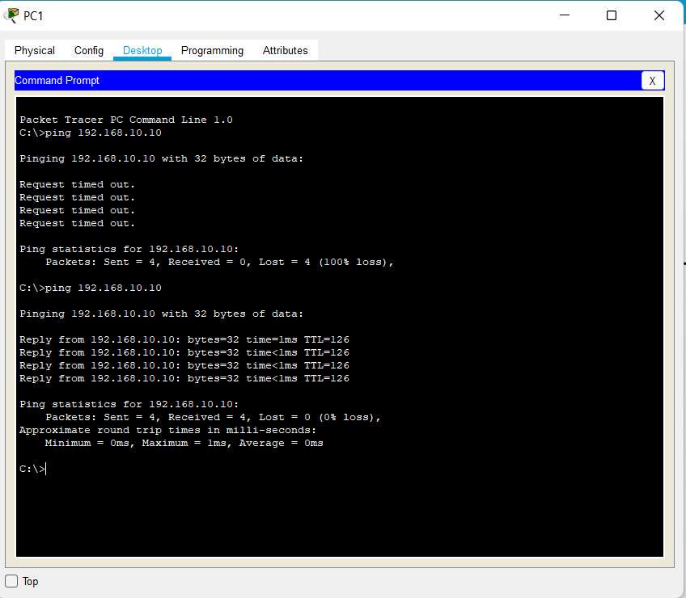

# Định tuyến tĩnh
## Khái niệm
* Định tuyến tĩnh là quá trình router thực hiện chuyển gói dữ liệu tới địa chỉ mạng đích dựa vào địa chỉ IP đích của gói dữ liệu. Để chuyển được gói dữ liệu đến đúng đích thì router phải học thông tin về đường đi tới các mạng khác. Thông tin về đường đi tới các mạng khác sẽ được người quản trị cấu hình cho router. Khi cấu trúc mạng thay đổi, người quản trị mạng phải tự thay đổi bảng định tuyến của router.
* Kỹ thuật định tuyến tĩnh đơn giản, dễ thực hiện, ít hao tốn tài nguyên mạng và CPU xử lý trên router (do không phải trao đổi thông tin định tuyến và không phải tính toán định tuyến). Tuy nhiên kỹ thuật này không hội tụ với các thay đổi diễn ra trên mạng và không thích hợp với những mạng có quy mô lớn (khi đó số lượng route quá lớn, không thể khai báo bằng tay được).
## Đặc điểm
* Áp dụng cho môi trường mạng nhỏ (khoảng dưới 5 router)
* Không tiêu tốn băng thông đường truyền để các thông báo giữa các Router về các đường đi
* Không tiêu tốn tài nguyên của hệ thống Router tính toán đường đi như định tuyến động
* Bảo mật vì Router chỉ hoạt động dựa vào các đường đi mà Admin chỉ định
* Rất khó khắc phục sự cố, phải cấu hình lại khi có sự thay đổi về địa chỉ mạng cũng như các thiết bị.
## Cấu hình định tuyến tĩnh   
* Cho topo như sau: 
    - Gán các địa chỉ IP vào các router.
    - Gán IP cho các PC trên cùng dải mạng với router được kết nối trực tiếp.
    - Định tuyến tĩnh cho các router.
* Kết quả:
    - Các PC có thể thông được với nhau bằng thực hiện lệnh ping => hai pc có thể kết nối được với nhau. Nếu lệnh ping thực hiện không thông thì có các khả năng sau:
        * Địa chỉ IP gõ nhầm (không cùng dải mạng đã cho).
        * Định tuyến xảy ra lỗi do nhầm next hop.      

    

### Cấu hình Router0, Router 1        

Router0(config)#interface g0/0                    
Router0(config-if)#ip address 192.168.10.1 255.255.255.0   
Router0(config-if)#no shutdown    
Router0(config)#interface g0/1                    
Router0(config-if)#ip address 192.168.20.1 255.255.255.0   
Router0(config-if)#no shutdown     
> router 1 cấu hình tương tự 

### Cấu hình định tuyến Router.   

Router(config)#ip route + network + subnetmask + nexthop    
    - Network: địa chỉ Network của các IP trong mạng (ví dụ trên network =172.16.1.0    
    - Nexthop: Là ip của cổng của Router kế tiếp trên đường đi tới network đích của packet
     
* Ví dụ       
    * Router 0        
        Router0(config)#ip route 192.168.30.0 255.255.255.0 192.198.20.2     
    * Router 1     
        Router1(config)#ip route 192.168.10.0 255.255.255.0 192.198.20.1

### Cấu hình PC 
* PC0     
     
* PC1
    

### Thực hiện lệnh ping    
* Ping từ PC0 đến PC1
   
* Ping từ PC1 đến PC0

# Tài liệu tham khảo
[Static](https://vnpro.vn/thu-vien/khai-niem-va-cau-hinh-dinh-tuyen-tinh-2347.html)