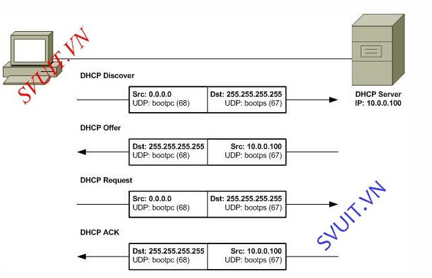

# Tìm hiểu về DHCP
## Khái niệm
* DHCP được viết tắt từ cụm từ Dynamic Host Configuration Protocol  là một giao thức cho phép cấp phát địa chỉ IP một cách tự động cùng với các cấu hình liên quan khác như subnet mask và gateway mặc định. Máy tính được cấu hình một cách tự động vì thế sẽ giảm việc can thiệp vào hệ thống mạng.
* Nếu không có DHCP, các máy có thể cấu hình IP thủ công (cấu hình IP tĩnh). Ngoài việc cung cấp địa chỉ IP, DHCP còn cung cấp thông tin cấu hình khác, cụ thể như DNS.
 
## Cách thức hoạt động    
     
* Bước 1:
    * Client : gửi gói tin DHCP Discover(gói broadcast) lên DHCP server để xin IP.
    * Chỉ có DHCP server mới nhận được gói DHCP discover của client.
* Bước 2:
    * Server trả lời lại bằng gói tin DHCP Offer chứa
        - pool : dãy địa chỉ IP mà server cấp
        - Subnet mask
        - default gateway
        - default root
        - lease time : thời gian sống của IP cấp...

* Bước 3:    
Khi client chấp nhận DHCP Offer nó sẽ gửi lên server DHCP gói tin DHCP Request để xin server cấp IP cho nó.
* Bước 4: 
    * Khi server nhận được gói DHCP Request thì nó sẽ trả lời bằng gói tin DHCP ACK xác nhận thiết bị đã có ip và thời gian sử dụng ip đến khi có địa chỉ mới.
    * DHCP ACK chính là địa chỉ IP mà server cấp cho client.

## Ưu điểm của DHCP
* DHCP cho phép cấu hình tự động nên dễ dàng cho các thiết bị máy tính, điện thoại, các thiết bị thông minh khác...có thể kết nối mạng nhanh.
* Vì DHCP thực hiện theo kiểu gán địa chỉ IP nên sẽ không xảy ra trường hợp trùng địa chỉ IP.
* các thiết bị có thể di chuyển tự do từ mạng này sang mạng khác và nhận địa chỉ IP tự động mới vì các thiết bị này có thể tự nhận IP.
* DHCP quản lý cả địa chỉ IP và các tham số TCP/IP trên cùng một màn hình như vậy sẽ dễ dàng theo dõi các thông số và quản lý chúng qua các trạm.
* DHCP giúp quản lý mạng mạnh hơn vì các cài đặt mặc định và thiết lập tự động lấy địa chỉ sẽ cho mọi thiết bị kết nối mạng đều có thể nhận được địa chỉ IP.

## Nhược điểm của DHCP     
Bởi DHCP sử dụng chủ yếu với các hộ gia đình hay văn phòng. Đối với các thiết bị dùng trong văn phòng, như máy in thì việc việc gán chúng với các địa chỉ IP thay đổi không mang tính thực tiễn. Lúc đó mỗi khi kết nối với máy tính khác thì máy in đó sẽ phải thường xuyên cập nhật cài đặt để máy tính có thể kết nối với máy in.

# Tài liệu tham khảo

[DHCP](https://www.totolink.vn/article/111-dhcp-la-gi-tim-hieu-ve-dhcp.html)           
[DHCP](https://securityzone.vn/t/bai-16-tim-hieu-va-cau-hinh-dhcp-tren-cisco.93/)