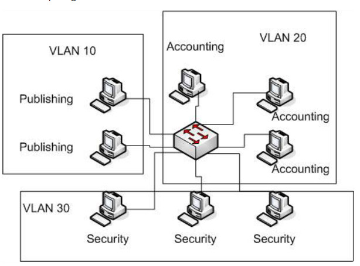
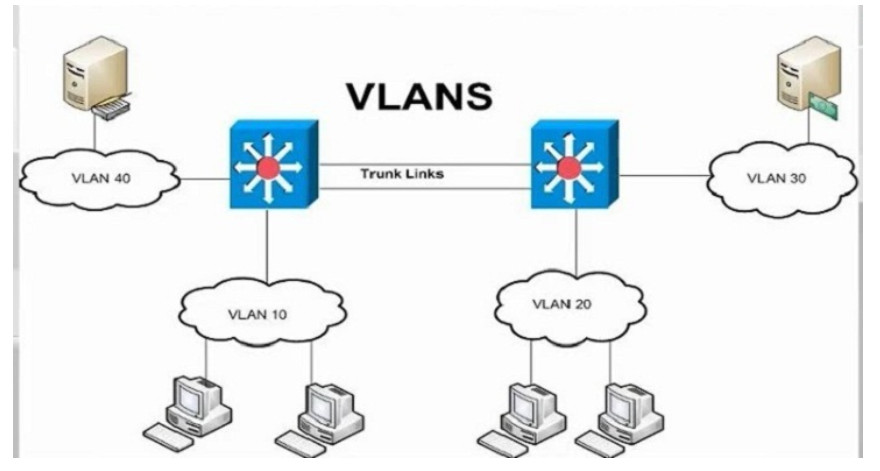

# VLAN (Virtual Local Area Netwwork)
## Khái niệm
* VLAN là cụm từ viết tắt của virtual local area network (hay virtual LAN) hay còn được gọi là mạng LAN ảo. VLAN là một kỹ thuật cho phép tạo lập các mạng LAN độc lập một cách logic trên cùng một kiến trúc hạ tầng vật lý. Việc tạo lập nhiều mạng LAN ảo trong cùng một mạng cục bộ (giữa các khoa trong một trường học, giữa các cục trong một công ty,...) giúp giảm thiểu miền quảng bá (broadcast domain) cũng như tạo thuận lợi cho việc quản lý một mạng cục bộ rộng lớn. VLAN tương đương như mạng con (subnet).
* Về mặt kỹ thuật, VLAN là một miền quảng bá được tạo bởi các switch. Bình thường thì router đóng vai trò tạo ra miền quảng bá. Đối với VLAN, switch có thể tạo ra miền quảng bá.       

## Khi nào cần 1 VLAN?
Cần cân nhắc việc sử dụng VLAN trong các trường hợp sau:
* Khi có quá nhiều máy tính trong mạng LAN
* Lưu lượng quảng bá (broadcast traffic) trong mạng LAN của bạn quá lớn.
* Các nhóm làm việc cần gia tăng bảo mật hoặc bị làm chậm vì quá nhiều bản tin quảng bá

## Lợi ích của VLAN.

    

* Tiết kiệm băng thông của mạng: Do VLAN có thể chia nhỏ LAN thành các đoạn khác nhau.
* Tăng khả năng bảo mật
* Dễ dàng thêm hay bớt các máy tính vào VLAN
* Mạng có tính linh động cao: VLAN có thể dễ dàng di chuyển các thiết bị. VLAN có thể được cấu hình tĩnh hay động
* Làm cho hệ thống mạng đơn giản hơn
## Đặc điểm của VLAN
* Các máy tính trong cùng một VLAN có thể giao tiếp được với nhau
* Dãy giá trị các VLAN ID chạy từ 0 -> 4095:      
    * 1 – 1001 : dải VLAN thường được sử dụng.
    * 1002 – 1005 : dải này dùng để giao tiếp với các kiểu mạng LAN khác.
    * 1006 – 4094: dải VLAN mở rộng, sử dụng khi switch hoạt động ở mode Transparent.
    * 0 và 4095: VLAN dành riêng.
    * VLAN 1, 1002 – 1005: mặc định trên Switch và không thể xóa được.
        * Mặc định VLAN sau khi được tạo sẻ được lưu vào file vlan.dat trong bộ nhớ Flash.

## Các loại VLAN
* Port - based VLAN: là cách cấu hình VLAN đơn giản và phổ biến. Mỗi cổng của Switch được gắn với một VLAN xác định (mặc định là VLAN 1), do vậy bất cứ thiết bị host nào gắn vào cổng đó đều thuộc một VLAN nào đó.
* MAC address based VLAN: Cách cấu hình này ít được sử dụng do có nhiều bất tiện trong việc quản lý. Mỗi địa chỉ MAC được đánh dấu với một VLAN xác định.
* Protocol – based VLAN: Cách cấu hình này gần giống như MAC Address based, nhưng sử dụng một địa chỉ logic hay địa chỉ IP thay thế cho địa chỉ MAC. Cách cấu hình không còn thông dụng nhờ sử dụng giao thức DHCP.
# Tài liệu tham khảo
[VLAN](https://quantrimang.com/vlan-la-gi-lam-the-nao-de-cau-hinh-mot-vlan-tren-switch-cisco-64830)      
[VLAN](https://www.dienmayxanh.com/kinh-nghiem-hay/vlan-la-gi-co-can-thiet-su-dung-khong-lam-the-nao-1137273)