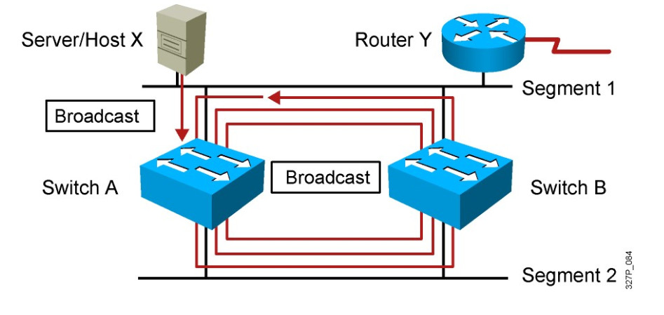
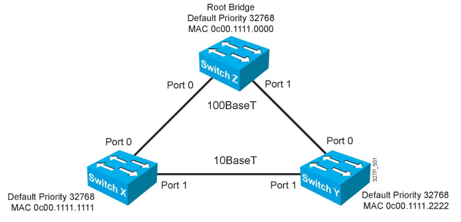

# SPANNING TREE PROTOCOL
## Khái niệm Spanning Tree Protocol.
- Spanning Tree Protocol (STP) là một giao thức ngăn chặn sự lặp vòng, cho phép các bridge truyền thông với nhau để phát hiện vòng lặp vật lý trong mạng.
- Theo mô hình dưới thì nó sẽ xảy ra hiện tượng:    
   
    * Broadcast storm (Bão quảng bá)
    * Instability MAC address table (Bảng địa chỉ MAC không ổn định)
    * Multiple Frame copies (Trùng lặp frame)
## Quá trình bầu chọn của giao thức Spanning Tree Protocol.
- Hoạt động bầu chọn của một tiến trình STP:
    - Bầu chọn Root Switch
    - Bầu chọn Root Port 
    - Bầu chọn Designated Port
    - Block các Port còn lại.     
Sơ đồ hoạt động của STP.
    

2.1: Bầu chọn Root Switch    
Khi các Switch được đấu nối khởi động nó sẽ gửi gói tin BPDU(bridge protocol data unit) trên các port của Switch. Thông số quyết định Sw nào được làm Root Sw là Bridge-ID(8 byte) gồm có các thông số :
- Priority:   
    - Dài 2 byte, default = 32768.
    - Switch nào có chỉ số priority có chỉ số nhỏ nhất sẽ được chọn làm Root-switch.
- MAC Address Switch:
    - Dài 6 byte
    - Xét từ trái sang phải từng giá trị hexa thì switch nào có MAC nhỏ nhất làm Root-switch.

Khi bầu xong Root-switch thì chỉ có Root-switch được gửi BPDU(2s/1 lần). Việc gửi đó để duy trì cây spanning tree đó không bị Loop.   
2.2: Bầu chọn Root Port.
* Tổng cost
    - Là port cung cấp đường về Root-switch mà có tổng path-cost là nhỏ nhất
    - Khi bầu chọn Root-port thì Root-Switch không tham gia quá trình bầu chọn này
    - Mỗi non-Rootswitch chỉ có 1 Root-port
    - Path-cost là giá trị cost trên từng cổng của Switch.
    - Nguyên tắc tính tổng path-cost: tính từ Root-switch --> switch đang muốn tính(đi ra không cộng, đi vào cộng cost).       
>Nếu path-cost bằng nhau thì:
* Sender Bridge ID: 
    * So sánh priority: (Cổng nào có priority nhỏ hơn thì là Root Port)
    * So sánh địa chỉ MAC, cài nào nhỏ hơn thì chọn.    
>Nếu Sender Bridge ID bằng nhau thì:
* Port ID đầu xa:
    * Port priority:0->255:128(mặc định)
    * Port Number:
* Port ID đầu gần   

2.3: Bầu chọn Designated Port.
- Tất cả các port của Root-SW đều là Designated Port.
- Trên một phân đoạn mạng điểm-điểm, một đầu là Root Port thì đầu còn lại là Designated Port.
- Là port cung cấp đường về Root-sw trên phân đoạn mạng đang xét mà có tổng path-cost là nhỏ nhất.   
    * Nếu tổng cost bằng nhau thì xét Sender Bridge ID.

2.4: Bầu chọn Block Port.
- Khi 1 trong các phân đoạn khác bị đứt thì phân đoạn port block sẽ được mở ra để chạy.
- Khi phân đoạn trên có lại thì phân đoạn block sẽ tiếp tục bị block lại
>Tuy port block không nhận được dữ liệu nhưng nó vẫn nhận gói tin BPDU từ Root-switch để duy trì cây spanning-tree. Kết quả sau 4 bước bầu chọn, cây STP hội tụ như sơ đồ sau:     

## Các trạng thái STP
- Các trạng thái khi Switch khởi động:
    * Disable: down
    * Blocking: nhận BDPU, ko gửi BPDU, không học MAC, không forward frame
    * Listening: nhận BDPU, gửi BPDU, không học MAC, không forward frame
    * Leaning: nhận BDPU, gửi BPDU, học MAC, không forward frame
    * Forwarding: nhận BDPU, gửi BPDU, học MAC, forward frame
- Việc chuyển từ trạng thái: Blocking sang listening mất 20(s).
- Việc chuyển từ trạng thái: Listening sang Leaning mất 15(s).
- Việc chuyển từ trạng thái: Learning sang Forwarding mất 15(s).

## Tài liệu tham khảo
[STP-1](https://vnpro.vn/thu-vien/tim-hieu-ve-giao-thuc-spanning-tree-protocol-3115.html)   
[STP-2](https://www.youtube.com/watch?v=o_6TxyX0W8o)