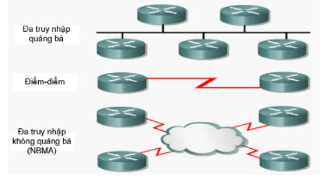
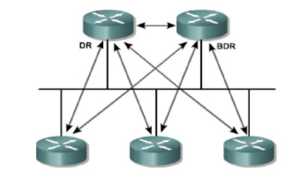

# **Giao thức OSPF**
## Định nghĩa
- Giao thức OSPF là giao thức thuộc nhóm Link State. Trên mỗi Router của cả bản đồ mạng của cả vùng (bảng định tuyến) thông qua việc đồng nhất bảng cơ sở dữ liệu trạng thái đường link (LSDP-Link State Database). Từ bản đồ mạng này router có thể tính toán đường đi ngắn nhất và xây dựng bảng định tuyến cho nó.
- Giao thức OSPF được sử dụng rộng rãi trong các công ty cho hệ thống mạng lớn.
- Giao thức OSPF sử dụng thuật toán Dijkstra để xay dựng và tính toán đường đi ngắn nhất tới mạng đích
* Một số ưu điểm của OSPF:
    > Tốc độ hội tụ nhanh    
    > Là một giao thức mạnh, có tính mở.
## Các loại gói OSPF 
* Loại 1 - Hello: Thiết lập và duy trì thông tin duy trì với hàng xóm.
* Loại 2 - Database Description Packet (DBD): Miêu tả nội dung của cơ sở dữ liệu trạng thái liên kết trên một Bộ định tuyến OSPF.
* Loại 3 - Link State Request (LSR): Yêu cầu một phần thông tin cụ thể của cơ sở dữ liệu trạng thái liên kết.
* Loại 4 - Link State Update (LSU): Truyền tải các LSA (Link State Advertisement) tới hàng xóm.
* Loại 5 – Link State Acknowledgement (LSAck): Xác nhận việc nhận LSA.
## Các trạng thái OSPF 
1. Trạng thái Down:    
Ở trạng thái Down, OSPF không trao đổi thông tin với bất kỳ hàng xóm nào. OSPF đang đợi để chuyển sang trạng thái tiếp theo, trạng thái Init.    
2. Trạng thái Init:      
 Cứ 10 giây, bộ định tuyến OSPF gửi 1 gói tin loại 1 (Hello) đến hàng xóm để thiết lập mối quan hệ với các bộ định tuyến của hàng xóm. Khi hàng xóm nhận được một gói tin Hello tức là hàng xóm đang đợi để chuyển sang mối quan hệ tiếp theo.
3. Trạng thái Two-Way:     
* Mọi bộ định tuyến cố gắng thiết lập trạng thái truyền thông hai chiều với tất cả các bộ định tuyến khác trong cùng một dải mạng. Trong gói Hello của bộ định tuyến có danh sách hàng xóm, khi mà bộ định tuyến thấy nó trong gói Hello trong danh sách hàng xóm thì thiết lập hai chiều.
* Trạng thái hai chiều là mối quan hệ cơ bản nhất giữa các hàng xóm OSPF, nhưng thông tin định tuyến không được chia sẻ trong mối quan hệ này.Để học về trạng thái liên kết của các bộ định tuyến khác và cuối cùng là xây dựng bảng định tuyến, mọi bộ định tuyến OSPF phải hình thành ít nhất một quan hệ gần kề. Bước đầu tiên để đến được trạng thái gần kề hoàn toàn là trạng thái ExStart.
4. Trạng thái Exstart.   
ExStart được thiết lập sử dụng gói miêu tả cơ sở dữ liệu (loại 2), gọi tắt là gói DBD. Hai bộ định tuyến hàng xóm sử dụng gói Hello để đàm phán xem ai là “chủ” và ai là “tớ” trong mối quan hệ và sử dụng gói DBD để trao đổi cơ sở dữ liệu. Bộ định tuyến có số hiệu OSPF cao hơn sẽ “thắng” và trở thành chủ. Rồi sau đó bắt đầu gửi thông tin định tuyến.
5. Trạng thái Exchange 
* Các bộ định tuyến miêu tả cơ sở dữ liệu trạng thái liên kết cho nhau. Các bộ định tuyến so sánh cái chúng học được với cái chúng có trong cơ sở dữ liệu. Nếu bộ định tuyến nhận được thông tin về một liên kết hiện không có trong cơ sở dữ liệu, bộ định tuyến yêu cầu một cập nhật đầy đủ từ hàng xóm. Thông tin định tuyến đầy đủ được trao đổi trong trạng thái Loading.
6. Trạng thái Loading.
* Sau khi bộ định tuyến miêu tả cơ sở dữ liệu cho nhau xong. Bộ định tuyến sẽ gửi gói tin loại 3 (LSR) yêu cầu trạng thái liên kết. Khi bộ định tuyến nhận được LSR, nó trả lời bằng một cập nhật định tuyến sử dụng gói loại 4, cập nhật trạng thái liên kết (LSU). Gói loại 4 này chứa các quảng báo trạng thái liên kết (LSA), đặc trưng của các giao thức định tuyến trạng thái liên kết. Gói LSU loại 4 được xác nhận sử dụng gói loại 5, xác nhận trạng thái liên kết (LSAck).
7. Trạng thái Full Adjacency    
Hoàn thành trạng thái Loading, các bộ định tuyến trở thành trạng thái gần kề hoàn chỉnh. 
## Các kiểu mạng OSPF
* Các giao diện OSPF tự động nhận diện ba kiểu mạng: đa truy nhập quảng bá, đa truy nhập không quảng bá (NBMA) và điểm-điểm. Người quản trị có thể cấu hình kiểu thứ tư, mạng điểm-đa điểm.   
.
* Một số mạng được định nghĩa là đa truy nhập vì không thể dự đoán trước có bao nhiêu bộ định tuyến kết nối với chúng (có thể có một, hai hoặc nhiều bộ định tuyến). Rất có thể có một số lượng lớn bộ định tuyến trong mạng đa truy nhập. Do vậy, để tránh lưu lượng cập nhập định tuyến quá lớn trong trường hợp mọi bộ định tuyến đều có quan hệ gần kề với nhau, các nhà thiết kế OSPF đã phát triển một hệ thống nhằm giới hạn số lượng bộ định tuyến trở thành gần kề với nhau. Hệ thống này quy định ra hai bộ định tuyến đặc biệt là bộ định tuyến chỉ định và chỉ định dự phòng.   

1. Bộ định tuyến chỉ định (Designated bộ định tuyến - DR)      
* DR có hai chức năng:
    * trở thành gần kề với tất cả các bộ định tuyến trên mạng
    * hoạt động như người đại diện trên mạng

 2. Bộ định tuyến chỉ định dự phòng (Backup Designated Router - BDR)
 * Do DR có thể bị lỗi nên một bộ định tuyến khác cần được bầu là BDR để dự phòng.
    * BDR cũng phải trở thành gần kề với tất cả các bộ định tuyến trong mạng và do vậy nó là điểm trung tâm thứ hai cho các LSA. Tuy nhiên, không giống DR, BDR không có trách nhiệm cập nhật định tuyến với các bộ định tuyến khác hoặc gửi LSA mạng. Thay vào đó, BDR giữ một bộ định thời đối với hành động cập nhật của DR để chắc chắn rằng DR vẫn đang hoạt động.
    * Nếu BDR không phát hiện thấy hoạt động từ DR trước khi bộ định thời hết hạn, BDR chiếm vai trò của DR và một BDR khác được bầu.

## Hoạt động của OSPF      
1. Thiết lập mối quan hệ gần kề
* Đầu tiên, khi một router chạy OSPF thì nó phải chỉ ra một giá trị dùng để định danh duy nhất cho nó trong cộng đồng các router chạy OSPF. Giá trị này gọi là Router-id có dạng như địa chỉ IP. Trên mỗi router sẽ tự động bầu ra một Router-id có địa chỉ IP cao nhất.
* Sau đó thiết lập quan hệ láng giềng.
2. Chọn BR và BDR (nếu có)      
* Do mạng đa truy nhập có thể hỗ trợ nhiều hơn hai bộ định tuyến, nên OSPF phải bầu DR để làm điểm trung tâm của các cập nhật trạng thái liên kết và LSA. Vai trò của DR là không thể thiếu, do vậy BDR được bầu để dự phòng cho DR. Nếu DR lỗi thì BDR sẽ đảm nhận nhiệm vụ.
* Giống như bầt kỳ quá trình bầu nào, quá trình bầu DR và BDR cũng có thể có “gian lận” để làm thay đổi kết quả. Việc “bỏ phiếu kín” được thực hiện nhờ gói Hello, chứa trường ID và priority của bộ định tuyến. Bộ định tuyến có giá trị priority lớn nhất sẽ thắng cử và trở thành DR. Bộ định tuyến với giá trị priority cao thứ hai sẽ được bầu làm BDR. Khi DR và BDR đã được chọn, chúng sẽ giữ đúng vai trò cho đến khi một trong hai bị lỗi, ngay cả khi có một bộ định tuyến mới với giá trị priority cao hơn ra nhập mạng. Khi đó, gói Hello thông báo cho bộ định tuyến mới về DR và BDR hiện có.      
* Sau khi bầu xong và truyền thông hai chiều được thiết lập, các bộ định tuyến sẵn sàng chia sẻ thông tin định tuyến với các bộ định tuyến gần kề để xây dựng bảng cơ sở dữ liệu trạng thái liên kết.
3. Khám phá tuyến.
* Các router sẽ bắt đầu trao đổi thông tin liên kết, nhưng router nào sẽ bắt đầu trước? Mục đích của ExStart là thiết lập mối quan hệ chủ/tớ giữa hai bộ định tuyến. Bộ định tuyến chủ sắp đặt việc trao đổi thông tin trạng thái liên kết, trong khi bộ định tuyến tớ trả lời yêu cầu từ phía bộ định tuyến chủ.    
* Sau khi các bộ định tuyến xác định được vai trò là chủ hay tớ, chúng chuyển sang chế độ Exchange. Chủ dẫn dắt tớ thông qua quá trình trao đổi các DBD miêu tả cơ sở dữ liệu trạng thái liên kết tổng quát của mỗi bộ định tuyến. Các miêu tả này bao gồm loại trạng thái liên kết, địa chỉ của bộ định tuyến quảng cáo, giá của liên kết và số trình tự.
* Bộ định tuyến xác nhận việc nhận DBD bằng cách gửi gói LSAck (Loại 5). Mỗi bộ định tuyến so sánh thông tin nó nhận được trong DBD với thông tin chúng đang có. Nếu BDB quảng cáo một trạng thái liên kết mới, bộ định tuyến sẽ chuyển sang trạng thái Loading bằng cách gửi gói LSR (Loại 3) về mục mới này. Để trả lời cho LSR, bộ định tuyến gửi thông tin trạng thái liên kết đầy đủ, sử dụng gói LSU (loại 4). Mỗi LSU mang nhiều LSA.
* Khi trạng thái Loading hoàn thành, các bộ định tuyến có mối quan hệ gần kề hoàn chỉnh và chuyển vào trạng thái Full.
4. Chọn tuyến tối ưu.
* Sử dụng thuật toán Dijsktra để tính toán đường đi ngắn nhất.
* Để giải quyết vấn đề này, Cisco IOS sử dụng bộ định thời giữ SPF (SPF hold timer). Sau khi nhận một LSU, bộ định thời giữ SPF xác định khoảng thời gian đợi trước khi chạy giải thuật SPF. Lệnh timers spf cho phép điều chỉnh khoảng thời gian này, giá trị mặc định là 10 giây.
