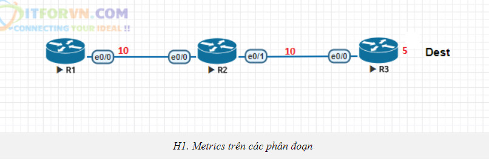
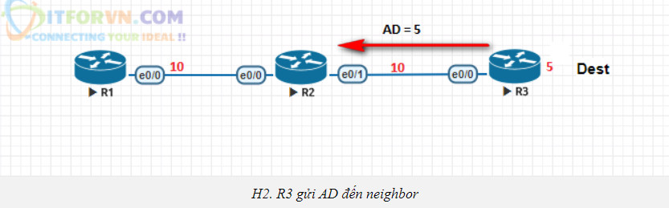
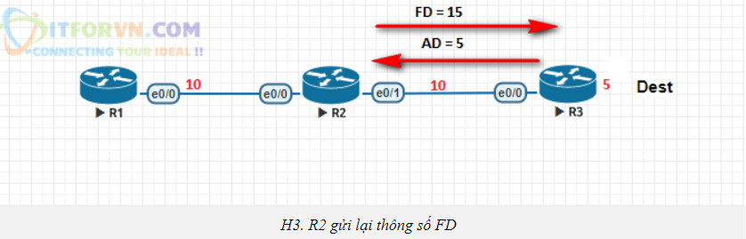
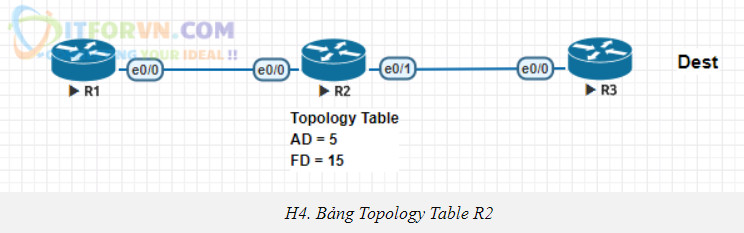
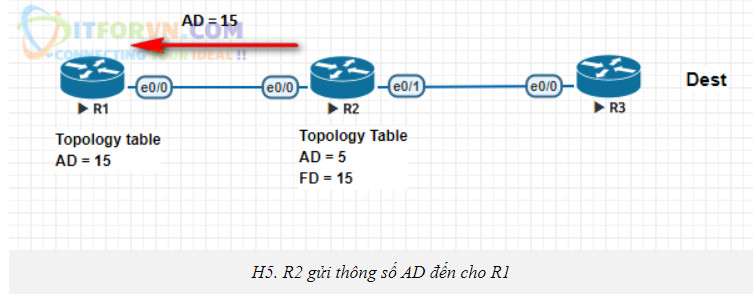
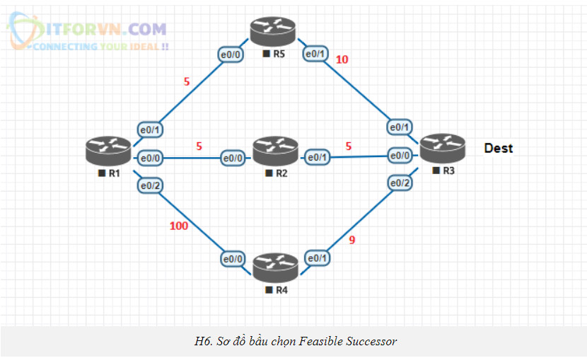
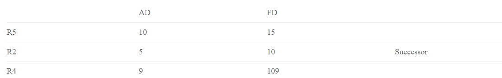

# Giao thúc EIGRP
## Khái niệm
* Enhanced Interior Gateway Routing Protocol (EIGRP) là giao thức định tuyến vectơ khoảng cách tiên tiến được sử dụng trên mạng máy tính để tự động hóa các quyết định và cấu hình định tuyến. Giao thức này được thiết kế bởi Cisco Systems như là một giao thức độc quyền, chỉ có trên các bộ định tuyến của Cisco
* EIGRP được sử dụng trên một bộ định tuyến để chia sẻ các tuyến đường với các bộ định tuyến khác trong cùng hệ thống tự trị. Không giống như các giao thức định tuyến nổi tiếng khác, chẳng hạn như RIP, EIGRP chỉ gửi các bản cập nhật gia tăng, giảm khối lượng công việc trên bộ định tuyến và lượng dữ liệu cần truyền.
## Hoạt động lựa chọn đường đi của EIGRP
1. Thiết lập quan hệ hàng xóm
* Điều kiện để thiết lập quan hệ hàng xóm
    * Giá trị AS (Autonomous System) được cấu hình trên router là giống nhau
    * Cùng subnet
    * Thoả mãn các điều kiện xác thực
    * Cùng bộ tham số K
            
        * Giá trị AS – Autonomous System(hệ tự trị): Khi cấu hình EIGRP trên router, người quản trị phải khai báo AS mà router này thuộc về. Giá trị này buộc phải khớp nhau giữa 2 router kết nối trực tiếp với nhau để các router này có thể thiết lập mối quan hệ láng giềng.    
        * Các địa chỉ đầu nối: Để 2 router thiết lập được quan hệ láng giềng với nhau, hai địa chỉ đầu nối giữa 2 router phải cùng subnet.
        * Thỏa mãn các điều kiện xác thực: Như các giao thức khác, để tang cường tính an ninh trong hoạt động trao đổi thông tin định tuyến,trên router có thể thực hiện cấu hình password để xác thực thông tin định tuyến nhận được từ các router khác. Hai router nếu có cấu hình xác thực thì phải thống nhất với nhau về password đã cấu hình thì mới có thể thiết lập quan hệ láng giềng với nhau.
        * Cùng bộ tham số K: EIGRP sử dụng một loại công thức tính metric phức tạp, là một hàm của bốn biến số: bandwidth, delay, load, reliability:Metric = f (bandwidth, delay, load, reliability)Các biến số này có thể được gắn với các trọng số để tang hoặc giảm bớt ảnh hưởng của chúng gọi là các tham số K gồm 5 giá trị K1, K2, K3, K4, K5. 
        

2. Bảng Topology.      
* Sau khi thiết lập quan hệ láng giềng, các router láng giềng của nhau sẽ lập tức gửi toàn bộ các route EIGRP trong bảng định tuyến của chúng.
* Chúng chỉ gửi bảng định tuyến lần đầu tiên, các lần sau sẽ gửi các bản cập nhật nếu có bất kỳ thay đổi gì.
* Khi router nhận được nhiều route từ nhiều láng giềng khác nhau, nó sẽ chọn cái tốt nhất để đưa vào sử dụng, các route khác nó sẽ đưa vào một "kho chứa" để dùng cho mục đích dự phòng đường đi. Kho chứa này được gọi là bảng "Topology". Khi đó, bảng Topology trên một router chạy EIGRP là bảng lưu toàn bộ route có thể có từ nó đến mọi đích đến trong mạng, và bảng định tuyến sẽ là bảng lấy và sử dụng route tốt nhất từ bảng Topology này.
* Chúng ta tiến hành tính toán đường đi tốt nhất đến Dest.EIGRP sử dụng một công thức rất phức tạp để tính toán metrics là bandwidth, delay, load và reliability.   
    * Router R3 sẻ quảng bá đến R2 metric từ nó đến Dest. Cost này được gọi là AD(Advertised Distance). Lúc đó giá trị AD này sẻ được lưu vào bảng Topology trên R2. Khi đó R2 sẻ biết rằng AD để đến Dest là 5
     
    * Lúc đó giá trị AD này sẻ được lưu vào bảng Topology trên R2. Khi đó R2 sẻ biết rằng AD để đến Dest là 5     
     
    * Ở đây ta cần ghi nhớ. AD: là thông số mà neighbor cho ta biết metric bao nhiêu từ neighbor đến Destination.
    
    * Metric 10 giữa R2 và R3 là directly connected. R2 sẻ biết tổng metric để đến Dest là 15. Thông số này được gọi là FD(Feasible Distance) và nó được lưu trong bảng Topology.     
     
    * Ở đây ta cần ghi nhớ. AD: là thông số mà neighbor cho ta biết metric bao nhiêu từ neighbor đến Destination.

 * FD: là thông số tổng metric để đi đến Destination. Bước tiếp theo R2 sẻ gửi FD = 15 của nó đến R1. R1 sẻ lưu lại thông tin này trong bảng Topology Table của nó và giá trị này là giá trị AD từ R2 gửi sang.

* R1 sau đó sẻ tính ra được khoảng cách FD = 25. Thông tin này sẻ được lưu vào Topology table.Best-route chính là đường nào có thông số FD nhỏ nhất.Best-route đi đến Destination được gọi là Successor. Successor sẻ được copy từ Topology table sang Routing table làm đường chính đi đến đích.

* EIGRP cũng cho ta một cơ chế tạo đường backup khi có sự cố. Đường này gọi là Feasible Successor. Vậy cơ chế để tạo ra đường backup Feasible Successor như thế nào. Chúng ta cùng xét sơ đồ sau:
    
Ta thiết lập bảng Topology của sơ đồ trên cho R1:
    
* Theo bảng Topology trên thì Đường đi qua R2 sẻ trở thành Successor (vì có FDmin đến Destination).
* Vậy làm sao để ta chọn được Feasible Successor. Ta sẻ tìm theo công thức sau:“AD của đường nào nhỏ hơn FDmin” thì đường đó sẻ trở thành Feasible Successor.
* Nói cách khác AD của Feasible Successor < FD của Successor. Vậy thì theo công thức trên đường đi qua R4 (AD=9) sẻ trở thành Feasible Successor và  được sử dụng như một đường backup. Nhưng chúng ta chỉ có thể thấy Successor được điền vào bản Routing table.
* Nếu đường Successor mất, EIGRP sẻ copy đường Feasible Successor và đưa vào bảng định tuyến ngay lập tức mà không cần bầu chọn lại.
* Nên đó chính là lý do ta có thể nói EIGRP hội tụ rất nhanh so với các giao thức khác nếu Feasible Successor đã có sẳn trong Topology table.
* Ở đây EIGRP có một đặc tính mà các giao thức khác không có đó là “Load-balancing” trên các đường có metrics không bằng nhau. Ta sẻ sử dụng một thông số đó là “variance”. Trong ví dụ trên ta thấy. Success có FD = 10. Feasible Successor có FD = 109. Để load-balance.

    * Feasible Successor cần có FD nhỏ hơn “X” lần của Successor.

    * Nếu ta set variance = 2, ta có FD = 20 < 109 ( không đạt)

    * Nếu ta set variance = 7, ta có FD = 70 < 109 ( không đạt)

    * Nếu ta set variance = 11, ta có FD = 110 > 109 (đạt yêu cầu)

Vậy nếu ta set “variance” bằng 11 thì đường Feasible Successor sẻ được điền vào Routing Table và Load-balance cùng lúc với Successor theo tỉ lệ 11:1.
## Các đặc điểm của EIRGP
EIGRP hoạt động khác với IGRP. Về bản chất EIGRP là một giao thức định tuyến dạng distance-vector nhưng khi cập nhật và bảo trì thông tin router lân cận và thông tin định tuyến thì nó làm việc giống như một giao thức định tuyến dạng link-state. Sau đây là các ưu điểm của EIGRP so với giao thức định tuyến distance-vector cách thông thường:
* Tốc độ hội tụ nhanh.
* Sử dụng băng thông hiệu quả.
* Có hỗ trợ mạng VLSM (Variable- Length Subnet Mask) và định tuyến liên miền không phân lớp CIDR (Classless Interdomain Routing). Không giống như IGRP, EIGRP có trao đổi thông tin về subnet mask nên nó hỗ trợ được cho hệ thống IP không theo lớp.
* Hỗ trợ cho nhiều giao thức mạng khác nhau.
* Không phụ thuộc vào giao thức được định tuyến. Nhờ cấu trúc từng phần riêng biệt tương ứng với từng giao thức mà EIGRP không cần phải chỉnh sửa lâu. Ví dụ như khi phát triển để hỗ trợ một giao thức mới như IP chẳng hạn, EIGRP cần phải có thêm phần mới tương ứng cho IP nhưng hoàn toàn không cần phải viết lại EIGRP.    

EIGRP router hội tụ nhanh vì chúng sử dụng thuật toán DUAL. DUAL bảo đảm hoạt động không bị lặp vòng khi tính toán đường đi, cho phép mọi router  trong hệ thống mạng thực hiện đồng bộ cùng lúc khi có sự thảy đổi xảy ra.   
 EIGRP sử dụng băng thông (Bandwidth) hiệu quả vì nó chỉ gửi thông tin cập nhật một phần và giới hạn chứ không gửi toàn bộ bảng định tuyến

# Tài liệu tham khảo
[EIGRP](https://itforvn.com/tu-hoc-ccna-bai-13-giao-thuc-eigrp/)     
[dd](https://www.forum.vnpro.org/forum/ccnp-enterprise/encor/420991-giao-th%E1%BB%A9c-%C4%91%E1%BB%8Bnh-tuy%E1%BA%BFn-eigrp)