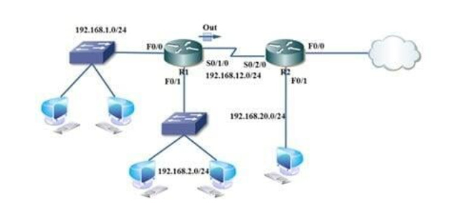

# ACL (Access Control List)
## Khái niệm
*  Access Control List (ACL) hay còn được gọi kiểm soát truy cập. Là một danh sách các điều kiện được áp đặt vào các cổng của router để lọc các gói tin đi qua nó. Danh sách này chỉ ra cho router biết loại dữ liệu nào được cho phép (allow) và loại dữ liệu nào bị hủy bỏ (deny). Sự cho phép và huỷ bỏ này có thể được kiểm tra dựa vào địa chỉ nguồn, địa chỉ đích, giao thức hoặc chỉ số cổng. 
* ACL thường được sử dụng cho hai mục đích:
    - Lọc lưu lượng
    - Phân loại dữ liệu: được áp dụng cho các dịch vụ: NAT, Distribute-list, VPN
## Phân loại
– Standard ACL:
* Dải số cho Standard ACL từ 1 – 99
* Có thể chặn được Network, Host và Subnet
* Chặn toàn bộ các dịch vụ
* Thực hiện tại điểm gần nhất với đích
* Cơ chế lọc được thực hiện dựa trên địa chỉ IP nguồn   

– Extended ACL :
* Dải số cho Extended ACL từ 100-199
* Có thể đồng ý hoặc chặn bất cứ một Network, Host, Subnet, hoặc cả dịch vụ
* Được lựa chọn các dịch vụ muốn chặn
* Cơ chế lọc được dựa trên địa chỉ IP nguồn, IP đích, giao thức, cổng     
## Cách thức hoạt động
*  Access Control List (ACL) sẽ thực hiện việc kiểm tra theo trình tự của các điều kiện trong danh sách cấu hình. Nếu có một điều kiện được so khớp trong danh sách thì nó sẽ thực hiện hành động tương ứng trong điều kiện đó, và các điều kiện còn lại sẽ không được kiểm tra nữa.

* Khi có gói tin đi vào một cổng, router sẽ kiểm tra xem có ACL nào được đặt trên cổng đó hay không để kiểm tra, nếu có thì các gói tin sẽ được kiểm tra với những phải có điều kiện trong danh sách. Nếu gói tin đó được cho phép bởi ACL, nó sẽ tiếp tục được kiểm tra trong bảng định tuyến để quyết định chọn cổng ra để đi đến đích.

* Tiếp đó, router sẽ kiểm tra xem trên cổng dữ liệu chuyển ra có đặt ACL hay không. Nếu không thì gói tin đó có thể sẽ được gửi tới mạng đích. Nếu có ACL thì nó sẽ kiểm tra với những điều kiện trong danh sách ACL đó

* Danh sách điều khiển truy cập (ACL – Access Control List) cho phép khai báo những địa chỉ nào được chuyển đổi. 
* Ví dụ: 
   
    * Khi các máy bên trong mạng 192.168.1.0 gửi gói tin ra ngoài Internet dữ liệu sẽ chuyển tới Router và chuyển ra cổng bên ngoài là S0/1/0. Lúc này dữ liệu sẽ gặp chốt Access-list, Access-list sẽ kiểm tra thấy Permit mạng 192.168.1.0 nên nó cho phép đi qua.

    * Khi các máy bên mạng 192.168.2.0 đi ra Access-list trên cổng S0/1/0 sẽ kiểm tra, nó không thấy mạng này trong danh sách cho phép đi qua nên sẽ hủy bỏ.

>Chú ý:    
    * Access list theo chiều Out là quản lý dữ liệu từ bên trong ra.   
    * Access list teo chiều In là quản lý dữ liệu từ bên ngoài đi vào.   
    * Trên mỗi cổng của Access list chỉ được gán một Access list theo một   chiều         
## Cấu hình ACL
Để hiểu cách cấu hình ACL, cần phải hiểu một số thuật ngữ sau:

* “Wildcard mask” có 32 bit (0 & 1), chia thành 4 phần, mỗi phần có 8 bit, là tham số được dùng xác định các bit nào sẽ được bỏ qua hay buộc phải so trùng trong việc kiểm tra điều kiện. Bit “1‟ có nghĩa là bỏ qua vị trí bit đó khi so sánh và bit “0‟ xác định vị trí bit đó phải giống nhau. Mặc dù cấu trúc giống subnet mask nhưng chúng hoạt động khác nhau (xem lại phần địa chỉ IP)

* Với Standard ACL, nếu không thêm “wildcard-mask” trong câu lệnh tạo ACL thì mặc định sẽ là 0.0.0.0

* “Wildcard mask” dùng cho một thiết bị hay còn gọi là “wildcard-host” có dạng: 0.0.0.0 (kiểm tra tất cả các bit). Khi kiểm tra ACL, nó sẽ kiểm tra tất cả các bit trong địa chỉ dùng để so khớp. Từ khóa “host” được thay thế cho thuật ngữ này.

* Wildcard mask cho tất cả các thiết bị được gọi là wildcard “any” có dạng: 255.255.255.255 (không kiểm tra tất cả các bit). Từ khóa “any” được thay thế cho thuật ngữ này.

>Lưu ý: Khi áp dụng Access Control List (ACL) trên một cổng, phải xác định ACL đó được dùng cho luồng dữ liệu vào (inbound) hay ra (outbound). Chiều của luồng dữ liệu được xác định trên cổng của router.

# Tài liệu tham khảo
[ACL](https://maychuvatly.com/blog/acl-ccna-chuong-5/#:~:text=Access%20Control%20List%20(ACL)%20c%C3%B3,c%E1%BA%A7n%20c%E1%BA%A5m%20lu%E1%BB%93ng%20d%E1%BB%AF%20li%E1%BB%87u.)    
[ACL](https://www.daihockhonggiay.com/blogs/post/access-control-list)