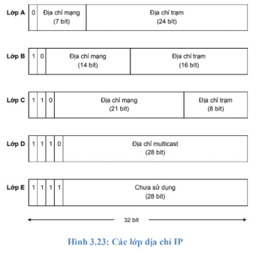
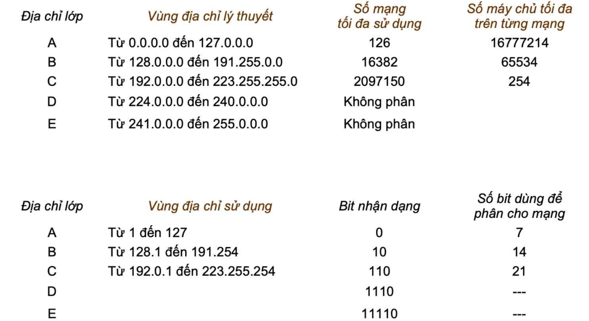

# Địa chỉ IP
## Địa chỉ IP dùng để làm gì?
* Trong một hệ thống mạng, các máy tính hoặc thiết bị điện tử liên lạc với nhau thông qua địa chỉ IP.   
* Địa chỉ IP có 2 version: IPv4 (32 bit) và IPv6(128 bit)

## Các lớp địa chỉ IP
* Địa chỉ IP là một dải nhị phân dài 32 bit và chia thành 4 bộ 8 bit gọi là các Octet, gồm phần net-id dùng để xác định mạng mà thiết bị kết nối vào và phần host-id để xác định thiết bị của mạng đó.   
* Địa chỉ IP được chia làm 5 lớp, ký hiệu là A, B, C, D và E.
    

* Các dải địa chỉ của các lớp

### Cách chia địa chỉ IP
* Lớp A:    
Trong địa chỉ lớp A, byte đầu tiên được dùng để định nghĩa địa chỉ mạng. Tuy
nhiên bit đầu tiên phải luôn luôn bằng ‘0’. 7 bit còn lại chỉ định các mạng khác nhau.     
    * Lớp A: Địa chỉ từ 1.0.0.0 -> 127.0.0.0
    * 126 mạng được sử dụng (127.0.0.0 dùng cho loopback)
    * 2^24 - 2 là các host được sử dụng

* Lớp B   
    * Địa chỉ mạng: 128.0.0.0 -> 191.255.0.0
    * 2^14 mạng cho lớp B
    * 2^16-2 host cho lớp B

* Lớp C
    * Địa chỉ mạng: 192.0.0.0 -> 233.255.255.0
    * mạng: 2^21 
    * host: 2^8-2

* Lớp D
    * Địa chỉ: 224.0.0.0 đến 240.0.0.0

* Lớp E
    * Địa chỉ mạng: 241.0.0.0 đến 255.0.0.0

* Private và Public IP
    * Trong LAN: Private
    * Internet: Public
    * NAT: Chuyển đổi public <-> private