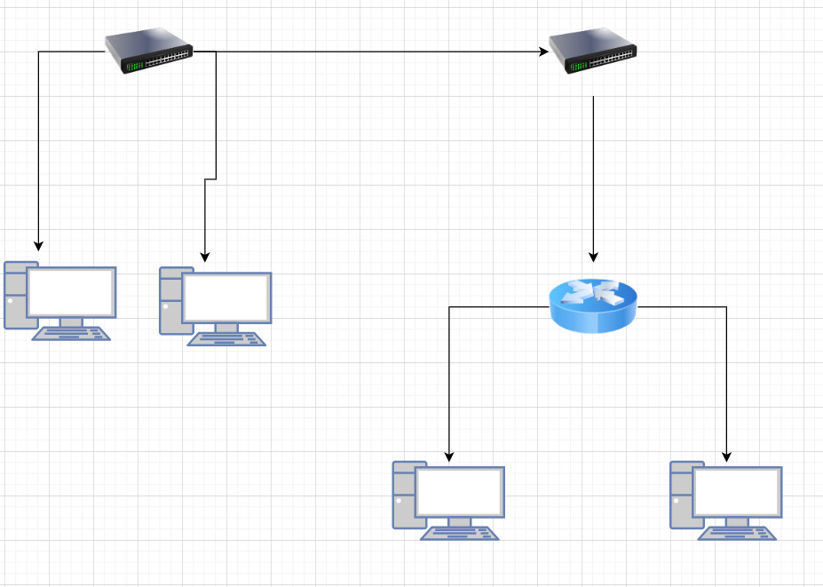
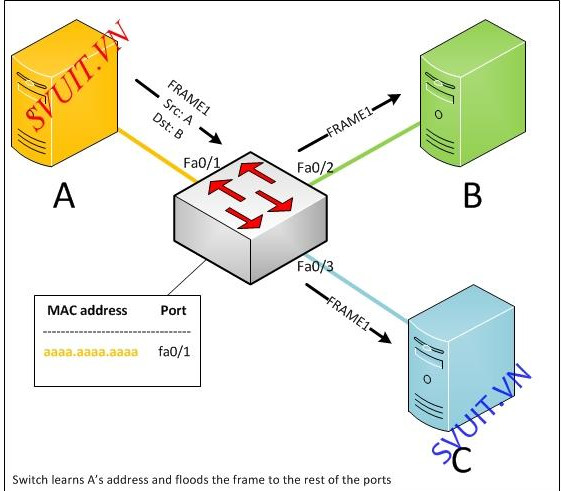
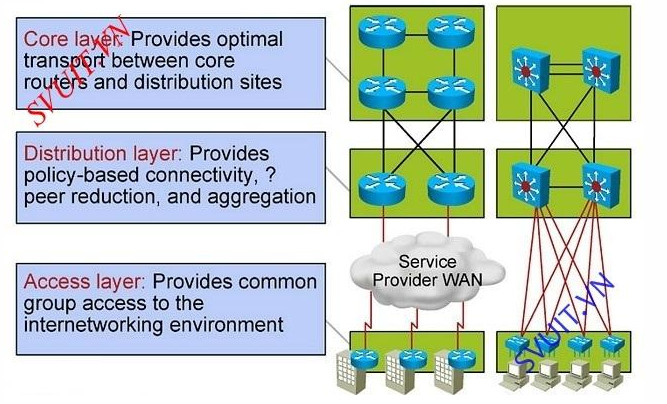

# Switch
1. Switch là gì?    
SWITCH hay còn gọi là bộ chuyển mạch mạng là một thiết bị hoạt động ở lớp Liên kết dữ liệu của mô hình OSI —Layer 2. Nó nhận các gói được gửi bởi các thiết bị được kết nối với các cổng vật lý của nó và gửi lại chúng, nhưng chỉ thông qua các cổng dẫn đến các thiết bị mà các gói dự kiến ​​tiếp cận. Chúng cũng có thể hoạt động ở lớp mạng – Lớp 3 nơi xảy ra quá trình định tuyến.
   

2. Chức năng của Ethernet Switch.
* Học địa chỉ
* Ra các quyết định forward hay filter các frame
* Chống Loop

   
3. Các phương thức chuyển mạch.    
Có 3 phương thức chuyển mạch 
    * Cut-through : switch chỉ kiểm tra địa chỉ đích đến của frame và forward gói tin đi ngay.
    * Store and forward : Nhận đầy đủ các frame rồi lưu frame đó lại để kiếm tra lỗi frame thông qua trường kiểm tra lỗi FCS.
        * Nếu frame ko bị lỗi -> truyền frame đi tiếp
        * Nếu lỗi sw sẽ drop frame
    * Fragment-free :
        * Sw kiểm tra frame > 64 byte thì chuyển frame tiếp
        * Nếu frame < 64 byte thì drop gói tin

> Vì ta biết độ dài tối thiểu của 1 ethernet frame là 64 byte. Nếu frame có độ dài < 64 byte thì frame đó bị lỗi.​    
> Ngày nay sw càng mạnh nên -> người ta chỉ dùng phương pháp store and forward.

4. Tính năng của Switch
* Một switch hoạt động ở lớp 2, tức là lớp liên kết dữ liệu của mô hình OSI.
* Nó là một thiết bị mạng thông minh có thể được hình thành như một cầu nối mạng đa cổng.
* Nó sử dụng địa chỉ MAC (địa chỉ của lớp con điều khiển truy cập phương tiện) để gửi các gói dữ liệu đến các cổng đích đã chọn. Và một MAC được tạo trên một port, một port có thể chứa nhiều MAC.
* Nó sử dụng kỹ thuật chuyển mạch gói để nhận và chuyển tiếp các gói dữ liệu từ nguồn đến thiết bị đích.
* Nó hỗ trợ truyền thông unicast (một-một), đa hướng (một-nhiều) và quảng bá (một-tất cả).
* Thiết bị chuyển mạch là thiết bị hoạt động, được trang bị phần mềm mạng và khả năng quản lý mạng.     

5. Mô hình phân cấp Cisco
     

* Access layer: kết nối các end user trong mạng, khu vực server fame...
* Distribute : Thường sử dụng sw( mutilplayer sw : sw lớp 3) or router(ít dùng). Sw layer 3 này có 2 ưu điểm.
    * Định tuyến giống Router.
    * Thiết lập các chính sách trong mạng
* Core : chủ yếu là Router. Kết nối ra internet hay kết nối các site...