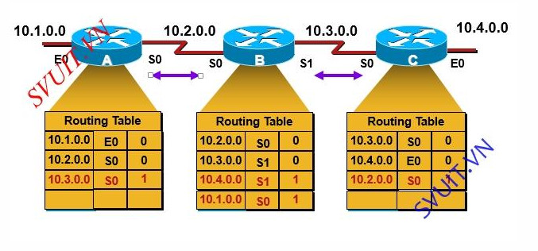
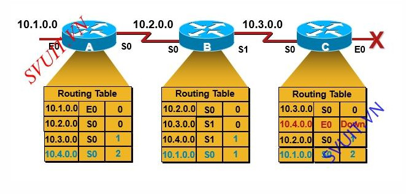
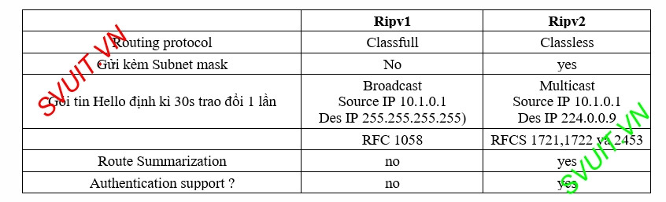

# Routing Information Protocol
## Khái niệm
RIP là một giao thức định tuyến vectơ khoảng cách (distance-vector) được sử dụng bên trong hệ tự trị. Giao thức này khá đơn giản, nó sử dụng giải thuật Bellman-Ford để tính toán bảng định tuyến.

## Nguyên lý hoạt động 
* Khi bật định tuyến RIP lên
    * Các Router kết nối trực tiếp với nhau sẽ trao đổi với nhau bằng gói tin Hello với định kỳ là 30s 1 lần. Gói hello này chứa bảng định tuyến của Router gửi đi.
    * Ví dụ: Router A sẽ gửi bảng định tuyến của nó cho Router B định kì là 30s 1 lần.
chú ý : Router chỉ trao đổi với Router nào kết nối trực tiếp tới nó.
        * A sẽ gửi bảng định tuyến cho B và ngược lại.
        * Nhưng A sẽ không gởi Routing Table cho C được vì C không kết nối trực tiếp với A(hay C không phải là Neighbor của A).
        * Router B nhận được bảng định tuyến của A thì ngay lập tức B sẽ tự động cập nhập lại bảng định tuyến của nó.
        * Nếu trong bảng định tuyến của nó đã có các mạng trong mạng A gửi thì nó sẽ giữ nguyên bảng định tuyến của nó.        

  

## Loop trong giao thức RIP
     
* Giả sử C mất mạng 10.4.0.0 mà C chỉ còn 3 mạng 10.1.0.0, 10.2.0.0, 10.3.0.0 30s sau C gửi Routing Table của nó cho B. không có sự thay đổi.
* 30s tiếp theo B gửi lai Routing table của nó cho C lúc này trên B có 4 mạng. C thấy có sự thay đổi C học thêm mạng 10.4.0.0 thông qua cổng S0 đến đến B. Để đến mạng 10.4.0.0 phải đi ra khỏi cổng S1 của B à Metric tăng lên 1. Metric =2
* 30s tiếp theo C lại gửi routing table cho B và B cập nhật lại
* Cứ tiếp tục như vậy thì Routing table của B va C sẽ thay đổi Metric của mạng 10.4.0.0 tăng liên tục. à hệ lụy của nó là A cũng sẽ bị ảnh hưởng. Và số Metric này sẽ tăng liên tục theo B và C.

> Đây là một nhược điểm cuản RIP khi một mạng của ta bị mất đi. Chỉ sô Metric liên tục thay đổi thì hiện tượng này gọi là Loop trong mạng.
> Khi bị Loop như vầy thì hệ thống mạng sẽ ko hoạt động được vì Metric thay đổi liên tục là CPU hoạt động liên tục à performance tăng.

## Cơ chế chống Loop trong giao thức RIP
### Giới hạn metric = 16
* Giới hạn Metric trong Rip = 16. Khi Router đang chạy mà thấy mạng nào có Metric =16 thi nó coi mạng đó ko có mặc dù vẫn Connected.
* Metric =16 gọi là Infinitive Metric( metric vô hạn)
> Rip chỉ dùng cho hạ tầng mạng nhỏ < 16 Router vì Metric max =16.Lưu ý : khi cắm 10.4.0.0 lại thì Router sẽ cập nhập lại Metric=0 

### Cơ chế Slipt Horizon        
- Khi C gửi toàn bộ Routing table cho B thì B sẽ học 10.4.0.0
- khi B gửi ngược lại mạng 10.4.0.0 cho C thì C nhận thấy nó đã có mạng 10.4.0.0 nên nó sẽ không học mạng này dù khi này 10.4.0.0 trên C chết.
=> C đã gửi 10.4.0.0 qua cho B rồi thì khi B gửi lại nó sẽ không học lại nữa.

## Trigger update 
- Khi 1 mạng trong C bị đứt thì ngay lập tức C gửi bảng định tuyến của nó cho B mà không cần đợi định kì 30s.
- C gửi bảng định tuyến trong đó mạng 10.4.0.0 nó sẽ đưa về trạng thái infinitive gọi là Router Poisoning. Nghĩa là khi 10.4.0.0 die nó sẽ gửi trigger bảng định tuyến đi trong đó nó có cái Router Poisoning là 10.4.0.0 Infinitive.    
## Router Poisoning
- Khi B nhận được Routing Table của C có mạng 10.4.0.0 thì nó sẽ đưa 10.4.0.0 về trạng thái Possiblly down( mạng này đang có khả năng down).
- Possiblly Down chưa down liền. Sau 30s C sẽ tiếp tục gửi Routing table cho B nếu 10.4.0.0 sống lại nó sẽ phục hồi lại trạng thái cho 10.4.0.0
- Sau khi B nhận xong thì nó sẽ trả lời lại bằng cơ chế Poisoning Reverse.
 ## Hold Down Timers
-   Khi 10.4.0.0 chết tức là 10.4.0.0 ở trang thái infinitive thì C gửi qua cho B sẽ không có 10.4.0.0 mà lúc này trong B lại có 10.4.0.0 mà C gửi lúc đầu.
-   Lúc này B sẽ đưa 10.4.0.0 về trạng thái Possiblly Down.
-   Nó sẽ bật bộ timer của nó là 180s rồi đếm ngược về 0. Cứ định kỳ 30s C gửi Routing table cho B à timer =150 mà không thấy 10.4.0.0 thì tiếp tục nó đếm xuống 120,90… đến khi timer =0 thì nó sẽ xóa 10.4.0.0 trong Routing table của nó

## So sánh RIPv1 và Ripv2
    

# Tài liệu tham khảo
[RIP](https://securityzone.vn/t/bai-13-tim-hieu-ve-giao-thuc-dinh-tuyen-rip.78/)