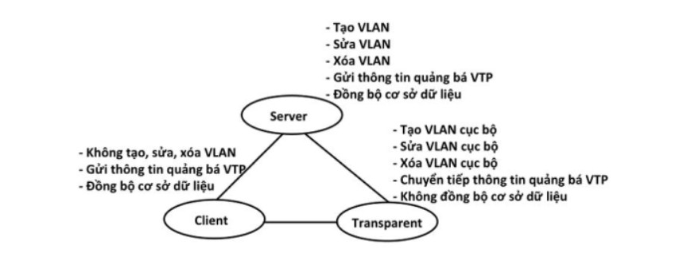
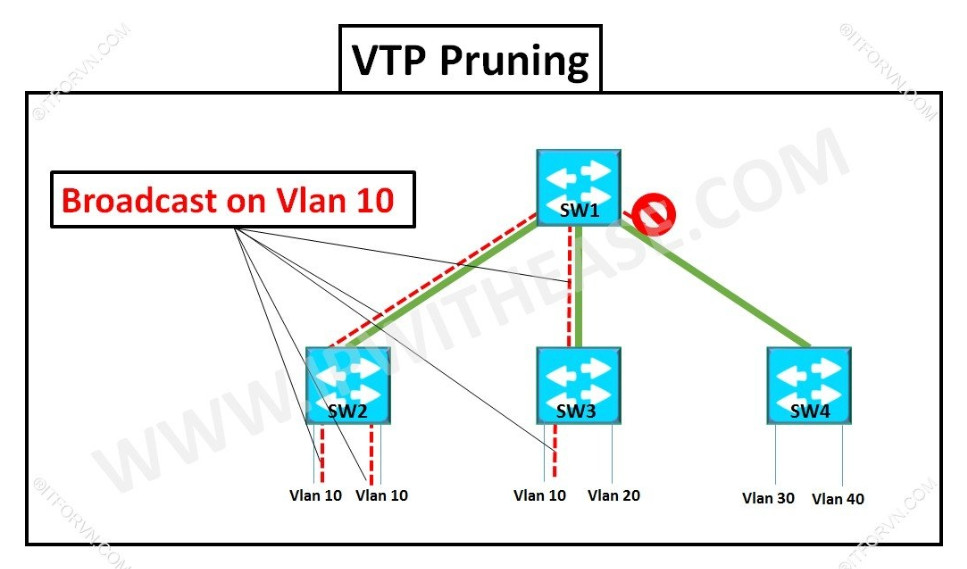

# **VLAN Trunking Protocol**
## Khái niệm
- là giao thức hoạt động ở tầng liên kết dữ liệu trong mô hình OSI.
- giúp cho việc cấu hình VLAN  luôn đồng nhất khi thêm, xóa hoặc sửa thông tin trong hệ thống mạng VLAN.
## Lợi ích của VTP
- Báo cáo về việc thêm các VLAN, dễ dàng thêm hoặc xóa  các VLAN.
- Biết được VLAN và các thông số cụ thể.
## Hoạt động của VTP
- VTP gửi thông điệp quảng bá qua " VTP domain" cứ 5 phút một lần hoặc là khi có sự cố xảy ra trong quá trình cấu hình VLAN.
- Một trong những thành phần quan trọng trong các thông tin quảng bá VTP là tham số "revision number". Mặc định số Revision giữa các Switch bằng 0, cứ mỗi lần SW thực hiện 1 hành động tạo, xóa, sửa thì nó sẽ tăng lên một đơn vị. Nếu 2 Switch được kết nối và trunking với nhau và cùng thông số VTP thì Switch có số Revision cao hơn sẻ đè cấu hình lên Switch có Revision number thấp hơn.
### VTP hoạt động trong 3 cơ chế sau:
- Server
- Client
- Transparent     

### VTP Prunning

Giả sử Host thuộc VLAN 10 tiến hành gửi một Frame đến Host khác cũng thuộc VLAN 10 nhưng nằm trong một Switch khác. Mỗi VLAN cũng là một Broadcast domain nên frame này cũng được chuyến đến VLAN 10 của Switch 2. Trên đường trunk sẽ cho qua tất các các dữ liệu của frame này nên Switch 4 cũng nhận được, điều này dẫn đến lãng phí tài nguyên băng thông hệ thống. Khi bật VTP Prunning thì Switch 4 gủi thông điệp cho Switch 1 rằng nó k cần frame này vì nó k có VLAN 10. Và khi Switch 1 này nhận được thông điệp này thì sẽ tiến hành chặn frame này không cho forward đến các đường trunk nào mà không tồn tại VLAN 10.

> *Tài liệu tham khảo*
- [What is VLAN Trungking?](https://baoninhsunrise.com/vlan-trunking-la-gi/)
- [What is VTP?](https://www.totolink.vn/article/97-vtp-la-gi-vlan-trunking-protocol-la-gi.html)
- [Features of VTP.](https://vnpro.vn/thu-vien/tinh-nang-vtp-pruning-3155.html)
