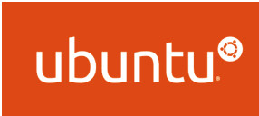

# Giới thiệu về Linux
## Định nghĩa 
* Wikipedia: Linux là một họ các hệ điều hành tự do mã nguồn mở tương tự Unix dựa trên Linux kernel 
* Linux là phần mềm mã nguồn mở (Open-source software), được phân phối dưới ”Giấy phép công cộng GNU” (GNU General Public License – GPL)
* GNU GPL cho phép việc trao đổi tự do các phần mềm, đảm bảo các phần mềm miễn phí đối với tất cả các  người sử dụng. Được áp dụng cho hầu hết các sản phẩm của “Tổ chức phần mềm tự do”      
.jpg)
## Lịch sử phát triển 
* Linus Torvalds, sinh ngày 28/12/1969 tại Helsinki, Phần Lan.
* Theo học đại học Helsinki năm 1988.
* 1989 nhập ngũ, giữ cấp bậc Thiếu uý. Mua quyển sách Operating Systems: Design and Implementationcủa giáo sư Andrew Tanenbaum, mô tả về MINIX – một phiên bản Unix rút gọn dành cho giáo dục.
* Nhập học trở lại vào năm 1990. Phát hành Linux kernel đầu tiên vào 17/09/1991 với 100% mã nguồn do ông 
phát triển (chiếm tỉ lệ khoảng 1% trong mã nguồn hiện tại).
* 1999, MIT tuyên bố Linus Torvalds là ”Innovators” dưới tuổi 35.
* 2000, Steve Jobs mời Linus Torvalds làm việc tại Apple nhưng từ chối.
* 2005, Linus tạo ra Git

# Ubuntu
## Định nghĩa
* Ubuntu là một hệ điều hành máy tính dựa trên Debian GNU/Linux, một bản phân phối Linux thông dụng. Tên của nó bắt nguồn từ "ubuntu" trong tiếng Zulu, có nghĩa là "tình người".
* Ubuntu là phần mềm mã nguồn mở tự do, có nghĩa là người dùng được tự do chạy, sao chép, phân phối, nghiên cứu, thay đổi và cải tiến phần mềm theo điều khoản của giấy phép GNU GPL.   

## Đặc điểm
 Ubuntu kết hợp những đặc điểm nổi bật chung của hệ điều hành nhân Linux, như tính bảo mật trước mọi virus và malware, khả năng tùy biến cao, tốc độ, hiệu suất làm việc, và những đặc điểm riêng tiêu biểu của Ubuntu như giao diện bắt mắt, bóng bẩy, cài đặt ứng dụng đơn giản, sự dễ dàng trong việc sao lưu dữ liệu và sự hỗ trợ của một cộng đồng người dùng khổng lồ.
 ## Điều khoản Ubuntu   
 * Terminal 
    * Còn gọi là CLI – Command line Interface, dung để giao tiếp với Linux thông qua việc sử dung các command.
    * Chiếm ít tài nguyên hệ thống, rất nhanh so với giao diện đồ hoạ (GUI)
 * Distro
    Chỉ các biến thể khác nhau của các ”Hệ điều hành dựa trên Linux”
 * Command
    * Ra các hướng dẫn (instruct) Linux thực hiện các tác vụ.
    * Được sử dung trên CLI.
 * Flavours
    * Linux có các Distro, còn Unix có các Flavour
    * Linux là 1 Unix flavour
 * Desktop environment: Tập hợp nhiều phần mềm, tạo nên giao diện đồ hoạ GUI - Graphical User Interface
 * Package manager: 
    * Công cụ quản lý các gói phần mềm trên Linux.
    * Mỗi distro có một ”Package manager” riêng
 * Root: Tài khoản có quyền cao nhất trên hệ thống. Windows: Administrator
 * Binaries: 
    * Là các file thực thi trên Linux.
    * Tương ứng .exe trên Windows

# Tài liệu tham khảo
[Linux](https://vi.wikipedia.org/wiki/Linux)     
[Ubuntu](https://vi.wikipedia.org/wiki/Ubuntu)