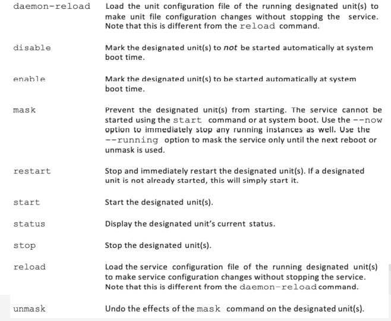
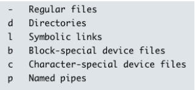

# Linux System 
## Init System
### Init system: type

* Cú pháp chung: systemctl [option] command [name]
    * systemctl get-default
    * systemctl list-units
    * systemctl list-units --type target --state active
    * runlevel
    * systemctl get-default
    * systemctl list-units
    * systemctl set-default
    * systemctl cat file.service
    * systemctl {start/stop/restart/enable/disable/status} file.service
    * systemctl daemon-reload
    * systemctl isolate multi-user.targe

### Init system: location
* Service unit files - được ưu tiên theo thứ tự như sau:
    * /etc/systemd/system/: local configuration
    * /run/systemd/system/: runtime units
    * /lib/systemd/system/: installed packges units
* Edit unit file:
1. copy và override theo thứ tự ưu tiên
2. Tạo thư mục cùng tên với unit + “.d”. Sử dụng file config .conf: override hoặc extend.

### Init system: service management        
    

### Init system: write your own service
Cấu trúc chung gồm: Unit, Service, Install.
* Unit 
    * After:
    * Before:
    * Description: Mô tả units
    * Documentation: Đặt danh sách các mã định danh tài nguyên thống nhất (URIS) trỏ đến các nguồn tài liệu.  Các URIs có thể là vị trí web, tệp hệ thống, trang thông tin và trang người dùng
    * Conflicts: Đặt đơn vị này không bắt đầu với các đơn vị được chỉ định.  Nếu bất kỳ thiết bị nào được chỉ định khởi động, thiết bị này không được khởi động.  (Đối diện với Yêu cầu)
    * Requires: Đặt đơn vị này bắt đầu cùng với các đơn vị được chỉ định. Nếu bất kỳ đơn vị nào được chỉ định không khởi động, đơn vị này sẽ không được khởi động. (Đối lập với Xung đột.)
    * Wants: Đặt đơn vị này bắt đầu cùng với các đơn vị được chỉ định. Nếu có  của các đơn vị được chỉ định không khởi động, đơn vị này vẫn được khởi động.

* Service 
    * ExecReload: cho biết các tập lệnh hoặc lệnh để chạy khi đơn vị là trình tải lại
    * ExecStart: cho biết các tập lệnh hoặc lệnh để chạy khi đơn vị là trình khởi động.
    * ExecStop: cho biết các tập lệnh hoặc lệnh để chạy khi đơn vị là trình kết thúc.
    * Enviroment: đặt các sản phẩm thay thế biến môi trường, ngăn cách nhau bằng khoảng trắng. 
    * Enviroment File: Chỉ ra một tập có chứa biến môi trường.
    * RemainAfterExit: Đặt thành không (mặc định) hoặc có.  Nếu được đặt thành có, dịch vụ vẫn hoạt động ngay cả khi quá trình bắt đầu bởi ExecStart kết thúc.  Nếu được đặt thành không, thì ExecStop được gọi khi quá trình bắt đầu bởi ExecStart kết thúc.

    * Restart: Dịch vụ được khởi động lại khi quá trình bắt đầu bởi ExecStart kết thúc.  Bỏ qua nếu lệnh khởi động lại systemctl hoặc lệnh dừng systemctl được đưa ra.  Đặt thành không (mặc định), bật - thành công, bật - thất bại, bật - bất thường, bật - cơ quan giám sát, bật - hủy hoặc luôn luôn.

    * Type: đặt kiểu khởi động

* Install:
    * Alias: Đặt các tên bổ xung có thể biểu thị dịch vụ trong lệnh systemctl.
    * Also: Đặt đơn vị bổ xung đã bật hoặc tắt cho dịch vụ này. Thường xuyên bổ xung thêm các đơn vị là loại ổ cắm.
    * RequiRedBy: chỉ định đơn vị khác yêu cầu dịch vụ này
    * WantedBy: chỉ định đơn vị mục tiêu nào quản lý dịch vụ này.

## Device-filesystem 
### File type and devices
* Trên Linux, mọi thứ đều là file: directories, documents, hard drives, partitions, printers, socket,...
* 5 loại file type cơ bản trên Linux:          
    

* Trên Linux, tất cả “devices đều nằm ở /dev”, có 2 loại device special files:
    * character special (bắt đầu bằng chữ “c”)
    * block special (bắt đầu bằng chữ “b”)     

* Một số loại cần chú ý:
    * /dev/null
    * /dev/zero
    * /dev/random vs /dev/urandom
### tty vs pts 
* tty virtual teletypes – sử dụng bàn phím và keyboard được kết nối vào để giả lập 1 teletype –emulated in hardware.
* pts pseudo-teletype – một teletypes được mô phỏng (emulate) hoàn toàn bằng phần mềm. Các pts (slave) được quản lý bởi multiplexor (master) - /dev/ptmx.
* Commands:
    * tty xác định tty đang sử dụng. tty –s không hiển thị kết quả mà chỉ trả về status code
    * who danh sách những user đang login vào, và đang sử dụng tty nào
    * write send message tới 1 user tại 1 tty (msg –y để enable message): write user tty
    * cat “message” > tty
    * wall broadcast message tới tất cả logged in user
    * DISPLAY=":0" xmessage ”this is message"

## Filesystem
* Filesystem: có thể
    * FHS - Filesystem Hierarchy Standard: toàn bộ Linux directory structure, bắt đầu ở root (/)
    * Filesystem type: một loại định dạng đĩa lưu trữ cụ thể, ví dụ EXT3, EXT4, XFS, BRTFS, … Linux hỗ trợ khoảng 100 loại định dạng đĩa lưu trữ.
    * Một partition hoặc một volume với một định dạng đĩa lưu trữ cụ thể. Được “mount” vào Linux filesystem.
* Filesystem type: mỗi loại quy định một cấu trúc lưu trữ dữ liệu và metadata khác nhau. Trên Linux sử dụng phổ biến nhất ext filesystem: ext(bản đầu tiên), ext1, ext2, ext3, ext4.
    * MINIX filesystem: filename dài 14 kí tự, hỗ trợ lưu trữ tối đa 64MB. Linux bản đầu tiên sử dụng hệ thống filesystem này.
    * ext: phát triển bởi Rémy Card năm 1992, filename dài 255 kí tự, lưu trữ tối đa 2GB.
    * ext2: được Rémy cải tiến từ ext vào năm 1993:
        * maximum filesize: 2TB (blocksize 4KB)
        * maximum filesystem size: 16TB (blocksize 4KB)
        * Nhược điểm: crash, phân mảnh (tương tự: FAT, FAT32, HFS)
    * ext3: bắt đầu phát triển năm 1998, chính thức đưa vào Linux 11/2001 trong kernel 2.4.15
        * maximum filesize: 2TB (blocksize 4KB)
        * maximum filesystem size: 16TB (blocksize 4KB)
        * sử dụng journaling (tương tự: NTFS)
    * ext4: phát triển bởi Theodore Ts’o năm 2006, đưa vào Linux năm 2008 trong kernel 2.6.28. Hỗ trợ filesize đến 16TB và filesystem size đến 1EiB (exbibyte)
 ### File system: other file system types
* XFS: default filesystem trên RHEL 7. 64-bits jounarling filesystem.
    * Nếu không dùng ext filesystem, hãy dùng XFS
* ZFS (zettabyte filesystem): phát triển bởi Sun Microsystem. Là 1 next-generation filesystem:
    * Volume management (single filesystem trên nhiều thiết bị lưu trữ).
    * Inline compression, automatic corruption repair.
    * Canonical hỗ trợ đưa ZFS vào kernel từ năm 2016.
    * Chưa nên sử dụng làm filesystem chính. Nên sử dụng song song với một ext4 filesystem.
* Btrfs (B-tree filesystem): được phát triển bởi Chris Mason năm 2017 tại Oracle.
    * Nhiều tính năng tương đồng như ZFS.
    * Năm 2015 trở thành filesystem mặc định trên SUSE Enterprise Linux.
    * Năm 2017, Red Hat thông báo không hỗ trợ sử dụng kể từ RHEL 7.4

